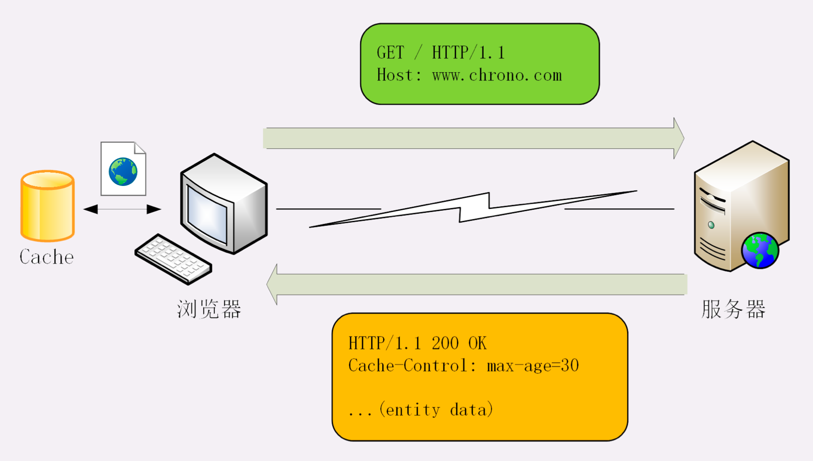
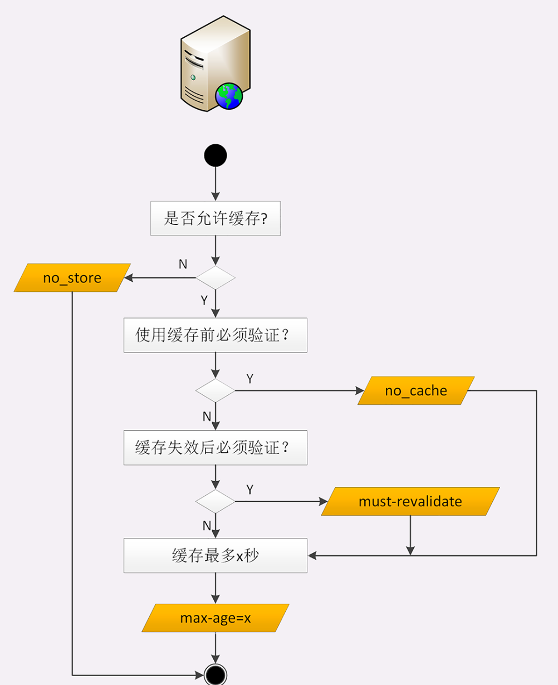
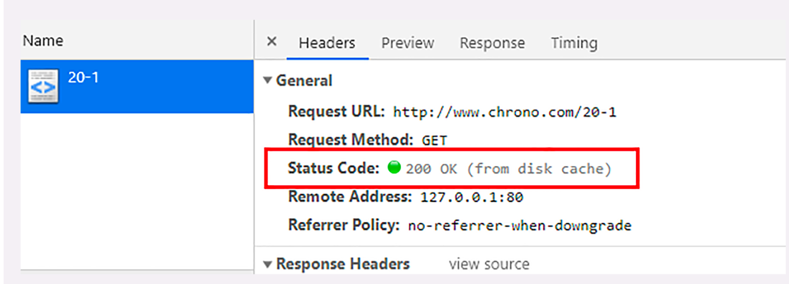
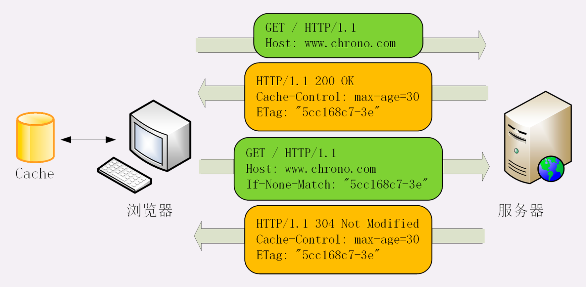

# 9.15-学习http(十一)

## **HTTP的缓存控制**

缓存(Cache)是计算机领域里的一个重要概念，是优化系统性能的利器。

由于链路漫长，网络时延不可控，浏览器使用 HTTP 获取资源的成本较高。所以，非常有必要把来之不易的数据缓存起来，下次再请求的时候尽可能地复用。这样，就可以避免多次请求 - 应答的通信成本，节约网络带宽，也可以加快响应速度。

基于请求 - 应答模式的特点，可以大致分为客户端缓存和服务器端缓存，因为服务器端缓存经常与代理服务混搭在一起。

### **服务器的缓存控制**

- 浏览器发现缓存无数据，于是发送请求，向服务器获取资源
- 服务器响应请求，返回资源，同时标记资源的有效期
- 浏览器缓存资源，等待下次重用

服务器标记资源有效期使用的头字段是**Cache-Control**，里面的值**max- age=30**就是资源的有效时间，相当于告诉浏览器，这个页面只能缓存 30 秒，之后就算是过期，不能用了。

Cache-Control字段里的max-age和上一节里 Cookie 有点像，都是标记资源的有效期。

但必须注意，这里的 max-age 是**生存时间**(又叫新鲜度或者缓存寿命， 类似 TTL，Time-To-Live)，时间的计算起点是响应报文的创建时刻(即 Date 字段，也就是离开服务器的时刻)，而不是客户端收到报文的时刻，也就是说包含了在链路传输过程中所有节点所停留的时间。

max-age是 HTTP 缓存控制最常用的属性，此外在响应报文里还可以用其他的属性来更精确地指示浏览器应该如何使用缓存:

- no_store:**不允许缓存**，用于某些变化非常频繁的数据，例如秒杀页面
- no_cache:它的字面含义容易与 no_store 搞混，实际的意思并不是不允许缓存，而是**可以缓存**，但在使用之前必须要去服务器验证是否过期，是否有最新的版本
- must-revalidate:又是一个和 no_cache 相似的词，它的意思是如果缓存不过期就可以继续使用，但过期了如果还想用就必须去服务器验证

### **客户端的缓存控制**

其实不止服务器可以发Cache-Control头，浏览器也可以发Cache-Control，也就是说请求 - 应答的双方都可以用这个字段进行缓存控制，互相协商缓存的使用策略。

当你点刷新按钮的时候，浏览器会在请求头里加一个**Cache-Control: max- age=0**。因为 max-age 是**生存时间**，max-age=0 的意思就是我要最新的数据，而本地缓存里的数据至少保存了几秒钟，所以浏览器就不会使用缓存，而是向服 务器发请求。服务器看到 max-age=0，也就会用一个最新生成的报文回应浏览器。

Ctrl+F5 的强制刷新又是什么样的呢?

它其实是发了一个**Cache-Control: no-cache**，含义和max-age=0基本一样，就看后台的服务器怎么理解，通常两者的效果是相同的。

那么，浏览器的缓存究竟什么时候才能生效呢?

试着点一下浏览器的前进后退按钮，再看开发者工具，你就会惊喜地发 现from disk cache的字样，意思是没有发送网络请求，而是读取的磁盘上的缓存。

这几个操作与刷新有什么区别呢?

其实也很简单，在前进后退跳转这些重定向动作中浏览器不会夹带私货， 只用最基本的请求头，没有Cache-Control，所以就会检查缓存，直接利用之前的资源，不再进行网络通信。

### **条件请求**

浏览器用Cache-Control做缓存控制只能是刷新数据，不能很好地利用缓存数据，又因为缓存会失效，使用前还必须要去服务器验证是否是最新版。

那么该怎么做呢?

浏览器可以用两个连续的请求组成验证动作:先是一个 HEAD，获取资源的修改时间 等元信息，然后与缓存数据比较，如果没有改动就使用缓存，节省网络流量，否则就再发一 个 GET 请求，获取最新的版本。

但这样的两个请求网络成本太高了，所以 HTTP 协议就定义了一系列**If**开头的**条件请求**字段，专门用来检查验证资源是否过期，把两个请求才能完成的工作合并在一个请求里做。而且，验证的责任也交给服务器，浏览器只需坐享其成。

条件请求一共有 5 个头字段，我们最常用的是**if-Modified-Since**和**If-None- Match**这两个。需要第一次的响应报文预先提供**Last-modified**和**ETag**，然后第二次请求时就可以带上缓存里的原值，验证资源是否是最新的。

如果资源没有变，服务器就回应一个**304 Not Modified**，表示缓存依然有效，浏览器就可以更新一下有效期，然后放心大胆地使用缓存了。

Last-modified很好理解，就是文件的最后修改时间。ETag 是什么呢?

ETag 是实体标签(Entity Tag)的缩写，**是资源的一个唯一标识**，主要是用来解决修改时间无法准确区分文件变化的问题。

比如，一个文件在一秒内修改了多次，但因为修改时间是秒级，所以这一秒内的新版本无法区分。

再比如，一个文件定期更新，但有时会是同样的内容，实际上没有变化，用修改时间就会误以为发生了变化，传送给浏览器就会浪费带宽。

使用 ETag 就可以精确地识别资源的变动情况，让浏览器能够更有效地利用缓存。

ETag 还有强弱之分。

强 ETag 要求资源在字节级别必须完全相符，弱 ETag 在值前有个W/标记，只要求资源在语义上没有变化，但内部可能会有部分发生了改变(例如 HTML 里的标签顺序调整， 或者多了几个空格)。

条件请求里其他的三个头字段是If-Unmodified-Since、If-Match和If-Range， 其实只要你掌握了if-Modified-Since和If-None-Match，可以轻易地举一反三。

### **小结**

今天学习了 HTTP 的缓存控制和条件请求，用好它们可以减少响应时间、节约网络流量

- 缓存是优化系统性能的重要手段，HTTP 传输的每一个环节中都可以有缓存
- 服务器使用Cache-Control设置缓存策略，常用的是max-age，表示资源的有效期
- 浏览器收到数据就会存入缓存，如果没过期就可以直接使用，过期就要去服务器验证是否仍然可用
- 验证资源是否失效需要使用条件请求，常用的是if-Modified-Since和If-None-Match，收到 304 就可以复用缓存里的资源
- 验证资源是否被修改的条件有两个:Last-modified和ETag，需要服务器预先在响应报文里设置，搭配条件请求使用
- 浏览器也可以发送Cache-Control字段，使用max-age=0或no_cache刷新数据。

## 参考

[透视HTTP协议(罗剑锋)](https://time.geekbang.org/column/intro/100029001)