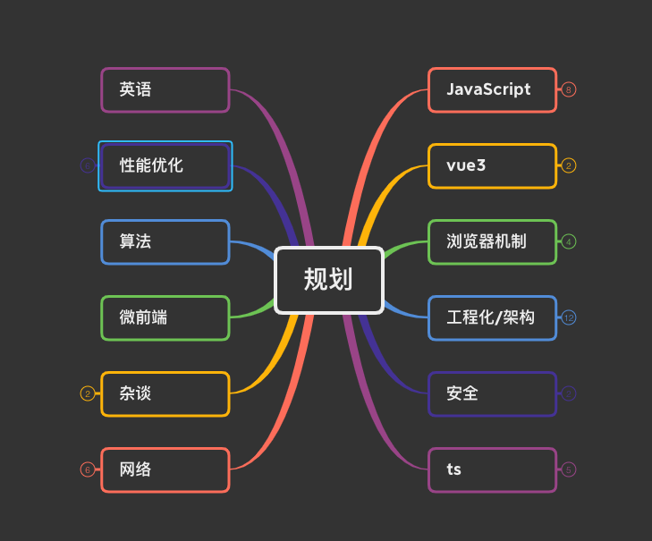

## **后续的规划**

如下规划表

### **优先级一**

- JavaScript核心知识(原型原型链、闭包、this指向、ES6重要知识等的重新复习)
- vue3基本学习、进阶学习、源码学习
- 英语能力的提升

### **优先级二**

- 算法

- 浏览器机制(缓存、v8、内核等)
- 网络http知识
- 工程化(webpack/vite/rollup 、bable、npm/yarn/pnpm等)
- 性能优化
- ts
- 安全

### **优先级三**

- 安全
- 前沿知识(微前端等)

## **如何学习**

### **费曼学习法**

- 第一， 确立你要学习的目标

- 第二，理解你要学习的对象

- 第三，以教代学，用输出代替输入
- 第四，进行回顾和反思
- 第五，实现知识的简化和吸收

## **反思**

不输出的知识 === 没学

