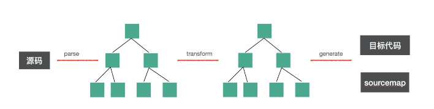
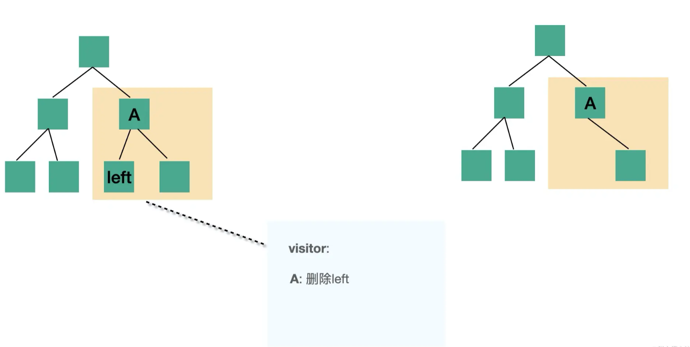
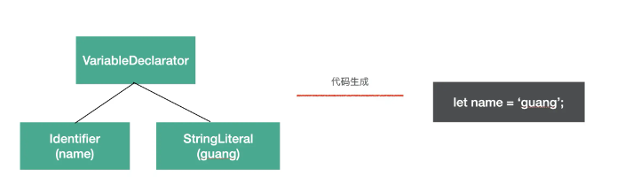

# **Babel**


## **Babel 的介绍**

babel 最开始叫 6to5，顾名思义是 es6 转 es5，但是后来随着 es 标准的演进，有了 es7、es8 等， 6to5 的名字已经不合适了，所以改名为了 babel。

babel 是[巴别塔](https://link.juejin.cn/?target=https%3A%2F%2Fbaike.baidu.com%2Fitem%2F%E5%B7%B4%E5%88%AB%E5%A1%94%2F67557%3Ffr%3Daladdin)的意思，来自圣经中的典故：

> 当时人类联合起来兴建希望能通往天堂的高塔，为了阻止人类的计划，上帝让人类说不同的语言，使人类相互之间不能沟通，计划因此失败，人类自此各散东西。此事件，为世上出现不同语言和种族提供解释。这座塔就是巴别塔。

**Babel的用处**

- 转换语法
- 目标环境中缺少的 Polyfill 功能（通过第三方 polyfill，例如[core-js](https://github.com/zloirock/core-js)）
- 源代码转换 (codemods)

## **babel 的编译流程**

babel 是 source to source 的转换，整体编译流程分为三步：

- parse：通过 parser 把源码转成抽象语法树（AST）
- transform：遍历 AST，调用各种 transform 插件对 AST 进行增删改
- generate：把转换后的 AST 打印成目标代码，并生成 sourcemap



### **这三步都做了什么？**

**parse**  --- parse 阶段的目的是把源码字符串转换成机器能够理解的 AST，这个过程分为词法分析、语法分析。

比如 `let name = 'guang';` 这样一段源码，我们要先把它分成一个个不能细分的单词（token），也就是 `let`, `name`, `=`, `'guang'`，这个过程是词法分析，按照单词的构成规则来拆分字符串成单词。

之后要把 token 进行递归的组装，生成 AST，这个过程是语法分析，按照不同的语法结构，来把一组单词组合成对象，比如声明语句、赋值表达式等都有对应的 AST 节点。


**transform** --- transform 阶段是对 parse 生成的 AST 的处理，会进行 AST 的遍历，遍历的过程中处理到不同的 AST 节点会调用注册的相应的 visitor 函数，visitor 函数里可以对 AST 节点进行增删改，返回新的 AST（可以指定是否继续遍历新生成的 AST）。这样遍历完一遍 AST 之后就完成了对代码的修改。



**generate** --- generate 阶段会把 AST 打印成目标代码字符串，并且会生成 sourcemap。不同的 AST 对应的不同结构的字符串。比如 `IfStatement` 就可以打印成 `if(test) {}` 格式的代码。这样从 AST 根节点进行递归的字符串拼接，就可以生成目标代码的字符串。




### **总结**

- parse(`生成ast`)
- transform(`对ast进行转换`)
- generate(`生成目标代码以及sourcemap`)


## **Babel中的ast**

[ast可视化查看](https://astexplorer.net/)


## **sourcemap**

### **sourcemap 的作用**

babel 对源码进行了修改，生成的目标代码可能改动很大，如果直接调试目标代码，那么可能很难对应到源码里。所以需要一种自动关联源码的方式，就是 sourcemap。

平时用 sourcemap 主要用两个目的：

**调试代码时定位到源码**

chrome、firefox 等浏览器支持在文件末尾加上[一行注释](https://link.juejin.cn/?target=https%3A%2F%2Fdeveloper.mozilla.org%2Fzh-CN%2Fdocs%2FTools%2FDebugger%2FHow_to%2FUse_a_source_map)

```ruby
//# sourceMappingURL=http://example.com/path/to/your/sourcemap.map
```

可以通过 url 的方式或者转成 base64 内联的方式来关联 sourcemap。调试工具（浏览器、vscode 等会自动解析 sourcemap，关联到源码。这样打断点、错误堆栈等都会对应到相应源码。

**线上报错定位到源码**

开发时会使用 sourcemap 来调试，但是生产可不会，要是把 sourcemap 传到生产算是大事故了。但是线上报错的时候确实也需要定位到源码，这种情况一般都是`单独上传 sourcemap 到错误收集平台`。

比如 sentry 就提供了一个 [@sentry/webpack-plugin](https://link.juejin.cn/?target=https%3A%2F%2Fwww.npmjs.com%2Fpackage%2F%40sentry%2Fwebpack-plugin) 支持在打包完成后把 sourcemap 自动上传到 sentry 后台，然后把本地 sourcemap 删掉。还提供了 [@sentry/cli](https://link.juejin.cn/?target=https%3A%2F%2Fwww.npmjs.com%2Fpackage%2F%40sentry%2Fcli) 让用户可以手动上传。

平时我们至少在这两个场景（开发时调试源码，生产时定位错误）下会用到 sourcemap。

### **生成 sourcemap**

生成 sourcemap 的流程是：

1. 创建一个 SourceMapGenerator 对象
2. 通过 addMapping 方法添加一个映射
3. 通过 toString 转为 sourcemap 字符串

```js
var map = new SourceMapGenerator({
  file: "source-mapped.js"
});

map.addMapping({
  generated: {
    line: 10,
    column: 35
  },
  source: "foo.js",
  original: {
    line: 33,
    column: 2
  },
  name: "christopher"
});

console.log(map.toString());
// '{"version":3,"file":"source-mapped.js",
//   "sources":["foo.js"],"names":["christopher"],"mappings":";;;;;;;;;mCAgCEA"}'
```

### **使用sourcemap**

SourceMapConsumer.with 的回调里面可以拿到 consumer 的 api，调用 originalPositionFor 和 generatedPositionFor 可以分别用目标代码位置查源码位置和用源码位置查目标代码位置。还可以通过 eachMapping 遍历所有 mapping，对每个进行处理。

```js
const rawSourceMap = {
  version: 3,
  file: "min.js",
  names: ["bar", "baz", "n"],
  sources: ["one.js", "two.js"],
  sourceRoot: "http://example.com/www/js/",
  mappings: "CAAC,IAAI,IAAM,SAAUA,GAClB,OAAOC,IAAID;CCDb,IAAI,IAAM,SAAUE,GAClB,OAAOA"
};

const whatever = await SourceMapConsumer.with(rawSourceMap, null, consumer => {
   // 目标代码位置查询源码位置
  consumer.originalPositionFor({
    line: 2,
    column: 28
  })
  // { source: 'http://example.com/www/js/two.js',
  //   line: 2,
  //   column: 10,
  //   name: 'n' }
  
  // 源码位置查询目标代码位置
  consumer.generatedPositionFor({
    source: "http://example.com/www/js/two.js",
    line: 2,
    column: 10
  })
  // { line: 2, column: 28 }
  
  // 遍历 mapping
  consumer.eachMapping(function(m) {
    // ...
  });

  return computeWhatever();
});
```

babel 就是用这些 api 来生成 sourcemap 的。

### **小结**

- sourcemap作用?  1. 开发调式  2. 线上排查
- sourcemap做了什么？将生成的目标文件与原文件进行映射 (`文件位置、代码行和列`)

[sourceMap奥秘](https://juejin.cn/book/6946117847848321055/section/6947678220401508392)

## **参考链接**

[Babel 插件通关秘籍](https://juejin.cn/book/6946117847848321055)
