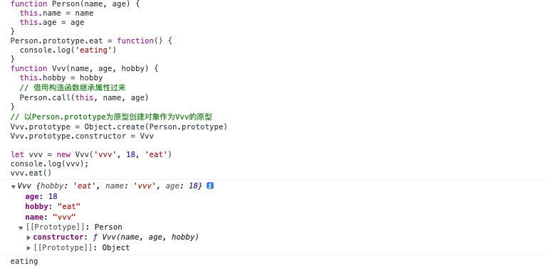

# 8.1-寄生组合继承

## 寄生组合继承解决了什么问题

寄生组合继承解决了组合继承的问题

组合继承已经相对完善了，但还是存在问题，它的问题就是调用了2 次父类构造函数，

第一次是在 new Student()，第二次是在 Person.call() 这里。

## 实现

```js
function Person(name, age) {
  this.name = name
  this.age = age
}
Person.prototype.eat = function() {
  console.log('eating')
}
function Vvv(name, age, hobby) {
  this.hobby = hobby
  // 借用构造函数继承属性过来
  Person.call(this, name, age)
}
// 以Person.prototype为原型创建对象作为Vvv的原型
Vvv.prototype = Object.create(Person.prototype)
Vvv.prototype.constructor = Vvv
```

## 测试

```js
let vvv = new Vvv('vvv', 18, 'eat')
console.log(vvv);
vvv.eat()
```

测试结果如下



可以知道Vvv的`prototype`属性已经变为`Person`构造函数了

所以可以使用到了`eat`方法