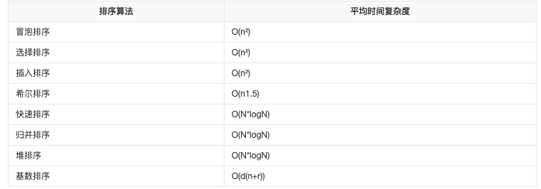

# 8.22-冒泡排序

## 描述
- `冒泡排序（BubbleSort）`，是一种计算机科学领域的较简单的排序算法。
- 它重复地走访过要排序的元素列，依次比较两个相邻的元素，如果顺序（如从大到小、首字母从Z到A）错误就把他们交换过来。走访元素的工作是重复地进行直到没有相邻元素需要交换，也就是说该元素列已经排序完成。
- 这个算法的名字由来是因为越小的元素会经由交换慢慢“浮”到数列的顶端（升序或降序排列），就如同碳酸饮料中二氧化碳的气泡最终会上浮到顶端一样，故名“冒泡排序”。

   [百度百科](https://baike.baidu.com/item/%E5%86%92%E6%B3%A1%E6%8E%92%E5%BA%8F/4602306)


## 算法原理

- 比较相邻的元素。如果第一个比第二个大，就交换他们两个
- 对每一对相邻元素做同样的工作，从开始第一对到结尾的最后一对。在这一点，最后的元素应该会是最大的数
- 针对所有的元素重复以上的步骤，除了最后一个
- 持续每次对越来越少的元素重复上面的步骤，直到没有任何一对数字需要比较


## 算法实现

```js
/**
 * 实现一个冒泡排序
 * @param {*} arr 数组
 * @returns 返回排序后的数组
 */

const bubbleSort = (arr) => {
  const len = arr.length
  // 外层循环用于控制从头到尾的比较+交换到底有多少轮
  for(let i = 0; i < len; i++) {
    // 内层循环用于完成每一轮遍历过程中的重复比较+交换
    for(let j = 0; j < len - 1; j++) {
      // 若相邻元素前面的数比后面的大
      if (arr[j] > arr[j + 1]) {
        // 交换两者
        [arr[j], arr[j + 1]] = [arr[j + 1], arr[j]];
      }
    }
  }
  return arr
}
```


## 算法动图展示


## 算法测试

```js
const arr = [2, 3, 8, 5, 4]
console.log(bubbleSort(arr)); // [2, 3, 4, 5, 8]
```


## 算法分析

### 时间复杂度

冒泡排序的时间复杂度为O(n^2)

### 算法稳定性

冒泡排序就是把小的元素往前调或者把大的元素往后调。比较是相邻的两个元素比较，交换也发生在这两个元素之间。所以，如果两个元素相等，是不会再交换的；如果两个相等的元素没有相邻，那么即使通过前面的两两交换把两个相邻起来，这时候也不会交换，所以相同元素的前后顺序并没有改变，所以冒泡排序是一种[稳定排序](https://baike.baidu.com/item/稳定排序/4975546)算法。

## 各类算法的时间复杂度

