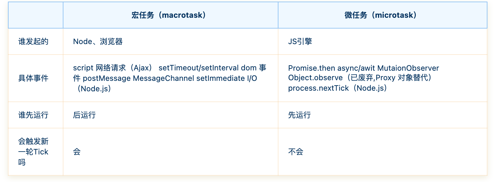
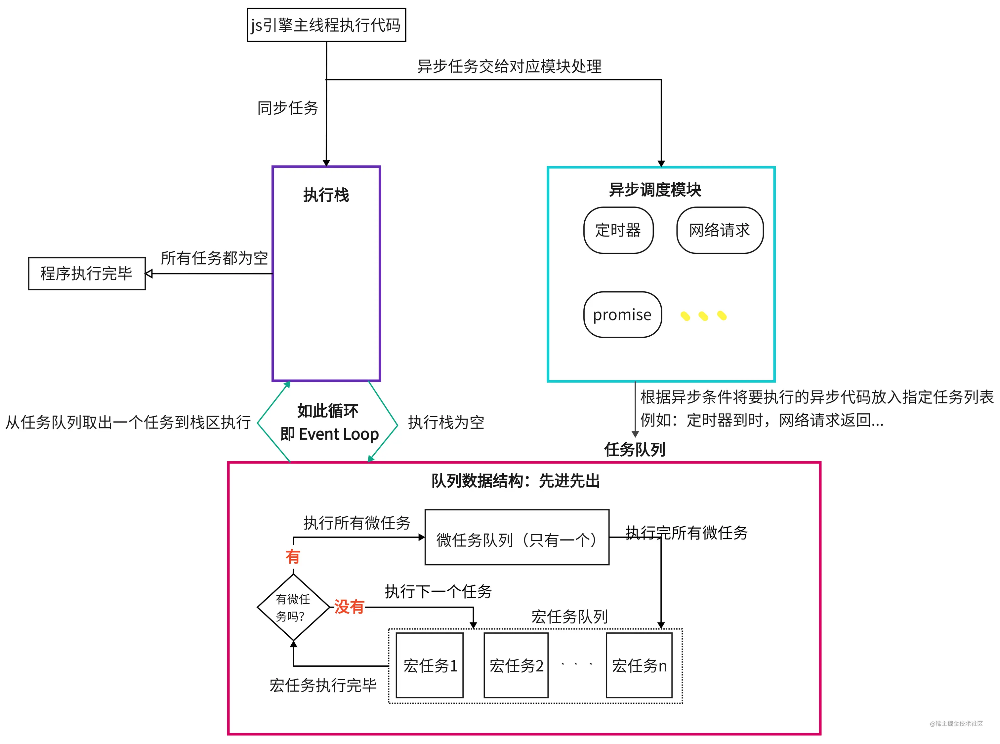

# 8.29-事件循环

## 为什么JavaScript是单线程

作为浏览器脚本语言，JavaScript的主要用途是与用户互动，以及操作DOM。这决定了它只能是单线程，否则会带来很复杂的同步问题。比如，假定JavaScript同时有两个线程，一个线程在某个DOM节点上添加内容，另一个线程删除了这个节点，这时浏览器应该以哪个线程为准？所以，为了避免复杂性，JavaScript就是单线程。

引入单线程就意味着，所有任务需要排队，前一个任务结束，才会执行后一个任务。这同时又导致了一个问题：如果前一个任务耗时很长，后一个任务就不得不一直等着。

为了利用多核CPU的计算能力，HTML5提出Web Worker标准，允许JavaScript脚本创建多个线程，但是子线程完全受主线程控制，且不得操作DOM。所以，这个新标准并没有改变JavaScript单线程的本质。

## 浏览器的事件循环机制

JS是一门单线程语言，所有的任务都需要排队，前一个任务执行完成，才会执行下一个任务。如果JS执行的时间过长，就会造成页面的渲染不连贯，导致页面渲染加载阻塞。为解决此问题，JS引入了同步任务和异步任务。

**同步任务：** 主线程上的任务，按顺序依次执⾏，当前⼀个任务执⾏完毕后，才能执⾏下⼀个任务。

**异步任务：** 主线程外的任务，是进⼊任务队列的任务，执行完毕之后会产生一个回调函数，并且通知主线程。当主线程上的任务执行完后，就会调取最早通知自己的回调函数，使其进入主线程中执行。

**微任务和宏任务**

异步任务还有更精确的区分：

- 微任务(micro-task) job
- 宏任务(macro-task) task



同步任务和异步任务都是由js引擎来调度管理的，在这其中维护了一组任务队列（Event Queue）；当执行到setTimeout时会将回调放入到**宏任务队列**，当执行到Promise then方法时会将会回调放入到**微任务队列**，当同步任务执行完成之后，就会去任务队列中的读取异步任务拿出来放到主线程中依次执行，首先会将微任务队列清空，然后再读取宏任务队列。

### Event Loop 执行机制

- 进入到script标签,就进入到了第一次事件循环.

- 遇到同步代码，立即执行(`执行完同步任务后,会执行异步任务`)

- 遇到宏任务,放入到宏任务队列里.

- 遇到微任务,放入到微任务队列里.

- 执行完所有同步代码即执行栈清空(`步骤5`)

- 取出微任务队列代码到栈区执行

- 微任务代码执行完毕，本次队列清空

- 寻找下一个宏任务,然后重复`步骤5`

以此反复直到清空所有宏任务，这种不断重复的执行机制，就叫做`事件循环`，流程图如下：




## 训练

`提示:在执行一个宏任务的时候, 会把这个宏任务存在的所有微任务执行完, 才会去执行下一个宏任务`

### 训练1

```js
const first = () => (new Promise((resolve, reject) => {
     console.log(3);
     let p = new Promise((resolve, reject) => {
         console.log(7);
         setTimeout(() => {
             console.log(5);
         }, 0)
         resolve(1);
     });
     resolve(2);
     p.then((res) => {
         console.log(res);
     });
 }));
 first().then((res) => {  
     console.log(res);
 });
 console.log(4);
```

<details>
  <summary>答案</summary>
  <div>3</div>
  <div>7</div>
  <div>4</div>
  <div>1</div>
  <div>2</div>
  <div>5</div>
</details>

### 训练2

```js
console.log('start')
 setTimeout(() => {
   console.log('timer1')
   Promise.resolve().then(function() {
     console.log('promise1')
   })
 }, 0)
 setTimeout(() => {
   console.log('timer2')
   Promise.resolve().then(function() {
     console.log('promise2')
   })
 }, 0)
 Promise.resolve().then(function() {
   console.log('promise3')
 })
 console.log('end')

```
<details>
  <summary>答案</summary>
  <div>start</div>
  <div>end</div>
  <div>promise3</div>
  <div>timer1</div>
  <div>promise1</div>
  <div>timer2</div>
  <div>promise2</div>
</details>

### 训练3

```js
console.log('start')
 setTimeout(() => {
   console.log('setTimeout')
 }, 0)
 new Promise((resolve) => {
   console.log('promise')
   resolve()
 }).then(() => {
   console.log('then1')
 }).then(() => {
   console.log('then2')
 })
 console.log('end')
```
<details>
  <summary>答案</summary>
  <div>start</div>
  <div>promise</div>
  <div>end</div>
  <div>then1</div>
  <div>then2</div>
  <div>setTimeout</div>
</details>

### 训练4

```js
console.log(1);
setTimeout(() => {
  console.log(2);
  new Promise((resolve, reject) => {
    console.log(3);
    resolve()
  }).then(res => {
    console.log(4);
  })
})
new Promise((resolve, reject) => {
  resolve()
}).then(res => {
  console.log(5);
}).then(res => {
  console.log(6);
})
new Promise((resolve, reject) => {
  console.log(7);
  resolve()
}).then(res => {
  console.log(8);
}).then(res => {
  console.log(9);
})
setTimeout(() => {
  console.log(10);
  new Promise((resolve, reject) => {
    console.log(11);
    resolve()
  }).then(res => {
    console.log(12);
  })
})
console.log(13);
```
<details>
  <summary>答案</summary>
  <div>1</div>
  <div>7</div>
  <div>13</div>
  <div>5</div>
  <div>8</div>
  <div>6</div>
   <div>9</div>
  <div>2</div>
  <div>3</div>
   <div>4</div>
  <div>10</div>
  <div>11</div>
  <div>12</div>
</details>


## 总结

- JavaScript是单线程语言，同步任务同步执行，异步任务异步执行
- 异步任务分为微任务和宏任务

`什么是浏览器事件循环?`

- js是单线程语言，分为同步任务和异步任务, 同步任务同步执行，异步任务异步执行
- 在执行代码的过程中, 先去执行同步任务,等待同步任务完成后,然后会去执行异步任务
- 异步任务又分为宏微任务, 遇到宏任务,放入到宏任务队列里,遇到微任务,放入到微任务队列里
- 等待同步任务完成, 然后开始执行宏微任务,(`微任务优先于宏任务`),本次队列清空, 然后继续寻找宏任务,
- 以此反复直到清空所有宏任务，这种不断重复的执行机制，就叫做`事件循环`

## 参考链接

[简析JavaScript事件循环机制](https://juejin.cn/post/7128011495685750821)

[浏览器与Node的事件循环(Event Loop)有何区别?](https://juejin.cn/post/6844903761949753352)