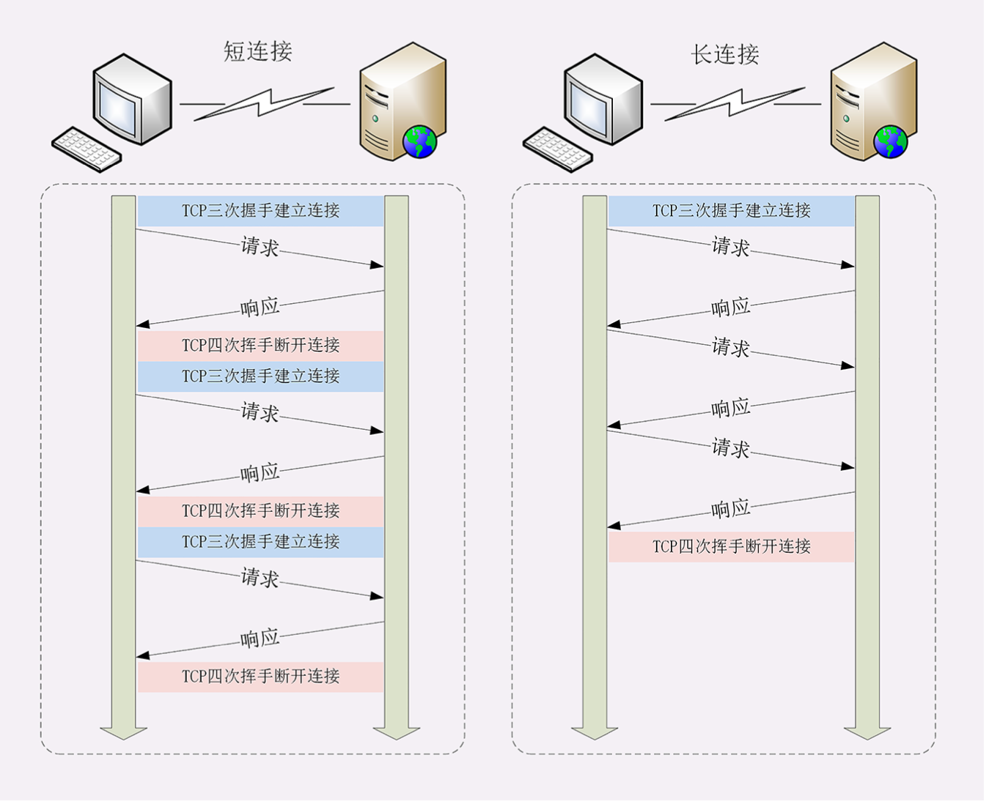
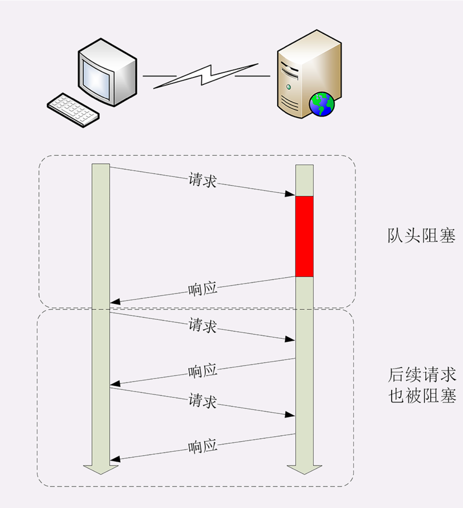

# 9.12-学习http(八)

## **HTTP的连接管理**

### **短连接**

HTTP 协议最初(0.9/1.0)是个非常简单的协议，通信过程也采用了简单的请求 - 应答方式。

它底层的数据传输基于 TCP/IP，每次发送请求前需要先与 服务器建立连接，收到响应报文后会立即关闭连接。

因为客户端与服务器的整个连接过程很短暂，不会与服务器保持长时间的连接状态，所以就被称为**短连接**(short- lived connections)。早期的 HTTP 协议也被称为是**无 连接**的协议。

短连接的缺点相当严重，因为在 TCP 协议里，建立连接和 关闭连接都是非常昂贵的操作。TCP 建立连接要有三次握手，发送 3 个数据包，需要 1 个 RTT;关闭连接是四次挥手，4 个数据包需要 2 个 RTT。

而 HTTP 的一次简单请求 - 响应通常只需要 4 个包， 如果不算服务器内部的处理时间，最多是 2 个 RTT。这么算下来，浪费的时间就是3÷5=60%，有三分之二的时间 被浪费掉了，传输效率低得惊人。

### **长连接**

针对短连接暴露出的缺点，HTTP 协议就提出了**长连接**的通信方式，也叫持久连接(persistent connections)、连接保活(keep alive)、连接复用(connection reuse)。

其实解决办法也很简单，用的就是**成本均摊**的思路，既然 TCP 的连接和关闭非常耗时间，那么就把这个时间成本由原来的一个请求 - 应答均摊到多个请求 - 应答上。

在短连接里发送了三次 HTTP请求 - 应答，每次都会浪费 60% 的 RTT 时间。而在长连接的情况下，同样发送三次请求，因为只在第一次时建立连接，在最后一次时关闭连接，所以浪费率就是3÷9≈33%，降低了差不多一半的 时间损耗。显然，如果在这个长连接上发送的请求越多，分 母就越大，利用率也就越高。

### **连接相关的头字段**

由于长连接对性能的改善效果非常显著，所以在 HTTP/1.1 中的连接都会默认启用长连接。不需要用什么特殊的头字段指定，只要向服务器发送了第一次请求，后续的请求都会重复利用第一次打开的 TCP 连接，也就是长连接，在这个连接上收发数据。

当然，我们也可以在请求头里明确地要求使用长连接机制， 使用的字段是**Connection**，值是**keep-alive**。

不过不管客户端是否显式要求长连接，如果服务器支持长连接，它总会在响应报文里放一个**Connection: keep- alive**字段，告诉客户端:我是支持长连接的，接下来 就用这个 TCP 一直收发数据吧。

### **队头阻塞**

看完了短连接和长连接，接下来就要说到著名的队头阻塞(Head-of-line blocking，也叫队首阻塞)了。

队头阻塞与短连接和长连接无关，而是由 HTTP 基本的请求 - 应答模型所导致的。

因为 HTTP 规定报文必须是一发一收，这就形成了一个 先进先出的串行队列。队列里的请求没有轻重缓急的优先级，只有入队的先后顺序，排在最前面的请求被最优先处理。

如果队首的请求因为处理的太慢耽误了时间，那么队列里后面的所有请求也不得不跟着一起等待，结果就是其他的请求承担了不应有的时间成本。

### **性能优化**

解决队头阻塞问题的方法

- **并发连接**，也就是同时对一个域名发起多个长连接(现在可以一次并发6~8个)， 用数量来解决质量的问题, 可以解决此问题。
- **域名分片**, 也就是多个域名指向同一台服务器

### **小结**

- 早期的 HTTP 协议使用短连接，收到响应后就立即关闭连接，效率很低(`短连接`)
- `HTTP/1.1 默认启用长连接`，在一个连接上收发多个请求 响应，提高了传输效率
- 服务器会发送`Connection: keep-alive字段表示启用了长连接`
- 报文头里如果有`Connection: close就意味着长连接即将关闭`
- 过多的长连接会占用服务器资源，所以服务器会用一些策 略有选择地关闭长连接;
- 队头阻塞问题会导致性能下降，可以用`并发连接和域名分片`技术缓解

