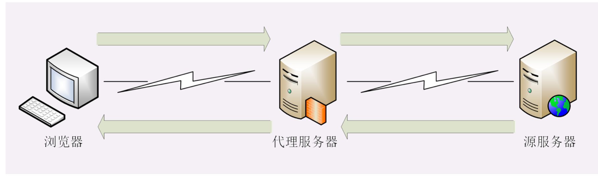
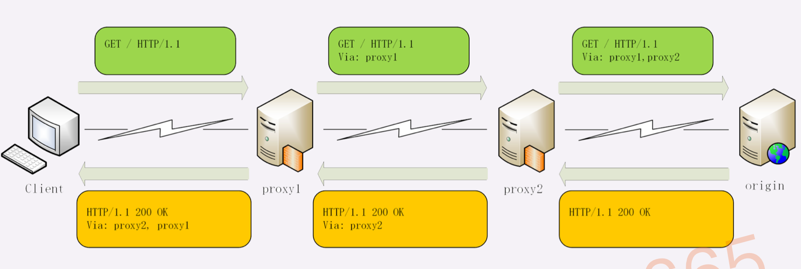
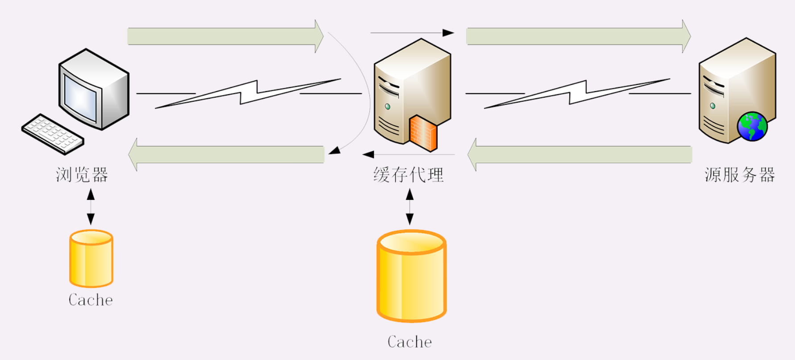
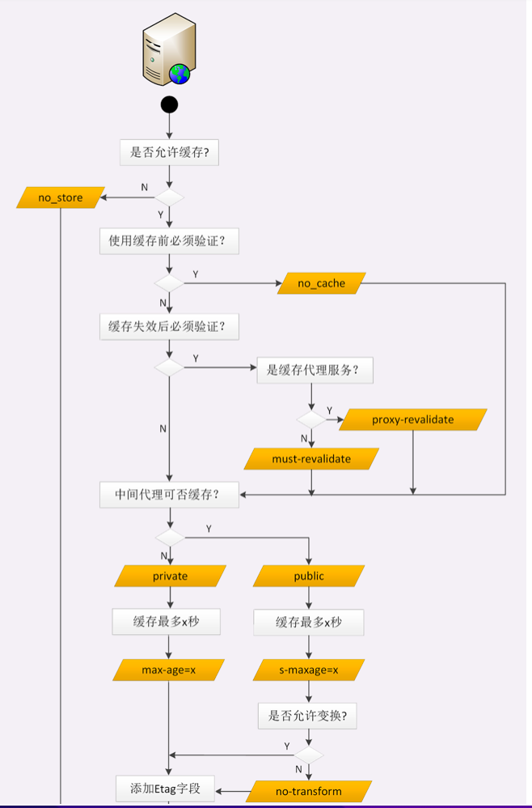
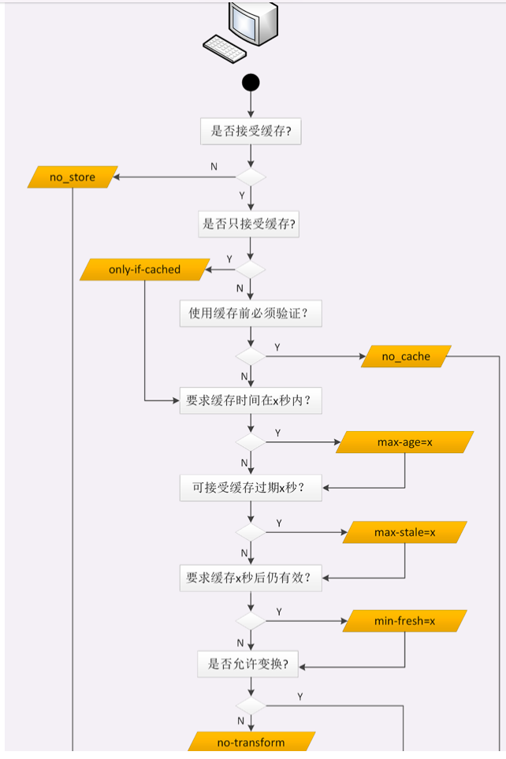

# 9.16-学习http(十二)

## **HTTP的代理服务** 

在前面讲 HTTP 协议的时候，我们严格遵循了 HTTP 的请求 - 应答模型，协议中只有两个互相通信的角色，分别是请求方浏览器(客户端)和应答方服务器。

今天，我们要在这个模型里引入一个新的角色，那就是HTTP 代理。

引入 HTTP 代理后，原来简单的双方通信就变复杂了一些，加入了一个或者多个中间人，但整体上来看，还是一个有顺序关系的链条，而且链条里相邻的两个角色仍然是简单的一对一通信，不会出现越级的情况。



链条的起点还是客户端(也就是浏览器)，中间的角色被称为代理服务器(proxy server)，链条的终点被称为源服务器(origin server)，意思是数据的源头起源。

### **代理服务**

代理服务就是指`服务本身不生产内容，而是处于中间位置转发上下游的请求和响应，具有双重身份`: 面向下游的用户时，表现为服务器，代表源服务器响应客户端的请求;而面向上游的源服务器时，又表现为客户端，代表客户端发送请求。

### **代理的作用**

为什么要有代理呢?换句话说，代理能干什么、带来什么好处呢?

你也许听过这样一句至理名言:计算机科学领域里的任何问题，都可以通过引入一个中间 层来解决(在这句话后面还可以再加上一句如果一个中间层解决不了问题，那就再加一 个中间层)。TCP/IP 协议栈是这样，而代理也是这样。

由于代理处在 HTTP 通信过程的中间位置，相应地就对上屏蔽了真实客户端，对下屏蔽了真实服务器，简单的说就是**欺上瞒下**。在这个中间层的小天地里就可以做很多的事情，为 HTTP 协议增加更多的灵活性，实现客户端和服务器的双赢。

代理最基本的一个功能是**负载均衡**。因为在面向客户端时屏蔽了源服务器，客户端看到的只是代理服务器，源服务器究竟有多少台、是哪些 IP 地址都不知道。于是代理服务器就可以 掌握请求分发的大权，决定由后面的哪台服务器来响应请求。

代理中常用的负载均衡算法你应该也有所耳闻吧，比如轮询、一致性哈希等等，这些算法的目标都是尽量把外部的流量合理地分散到多台源服务器，提高系统的整体资源利用率和性能。

在负载均衡的同时，代理服务还可以执行更多的功能，比如:

- **健康检查**:使用心跳等机制监控后端服务器，发现有故障就及时踢出集群，保证服务高可用
- **安全防护**:保护被代理的后端服务器，限制 IP 地址或流量，抵御网络攻击和过载
- **加密卸载**:对外网使用 SSL/TLS 加密通信认证，而在安全的内网不加密，消除加解密成本
- **数据过滤**:拦截上下行的数据，任意指定策略修改请求或者响应
- **内容缓存**:暂存、复用服务器响应

### **代理相关头字段**

代理的好处很多，但因为它欺上瞒下的特点，隐藏了真实客户端和服务器，如果双方想要获得这些丢失的原始信息，该怎么办呢?

首先，代理服务器需要用字段**Via**标明代理的身份。

Via 是一个通用字段，请求头或响应头里都可以出现。每当报文经过一个代理节点，代理服务器就会把自身的信息追加到字段的末尾，就像是经手人盖了一个章。

如果通信链路中有很多中间代理，就会在 Via 里形成一个链表，这样就可以知道报文究竟 走过了多少个环节才到达了目的地。

例如下图中有两个代理:proxy1 和 proxy2，客户端发送请求会经过这两个代理，依次添加就是Via: proxy1, proxy2，等到服务器返回响应报文的时候就要反过来走，头字段就是Via: proxy2, proxy1。



Via 字段只解决了客户端和源服务器判断是否存在代理的问题，还不能知道对方的真实信息

但服务器的 IP 地址应该是保密的，关系到企业的内网安全，所以一般不会让客户端知道。 不过反过来，通常服务器需要知道客户端的真实 IP 地址，方便做访问控制、用户画像、统计分析。

可惜的是 HTTP 标准里并没有为此定义头字段，但已经出现了很多事实上的标准，最常用的两个头字段是**X-Forwarded-For**和**X-Real-IP**。

X-Forwarded-For的字面意思是为谁而转发，形式上和Via差不多，也是每经过一个代理节点就会在字段里追加一个信息。但Via追加的是代理主机名(或者域名)，而X-Forwarded-For追加的是请求方的 IP 地址。所以，在字段里最左边的 IP 地址就客户端的地址。

X-Real-IP是另一种获取客户端真实 IP 的手段，它的作用很简单，就是记录客户端 IP 地址，没有中间的代理信息，相当于是X-Forwarded-For的简化版。如果客户端和源 服务器之间只有一个代理，那么这两个字段的值就是相同的。

### **代理协议**

有了X-Forwarded-For等头字段，源服务器就可以拿到准确的客户端信息了。但对于代理服务器来说它并不是一个最佳的解决方案。

因为通过X-Forwarded-For操作代理信息必须要解析 HTTP 报文头，这对于代理来说成本比较高，原本只需要简单地转发消息就好，而现在却必须要费力解析数据再修改数据， 会降低代理的转发性能。

另一个问题是X-Forwarded-For等头必须要修改原始报文，而有些情况下是不允许甚 至不可能的(比如使用 HTTPS 通信被加密)。

所以就出现了一个专门的代理协议(The PROXY protocol)，它由知名的代理软件 HAProxy 所定义，也是一个事实标准，被广泛采用(注意并不是 RFC)。

代理协议有 v1 和 v2 两个版本，v1 和 HTTP 差不多，也是明文，而 v2 是二进制格 式。今天只介绍比较好理解的 v1，它在 HTTP 报文前增加了一行 ASCII 码文本，相当于又 多了一个头。

这一行文本其实非常简单，开头必须是PROXY五个大写字母，然后是TCP4或 者TCP6，表示客户端的 IP 地址类型，再后面是请求方地址、应答方地址、请求方端口号、应答方端口号，最后用一个回车换行(\r\n)结束。

例如下面的这个例子，在 GET 请求行前多出了 PROXY 信息行，客户端的真实 IP 地址 是1.1.1.1，端口号是 55555。

```html
PROXY TCP4 1.1.1.1 2.2.2.2 55555 80\r\n 
GET / HTTP/1.1\r\n
Host: www.xxx.com\r\n
\r\n
```

服务器看到这样的报文，只要解析第一行就可以拿到客户端地址，不需要再去理会后面的 HTTP 数据，省了很多事情。

不过代理协议并不支持X-Forwarded-For的链式地址形式，所以拿到客户端地址后再 如何处理就需要代理服务器与后端自行约定。

### **小结**

- HTTP 代理就是客户端和服务器通信链路中的一个中间环节，为两端提供代理服务
- 代理处于中间层，为 HTTP 处理增加了更多的灵活性，可以实现负载均衡、安全防护、 数据过滤等功能
- 代理服务器需要使用字段Via标记自己的身份，多个代理会形成一个列表
- 如果想要知道客户端的真实 IP 地址，可以使用字段X-Forwarded-For和X-Real-IP
- 专门的代理协议可以在不改动原始报文的情况下传递客户端的真实 IP


## **HTTP的缓存代理**

之前谈到缓存时，主要讲了客户端(浏览器)上的缓存控制，它能够减少响应时间、节约带宽，提升客户端的用户体验。

但 HTTP 传输链路上，不只是客户端有缓存，服务器上的缓存也是非常有价值的，可以让请求不必走完整个后续处理流程，就近获得响应结果。

特别是对于那些读多写少的数据，例如突发热点新闻、爆款商品的详情页，一秒钟内可能有成千上万次的请求。即使仅仅缓存数秒钟，也能够把巨大的访问流量挡在外面，让RPS(request per second)降低好几个数量级，减轻应用服务器的并发压力，对性能的 改善是非常显著的。

HTTP 的服务器缓存功能主要由代理服务器来实现(即缓存代理)，而源服务器系统内部虽然也经常有各种缓存(如 Memcache、Redis、Varnish 等)，但与 HTTP 没有太多关系，所以这里暂且不说。

### **缓存代理服务**

代理服务收到源服务器发来的响应数据后需要做两件事。第一个当然是把报文转发给客户端，而第二个就是把报文存入自己的 Cache 里。

下一次再有相同的请求，代理服务器就可以直接发送 304 或者缓存数据，不必再从源服务器那里获取。这样就降低了客户端的等待时间，同时节约了源服务器的网络带宽。



在 HTTP 的缓存体系中，缓存代理的身份十分特殊，它既是客户端，又是服务器，同时也既不是客户端，又不是服务器。

说它即是客户端又是服务器，是因为它面向源服务器时是客户端，在面向客户端时又是服务器，所以它即可以用客户端的缓存控制策略也可以用服务器端的缓存控制策略，也就是说它可以同时使用各种Cache-Control属性。

但缓存代理也即不是客户端又不是服务器，因为它只是一个数据的中转站，并不是真正的数据消费者和生产者，所以还需要有一些新的Cache-Control属性来对它做特别的约束。

### **源服务器的缓存控制**

之前介绍了 4 种服务器端的Cache-Control属性:max-age、no_store、 no_cache 和 must-revalidate，应该还有印象吧?

这 4 种缓存属性可以约束客户端，也可以约束代理。

但客户端和代理是不一样的，客户端的缓存只是用户自己使用，而代理的缓存可能会为非常多的客户端提供服务。所以，需要对它的缓存再多一些限制条件。

首先，我们要区分客户端上的缓存和代理上的缓存，可以使用两个新属性**private**和**public**。

private表示缓存只能在客户端保存，是用户私有的，不能放在代理上与别人共 享。而public的意思就是缓存完全开放，谁都可以存，谁都可以用。

比如你登录论坛，返回的响应报文里用Set-Cookie添加了论坛 ID，这就属于私人数据，不能存在代理上。不然，别人访问代理获取了被缓存的响应就麻烦了。

其次，缓存失效后的重新验证也要区分开(即使用条件请求Last- modified和ETag)，**must-revalidate**是只要过期就必须回源服务器验证，而新的**proxy-revalidate**只要求代理的缓存过期后必须验证，客户端不必回源，只验证 到代理这个环节就行了。

再次，缓存的生存时间可以使用新的**s-maxage**(s 是 share 的意思，注意 maxage 中间没有-)，只限定在代理上能够存多久，而客户端仍然使用max_age。

还有一个代理专用的属性**no-transform**。代理有时候会对缓存下来的数据做一些优化，比如把图片生成 png、webp 等几种格式，方便今后的请求处理，而no- transform就会禁止这样做，不许偷偷摸摸搞小动作。

源服务器在设置完Cache-Control后必须要为报文加上Last- modified或ETag字段。否则，客户端和代理后面就无法使用条件请求来验证缓存是否有效，也就不会有 304 缓存重定向。




### **客户端的缓存控制**

客户端在 HTTP 缓存体系里要面对的是代理和源服务器，也必须区别对待，这里就直接上图了，来个看图说话。



max-age、no_store、no_cache 这三个属性在之前已经介绍过了，它们也是同样作用于代理和源服务器。

关于缓存的生存时间，多了两个新属性**max-stale**和**min-fresh**。 max-stale的意思是如果代理上的缓存过期了也可以接受，但不能过期太多，超过 x 秒

也会不要。min-fresh的意思是缓存必须有效，而且必须在 x 秒后依然有效。

比如，草莓上贴着标签max-age=5，现在已经在冰柜里存了 7 天。如果有请求max-stale=2，意思是过期两天也能接受，所以刚好能卖出去。

但要是min-fresh=1，这是绝对不允许过期的，就不会买走。这时如果有另外一个菠萝 是max-age=10，那么7+1<10，在一天之后还是新鲜的，所以就能卖出去。

有的时候客户端还会发出一个特别的**only-if-cached**属性，表示只接受代理缓存的数 据，不接受源服务器的响应。如果代理上没有缓存或者缓存过期，就应该给客户端返回一个 504(Gateway Timeout)。

### **小结**

- 计算机领域里最常用的性能优化手段是时空转换，也就是时间换空间或者空间换时间，HTTP 缓存属于后者
- 缓存代理是增加了缓存功能的代理服务，缓存源服务器的数据，分发给下游的客户端
- Cache-Control字段也可以控制缓存代理，常用的有private、s-maxage、no-transform等，同样必须配合Last-modified、ETag等字段才能使用
- 缓存代理有时候也会带来负面影响，缓存不良数据，需要及时刷新或删除

## 参考

[透视HTTP协议(罗剑锋)](https://time.geekbang.org/column/intro/100029001)