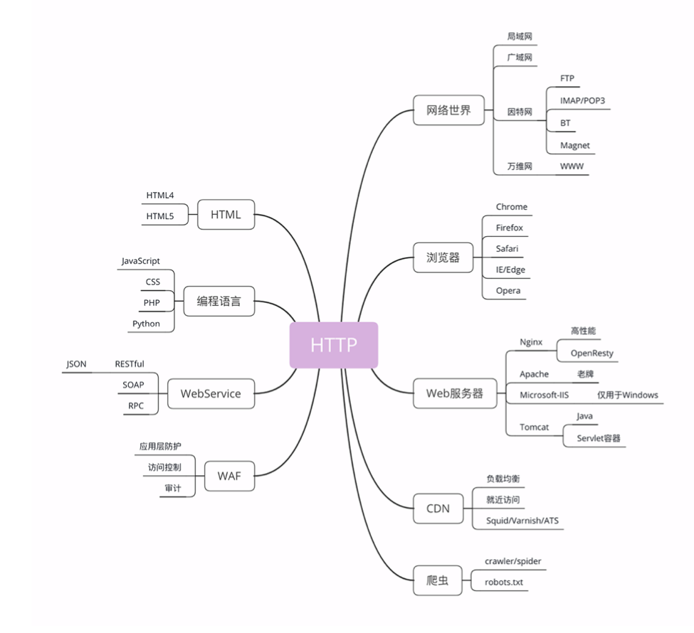
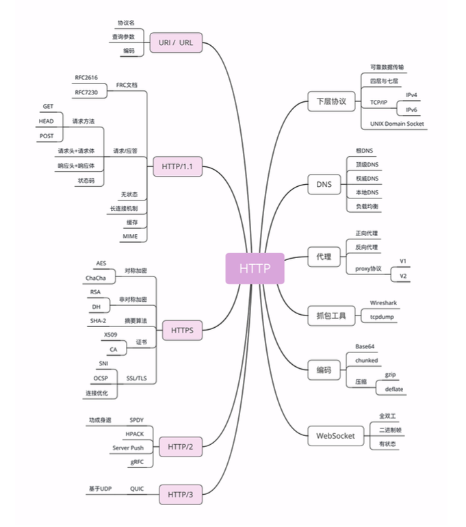

# 9.2-学习http(二)

## 与HTTP相关的各种概念(上)

### **浏览器**

浏览器的正式名字叫**Web Browser**，顾名思义，就是检索、查看互联网上网页资源的 应用程序，名字里的 Web，实际上指的就是World Wide Web，也就是万维网。

浏览器本质上是一个 HTTP 协议中的**请求方**，使用 HTTP 协议获取网络上的各种资源。当 然，为了让我们更好地检索查看网页，它还集成了很多额外的功能。

例如，HTML 排版引擎用来展示页面，JavaScript 引擎用来实现动态化效果，甚至还有开 发者工具用来调试网页，以及五花八门的各种插件和扩展。

在 HTTP 协议里，浏览器的角色被称为User Agent即用户代理，意思是作为访问 者的代理来发起 HTTP 请求。不过在不引起混淆的情况下，我们通常都简单地称之 为客户端。

### **Web**服务器

协议另一端的**应答方**(响应方)是**服务器**，**Web Server**。

**Web 服务器:** 

- Apache(老牌的服务器)
- Nginx 是 Web 服务器里的后起之秀，特点是高性能、高稳定，且易于扩展。 
- 还有 Windows 上的 IIS、Java 的 Jetty/Tomcat 等，因为性能不是很高，所以在互 联网上应用得较少。

### **CDN**

**CDN**，全称是Content Delivery Network，翻译过来就是内容分发网络。它应用 了 HTTP 协议里的缓存和代理技术，代替源站响应客户端的请求。

**CDN的好处:**

- 可以`缓存源站的数据`,让浏览器的请求不用千里迢迢地到达源站服务器， 直接在半路就可以获取响应。如果 CDN 的调度算法很优秀，更可以找到离用户最近的 节点，大幅度缩短响应时间。
- 除了基本的网络加速外，还提供负载均衡、 安全防护、边缘计算、跨运营商网络等功能，能够成倍地放大源站服务器的服务能力

### **爬虫**

前面说到过浏览器，它是一种用户代理，代替我们访问互联网。

HTTP 协议并没有规定用户代理后面必须是真正的人类，它也完全可以是机器人，这些机器人的正式名称就叫做**爬虫**(Crawler)，实际上是一种可以自动访 问 Web 资源的应用程序。

**爬虫是怎么来的呢?**

- 绝大多数是由各大搜索引擎放出来的，抓取网页存入庞大的数据库，再建立关键字索引，这样我们才能够在搜索引擎中快速地搜索到互联网角落里的页面。
- 爬虫也有不好的一面，它会`过度消耗网络资源，占用服务器和带宽，影响网站对真实数据的 分析`，甚至`导致敏感信息泄漏`。
- 所以，又`出现了反爬虫技术`，通过各种手段来限制爬 虫。其中一项就是君子协定robots.txt，约定哪些该爬，哪些不该爬。

无论是爬虫还是反爬虫，用到的基本技术都是两个，一个是 HTTP，另一个就是 HTML。

**ps:** 在浏览某些网站时遇到要求`验证你不是机器人`的页面, 这其实就是一种`反爬虫`的手段

### **WAF**

**WAF**是近几年比较火的一个词，意思是网络应用防火墙。与硬件防火墙类 似，它是应用层面的防火墙，专门检测 HTTP 流量，是防护 Web 应用的安全技术。

WAF 通常位于 Web 服务器之前，可以`阻止如 SQL 注入、跨站脚本等攻击`，目前应用较多的一个开源项目是 ModSecurity，它能够完全集成进 Apache 或 Nginx。

## 与HTTP相关的各种概念(下)

### **TCP/IP** 

TCP/IP 协议实际上是一系列网络通信协议的统称，其中最核心的两个协议是**TCP**和**IP**，其他的还有 UDP、ICMP、ARP 等等，共同构成了一个复杂但有层次的协议栈。

`IP 协议`

**IP 协议**是**I**nternet **P**rotocol的缩写，主要目的是解决`寻址和路由问题`，以及如何在两点间传送数据包。IP 协议使用**IP 地址**的概念来定位互联网上的每一台计算机。

现在我们使用的 IP 协议大多数是 v4 版，地址是四个用.分隔的数字，例 如192.168.0.1，总共有 2^32，大约 42 亿个可以分配的地址。看上去好像很多，但互 联网的快速发展让地址的分配管理很快就捉襟见肘。所以，就又出现了 v6 版，使用 8 组:分隔的数字作为地址，容量扩大了很多，有 2^128 个，在未来的几十年里应该是足够用了

`TCP 协议`

**TCP 协议**是**T**ransmission **C**ontrol **P**rotocol的缩写，意思是传输控制协议，它位 于 IP 协议之上，基于 IP 协议提供可靠的、字节流形式的通信，是 HTTP 协议得以实现的 基础。

可靠是指保证数据不丢失，字节流是指保证数据完整，所以在 TCP 协议的两端可 以如同操作文件一样访问传输的数据，就像是读写在一个密闭的管道里流动的字节。

HTTP 是一个"传输协议"，但它不关心寻址、路由、数据完整性等 传输细节，而要求这些工作都由下层来处理。因为互联网上最流行的是 TCP/IP 协议，而它 刚好满足 HTTP 的要求，所以互联网上的 HTTP 协议就运行在了 TCP/IP 上，HTTP 也就可 以更准确地称为**HTTP over TCP/IP**(`TCP/IP上的HTTP`)

### **DNS**

因为在TCP/IP 协议中使用 IP 地址来标识计算机,难以记忆与输入, 于是**域名系统**(**Domain Name System**)出现了

在 DNS 中，域名(Domain Name)又称为主机名(Host)

域名用`.`分隔成多个单词，级别从左到右逐级升高，最右边的被称为顶级域名。

**域名解析:**   用`域名映射真实IP`,因为如果要使用 TCP/IP 协议来通信仍然要使用IP地址

### **URI/URL**

有了TCP/IP 和 DNS, 我们还不能任意访问网络上的资源

DNS 和 IP 地址只是标记了互联网上的主机，但主机上有那么多文本、图片、页面到底要找哪一个呢?

于是就出现了 URI(**Uniform Resource Identifier**)，中文名称是 **统一资源标识符**，使用它就能够唯一地标记互联网上资源

URI 另一个更常用的表现形式是 URL**(Uniform Resource Locator**)， **统一资源定位符**，也就是我们俗称的`网址`，它实际上是 URI 的一个子集，不过因为这两者几乎是相同的，差异不大，所以通常不会做严格的区分。

拿 Nginx 网站来举例，看一下 URI 是什么样子的

```html
http://nginx.org/en/download.html
```

可以看到，URI 主要有三个基本的部分构成(**协议名 + 主机名 + 路径**):

- 协议名:即访问该资源应当使用的协议，在这里是http
- 主机名:即互联网上主机的标记，可以是域名或 IP 地址，在这里是nginx.org
- 路径:即资源在主机上的位置，使用/分隔多级目录，在这里是/en/download.html

### **HTTPS**

HTTPS是`运行在SSL/TLS 协议上的 HTTP`(**HTTP over SSL/TLS**)

注意它的名字，这里是 SSL/TLS，而不是 TCP/IP，它是一个负责加密通信的安全协议，建 立在 TCP/IP 之上，所以也是个可靠的传输协议，可以被用作 HTTP 的下层。

SSL 的全称是**Secure Socket Layer**，由网景公司发明，当发展到 3.0 时被标准化，改 名为 TLS，即**Transport Layer Security**，但由于历史的原因还是有很多人称之为 SSL/TLS，或者直接简称为 SSL。

SSL 使用了许多密码学最先进的研究成果，综合了`对称加密`、`非对称加密`、`摘要算法`、`数字签名`、`数字证书`等技术，能够在不安全的环境中为通信的双方创建出一个秘密的、安全的传输通道，为 HTTP 套上一副坚固的盔甲

### **代理**

代理(Proxy)是 HTTP 协议中请求方和应答方中间的一个环节，作为中转站，既可以 转发客户端的请求，也可以转发服务器的应答。

**代理有很多的种类，常见的有:**

- 匿名代理:完全隐匿了被代理的机器，外界看到的只是代理服务器
- 透明代理:顾名思义，它在传输过程中是透明开放的，外界既知道代理，也知道客户端
- 正向代理:靠近客户端，代表客户端向服务器发送请求
- 反向代理:靠近服务器端，代表服务器响应客户端的请求

由于代理在传输过程中插入了一个中间层，所以可以在这个环节做很多有意思的事情，比如:

- 负载均衡:把访问请求均匀分散到多台机器，实现访问集群化
- 内容缓存:暂存上下行的数据，减轻后端的压力
- 安全防护:隐匿 IP, 使用 WAF 等工具抵御网络攻击，保护被代理的机器
-  数据处理:提供压缩、加密等额外的功能

## 相关图



**与HTTP相关的各种概念(上)**




**与HTTP相关的各种概念(下)**

## 参考

[透视HTTP协议(罗剑锋)](https://time.geekbang.org/column/intro/100029001)