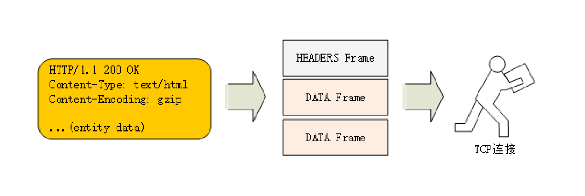
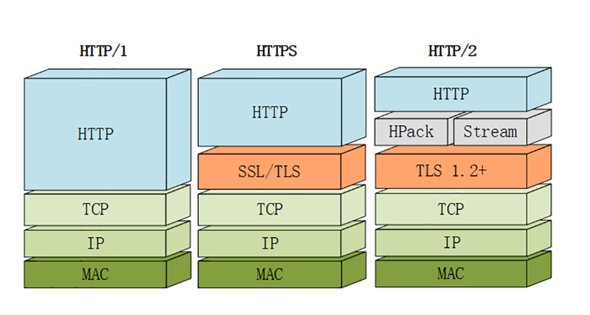

# 9.20-学习http(十四)

## **HTTP/2特性概览** 

### **为什么不是HTTP/2.0**

为什么 HTTP/2 不像之前的1.0、1.1那样叫2.0呢?

这个也是很多初次接触 HTTP/2 的人问的最多的一个问题，对此 HTTP/2 工作组特别给出了解释。

他们认为以前的1.0、1.1造成了很多的混乱和误解，让人在实际的使用中难以区分差异，所以就决定 HTTP 协议不再使用小版本号(minor version)，只使用大版本号 (major version)，从今往后 HTTP 协议不会出现 HTTP/2.0、2.1，只会 有HTTP/2、HTTP/3......

这样就可以明确无误地辨别出协议版本的跃进程度，让协议在一段较长的时期内保持稳定，每当发布新版本的 HTTP 协议都会有本质的不同，绝不会有零敲碎打的小改良。

### **兼容HTTP/1**

由于 HTTPS 已经在安全方面做的非常好了，所以 HTTP/2 的唯一目标就是改进性能。

但它不仅背负着众多的期待，同时还背负着 HTTP/1 庞大的历史包袱，所以协议的修改必须小心谨慎，兼容性是首要考虑的目标，否则就会破坏互联网上无数现有的资产，这方面 TLS 已经有了先例(为了兼容 TLS1.2 不得不进行伪装)。

那么，HTTP/2 是怎么做的呢?

因为必须要保持功能上的兼容，所以 HTTP/2 把 HTTP 分解成了语义和语法两个部分，语义层不做改动，与 HTTP/1 完全一致(即 RFC7231)。比如请求方法、 URI、状态码、头字段等概念都保留不变，这样就消除了再学习的成本，基于 HTTP 的上层应用也不需要做任何修改，可以无缝转换到 HTTP/2。

特别要说的是，与 HTTPS 不同，HTTP/2 没有在 URI 里引入新的协议名，仍然用http表示明文协议，用https表示加密协议。

这是一个非常了不起的决定，可以让浏览器或者服务器去自动升级或降级协议，免去了选择的麻烦，让用户在上网的时候都意识不到协议的切换，实现平滑过渡。

在语义保持稳定之后，HTTP/2 在语法层做了天翻地覆的改造，完全变更了 HTTP 报文的传输格式。

### **头部压缩**

HTTP/1 里可以用头字段Content-Encoding指定 Body 的编码方式，比如用 gzip 压缩来节约带宽，但报文的另一个组成部—Header 却被无视了，没有针对它的优化手段。

由于报文 Header 一般会携带User Agent、Cookie、Accept、Server等许多固定的头字段，多达几百字节甚至上千字节，但 Body 却经常只有几十字节(比如 GET 请求、204/301/304 响应)，成了不折不扣的大头儿子。更要命的是，成千上万的请求响应报文里有很多字段值都是重复的，非常浪费，长尾效应导致大量带宽消耗在了这些 冗余度极高的数据上。

所以，HTTP/2 把**头部压缩**作为性能改进的一个重点，优化的方式你也肯定能想到，还是压缩。

不过 HTTP/2 并没有使用传统的压缩算法，而是开发了专门的**HPACK**算法，在客户端和服务器两端建立字典，用索引号表示重复的字符串，还釆用哈夫曼编码来压缩整数和 字符串，可以达到 50%~90% 的高压缩率。

### **二进制格式**

你可能已经很习惯于 HTTP/1 里纯文本形式的报文了，它的优点是一目了然，用最简单的工具就可以开发调试，非常方便。

但 HTTP/2 在这方面没有妥协，决定改变延续了十多年的现状，不再使用肉眼可见的 ASCII 码，而是向下层的 TCP/IP 协议靠拢，全面采用二进制格式。

这样虽然对人不友好，但却大大方便了计算机的解析。原来使用纯文本的时候容易出现多义性，比如大小写、空白字符、回车换行、多字少字等等，程序在处理时必须用复杂的状态机，效率低，还麻烦。

而二进制里只有0和1，可以严格规定字段大小、顺序、标志位等格式，对就是对，错就是错，解析起来没有歧义，实现简单，而且体积小、速度快，做到内部提 效。

以二进制格式为基础，HTTP/2 就开始了大刀阔斧的改革。

它把 TCP 协议的部分特性挪到了应用层，把原来的Header+Body的消息打散为数个小片的**二进制帧**(Frame)，用HEADERS帧存放头数据、DATA帧存放实体数据。

这种做法有点像是Chunked分块编码的方式，也是化整为零的 思路，但 HTTP/2 数据分帧后Header+Body的报文结构就完全消失了，协议看到的只是一个个的碎片。

### **虚拟的流**

消息的碎片到达目的地后应该怎么组装起来呢?

HTTP/2 为此定义了一个**流**(Stream)的概念，**它是二进制帧的双向传输序列**，同一个消息往返的帧会分配一个唯一的流 ID。你可以想象把它成是一个虚拟的数据流，在里面流动的是一串有先后顺序的数据帧，这些数据帧按照次序组装起来就是 HTTP/1 里的 请求报文和响应报文。

因为流是虚拟的，实际上并不存在，所以 HTTP/2 就可以在一个 TCP 连接上用**流**同时发送多个碎片化的消息，这就是常说的**多路复用**( Multiplexing) =>多个往返通信都复用一个连接来处理。

在流的层面上看，消息是一些有序的帧序列，而在连接的层面上看，消息却是乱序收发的帧。多个请求 / 响应之间没有了顺序关系，不需要排队等待，也就不会再 出现队头阻塞问题，降低了延迟，大幅度提高了连接的利用率。

为了更好地利用连接，加大吞吐量，HTTP/2 还添加了一些控制帧来管理虚拟的流，实现了优先级和流量控制，这些特性也和 TCP 协议非常相似。

HTTP/2 还在一定程度上改变了传统的请求 - 应答工作模式，服务器不再是完全被动地响应请求，也可以新建流主动向客户端发送消息。比如，在浏览器刚请求 HTML 的时 候就提前把可能会用到的 JS、CSS 文件发给客户端，减少等待的延迟，这被称为**服务推送**(Server Push，也叫 Cache Push)。

### **强化安全**

出于兼容的考虑，HTTP/2 延续了 HTTP/1 的明文特点，可以像以前一样使用明文传输数据，不强制使用加密通信，不过格式还是二进制，只是不需要解密。

但由于 HTTPS 已经是大势所趋，而且主流的浏览器 Chrome、Firefox 等都公开宣布只支持加密的 HTTP/2，所以事实上的 HTTP/2 是加密的。也就是说，互联网上通常所能见 到的 HTTP/2 都是使用https协议名，跑在 TLS 上面。

为了区分加密和明文这两个不同的版本，HTTP/2 协议定义了两个字符串标识符:h2表示加密的 HTTP/2，h2c表示明文的 HTTP/2，多出的那个字母c的 意思是clear text。

在 HTTP/2 标准制定的时候(2015 年)已经发现了很多 SSL/TLS 的弱点，而新的 TLS1.3 还未发布，所以加密版本的 HTTP/2 在安全方面做了强化，要求下层的通信协议必须是 TLS1.2 以上，还要支持前向安全和 SNI，并且把几百个弱密码套件列入了黑名单，比 如 DES、RC4、CBC、SHA-1 都不能在 HTTP/2 里使用，相当于底层用的是TLS1.25。

### **协议栈**

下面的这张图对比了 HTTP/1、HTTPS 和 HTTP/2 的协议栈，你可以清晰地看到，HTTP/2 是建立在HPackStreamTLS1.2基础之上的，比 HTTP/1、HTTPS 复杂了一 些。

虽然 HTTP/2 的底层实现很复杂，但它的语义还是简单的 HTTP/1，之前学习的知识不会过时，仍然能够用得上。

### **小结**

- HTTP 协议取消了小版本号，所以 HTTP/2 的正式名字不是 2.0
- HTTP/2 在语义上兼容 HTTP/1，保留了请求方法、URI 等传统概念
- HTTP/2 使用HPACK算法压缩头部信息，消除冗余数据节约带宽
- HTTP/2 的消息不再是Header+Body的形式，而是分散为多个二进制帧
- HTTP/2 使用虚拟的流传输消息，解决了困扰多年的队头阻塞问题，同时实现了多路复用，提高连接的利用率
- HTTP/2 也增强了安全性，要求至少是 TLS1.2，而且禁用了很多不安全的密码套件

**HTTP/2.0** 相比较 **HTTP/1.1**

- 二进制协议，不再是纯文本(`二进制协议`)
- 可发起多个请求，废弃了 1.1 里的管道(`多路复用`)
- 使用专用算法压缩头部，减少数据传输量(`头部压缩, 使得可以在header带更多数据了`)
- 允许服务器主动向客户端推送数据(`服务器主动push数据到客户端`)
- 增强了安全性，事实上要求加密通信(`安全性`)

## 参考

[透视HTTP协议(罗剑锋)](https://time.geekbang.org/column/intro/100029001)