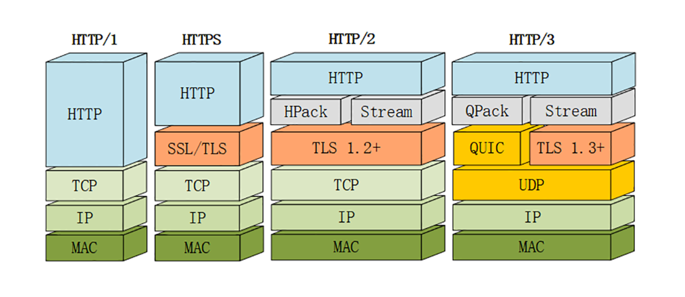
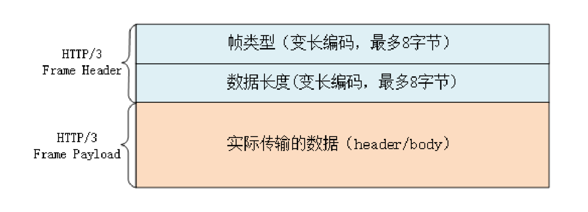

# 9.22-学习http(十六)

## **HTTP/3展望**

在前面里，我们一起学习了 HTTP/2，你也应该看到了 HTTP/2 做出的许多努力，比如头部压缩、二进制分帧、虚拟的流与多路复用，性能方面比 HTTP/1 有了很大的提 升，基本上解决了`队头阻塞`这个问题。

### **HTTP/2的队头阻塞**

你可能要发出疑问了:为什么说是基本上，而不是完全解决了呢?

这是因为 HTTP/2 虽然使用帧、流、多路复用，没有了队头阻塞，但这些手段都是在应用层里，而在下层，也就是 TCP 协议里，还是会发生队头阻塞。

这是怎么回事呢?

让我们从协议栈的角度来仔细看一下。在 HTTP/2 把多个请求 - 响应分解成流，交给 TCP 后，TCP 会再拆成更小的包依次发送(其实在 TCP 里应该叫 segment，也就 是段)。

在网络良好的情况下，包可以很快送达目的地。但如果网络质量比较差，像手机上网的时候，就有可能会丢包。而 TCP 为了保证可靠传输，有个特别的丢包重传机制，丢失的包必须要等待重新传输确认，其他的包即使已经收到了，也只能放在缓冲区里，上层的应用拿不出来，只能干着急。

我举个简单的例子:

客户端用 TCP 发送了三个包，但服务器所在的操作系统只收到了后两个包，第一个包丢了。那么内核里的 TCP 协议栈就只能把已经收到的包暂存起来，停下等着客户端重传那个丢失的包，这样就又出现了队头阻塞。

由于这种队头阻塞是 TCP 协议固有的，所以 HTTP/2 即使设计出再多的花样也无法解决。

Google 在推 SPDY 的时候就已经意识到了这个问题，于是就又发明了一个新 的QUIC协议，让 HTTP 跑在 QUIC 上而不是 TCP 上。

而这个HTTP over QUIC就是 HTTP 协议的下一个大版本，**HTTP/3**。它在 HTTP/2 的基础上又实现了质的飞跃，真正完美地解决了队头阻塞问题。

### **QUIC协议**

从上面这张图里，你可以看到 HTTP/3 有一个关键的改变，那就是它把下层的 TCP抽 掉了，换成了 UDP。因为 UDP 是无序的，包之间没有依赖关系，所以就从根本上解决 了队头阻塞。

UDP 是一个简单、不可靠的传输协议，只是对 IP 协议的一层很薄的包装，和 TCP 相比，它实际应用的较少。

不过正是因为它简单，不需要建连和断连，通信成本低，也就非常灵活、高效，可塑性很强。

所以，QUIC 就选定了 UDP，在它之上把 TCP 的那一套连接管理、拥塞窗口、流量控制 等搬了过来，去其糟粕，取其精华，打造出了一个全新的可靠传输协议，可以认为 是**新时代的 TCP**。

QUIC 最早是由 Google 发明的，被称为 gQUIC。而当前正在由 IETF 标准化的 QUIC 被 称为 iQUIC。两者的差异非常大，甚至比当年的 SPDY 与 HTTP/2 的差异还要大。

gQUIC 混合了 UDP、TLS、HTTP，是一个应用层的协议。而 IETF 则对 gQUIC 做了清理，把应用部分分离出来，形成了 HTTP/3，原来的 UDP 部分下放到了传输层，所 以 iQUIC 有时候也叫QUIC-transport。

接下来要说的 QUIC 都是指 iQUIC，要记住，它与早期的 gQUIC 不同，是一个传输层的协议，和 TCP 是平级的。

### **QUIC的特点**

QUIC 基于 UDP，而 UDP 是无连接的，根本就不需要握手和挥手，所以天生就要比 TCP 快。

就像 TCP 在 IP 的基础上实现了可靠传输一样，QUIC 也基于 UDP 实现了可靠传输，保证数据一定能够抵达目的地。它还引入了类似 HTTP/2 的流和多路复用，单 个流是有序的，可能会因为丢包而阻塞，但其他流不会受到影响。

为了防止网络上的中间设备(Middle Box)识别协议的细节，QUIC 全面采用加密通信， 可以很好地抵御窜改和协议僵化(ossification)。

而且，因为 TLS1.3 已经在(2018)正式发布，所以 QUIC 就直接应用了 TLS1.3，顺便也就获得了 0-RTT、1-RTT 连接的好处。

但 QUIC 并不是建立在 TLS 之上，而是内部包含了 TLS。它使用自己的帧接管了 TLS 里的记录，握手消息、警报消息都不使用 TLS 记录，直接封装成 QUIC 的帧发送，省掉了一次开销。

### **HTTP/3协议**

了解了 QUIC 之后，再来看 HTTP/3 就容易多了。

因为 QUIC 本身就已经支持了加密、流和多路复用，所以 HTTP/3 的工作减轻了很多，把流控制都交给 QUIC 去做。调用的不再是 TLS 的安全接口，也不是 Socket API，而是专门 的 QUIC 函数。不过这个QUIC 函数还没有形成标准，必须要绑定到某一个具体的实现库。

HTTP/3 里仍然使用流来发送请求 - 响应，但它自身不需要像 HTTP/2 那样再去定义流，而是直接使用 QUIC 的流，相当于做了一个概念映射。

HTTP/3 里的双向流可以完全对应到 HTTP/2 的流，而单向流在 HTTP/3 里用来 实现控制和推送，近似地对应 HTTP/2 的 0 号流。

由于流管理被下放到了 QUIC，所以 HTTP/3 里帧的结构也变简单了。

 帧头只有两个字段:类型和长度，而且同样都采用变长编码，最小只需要两个字节。

HTTP/3 里的帧仍然分成数据帧和控制帧两类，HEADERS 帧和 DATA 帧传输数据，但其他一些帧因为在下层的 QUIC 里有了替代，所以在 HTTP/3 里就都消失了，比如 RST_STREAM、WINDOW_UPDATE、PING 等。

头部压缩算法在 HTTP/3 里升级成了**QPACK**，使用方式上也做了改变。虽然也分成静态表和动态表，但在流上发送 HEADERS 帧时不能更新字段，只能引用，索引表的更新需要在专门的单向流上发送指令来管理，解决了 HPACK 的队头阻塞问题。

另外，QPACK 的字典也做了优化，静态表由之前的 61 个增加到了 98 个，而且序号从 0 开始，也就是说:authority的编号是 0。

### **HTTP/3服务发现**

讲了这么多，不知道你注意到了没有:HTTP/3 没有指定默认的端口号，也就是说不一定非要在 UDP 的 80 或者 443 上提供 HTTP/3 服务。

那么，该怎么发现HTTP/3 呢?

这就要用到 HTTP/2 里的扩展帧了。浏览器需要先用 HTTP/2 协议连接服务器，然后 服务器可以在启动 HTTP/2 连接后发送一个**Alt-Svc**帧，包含一 个h3=host:port的字符串，告诉浏览器在另一个端点上提供等价的 HTTP/3 服务。

浏览器收到Alt-Svc帧，会使用 QUIC 异步连接指定的端口，如果连接成功，就会断开 HTTP/2 连接，改用新的 HTTP/3 收发数据。

### **小结**

HTTP/3 综合了我们之前讲的所有技术(HTTP/1、SSL/TLS、HTTP/2)，包含知识点很多，比如队头阻塞、0-RTT 握手、虚拟的流、多路复用，算得上是集大成之作， 需要多下些功夫好好体会。

- `HTTP/3 基于 QUIC 协议，完全解决了队头阻塞问题`，弱网环境下的表现会优于 HTTP/2
- QUIC 是一个新的传输层协议，建立在 UDP 之上，实现了可靠传输
- QUIC 内含了 TLS1.3，只能加密通信，支持 0-RTT 快速建连
- QUIC 的连接使用不透明的连接 ID，不绑定在IP 地址 + 端口上，支持连接迁移
- QUIC 的流与 HTTP/2 的流很相似，但分为双向流和单向流
- HTTP/3 没有指定默认端口号，需要用 HTTP/2 的扩展帧Alt-Svc来发现

## 参考

[透视HTTP协议(罗剑锋)](https://time.geekbang.org/column/intro/100029001)