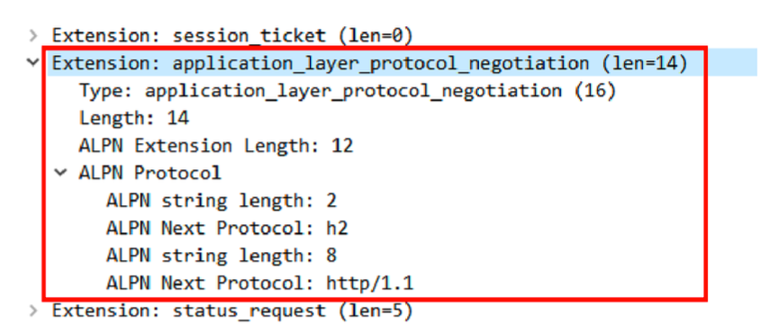

# 9.23-学习http(十七)

## **我应该迁移到HTTP/2吗?**

直到今天，HTTP/2 在互联网上还是处于不温不火的状态，虽然已经有了不少的网站改造升级到了 HTTP/2，但普及的速度远不及 HTTPS。

所以，你有这样的疑问也是很自然的，升级到 HTTP/2 究竟能给我们带来多少好处呢?到 底值不值呢?

### **HTTP/2的优点**

HTTP/2 最大的一个优点是**完全保持了与 HTTP/1 的兼容**，在语义上没有任何变化，之前在 HTTP 上的所有投入都不会浪费。

因为兼容 HTTP/1，所以 HTTP/2 也具有 HTTP/1 的所有优点，并且基本解决了 HTTP/1 的所有缺点，安全与性能兼顾，可以认为是更安全的 HTTP、更快的 HTTPS。

在安全上，HTTP/2 对 HTTPS 在各方面都做了强化。下层的 TLS 至少是 1.2，而且只能使用前向安全的密码套件(即 ECDHE)，这同时也就默认实现了TLS False Start，支持 1-RTT 握手，所以不需要再加额外的配置就可以自动实现 HTTPS 加速。

安全有了保障，再来看 HTTP/2 在性能方面的改进。

你应该知道，影响网络速度的两个关键因素是**带宽**和**延迟**，HTTP/2 的头部压缩、 多路复用、流优先级、服务器推送等手段其实都是针对这两个要点。

所谓的带宽就是网络的传输速度。从最早的 56K/s，到如今的 100M/s，虽然网速已经是今非昔比，比从前快了几十倍、几百倍，但仍然是稀缺资源，图片、视频这样的 多媒体数据很容易会把带宽用尽。

节约带宽的基本手段就是压缩，在 HTTP/1 里只能压缩 body，而 HTTP/2 则可以用 HPACK 算法压缩 header，这对高流量的网站非常有价值，有数据表明能节省大概 5%~10% 的流量，这是实实在在的真金白银。

与 HTTP/1并发多个连接不同，HTTP/2 的多路复用特性要求对**一个域名(或者 IP)只用一个 TCP 连接**，所有的数据都在这一个连接上传输，这样不仅节约了客户端、服务器和网络的资源，还可以把带宽跑满，让 TCP 充分吃饱。

这是为什么呢?

我们来看一下在 HTTP/1 里的长连接，虽然是双向通信，但任意一个时间点实际上还是单向的:`上行请求时下行空闲，下行响应时上行空闲`，再加上队头阻塞，实际的带宽打了个对折还不止

而在 HTTP/2 里，多路复用则让 TCP 开足了马力，全速狂奔，多个请求响应并发，每时每刻上下行方向上都有流在传输数据，没有空闲的时候，带宽的利用率能够接近100%。所以，HTTP/2 只使用一个连接，就能抵得过 HTTP/1 里的五六个连接。

不过流也可能会有依赖关系，可能会存在等待导致的阻塞，这就是延迟，所以 HTTP/2 的其他特性就派上了用场。

优先级可以让客户端告诉服务器，哪个文件更重要，更需要优先传输，服务器就可以调高流的优先级，合理地分配有限的带宽资源，让高优先级的 HTML、图片更快地到达客户 端，尽早加载显示。

服务器推送也是降低延迟的有效手段，它不需要客户端预先请求，服务器直接就发给客户端，这就省去了客户端解析 HTML 再请求的时间。

### **HTTP/2的缺点**

说了一大堆 HTTP/2 的优点，再来看看它有什么缺点吧。

在之前的介绍中，你就知道 HTTP/2 在 TCP 级别还是存在队头阻塞的问题。所以，如果网络连接质量差，发生丢包，那么 TCP 会等待重传，传输速度就会降低。

另外，在移动网络中发生 IP 地址切换的时候，下层的 TCP 必须重新建连，要再次握手，经历慢启动，而且之前连接里积累的 HPACK 字典也都消失了，必须重头开始计算，导致带宽浪费和时延。

刚才也说了，HTTP/2 对一个域名只开一个连接，所以一旦这个连接出问题，那么整个网站的体验也就变差了。

而这些情况下 HTTP/1 反而不会受到影响，因为它本来就慢，而且还会对一个域名开 6~8 个连接，顶多其中的一两个连接会更慢，其他的连接不会受到影响。

### **应该迁移到HTTP/2吗?**

在我看来，HTTP/2 处于一个略尴尬的位置，前面有老前辈HTTP/1，后面有新来者HTTP/3，即有老前辈的打压，又有新来者的追赶，也就难怪没有 获得市场的大力吹捧了。

但这绝不是说 HTTP/2一无是处，实际上 HTTP/2 的性能改进效果是非常明显的，Top 1000 的网站中已经有超过 40% 运行在了 HTTP/2 上，包括知名的 Apple、Facebook、 Google、Twitter 等等。仅用了四年的时间，HTTP/2 就拥有了这么大的市场份额和巨头的 认可，足以证明它的价值。

因为 HTTP/2 的侧重点是性能，所以是否迁移就需要在这方面进行评估。如果网站的流量很大，那么 HTTP/2 就可以带来可观的收益;反之，如果网站流量比较小，那么升级到 HTTP/2 就没有太多必要了，只要利用现有的 HTTP 再优化就足矣。

不过如果你是新建网站，我觉得完全可以跳过 HTTP/1、HTTPS，直接一步到位，上 HTTP/2，这样不仅可以获得性能提升，还免去了老旧的历史包袱，日后也不会再有迁移的烦恼。

HTTP/2 毕竟是下一代HTTP 协议，它的很多特性也延续到了 HTTP/3，提早升级到 HTTP/2 还可以让你在 HTTP/3 到来时有更多的技术积累和储备，不 至于落后于时代。

### **配置HTTP/2**

因为 HTTP/2事实上是加密的，所以如果你已经成功迁移到了 HTTPS，那么在 Nginx 里启用 HTTP/2 简直可以说是不费吹灰之力，只需要在 server 配置里再多加一个参数就可以搞定了。

```js
server {
  listen 443 ssl http2;
}
```

注意listen指令，在ssl后面多了一个http2，这就表示在 443 端口上开启了 SSL 加密，然后再启用 HTTP/2。

注意一点，HTTP/2 默认启用 header 压缩(HPACK)，但并没有默认启用 body 压 缩，所以不要忘了在 Nginx 配置文件里加上gzip指令，压缩 HTML、JS 等文本数据。

### **应用层协议协商(ALPN)**

最后说一下 HTTP/2 的服务发现吧。

你有没有想过，在 URI 里用的都是 HTTPS 协议名，没有版本标记，浏览器怎么知道服务器支持 HTTP/2 呢?为什么上来就能用 HTTP/2，而不是用 HTTP/1 通信呢?

答案在 TLS 的扩展里，有一个叫**ALPN**(Application Layer Protocol Negotiation) 的东西，用来与服务器就 TLS 上跑的应用协议进行协商。

客户端在发起Client Hello握手的时候，后面会带上一个ALPN扩展，里面按照优 先顺序列出客户端支持的应用协议。

就像下图这样，最优先的是h2，其次是http/1.1，以前还有spdy，以后还可能会有h3。



服务器看到 ALPN 扩展以后就可以从列表里选择一种应用协议，在Server Hello里也带上ALPN扩展，告诉客户端服务器决定使用的是哪一种。因为我们在 Nginx 配置里使用了 HTTP/2 协议，所以在这里它选择的就是h2。

这样在 TLS 握手结束后，客户端和服务器就通过ALPN完成了应用层的协议协商，后面 就可以使用 HTTP/2 通信了。

### **小结**

今天我们学习了是否应该迁移到 HTTP/2，还有应该如何迁移到 HTTP/2。

- HTTP/2 完全兼容 HTTP/1，是更安全的 HTTP、更快的 HTTPS，头部压缩、多路复用等技术可以充分利用带宽，降低延迟，从而大幅度提高上网体验
- TCP 协议存在队头阻塞，所以 HTTP/2 在弱网或者移动网络下的性能表现会不如 HTTP/1
- 迁移到 HTTP/2 肯定会有性能提升，但高流量网站效果会更显著
- 如果已经升级到了 HTTPS，那么再升级到 HTTP/2 会很简单
- TLS 协议提供ALPN扩展，让客户端和服务器协商使用的应用层协议，发现HTTP/2 服务

## 参考

[透视HTTP协议(罗剑锋)](https://time.geekbang.org/column/intro/100029001)