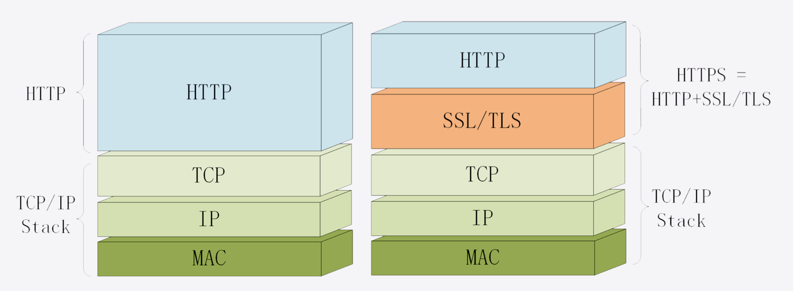
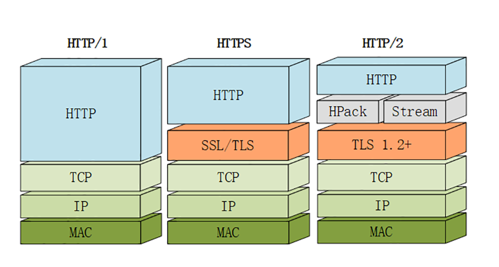

# 9.25-本周总结

## **总结**

### **本周学了什么**

- **安全相关**
  - **HTTPS是什么? SSL/TLS又是什么?**
  - **对称加密与非对称加密**
  - **数字签名与证书**
- **HTTP/2相关**
  - **HTTP/2特性概览**
  - **HTTP/2内核剖析**
  - **应该迁移到HTTP/2吗?**
- **HTTP/3展望**

## **HTTPS是什么? SSL/TLS又是什么?**

### **HTTPS是什么?**

HTTPS 其实是一个非常简单的协议，RFC 文档很小，只有短短的 7 页，里面规定了**新的协议名https，默认端口号 443**，至于其他的什么请求 - 应答模式、报文结构、请求方法、URI、头字段、连接管理等等都完全沿用 HTTP，没有任何新的东西。

HTTPS 把 HTTP 下层的传输协议由 TCP/IP 换成了 SSL/TLS，由**HTTP over TCP/IP**变成了**HTTP over SSL/TLS**，让 HTTP 运行在了安全的 SSL/TLS 协议上。

###  **SSL/TLS是什么?**

SSL 即安全套接层(Secure Sockets Layer)

SSL 发展到 v3 时已经证明了它自身是`一个非常好的安全通信协议`，于是互联网工程组 IETF `在 1999 年`把它改名为 TLS(传输层安全，Transport Layer Security)，正式标准化，版本号从 1.0 重新算起，所以` TLS1.0 实际上就是 SSLv3.1`。

到今天 TLS 已经发展出了`三个版本`，分别是` 2006 年的 1.1、2008 年的 1.2 和去年 (2018)的 1.3`，每个新版本都紧跟密码学的发展和互联网的现状，持续强化安全和性 能，已经成为了信息安全领域中的权威标准。

目前应用的`最广泛的 TLS 是 1.2`，而之前的协议(TLS1.1/1.0、SSLv3/v2)都已经被认为是不安全的，各大浏览器即将在 2020 年左右停止支持，所以接下来的讲解都针对的是 TLS1.2。

TLS 由记录协议、握手协议、警告协议、变更密码规范协议、扩展协议等几个子协议组成， 综合使用了对称加密、非对称加密、身份认证等许多密码学前沿技术。

### **http 和 https 的区别**

- **加密**： HTTPS 是 HTTP 协议的更加安全的版本，通过使用SSL/TLS进行加密传输的数据

- **连接方式**： HTTP（三次握手）和 HTTPS （三次握手+数字证书）连接方式不一样

- **端口**： HTTP 默认的端口是 80和 HTTPS 默认端口是 443

  

## **对称加密与非对称加密**

- `对称加密只使用一个密钥`，运算速度快，密钥必须保密，`无法做到安全的密钥交换`，常用的有 AES 和 ChaCha20

- `非对称加密使用两个密钥:公钥和私钥，公钥可以任意分发而私钥保密，解决了密钥安全交换问题但速度慢，常用的有 RSA 和 ECC`

- 把对称加密和非对称加密结合起来就得到了又好又快的混合加密，也就是` TLS 里使用的加密方式(混合加密)`

  

## **数字签名与证书**

- `摘要算法用来实现完整性(摘要算法近似地理解成一种特殊的压缩算法，它能够把任意长度的数据压缩成固定长度、而且独一无二的摘要字符串)`，能够为数据生成独一无二的指纹，常用的算法是` SHA- 2`
- `数字签名是私钥对摘要的加密`，可以由公钥解密后验证，实现身份认证和不可否认(**数字签名的原理其实很简单，就是把公钥私钥的用法反过来，之前是公钥加密、私钥解密，现在是私钥加密、公钥解密)**
- `公钥的分发需要使用数字证书，必须由 CA 的信任链来验证`，否则就是不可信的
- 作为信任链的源头 CA 有时也会不可信，解决办法有 CRL、OCSP，还有终止信任

## **保证通信安全**

如果通信过程具备了四个特性，就可以认为是安全的，这四个特性是:

- **机密性 (对称加密与非对称加密)**
- **完整性 (摘要算法)**
- **身份认证(数字签名)** 
- **不可否认(数字签名)**

## **HTTP/2特性概览**

- HTTP 协议取消了小版本号，所以 HTTP/2 的正式名字不是 2.0
- HTTP/2 在语义上兼容 HTTP/1，保留了请求方法、URI 等传统概念
- HTTP/2 使用HPACK算法压缩头部信息，消除冗余数据节约带宽
- HTTP/2 的消息不再是Header+Body的形式，而是分散为多个二进制帧
- HTTP/2 使用虚拟的流传输消息，解决了困扰多年的队头阻塞问题，同时实现了多路复用，提高连接的利用率
- HTTP/2 也增强了安全性，要求至少是 TLS1.2，而且禁用了很多不安全的密码套件

**HTTP/2.0** 相比较 **HTTP/1.1**

- 二进制协议，不再是纯文本(`二进制协议`)
- 可发起多个请求，废弃了 1.1 里的管道(`多路复用,基本解决困扰多年的队头阻塞问题`)
- 使用专用算法压缩头部，减少数据传输量(`头部压缩, 使得可以在header带更多数据了`)
- 允许服务器主动向客户端推送数据(`服务器主动push数据到客户端`)
- 增强了安全性，事实上要求加密通信(`安全性`)

## **HTTP/2内核剖析**

- HTTP/2 必须先发送一个连接前言字符串，然后才能建立正式连接
- HTTP/2 废除了起始行，统一使用头字段，在两端维护字段Key-Value的索引表，使用HPACK算法压缩头部
- HTTP/2 把报文切分为多种类型的二进制帧，报头里最重要的字段是流标识符，标记帧属于哪个流
- 流是 HTTP/2 虚拟的概念，是帧的双向传输序列，相当于 HTTP/1 里的一次请求 -应答
- 在一个 HTTP/2 连接上可以并发多个流，也就是多个请求 - 响应报文，这就是多路复用

## **应该迁移到HTTP/2吗?**

- HTTP/2 完全兼容 HTTP/1，是更安全的 HTTP、更快的 HTTPS，头部压缩、多路复用等技术可以充分利用带宽，降低延迟，从而大幅度提高上网体验
- TCP 协议存在队头阻塞，所以 HTTP/2 在弱网或者移动网络下的性能表现会不如 HTTP/1
- 迁移到 HTTP/2 肯定会有性能提升，但高流量网站效果会更显著
- 如果已经升级到了 HTTPS，那么再升级到 HTTP/2 会很简单
- TLS 协议提供ALPN扩展，让客户端和服务器协商使用的应用层协议，发现HTTP/2 服务

因为` HTTP/2 的侧重点是性能`，所以是否迁移就需要在这方面进行评估。如果网站的流量很大，那么 HTTP/2 就可以带来可观的收益;反之，如果网站流量比较小，那么升级到 HTTP/2 就没有太多必要了，只要利用现有的 HTTP 再优化就足矣。

## **HTTP/3展望**

HTTP/3 综合了我们之前讲的所有技术(HTTP/1、SSL/TLS、HTTP/2)，包含知识点很多，比如队头阻塞、0-RTT 握手、虚拟的流、多路复用，算得上是集大成之作， 需要多下些功夫好好体会。

- `HTTP/3 基于 QUIC 协议，完全解决了队头阻塞问题`，弱网环境下的表现会优于 HTTP/2
- QUIC 是一个新的传输层协议，建立在 UDP 之上，实现了可靠传输
- QUIC 内含了 TLS1.3，只能加密通信，支持 0-RTT 快速建连
- QUIC 的连接使用不透明的连接 ID，不绑定在IP 地址 + 端口上，支持连接迁移
- QUIC 的流与 HTTP/2 的流很相似，但分为双向流和单向流
- HTTP/3 没有指定默认端口号，需要用 HTTP/2 的扩展帧Alt-Svc来发现

