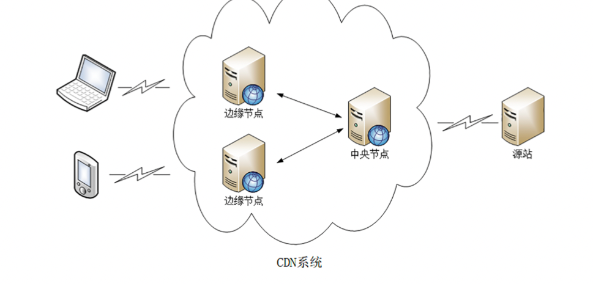
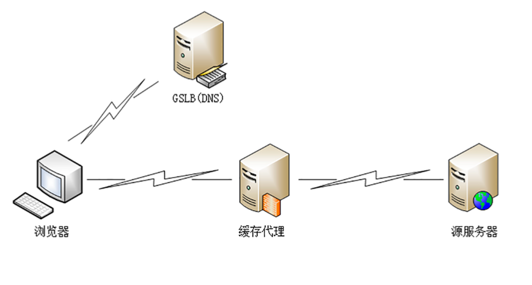

# 9.26-学习http(十八)

##  **CDN:加速我们的网络服务**

### **什么是CDN**?

CDN(Content Delivery Network 或 Content Distribution Network)，中文名叫内容分发网络, 它就是专门为解决长距离上网络访问速度慢而诞生的一种网

络应用服务。

从名字上看，CDN 有三个关键词:**内容**、**分发**和**网络**。

先看一下网络的含义。CDN 的最核心原则是**就近访问**，如果用户能够在本地几十公里的距离之内获取到数据，那么时延就基本上变成 0 了。

所以 CDN 投入了大笔资金，在全国、乃至全球的各个大枢纽城市都建立了机房，部署了大量拥有高存储高带宽的节点，构建了一个专用网络。这个网络是跨运营商、跨地域的，虽然内部也划分成多个小网络，但它们之间用高速专有线路连接，是真正的信息高速公路， 基本上可以认为不存在网络拥堵。

有了这个高速的专用网之后，CDN 就要分发源站的内容了，用到的就是在之前说过的**缓存代理**技术。使用推或者拉的手段，把源站的内容逐级缓存到网络的每一个节点上。

于是，用户在上网的时候就不直接访问源站，而是访问离他最近的一个 CDN 节点，术语叫**边缘节点**(edge node)，其实就是缓存了源站内容的代理服务器，这样一来就省去了长途跋涉的时间成本，实现了网络加速。

那么，CDN 都能加速什么样的内容呢?

在 CDN 领域里，`内容其实就是 HTTP 协议里的资源，比如超文本、图片、视频、 应用程序安装包等等`。

资源按照是否可缓存又分为**静态资源**和**动态资源**。所谓的静态资源是指数据内容静态不变，任何时候来访问都是一样的，比如图片、音频。所谓的动态资源是指 数据内容是动态变化的，也就是由后台服务计算生成的，每次访问都不一样，比如商品的库存、微博的粉丝数等。

`只有静态资源才能够被缓存加速、就近访问`，而动态资源只能由源站实时生成，即使缓存了也没有意义。不过，如果动态资源指定了Cache-Control，允许缓存短暂的时 间，那它在这段时间里也就变成了静态资源，可以被 CDN 缓存加速。

### **CDN的负载均衡**

CDN 是具体怎么运行的，它有两个关键组成部分:**全局负载均衡**和**缓存系统**，对应的是DNS和缓存代理技术。

全局负载均衡(Global Sever Load Balance)一般简称为 GSLB，它是 CDN 的大 脑，主要的职责是当用户接入网络的时候在 CDN 专网中挑选出一个最佳节点提供服 务，解决的是用户如何找到最近的边缘节点，对整个 CDN 网络进行负载均衡

GSLB 最常见的实现方式是**DNS 负载均衡**。

原来没有 CDN 的时候，权威 DNS 返回的是网站自己服务器的实际 IP 地址，浏览器收到 DNS 解析结果后直连网站。

但加入 CDN 后就不一样了，权威 DNS 返回的不是 IP 地址，而是一个 CNAME( Canonical Name ) 别名记录，指向的就是 CDN 的 GSLB。它有点像是 HTTP/2 里Alt- Svc的意思，告诉外面:我这里暂时没法给你真正的地址，你去另外一个地方再查查看 吧。

因为没拿到 IP 地址，于是本地 DNS 就会向 GSLB 再发起请求，这样就进入了 CDN 的全局负载均衡系统，开始智能调度，主要的依据有这么几个:

- 看用户的 IP 地址，查表得知地理位置，找相对最近的边缘节点
- 2. 看用户所在的运营商网络，找相同网络的边缘节点
- 3. 检查边缘节点的负载情况，找负载较轻的节点
- 4. 其他，比如节点的健康状况、服务能力、带宽、响应时间等。

GSLB 把这些因素综合起来，用一个复杂的算法，最后找出一台最合适的边缘节点，把 这个节点的 IP 地址返回给用户，用户就可以就近访问 CDN 的缓存代理了。

### **CDN的缓存代理**

缓存系统是 CDN 的另一个关键组成部分，相当于 CDN 的心脏。如果缓存系统的服务

能力不够，不能很好地满足用户的需求，那 GSLB 调度算法再优秀也没有用。

但互联网上的资源是无穷无尽的，不管 CDN 厂商有多大的实力，也不可能把所有资源都缓存起来。所以，缓存系统只能有选择地缓存那些最常用的那些资源。

这里就有两个 CDN 的关键概念:**命中**和**回源**。 命中就是指用户访问的资源恰好在缓存系统里，可以直接返回给用户;回源则正相反，缓存里没有，必须用代理的方式回源站取。

相应地，也就有了两个衡量 CDN 服务质量的指标:**命中率**和**回源率**。命中率就是命中次数与所有访问次数之比，回源率是回源次数与所有访问次数之比。显然，好的 CDN 应该是命中率越高越好，回源率越低越好。现在的商业 CDN 命中率都在 90% 以上，相当于把源站的服务能力放大了 10 倍以上。

怎么样才能尽可能地提高命中率、降低回源率呢?

首先，最基本的方式就是在存储系统上下功夫，硬件用高速 CPU、大内存、万兆网卡，再搭配 TB 级别的硬盘和快速的 SSD。软件方面则不断求新求变，各种新的存储软件都 会拿来尝试，比如 Memcache、Redis、Ceph，尽可能地高效利用存储，存下更多的内 容。

其次，缓存系统也可以划分出层次，分成一级缓存节点和二级缓存节点。一级缓存配置高一些，直连源站，二级缓存配置低一些，直连用户。回源的时候二级缓存只找一级缓存，一级缓存没有才回源站，这样最终扇入度就缩小了，可以有效地减少真正的回源。

第三个就是使用高性能的缓存服务，据我所知，目前国内的 CDN 厂商内部都是基于开源软 件定制的。最常用的是专门的缓存代理软件 Squid、Varnish，还有新兴的 ATS(Apache Traffic Server)，而 Nginx 和 OpenResty 作为 Web 服务器领域的多面手，凭借着强大的反向代理能力和模块化、易于扩展的优点，也在 CDN 里占据了不少的份额。

### **小结**

CDN 发展到现在已经有二十来年的历史了，早期的 CDN 功能比较简单，只能加速静态资源。随着这些年 Web 2.0、HTTPS、视频、直播等新技术、新业务的崛起，它也在不断进步，增加了很多的新功能，比如 SSL 加速、内容优化(数据压缩、图片格式转换、视频转码)、资源防盗链、WAF 安全防护等等。

现在，再说 CDN 是搬运工已经不太准确了，它更像是一个无微不至的网站保姆，让网站只安心生产优质的内容，其他的杂事都由它去代劳。

- 由于客观地理距离的存在，直连网站访问速度会很慢，所以就出现了 CDN
- CDN 构建了全国、全球级别的专网，让用户就近访问专网里的边缘节点，降低了传输延迟，实现了网站加速
- GSLB 是 CDN 的大脑，使用 DNS 负载均衡技术，智能调度边缘节点提供服务
- 缓存系统是 CDN 的心脏，使用 HTTP 缓存代理技术，缓存命中就返回给用户，否则就要回源

## 参考

[透视HTTP协议(罗剑锋)](https://time.geekbang.org/column/intro/100029001)