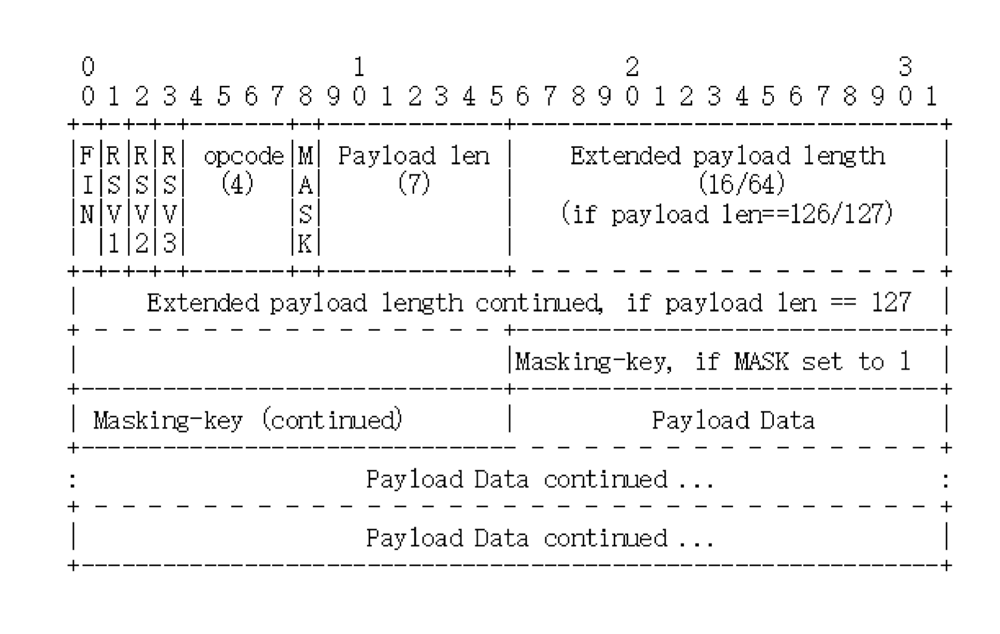
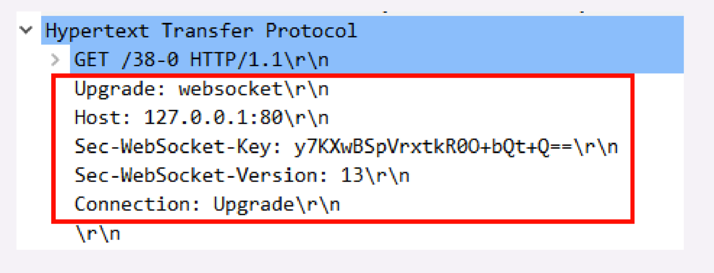
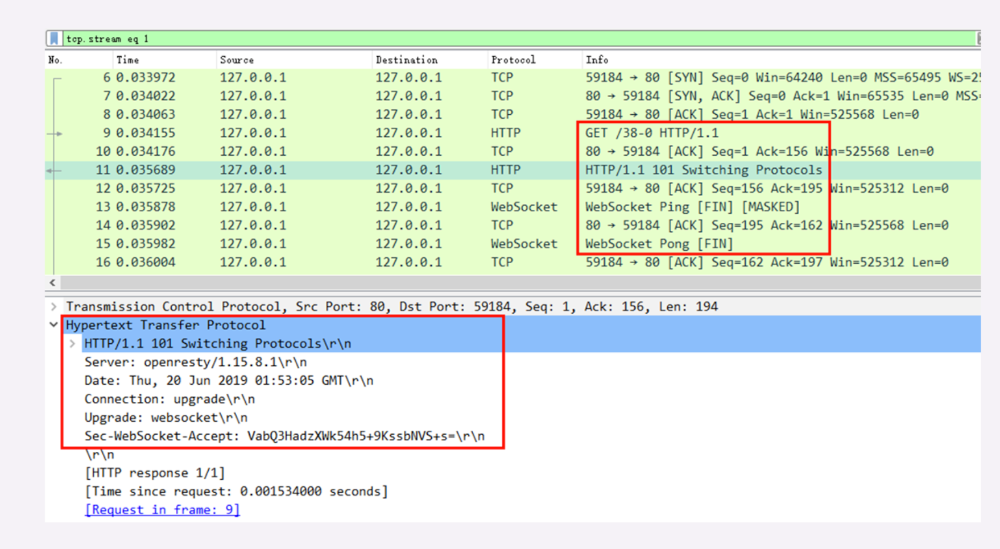

# 9.27-学习http(十九)

##  **WebSocket**

### **为什么要有WebSocket**

不过，已经有了被广泛应用的 HTTP 协议，为什么要再出一个 WebSocket 呢?它有哪些好处呢?

其实 WebSocket 与 HTTP/2 一样，都是为了解决 HTTP 某方面的缺陷而诞生的。HTTP/2 针对的是队头阻塞，而 WebSocket 针对的是请求 - 应答通信模式。

那么，请求 - 应答有什么不好的地方呢?

请求 - 应答是一种**半双工**的通信模式，虽然可以双向收发数据，但同一时刻只能一个方向上有动作，传输效率低。更关键的一点，它是一种被动通信模式，服务器只能被动响应客户端的请求，无法主动向客户端发送数据。

虽然后来的 HTTP/2、HTTP/3 新增了 Stream、Server Push 等特性，但请求 - 应答依然是主要的工作方式。这就导致 HTTP 难以应用在动态页面、即时消息、网络游戏等要求**实时通信**的领域

 WebSocket 出现之前，在浏览器环境里用 JavaScript 开发实时 Web 应用很麻烦。因为浏览器是一个受限的沙盒，不能用 TCP，只有 HTTP 协议可用，所以就出现了很多变通的技术，**轮询**(polling)就是比较常用的的一种。

简单地说，轮询就是不停地向服务器发送 HTTP 请求，问有没有数据，有数据的话服务器就用响应报文回应。如果轮询的频率比较高，那么就可以近似地实现实时通信的效果。

但轮询的缺点也很明显，反复发送无效查询请求耗费了大量的带宽和 CPU 资源，非常不经济。

所以，为了克服 HTTP请求 - 应答模式的缺点，WebSocket 就应运而生了。它原来是 HTML5 的一部分，后来自立门户，形成了一个单独的标准，RFC 文档编号是 6455。

### **WebSocket的特点**

WebSocket 是一个真正**全双工**的通信协议，与 TCP 一样，客户端和服务器都可以随 时向对方发送数据，而不用像 HTTP你拍一，我拍一那么客套。于是，服务器就可以变得更加主动了。一旦后台有新的数据，就可以立即推送给客户端，不需要客户端轮询，实时通信的效率也就提高了。

WebSocket 采用了二进制帧结构，语法、语义与 HTTP 完全不兼容，但因为它的主要运行环境是浏览器，为了便于推广和应用，就不得不搭便车，在使用习惯上尽量向 HTTP 靠拢，这就是它名字里Web的含义。

服务发现方面，WebSocket 没有使用 TCP 的IP 地址 + 端口号，而是延用了 HTTP 的 URI 格式，但开头的协议名不是http，引入的是两个新的名字:**ws**和**wss**， 分别表示明文和加密的 WebSocket 协议。

WebSocket 的默认端口也选择了 80 和 443，因为现在互联网上的防火墙屏蔽了绝大多数的端口，只对 HTTP 的 80、443 端口放行，所以 WebSocket 就可以伪装成 HTTP 协议，比较容易地穿透防火墙，与服务器建立连接。具体是怎么伪装的，我稍后再讲。

下面我举几个 WebSocket 服务的例子，你看看，是不是和 HTTP 几乎一模一样:

```html
ws://www.chrono.com
ws://www.chrono.com:8080/srv
wss://www.chrono.com:445/im?user_id=xxx
```

要注意的一点是，WebSocket 的名字容易让人产生误解，虽然大多数情况下我们会在浏览器里调用 API 来使用 WebSocket，但它不是一个调用接口的集合，而是一个通信协议，所以我觉得把它理解成**TCP over Web**会更恰当一些。

### **WebSocket的帧结构**

刚才说了，WebSocket 用的也是二进制帧，有之前 HTTP/2、HTTP/3 的经验，相信你这次也能很快掌握 WebSocket 的报文结构。

不过 WebSocket 和 HTTP/2 的关注点不同，WebSocket 更**侧重于实时通信**，而 HTTP/2 更侧重于提高传输效率，所以两者的帧结构也有很大的区别。

WebSocket 虽然有帧，但却没有像 HTTP/2 那样定义流，也就不存在多路复 用优先级等复杂的特性，而它自身就是全双工的，也就不需要服务器推送。 所以综合起来，WebSocket 的帧学习起来会简单一些。

下图就是 WebSocket 的帧结构定义，长度不固定，最少 2 个字节，最多 14 字节，看着好像很复杂，实际非常简单。



开头的两个字节是必须的，也是最关键的。

第一个字节的第一位**FIN**是消息结束的标志位，相当于 HTTP/2 里 的END_STREAM，表示数据发送完毕。一个消息可以拆成多个帧，接收方看 到FIN后，就可以把前面的帧拼起来，组成完整的消息。

FIN后面的三个位是保留位，目前没有任何意义，但必须是 0。

第一个字节的后 4 位很重要，叫**Opcode**，操作码，其实就是帧类型，比如 1 表示帧内容是纯文本，2 表示帧内容是二进制数据，8 是关闭连接，9 和 10 分别是连接保活的 PING 和 PONG。

第二个字节第一位是掩码标志位**MASK**，表示帧内容是否使用异或操作(xor)做简单的加密。目前的 WebSocket 标准规定，客户端发送数据必须使用掩码，而服务器发送则必须不使用掩码。

第二个字节后 7 位是**Payload len**，表示帧内容的长度。它是另一种变长编码，最少 7 位，最多是 7+64 位，也就是额外增加 8 个字节，所以一个 WebSocket 帧最大是 2^64。

长度字段后面是**Masking-key**，掩码密钥，它是由上面的标志位MASK决定的， 如果使用掩码就是 4 个字节的随机数，否则就不存在。

这么分析下来，其实 WebSocket 的帧头就四个部分:**结束标志位 + 操作码 + 帧长度 + 掩码**，只是使用了变长编码的小花招，不像 HTTP/2 定长报文头那么简单明了。

### **WebSocket的握手**

和 TCP、TLS 一样，WebSocket 也要有一个握手过程，然后才能正式收发数据。

这里它还是搭上了 HTTP 的便车，利用了 HTTP 本身的协议升级特性，伪装成 HTTP，这样就能绕过浏览器沙盒、网络防火墙等等限制，这也是 WebSocket 与 HTTP 的另一个重要关联点。

WebSocket 的握手是一个标准的 HTTP GET 请求，但要带上两个协议升级的专用头字段:

- Connection: Upgrade，表示要求协议升级
-  Upgrade: websocket，表示要升级成 WebSocket 协议

另外，为了防止普通的 HTTP 消息被意外识别成 WebSocket，握手消息还增加了两个 额外的认证用头字段(所谓的挑战，Challenge):

- Sec-WebSocket-Key:一个 Base64 编码的 16 字节随机数，作为简单的认证密钥
- Sec-WebSocket-Version:协议的版本号，当前必须是 13。



服务器收到 HTTP 请求报文，看到上面的四个字段，就知道这不是一个普通的 GET 请求， 而是 WebSocket 的升级请求，于是就不走普通的 HTTP 处理流程，而是构造一个特殊 的101 Switching Protocols响应报文，通知客户端，接下来就不用 HTTP 了，全改用 WebSocket 协议通信。(有点像 TLS 的Change Cipher Spec)

WebSocket 的握手响应报文也是有特殊格式的，要用字段Sec-WebSocket-Accept验 证客户端请求报文，同样也是为了防止误连接。

具体的做法是把请求头里Sec-WebSocket-Key的值，加上一个专用的 UUID 258EAFA5-E914-47DA-95CA-C5AB0DC85B11，再计算 SHA-1 摘要。

```html
encode_base64(
sha1(
Sec-WebSocket-Key + '258EAFA5-E914-47DA-95CA-C5AB0DC85B11' ))
```

客户端收到响应报文，就可以用同样的算法，比对值是否相等，如果相等，就说明返回的报文确实是刚才握手时连接的服务器，认证成功。

握手完成，后续传输的数据就不再是 HTTP 报文，而是 WebSocket 格式的二进制帧了。




### **小结**

浏览器是一个沙盒环境，有很多的限制，不允许建立 TCP 连接收发数据，而有了 WebSocket，我们就可以在浏览器里与服务器直接建立TCP 连接，获得更多的自由。

不过自由也是有代价的，WebSocket 虽然是在应用层，但使用方式却与TCP Socket差不多，过于原始，用户必须自己管理连接、缓存、状态，开发上比 HTTP 复杂的多，所以是否要在项目中引入 WebSocket 必须慎重考虑。

- HTTP 的请求 - 应答模式不适合开发实时通信应用，效率低，难以实现动态页面，所以出现了 WebSocket(`WebSocket的出现`)
- WebSocket 是一个全双工的通信协议，相当于对 TCP 做了一层薄薄的包装， 让它运行在浏览器环境里(`全双工`)
- WebSocket 使用兼容 HTTP 的 URI 来发现服务，但定义了新的协议 名ws和wss，端口号也沿用了 80 和 443(`ws与wss`)
- WebSocket 使用二进制帧，结构比较简单，特殊的地方是有个掩码操作，客户端发数据必须掩码，服务器则不用
- WebSocket 利用 HTTP 协议实现连接握手，发送 GET 请求要求协议升级，握手过程中有个非常简单的认证机制，目的是防止误连接


WebSocket的优点决定了它的用法

**双向通信**：websocket使得客户端跟服务端之间交换数据变得更加简单。允许服务器主动向客户端推送数据。浏览器只需要和服务器完成一次握手，就可以创建持久性的连接，并进行双向数据传输。

**实时性强**: 服务器可以主动给客户端推送数据，相比http请求需要先由客户端发起请求，浏览器才会响应，延迟明显更少、时间更短。

**连接保持**：websocket连接创建成功后，只要连接不断开，通信会一直保持，而且还会省略部分状态信息（http请求可能每次请求都需要携带状态信息）


**使用场景**

- 相对于http，websocket优势显而易见。所以在一些实时通信上，都需要用到websocket，比如多媒体聊天、玩家游戏、页面局部刷新、协同编辑等场景。


[MDN使用](https://developer.mozilla.org/zh-CN/docs/Web/API/WebSocket)

## 参考

[透视HTTP协议(罗剑锋)](https://time.geekbang.org/column/intro/100029001)