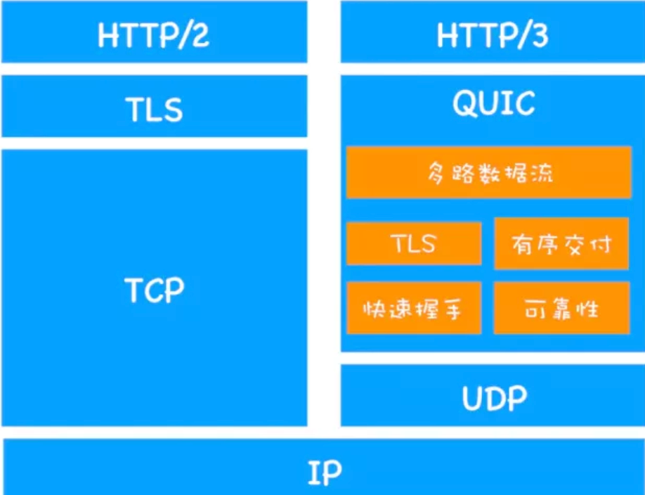

# 9.4-总结本周(9月第一周)

## 总结

### 目标

本月的目标的学习`http相关知识`,星期一到星期五去学习总结, 星期六休息, 星期天总结本周

### 本周学了什么

- http的一个发展历程
- http是什么
- 与http相关的各种概念

## http的一个发展历程

- HTTP 协议始于三十年前蒂姆·伯纳斯 - 李的一篇论文
- HTTP/0.9 是个简单的文本协议，只能获取文本资源(**1989**)
- HTTP/1.0 确立了大部分现在使用的技术，但它不是正式标准(**1996**)
- HTTP/1.1 是目前互联网上使用最广泛的协议，功能也非常完善(**1999**)
- HTTP/2 基于 Google 的 SPDY 协议，注重性能改善，但还未普及(**2015**)
- HTTP/3 基于 Google 的 QUIC 协议，是将来的发展方向(**2018**)

### 各种版本的比较

**HTTP/1.0** 相比较 **HTTP/0.9**

- 增加了 HEAD、POST 等新方法
- 增加了响应状态码，标记可能的错误原因
- 引入了协议版本号概念
- 引入了 HTTP Header(头部)的概念，让 HTTP 处理请求和响应更加灵活
- 传输的数据不再仅限于文本

**HTTP/1.1** 相比较 **HTTP/1.0**

- 它是一个正式的标准(**HTTP/1.1**)，而不是一份可有可无的参考文档(**HTTP/1.0**)。

- 增加了 PUT、DELETE 等新的方法
- 增加了缓存管理和控制(`增加了缓存管理,同一个请求不需要每次都需要经过三次握手`)
- 明确了连接管理，允许持久连接(`HTTP 1.0需要使用keep-alive参数来告知服务器端要建立一个长连接，HTTP1.1默认支持长连接`)
- 允许响应数据分块(chunked)，利于传输大文件
- 强制要求 Host 头，让互联网主机托管成为可能(`HTTP1.0是没有host域的，HTTP1.1才支持这个参数`)

**HTTP/2.0** 相比较 **HTTP/1.1**

2015年, `发布了 **HTTP/2**, **HTTP/2** 的制定充分考虑了现今互联网的现状:宽带、移动、不安全，在高度兼容

- 二进制协议，不再是纯文本(`二进制协议`)
- 可发起多个请求，废弃了 1.1 里的管道(`多路复用`)
- 使用专用算法压缩头部，减少数据传输量(`头部压缩, 使得可以在header带更多数据了`)
- 允许服务器主动向客户端推送数据(`服务器主动push数据到客户端`)
- 增强了安全性，“事实上”要求加密通信(`安全性`)

**HTTP/3.0** 相比较 **HTTP/2.0**

**HTTP/3.0**是基于[UDP](https://so.csdn.net/so/search?q=UDP&spm=1001.2101.3001.7020)协议实现了类似于TCP的多路复用数据流、传输可靠性等功能，这套功能被称为QUIC协议.

- 流量控制、传输可靠性功能：QUIC在UDP的基础上增加了一层来保证数据传输可靠性，它提供了数据包重传、拥塞控制、以及其他一些TCP中的特性
- 集成TLS加密功能：目前QUIC使用TLS1.3，减少了握手所花费的RTT数。

- 解决了http 2.0中前一个stream丢包导致后一个stream被阻塞的问题（`解决TCP层的队头阻塞问题`)
- 可以快速进行三次握手(`快速握手`)

## http是什么

**HTTP 是一个在计算机世界里专门在两点之间传输文字、图片、音频、视频等超文本数据的约定和规范**

- 计算机世界里
- 俩点(`必须是双方`)
- 传输文字、图片、音频、视频等超文本数据
- 是一种约定和规范

## 与HTTP相关的各种概念

### **浏览器**

HTTP 协议中的**请求方**

### **Web**服务器

HTTP协议另一端的**应答方**(响应方)是**服务器**，**Web Server**

### **CDN**

**CDN**，全称是Content Delivery Network，就是`内容分发网络`。它应用 了 HTTP 协议里的缓存和代理技术，代替源站响应客户端的请求。

**CDN的好处:**

- 可以`缓存源站的数据`,让浏览器的请求不用千里迢迢地到达源站服务器， 直接在半路就可以获取响应。如果 CDN 的调度算法很优秀，更可以找到离用户最近的 节点，大幅度缩短响应时间。
- 除了基本的网络加速外，还提供负载均衡、 安全防护、边缘计算、跨运营商网络等功能，能够成倍地放大源站服务器的服务能力

### **爬虫**

HTTP 协议并没有规定用户代理后面必须是真正的人类，它也完全可以是机器人，这些机器人的正式名称就叫做**爬虫**(Crawler)，实际上是一种可以自动访 问 Web 资源的应用程序。

### **WAF**

**WAF**是近几年比较火的一个词，意思是网络应用防火墙。与硬件防火墙类 似，它是应用层面的防火墙，专门检测 HTTP 流量，是防护 Web 应用的安全技术。

WAF 通常位于 Web 服务器之前，可以`阻止如 SQL 注入、跨站脚本等攻击`，目前应用较多的一个开源项目是 ModSecurity，它能够完全集成进 Apache 或 Nginx。

### **TCP/IP**

TCP/IP 协议实际上是一系列网络通信协议的统称，其中最核心的两个协议是**TCP**和**IP**，其他的还有 UDP、ICMP、ARP 等等，共同构成了一个复杂但有层次的协议栈。

- tcp 传输数据
- ip 寻找地址

### **DNS**

因为在TCP/IP 协议中使用 IP 地址来标识计算机,难以记忆与输入, 于是**域名系统**(**Domain Name System**)出现了

**域名解析:** 用`域名映射真实IP`,因为如果要使用 TCP/IP 协议来通信仍然要使用IP地址

### **URI/URL**

有了TCP/IP 和 DNS, 我们还不能任意访问网络上的资源

DNS 和 IP 地址只是标记了互联网上的主机，但主机上有那么多文本、图片、页面到底要找哪一个呢?

于是就出现了 URI(**Uniform Resource Identifier**)，中文名称是 **统一资源标识符**，使用它就能够唯一地标记互联网上资源

### **HTTPS**

HTTPS是`运行在SSL/TLS 协议上的 HTTP`(**HTTP over SSL/TLS**)

SSL 使用了许多密码学最先进的研究成果，综合了`对称加密`、`非对称加密`、`摘要算法`、`数字签名`、`数字证书`等技术，能够在不安全的环境中为通信的双方创建出一个秘密的、安全的传输通道，为 HTTP 套上一副坚固的盔甲

### **代理**

代理(Proxy)是 HTTP 协议中请求方和应答方中间的一个环节，作为中转站，既可以 转发客户端的请求，也可以转发服务器的应答。

**代理有很多的种类，常见的有:**

- 匿名代理:完全隐匿了被代理的机器，外界看到的只是代理服务器
- 透明代理:顾名思义，它在传输过程中是透明开放的，外界既知道代理，也知道客户端
- 正向代理:靠近客户端，代表客户端向服务器发送请求(`作为客户端`)
- 反向代理:靠近服务器端，代表服务器响应客户端的请求(`作为服务器`)