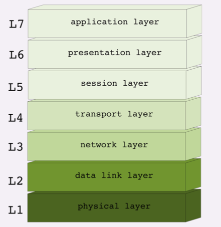
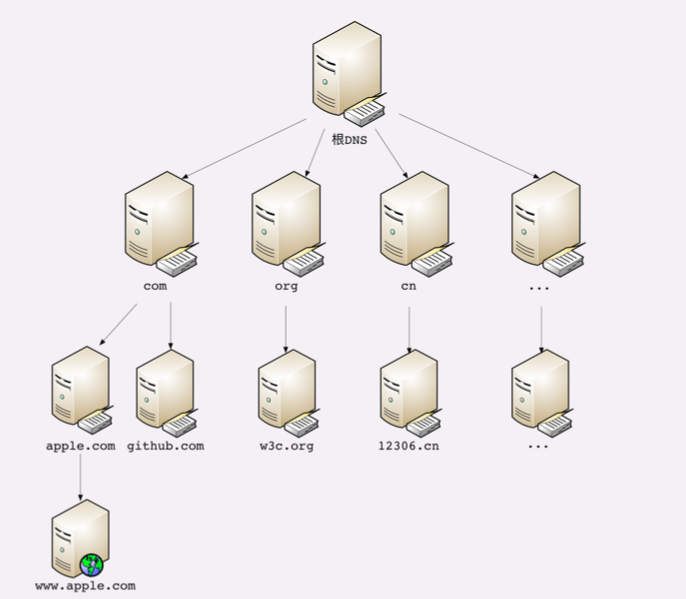

# 9.5-学习http(三)

## 四层和七层**网络分层模型**

### **TCP/IP** **网络分层模型**

TCP/IP 协议总共有四层，就像搭积木一样，每一层需要下层的支撑，同时又支撑着上层， 任何一层被抽掉都可能会导致整个协议栈坍塌

第一层叫**链接层**(link layer)，负责在以太网、WiFi 这样的底层网络上发送原始数据 包，工作在网卡这个层次，使用 MAC 地址来标记网络上的设备，所以有时候也叫 MAC 层。

第二层叫**网际层**或者**网络互连层**(internet layer)，IP 协议就处在这一层。因为 IP 协议定义了IP 地址的概念，所以就可以在链接层的基础上，用 IP 地址取代 MAC 地址，把许许多多的局域网、广域网连接成一个虚拟的巨大网络，在这个网络里找设 备时只要把 IP 地址再翻译成 MAC 地址就可以了。

第三层叫**传输层**(transport layer)，这个层次协议的职责是保证数据在IP地址标记 的两点之间可靠地传输，是 TCP 协议工作的层次，另外还有它的一个小伙伴UDP。

TCP 是一个有状态的协议，需要先与对方建立连接然后才能发送数据，而且保证数据不丢 失不重复。而 UDP 则比较简单，它无状态，不用事先建立连接就可以任意发送数据，但不 保证数据一定会发到对方。两个协议的另一个重要区别在于数据的形式。TCP 的数据是连 续的字节流，有先后顺序，而 UDP 则是分散的小数据包，是顺序发，乱序收。

协议栈的第四层叫**应用层**(application layer)，由于下面的三层把基础打得非常好， 所以在这一层就百花齐放了，有各种面向具体应用的协议。例如 Telnet、SSH、FTP、 SMTP 等等，当然还有我们的 HTTP。

MAC 层的传输单位是帧(frame)，IP 层的传输单位是包(packet)，TCP 层的传输单位 是段(segment)，HTTP 的传输单位则是消息或报文(message)。但这些名词并没有 什么本质的区分，可以统称为数据包。

### **OSI** **网络分层模型**

**OSI**，全称是**开放式系统互联通信参考 模型**(Open System Interconnection Reference Model)

OSI 模型分成了七层，部分层次与 TCP/IP 很像，从下到上分别是:

- 第一层:物理层，网络的物理形式，例如电缆、光纤、网卡、集线器等等
- 第二层:数据链路层，它基本相当于 TCP/IP 的链接层
- 第三层:网络层，相当于 TCP/IP 里的网际层
- 第四层:传输层，相当于 TCP/IP 里的传输层
-  第五层:会话层，维护网络中的连接状态，即保持会话和同步
- 第六层:表示层，把数据转换为合适、可理解的语法和语义
- 第七层:应用层，面向具体的应用传输数据

### **两个分层模型的映射关系**

- 第一层:物理层，TCP/IP 里无对应
-  第二层:数据链路层，对应 TCP/IP 的链接层
- 第三层:网络层，对应 TCP/IP 的网际层
-  第四层:传输层，对应 TCP/IP 的传输层
-  第五、六、七层:统一对应到 TCP/IP 的应用层。

### 小结

-  TCP/IP 分为四层，核心是二层的 IP 和三层的 TCP，HTTP 在第四层
-  OSI 分为七层，基本对应 TCP/IP，TCP 在第四层，HTTP 在第七层
-  OSI 可以映射到 TCP/IP，但这期间一、五、六层消失了
- 日常交流的时候我们通常使用 OSI 模型，用四层、七层等术语
-  HTTP 利用 TCP/IP 协议栈逐层打包再拆包，实现了数据传输，但下面的细节并不可见

有一个辨别四层和七层比较好的(但不是绝对的)小窍门，**两个凡是**:凡是由操作系统负责处理的就是四层或四层以下，否则，凡是需要由应用程序(也就是你自己写代码)负责处理的就是七层。

## 域名系统(DNS)

### **为什么会出现DNS?**

因为在TCP/IP 协议中使用 IP 地址来标识计算机,难以记忆与输入, 于是**域名系统**(**Domain Name System**)出现了

### **域名的形式**

域名是一个有层次的结构，是一串用.分隔的多个单词，最右边的 被称为顶级域名，然后是二级域名，层级关系向左依次降低。

最左边的是主机名，通常用来表明主机的用途，比如www表示提供万维网服 务、mail表示提供邮件服务，不过这也不是绝对的，名字的关键是要让我们容易记忆。

例如: www.codevity.top，

- top就是顶级域名，
- codevity是二级域名
- www则是主机名。
- 使用这个域名，DNS 就会把它转换成相应的 IP 地址，你就我的网站了。

### **域名的解析**

就像 IP 地址必须转换成 MAC 地址才能访问主机一样，域名也必须要转换成 IP 地址，这个 过程就是**域名解析**

DNS 的核心系统是一个三层的树状、分布式服务，基本对应域名的结构:

- 根域名服务器(Root DNS Server): 管理顶级域名服务器，返 回com、net、cn等顶级域名服务器的 IP 地址
- 顶级域名服务器(Top-level DNS Server):管理各自域名下的权威域名服务器，比如 com 顶级域名服务器可以返回 apple.com 域名服务器的 IP 地址
- 权威域名服务器(Authoritative DNS Server):管理自己域名下主机的 IP 地址，比如 apple.com 权威域名服务器可以返回 www.apple.com 的 IP 地址

有了这个系统以后，任何一个域名都可以在这个树形结构里从顶至下进行查询，就好像是把 域名从右到左顺序走了一遍，最终就获得了域名对应的 IP 地址。

例如，访问www.apple.com，就要进行下面的三次查询:

- 访问根域名服务器，它会告诉你com顶级域名服务器的地址
- 访问com顶级域名服务器，它再告诉你apple.com域名服务器的地址
- 最后访问apple.com域名服务器，就得到了www.apple.com的地址

虽然核心的 DNS 系统遍布全球，服务能力很强也很稳定，但如果全世界的网民都往这个系 统里挤，即使不挤瘫痪了，访问速度也会很慢。

所以在核心 DNS 系统之外，还有两种手段用来减轻域名解析的压力，并且能够更快地获取 结果，基本思路就是**缓存**。

- 首先，许多大公司、网络运行商都会建立自己的 DNS 服务器，作为用户 DNS 查询的代 理，代替用户访问核心 DNS 系统。这些野生服务器被称为`非权威域名服务器`，可以缓存之前的查询结果，如果已经有了记录，就无需再向根服务器发起查询，直接返回对应 的 IP 地址。(`非权威域名服务器--自行建立DNS服务器`)
- 其次，`操作系统里也会对 DNS 解析结果做缓存`，如果你之前访问 过www.apple.com，那么下一次在浏览器里再输入这个网址的时候就不会再跑到 DNS 那里去问了，直接在操作系统里就可以拿到 IP 地址。(`操作系统缓存`)
- 另外，操作系统里还有一个特殊的主机映射文件，通常是一个可编辑的文本，在 Linux 里是/etc/hosts(`host文件`)
- 浏览器内部也会缓存dns的

## 小结

通过一个例子来描述DNS域名解析: 在浏览器地址栏里随便输入一个不存在的域名，比如就叫www. 不存在.com，试着解释一下它的 DNS 解析过程

- 先查看`浏览器`查询是否有缓存,如果没有
- 然后看`host文件`查询是否有缓存, 如果没有
- 再看`操作系统`查询是否有缓存, 如果没有
- 然后再去`非权威域名服务器`查询是否有缓存, 如果没有
- 最后查询`根域名` -> `顶级域名` ->`权威域名服务器`
- 如果都没有, 网站错误,
- 如果存在,继续加载网站

## 参考

[透视HTTP协议(罗剑锋)](https://time.geekbang.org/column/intro/100029001)