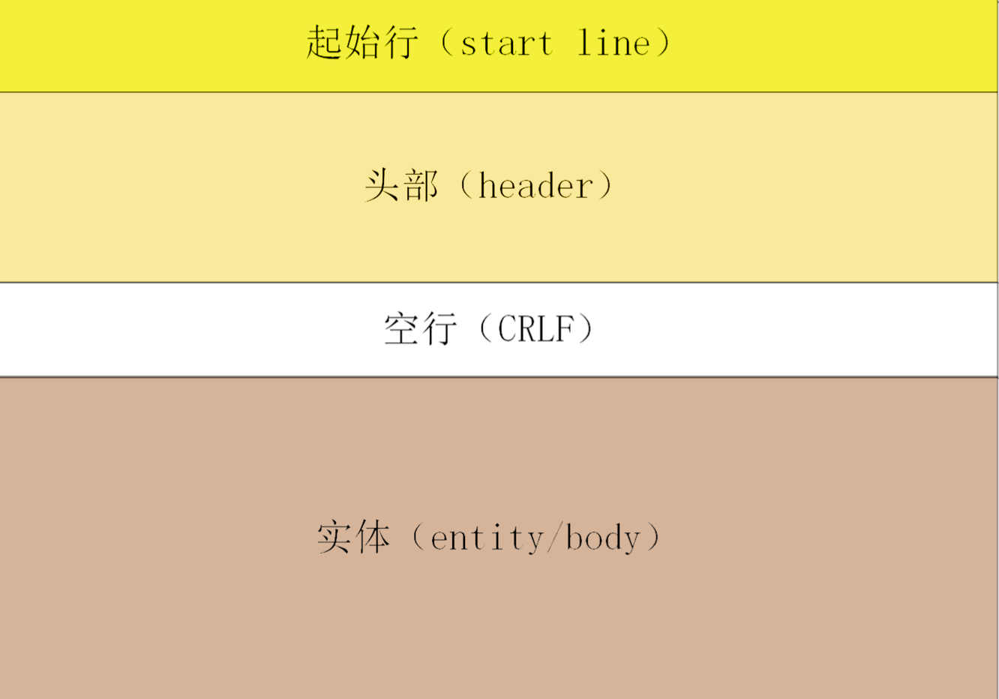
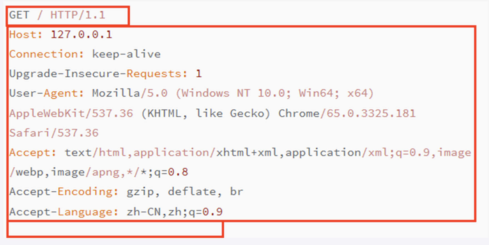
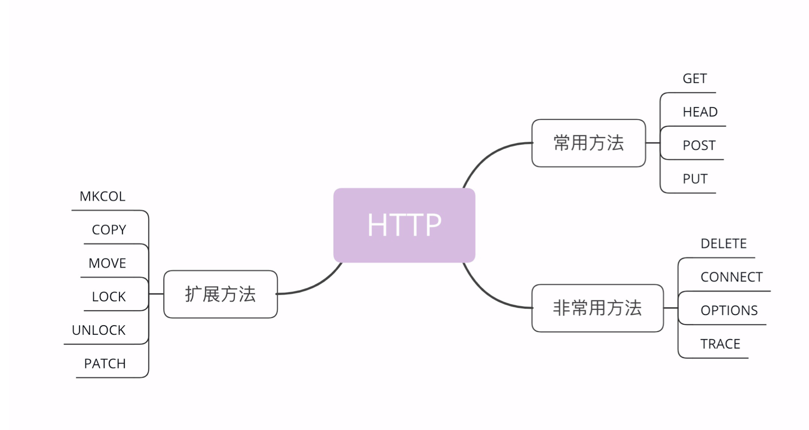

# 9.6-学习http(四)

## HTTP报文

### **HTTP 协议的核心部分是什么呢?**

答案就是它传输的报文内容

HTTP 协议在规范文档里详细定义了报文的格式，规定了组成部分，解析规则，还有处理策略，所以可以在 TCP/IP 层之上实现更灵活丰富的功能，例如`连接控制，缓存管理、数据编码、内容协商`等等

###  **报文结构**

HTTP 协议的请求报文和响应报文的结构基本相同，由三大部分组成:

- 起始行(start line):描述请求或响应的基本信息
- 头部字段集合(header):使用 key-value 形式更详细地说明报文
- 消息正文(entity):实际传输的数据，它不一定是纯文本，可以是图片、视频等二进制数据

这其中前两部分起始行和头部字段经常又合称为**请求头**或**响应头**，消息正文又称为**实体**，但与**header**对应，很多时候就直接称为**body**

HTTP 协议规定报文`必须有 header`，但`可以没有 body`，而且在` header 之后必须要有一个空行`，也就 是CRLF，十六进制的0D0A。




### **示例**



在这个浏览器发出的请求报文里，第一行GET / HTTP/1.1就是请求行，而后面的HostConnection等等都属于header，报文的 最后是一个空白行结束，没有body。

### **请求行**

起始行也就是**请求行**(request line)，它简要地描述了**客户端想要如何操作服务器端的资源**。

请求行由三部分构成:

- `请求方法`:是一个动词，如 GET/POST，表示对资源的操作
- `请求目标`:通常是一个 URI，标记了请求方法要操作的资源
- `版本号`:表示报文使用的 HTTP 协议版本

这三个部分通常使用空格(space)来分隔，最后要用 CRLF 换行表示结束

```html
GET / HTTP/1.1
```

在这个请求行里，`GET是请求方法`，`/是请求目标`，`HTTP/1.1是版本号`，把这三部分连起来，意思就 是服务器你好，我想获取网站根目录下的默认文件，我用 的协议版本号是 1.1，请不要用 1.0 或者 2.0 回复我。

### **状态行**

看完了请求行，我们再看响应报文里的起始行，在这里它不叫响应行，而是叫**状态行**(status line)，意思是 **服务器响应的状态**。

比起请求行来说，状态行要简单一些，同样也是由三部分构成:

- 版本号:表示报文使用的 HTTP 协议版本
- 状态码:一个三位数，用代码的形式表示处理的结果，例如 200 是成功，500 是服务器错误
- 原因:作为数字状态码补充，是更详细的解释文字，帮助人理解原因

```html
HTTP/1.1 200 OK
```

意思就是:浏览器你好，我已经处理完了你的请求，这个 报文使用的协议版本号是 1.1，状态码是 200，一切 OK。

### **头部字段**

请求行或状态行再加上头部字段集合就构成了 HTTP 报文里完整的请求头或响应头

请求头和响应头的结构是基本一样的，唯一的区别是起始行，所以我把请求头和响应头里的字段放在一起介绍

头部字段是 key-value 的形式，key 和 value 之间 用:分隔，`最后用 CRLF 换行表示字段结束`。比如 在Host: 127.0.0.1这一行里 key 就是Host，value 就是127.0.0.1。

HTTP 头字段非常灵活，不仅可以使用标准里的 Host、 Connection 等已有头，也可以任意添加自定义头，这就给 HTTP 协议带来了无限的扩展可能。

不过使用头字段需要注意下面几点:

- 字段名不区分大小写，例如Host也可以写 成host，但首字母大写的可读性更好
- 字段名里不允许出现空格，可以使用连字符-，但不 能使用下划线_。例如，test-name是合法的字 段名，而test name、test_name是不正确的字段名
- 字段名后面必须紧接着:，不能有空格，而:后的字段值前可以有多个空格
- 字段的顺序是没有意义的，可以任意排列不影响语义
- 字段原则上不能重复，除非这个字段本身的语义允许，例如 Set-Cookie

### **小结**

- HTTP 报文结构由`起始行 + 头部 + 空行 + 实体`组成，简单地说就是`header+body`

- HTTP 报文`可以没有 body，但必须要有 header，而且header 后也必须要有空行`

- `请求头由请求行 + 头部字段构成，响应头由状态行 + 头部字段构成`

- `请求行有三部分:请求方法，请求目标和版本号`

- `状态行也有三部分:版本号，状态码和原因字符串`

- `头部字段是 key-value 的形式，用:分隔，不区分大小写`，顺序任意，除了规定的标准头，也可以任意添加自定义字段，实现功能扩展

- `HTTP/1.1 里唯一要求必须提供的头字段是 Host`，它必须出现在请求头里，标记虚拟主机名

  

## 请求方法

上面介绍了 HTTP 的报文结构，它是由 header+body 构成，请求头里有请求方法和请求目标，响应头里有状态码 和原因短语，现在要说的就是请求头里的请求方法

### **标准请求方法**

目前 HTTP/1.1 规定了八种方法，单词**都必须是大写的形式** 

-  GET:获取资源，可以理解为读取或者下载数据
- HEAD:获取资源的元信息
-  POST:向资源提交数据，相当于写入或上传数据
- PUT:类似 POST
-  DELETE:删除资源
-  CONNECT:建立特殊的连接隧道
- OPTIONS:列出可对资源实行的方法
-  TRACE:追踪请求 - 响应的传输路径



### **GET/HEAD**

虽然 HTTP/1.1 里规定了八种请求方法，但只有前四个是比较常用的，所以我们先来看一下这四个方法。

**GET方法**

**GET**方法应该是 HTTP 协议里最知名的请求方法了，也应该是用的最多的，自 0.9 版出现并一直被保留至今，是名副其 实的“元老”。

它的含义是请求**从服务器获取资源**，这个资源既可以是静态 的文本、页面、图片、视频，也可以是由 PHP、Java 动态生成的页面或者其他格式的数据。

GET 方法虽然基本动作比较简单，但搭配 URI 和其他头字 段就能实现对资源更精细的操作。

**HEAD方法**

**HEAD**方法与 GET 方法类似，也是请求从服务器获取资源，服务器的处理机制也是一样的，`但服务器不会返回请求的实体数据`，只会传回响应头，也就是资源的“元信息”。

HEAD 方法可以看做是 GET 方法的一个“简化版”或 者“轻量版”。因为它的响应头与 GET 完全相同，所以可以用在很多并不真正需要资源的场合，避免传输 body 数据 的浪费。

比如，想要检查一个文件是否存在，只要发个 HEAD 请求就可以了，没有必要用 GET 把整个文件都取下来。再比如，要检查文件是否有最新版本，同样也应该用 HEAD，服务器会在响应头里把文件的修改时间传回来。

### **POST/PUT**

**POST方法**

GET 和 HEAD 方法是从服务器获取数据，而 POST 和 PUT 方法则是相反操作，向 URI 指定的资源提交数据，数据就放在报文的 body 里。

POST 也是一个经常用到的请求方法，使用频率应该是仅次于 GET，应用的场景也非常多，只要向服务器发送数据，用的大多数都是 POST。

**PUT方法**

PUT 的作用与 POST 类似，也可以向服务器提交数据，但与 POST 存在微妙的不同，通常 POST 表示的是“新建”“create”的含义，而 PUT 则是“修改”“update”的含义。

在实际应用中，PUT 用到的比较少。而且，因为它与 POST 的语义、功能太过近似，有的服务器甚至就直接禁止使用 PUT 方法，只用 POST 方法上传数据

### **其他方法**

讲完了 GET/HEAD/POST/PUT，还剩下四个标准请求方 法，它们属于比较“冷僻”的方法，应用的不是很多

- **DELETE**方法指示服务器删除资源，因为这个动作危险性太大，所以通常服务器不会执行真正的删除操作，而是对资源做一个删除标记。当然，更多的时候服务器就直接不处理 DELETE 请求。
- **CONNECT**是一个比较特殊的方法，要求服务器为客户端和另一台远程服务器建立一条特殊的连接隧道，这时 Web 服务器在中间充当了代理的角色。
- **OPTIONS**方法要求服务器列出可对资源实行的操作方法， 在响应头的 Allow 字段里返回。它的功能很有限，用处也不 大，有的服务器(例如 Nginx)干脆就没有实现对它的支持。
- **TRACE**方法多用于对 HTTP 链路的测试或诊断，可以显示出请求 - 响应的传输路径。它的本意是好的，但存在漏洞， 会泄漏网站的信息，所以 Web 服务器通常也是禁止使用。

### **扩展方法**

省略...

## 参考

[透视HTTP协议(罗剑锋)](https://time.geekbang.org/column/intro/100029001)