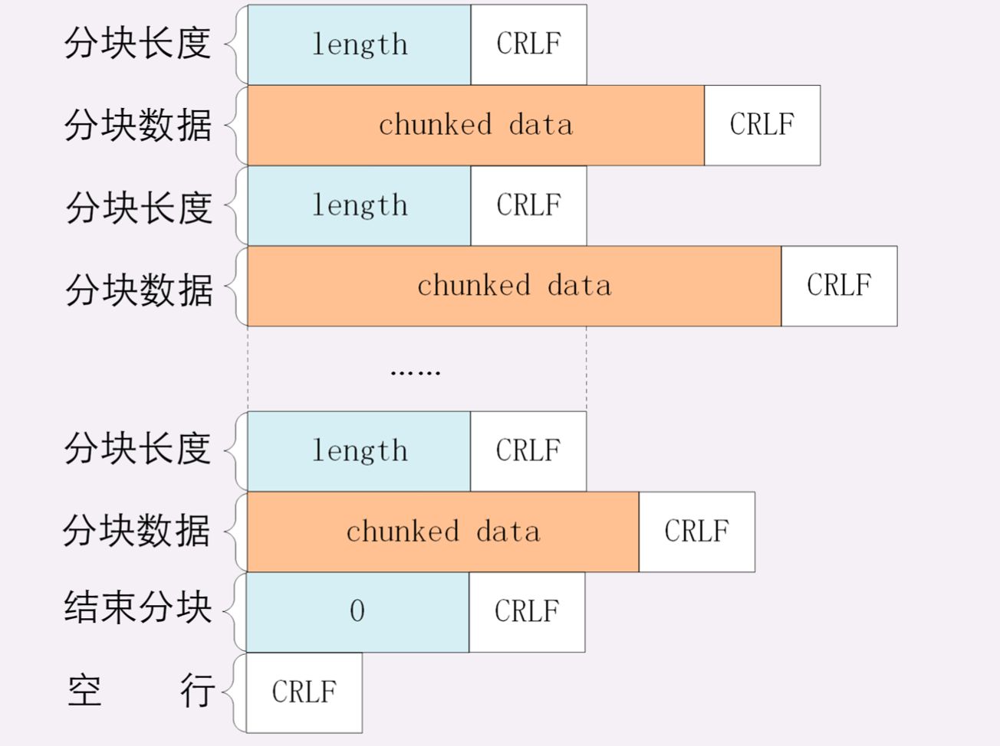

# 9.9-学习http(七)

## **HTTP 的实体数据—body**

### **数据类型和编码**

HTTP标记数据类型的方案MIME(**多用途互联网邮件扩展**)

MIME 是一个很大的标准规范，但 HTTP 只顺手牵羊取了其中的一部分，用来标记 body 的数据类型，这就是我们平常总能听到的**MIME type**。

MIME 把数据分成了八大类，每个大类下再细分出多个子类，形式是type/subtype的字符串，巧得很，刚好也符合了 HTTP 明文的特点，所以能够很容易地纳入 HTTP 头 字段里。这里简单列举一下在 HTTP 里经常遇到的几个类别:

- text:即文本格式的可读数据，我们最熟悉的应该就是 text/html 了，表示超文本文档，此外还有纯文本text/plain、样式表 text/css 等。
- image:即图像文件，有 image/gif、image/jpeg、image/png 等
- audio/video:音频和视频数据，例如 audio/mpeg、video/mp4 等
- application:数据格式不固定，可能是文本也可能是二进制，必须由上层应用程序来解释。常见的有 application/json，application/javascript、 application/pdf 等


但仅有 MIME type 还不够，因为 HTTP 在传输时为了节约带宽，有时候还会压缩数据，为了不要让浏览器继 续猜，还需要有一个Encoding type，告诉数据是用的什么编码格式，这样对方才能正确解压缩，还原出原始的数据。

比起 MIME type 来说，Encoding type 就少了很多，常用 的只有下面三种:

- gzip:GNU zip 压缩格式，也是互联网上最流行的压缩格式
- deflate: zlib(deflate)压缩格式，流行程度仅次于 gzip
- br: 一种专门为 HTTP 优化的新压缩算法(Brotli)

### **数据类型使用的头字段**

有了MIME type 和 Encoding type，无论是浏览器还是服 务器就都可以轻松识别出 body 的类型，也就能够正确处理数据了。

HTTP 协议为此定义了两个 Accept 请求头字段和两个Content 实体头字段，用于客户端和服务器进行**内容协商**。也就是说，客户端用 Accept 头告诉服务器希望接收 什么样的数据，而服务器用 Content 头告诉客户端实际发 送了什么样的数据。


**Accept**字段标记的是客户端可理解的 MIME type，可以 用,做分隔符列出多个类型，让服务器有更多的选择余地，例如下面的这个头:

```html
Accept: text/html,application/xml,image/webp,image/png
```

这就是告诉服务器:我能够看懂 HTML、XML 的文本， 还有 webp 和 png 的图片，请给我这四类格式的数据。

相应的，服务器会在响应报文里用头字段**Content-Type**告诉实体数据的真实类型:

```html
Content-Type: text/html
Content-Type: image/png
```

这样浏览器看到报文里的类型是text/html就知道是 HTML 文件，会调用排版引擎渲染出页面，看 到image/png就知道是一个 PNG 文件，就会在页面上显示出图像。


**Accept-Encoding**字段标记的是客户端支持的压缩格式， 例如上面说的 gzip、deflate 等，同样也可以用,列出多 个，服务器可以选择其中一种来压缩数据，实际使用的压缩 格式放在响应头字段**Content-Encoding**里。

```html
Accept-Encoding: gzip, deflate, br (客户端支持)

Content-Encoding: gzip(服务端选择的压缩数据方法)
```

不过这两个字段是可以省略的

- 如果请求报文里没有 Accept-Encoding 字段，就表示客户端不支持压缩数据
- 如果响应报文里没有 Content-Encoding 字段，就表示响 应数据没有被压缩。

### **语言类型与编码**

MIME type 和 Encoding type 解决了计算机理解 body 数 据的问题，但互联网遍布全球，不同国家不同地区的人使用了很多不同的语言，虽然都是 text/html，但如何让浏览器 显示出每个人都可理解可阅读的语言文字呢?

于是出现了 Unicode 和 UTF-8，把世界上所有的语言都容纳在一种编码方案里，UTF-8 也成为了互联网上的标准字符集

### **语言类型使用的头字段**

同样的，HTTP 协议也使用 Accept 请求头字段和 Content 实体头字段，用于客户端和服务器就语言与编码进行**内容协商**。

**Accept-Language**字段标记了客户端可理解的自然语言， 也允许用,做分隔符列出多个类型，例如:

```html
Accept-Language: zh-CN, zh, en
```

这个请求头会告诉服务器:最好给我 zh-CN 的汉语文 字，如果没有就用其他的汉语方言，如果还没有就给英 文。

相应的，服务器应该在响应报文里用头字段**Content- Language**告诉客户端实体数据使用的实际语言类型:

```html
Content-Language: zh-CN
```

字符集在 HTTP 里使用的请求头字段是**Accept-Charset**， 但响应头里却没有对应的 Content-Charset，而是在 **Content-Type**字段的数据类型后面用charset=xxx来 表示，这点需要特别注意。

例如，浏览器请求 GBK 或 UTF-8 的字符集，然后服务器返 回的是 UTF-8 编码，就是下面这样:

```js
Accept-Charset: gbk, utf-8
Content-Type: text/html; charset=utf-8
```

不过现在的浏览器都支持多种字符集，通常不会发送 Accept-Charset，而服务器也不会发送 Content- Language，因为使用的语言完全可以由字符集推断出来， 所以在请求头里一般只会有 Accept-Language 字段，响应头里只会有 Content-Type 字段。

### **内容协商的质量值**

在 HTTP 协议里用 Accept、Accept-Encoding、Accept- Language 等请求头字段进行内容协商的时候，还可以用一 种特殊的q参数表示权重来设定优先级，这里的q是quality factor的意思。

权重的最大值是 1，最小值是 0.01，默认值是 1，如果值是 0 就表示拒绝。具体的形式是在数据类型或语言代码后面加 一个;，然后是q=value。

这里要提醒的是;的用法，在大多数编程语言里;的 断句语气要强于,，而在 HTTP 的内容协商里却恰好反 了过来，;的意义是小于,的。

例如下面的 Accept 字段:

```html
Accept: text/html,application/xml;q=0.9,*/*;q=0.8
```

它表示浏览器最希望使用的是 HTML 文件，权重是 1，其 次是 XML 文件，权重是 0.9，最后是任意数据类型，权重 是 0.8。服务器收到请求头后，就会计算权重，再根据自己 的实际情况优先输出 HTML 或者 XML。

### **小结**

- 数据类型表示实体数据的内容是什么，使用的是 MIME type，相关的头字段是 Accept 和 Content-Type
- 数据编码表示实体数据的压缩方式，相关的头字段是Accept-Encoding 和 Content-Encoding
- 语言类型表示实体数据的自然语言，相关的头字段是Accept-Language 和 Content-Language
- 字符集表示实体数据的编码方式，相关的头字段是Accept-Charset 和 Content-Type
- 客户端需要在请求头里使用 Accept 等头字段与服务器进 行内容协商，要求服务器返回最合适的数据
- Accept 等头字段可以用,顺序列出多个可能的选项，还可以用;q=参数来精确指定权重

## **HTTP传输大文件方法**

### **分块传输**

如果大文件整体不能变小，那就把它拆开，分解成多个小块，把这些小块分批发给浏览器，浏览器收到后再组装复原,这种**化整为零**的思路在 HTTP 协议里就是**chunked**分块传输编码，在响应报文里用头字 段`Transfer-Encoding: chunked`来表示，意思是报文 里的 body 部分不是一次性发过来的，而是分成了许多的块 (chunk)逐个发送。

分块传输也可以用于流式数据，例如由数据库动态生成的表单页面，这种情况下 body 数据的长度是未知的，无法在头字段**Content-Length**里给出确切的长度，所以也 只能用 chunked 方式分块发送。

`Transfer-Encoding: chunked`和`Content- Length`这两个字段是**互斥的**，也就是说响应报文里这两个字段不能同时出现，一个响应报文的传输要么是长度已知，要么是长度未知(chunked)，这一点一定要记住。

下面我们来看一下分块传输的编码规则，其实也很简单，同样采用了明文的方式，很类似响应头。

- 每个分块包含两个部分，长度头和数据块
- 长度头是以 CRLF(回车换行，即\r\n)结尾的一行明文，用 16 进制数字表示长度
- 数据块紧跟在长度头后，最后也用 CRLF 结尾，但数据不包含 CRLF
- 最后用一个长度为 0 的块表示结束，即0\r\n\r\n



### **范围请求**

有了分块传输编码，服务器就可以轻松地收发大文件了，但对于上G的超大文件，还有一些问题需要考虑。

比如，你在看当下正热播的某穿越剧，想跳过片头，直接看正片，或者有段剧情很无聊，想拖动进度条快进几分钟，这实际上是想获取一个大文件其中的片段数据，而分块传输并没有这个能力。

HTTP 协议为了满足这样的需求，提出了**范围请求**(range requests)的概念，允许客户端在请求头里使 用专用字段来表示只获取文件的一部分，相当于是**客户端的化整为零**。

范围请求不是 Web 服务器必备的功能，可以实现也可以不实现，所以服务器必须在响应头里使用字段**Accept- Ranges: bytes**明确告知客户端:我是支持范围请求 的。

如果不支持的话该怎么办呢?服务器可以发送Accept- Ranges: none，或者干脆不发送Accept-Ranges字 段，这样客户端就认为服务器没有实现范围请求功能，只能 老老实实地收发整块文件了。

请求头**Range**是 HTTP 范围请求的专用字段，格式 是**bytes=x-y**，其中的 x 和 y 是以字节为单位的数据范围。

要注意 x、y 表示的是偏移量，范围必须从 0 计数，例 如前 10 个字节表示为0-9，第二个 10 字节表示 为10-19，而0-10实际上是前 11 个字节。

Range 的格式也很灵活，起点 x 和终点 y 可以省略，能够很方便地表示正数或者倒数的范围。假设文件是 100 个字节，那么:

- 0-表示从文档起点到文档终点，相当于0-99，即整个文件
- 10-是从第 10 个字节开始到文档末尾，相当于10 99
- -1是文档的最后一个字节，相当于99-99
- -10是从文档末尾倒数 10 个字节，相当于90-99

服务器收到 Range 字段后，需要做四件事。

- 第一，它必须检查范围是否合法，比如文件只有 100 个字 节，但请求200-300，这就是范围越界了。服务器就会 返回状态码**416**，意思是你的范围请求有误，我无法处理，请再检查一下
- 如果范围正确，服务器就可以根据 Range 头计算偏移量，读取文件的片段了，返回状态码**206 Partial Content**，和 200 的意思差不多，但表示 body 只是原数据的一部分
- 第三，服务器要添加一个响应头字段**Content-Range**，告诉片段的实际偏移量和资源的总大小，格式是**bytes x- y/length**，与 Range 头区别在没有=，范围后多了总长度。例如，对于0-10的范围请求，值就是bytes 0-10/100
- 最后剩下的就是发送数据了，直接把片段用 TCP 发给客户端，一个范围请求就算是处理完了

### **小结**

- 分块传输可以流式收发数据，节约内存和带宽，使用响应头字段Transfer-Encoding: chunked来表示，分块的格式是 16 进制长度头 + 数据块
- 范围请求可以只获取部分数据，即分块请求，实现视频拖拽或者断点续传，使用请求头字段Range和响应头字段Content-Range，响应状态码必须是 206
- 也可以一次请求多个范围，这时候响应报文的数据类型是multipart/byteranges，body 里的多个部分会用 boundary 字符串分隔

## 参考

[透视HTTP协议(罗剑锋)](https://time.geekbang.org/column/intro/100029001)