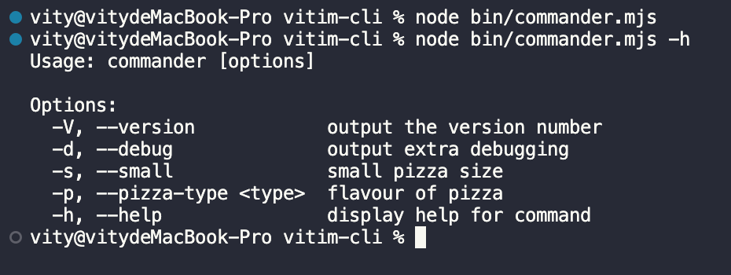
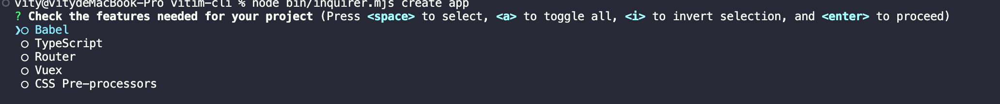
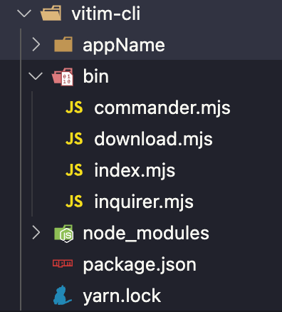
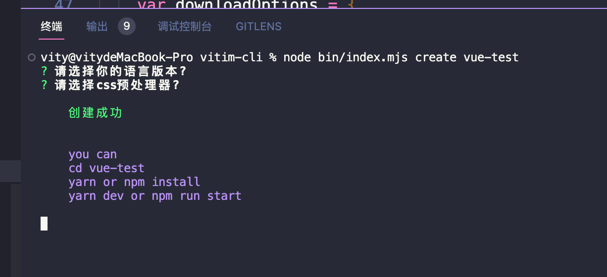
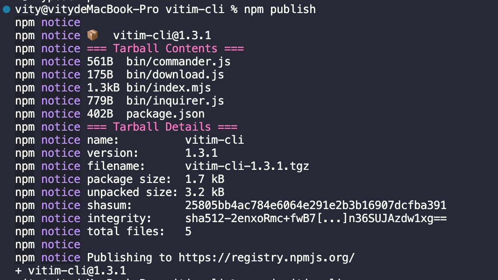

# 如何创建一个cli工具呢?

[代码仓库](https://gitee.com/igxv/vimit-cli.git)

## 1.创建文件夹以及初始化

```shell
mkdir vitim-cli && cd vitim-cli && npm init -y
```

## 2.创建bin文件夹,并设置bin命令

```json
{
  "name": "vitim-cli",
  "version": "1.3.1",
  "description": "",
  "main": "index.js",
  "type": "module",
  "scripts": {
    "test": "echo \"Error: no test specified\" && exit 1"
  },
  "bin": {
    "vimit": "./bin/index.mjs" 
  },
  "keywords": [],
  "author": "",
  "license": "ISC",
  "dependencies": {
    "commander": "^9.4.1",
    "download-git-repo": "^3.0.2",
    "inquirer": "^9.1.3"
  }
}

```

这里`type:module` 使用ESM模块, 因为下面的插件搞版本不支持`commonjs`了

通过设置bin命令,为后面发布到npm,可以通过vitim命令(可以看第7点)访问

## 3.commander插件

[commander的使用](https://github.com/tj/commander.js/blob/HEAD/Readme_zh-CN.md)

安装

```shell
yarn add commander or npm install commander
```

在bin目录下新建`commander.mjs` 文件

```js
import { program } from 'commander'
program.version('0.0.1');

//有两种最常用的选项，一类是 boolean 型选项，选项无需配置参数，
//另一类选项则可以设置参数（使用尖括号声明在该选项后，如--expect <value>）。如果在命令行中不指定具体的选项及参数，则会被定义为undefined。

program
  .option('-d, --debug', 'output extra debugging')
  .option('-s, --small', 'small pizza size')
  .option('-p, --pizza-type <type>', 'flavour of pizza');

// 参数解析
program.parse(process.argv);
```

运行



可以得知[commander](https://github.com/tj/commander.js/blob/HEAD/Readme_zh-CN.md)可以为我们进行参数解析

这里注意一个点

```js
// 参数解析
program.parse(process.argv);
```

这段代码必须放在最后,不然写在它后面的会解析失败

## 4.inquirer插件

[inquirer的使用](https://www.npmjs.com/package/inquirer)

inquirer是什么呢?

`inquirer是实现人机交互的插件`

安装

```
yarn add inquirer or npm install inquirer
```

在bin目录下新建`inquirer.js` 文件

```js
import { program } from 'commander'
import inquirer from "inquirer"
program.version('0.0.1');
program
  .command('create <app-name>')  // 命令
  .description('create app') // 命令描述
  .action(async () => {  // 命令行为
    let answer = await inquirer.prompt([
      {
        name: 'features',
        type: 'checkbox',
        message: 'Check the features needed for your project',
        choices: ['Babel', 'TypeScript', 'Router', 'Vuex', 'CSS Pre-processors']
      },
      {
        name: 'use_class_style',
        type: 'confirm',
        message: 'Use class-style component syntax?'
      },
    ])

    // 通过answer可以获取到刚才的选择
  })

// 参数解析
program.parse(process.argv);
```

运行


## 5.download-git-repo插件

[download-git-repo的使用](https://www.npmjs.com/package/download-git-repo)

download-git-repo这个插件可以帮助我们从git仓库中拉取代码

安装

```shell
yarn add download-git-repo or npm install download-git-repo
```

在bin目录下新建`download.js` 文件

```js
import downloadGitRepo  from 'download-git-repo'
// 第二个参数为拉取代码后的文件夹名字
download('direct:https://gitee.com/igxv/v-cli', 'appName', { clone: true })
```

运行

```shell
node bin/download.mjs
```



可以看到我们拉取成功了,多了一个名字叫appName的文件夹

## 6.综合运用

```shell
☆目标:
1.创建一个vimit-cli工具
2.输入vimit create appName 开始进行创建
3.出现选择
   (1).请选择你的语言版本?  ['JavaScript', 'TypeScript']
   (2).请选择css预处理器? ['sass', 'less']
4.创建成功之后的提示
you can
cd appName
yarn or npm install
yarn dev or npm run start
```

全部代码 `index.mjs`

```js
#! /usr/bin/env node

// 注意上面这里一定要声明node环境, 否则有问题

import { program } from 'commander'
import inquirer from "inquirer"
import { promisify } from "util" // 异步
import downloadGitRepo  from 'download-git-repo'
const download = promisify(downloadGitRepo)
import chalk from "chalk" 

// 克隆
const clone = (appName) =>  download('direct:https://gitee.com/igxv/v-cli', appName, { clone: true })
//日志打印
const log = (content, color) => console.log(chalk[color](content));

program.version('1.0.0');
program
  .command('create <app-name>')  // 命令
  .description('create app') // 命令描述
  .action(async (appName) => {  // 命令行为
    let answer = await inquirer.prompt([
      {
        name: 'language',
        type: 'checkbox',
        message: '请选择你的语言版本?',
        choices: ['JavaScript', 'TypeScript']
      },
      {
        name: 'pre_css',
        type: 'checkbox',
        message: '请选择css预处理器?',
        choices: ['sass', 'less']
      },
    ])
    // 开始克隆
    clone(appName);
    log(`
    创建成功
    `, 'green')
    log(`
    you can
    cd ${appName}
    yarn or npm install
    yarn dev or npm run start
    `,'blue')
})

// 参数解析
program.parse(process.argv);

```

运行



发布到npm中

```shell
npm publish
```



这样就可以发布成功了

#### 7.使用

安装已经发布的vitim-cli

```
npm i vitim-cli -g
```

使用vitim进行创建

```
vitim create app 
```
#### 8.插件推荐

交互输入： [inquirer](https://link.juejin.cn?target=http%3A%2F%2Fnpm.im%2Finquirer)、 [enquirer](https://link.juejin.cn?target=http%3A%2F%2Fnpm.im%2Fenquirer) 、[prompts](https://link.juejin.cn?target=https%3A%2F%2Fnpm.im%2Fprompts)

输出美化： [chalk](https://link.juejin.cn?target=http%3A%2F%2Fnpm.im%2Fchalk)、 [kleur](https://link.juejin.cn?target=https%3A%2F%2Fnpm.im%2Fkleur)、[ink](https://link.juejin.cn?target=http%3A%2F%2Fnpm.im%2Fink)、[figlet](https://link.juejin.cn?target=https%3A%2F%2Fwww.npmjs.com%2Fpackage%2Ffiglet)

加载动画：[ora](https://link.juejin.cn?target=http%3A%2F%2Fnpm.im%2Fora)

基本解析：[meow](https://link.juejin.cn?target=http%3A%2F%2Fnpm.im%2Fmeow) 、 [arg](https://link.juejin.cn?target=http%3A%2F%2Fnpm.im%2Farg)

参数解析：[commander](https://link.juejin.cn?target=http%3A%2F%2Fnpm.im%2Fcommander) 、[yargs](https://link.juejin.cn?target=https%3A%2F%2Fwww.npmjs.com%2Fpackage%2Fyargs)

操作命令行 [sindresorhus/ansi-escapes](https://link.juejin.cn?target=https%3A%2F%2Fgithub.com%2Fsindresorhus%2Fansi-escapes)

输出截断 [sindresorhus/cli-truncate](https://link.juejin.cn?target=https%3A%2F%2Fgithub.com%2Fsindresorhus%2Fcli-truncate)


