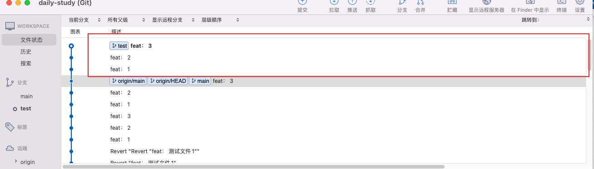
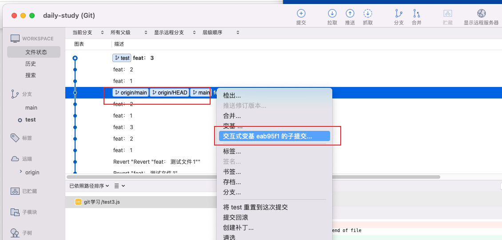
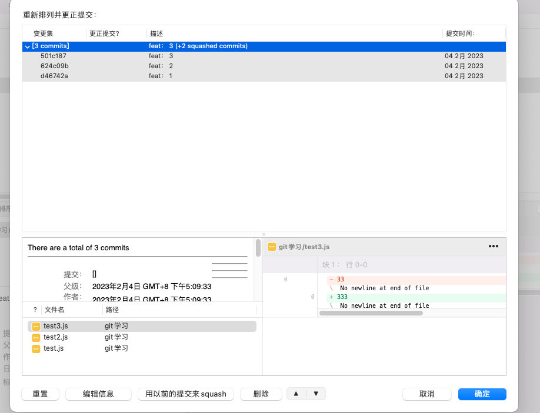
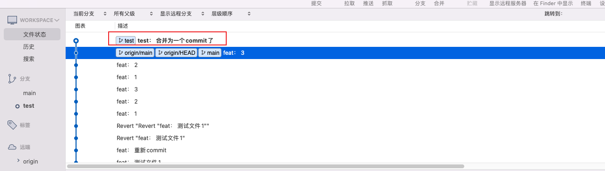

# **5-sourcetree操作**

## **重置**

**重置(reset)主要用于将改动提交(commit)到本地而未推送(push)到远程仓库时,`reset`是用来重置本地仓库的`commit`命令**


点击重置到这次提交后, 会出现


- **软合并：保存改动文件，将改动文件回退到暂存区，也就是`git add`之后的状态**
- **混合合并：保存改动文件，将改动文件回退到未暂存状态，也就是`git add`之前的状态**
- **强行合并：丢弃改动文件，强制回退到指定版本**


特殊情况(如重置远程的)
- git push -f origin master(`非特殊情况不要乱用`)
- 强行推送并且会覆盖的commit(`git log查看commit`)


使用场景
- 用于本地操作(回滚)
- 撤销commit(未推送到远端情况)


## **回滚操作**

**回滚(revert)主要用于已经`push`到远程仓库时,`revert`后会新增加一个`commit`,`commit`的内容是之前提交内容的反操作，就像你修改内容提交一样，远程仓库认为这是一个新的提交，从而应用到远程分支上**

`特别注意: 回滚是提交内容的反操作`
- 也就是说, 你回滚的是新增的内容, 那么你回滚后, 则会删除这些内容


```js
// 回滚前, 提交的文件有
test.js -> 当前的记录feat:test
fallback.js -> 当前的记录feat:fallback

对记录为feat:test 的进行回滚

// 回滚后, 文件
fallback.js 
```

然后push远程之后就会回滚成功

### **撤销回滚操作**

- 先使用`git reflog`查看操作记录
- 然后再使用`git reset --hard 0df18f6`

## **变基合并**

- 两者都可以把别人提交的代码，同步到自己的开发分支。
- 合并，从SourceTree的图表上看，会有多条线。而变基只有一条蓝色的线（好像就这点不同了）。

### **变基操作**

1. 多人同时开发，小明同学在**dev1**分支上开发，“我”在**dev2**分支上开发；
2. 小明同学开发完成并提交了代码到他的**dev1**分支上，“我”也开发完成并提交到**dev2**上；
3. 现在“我”要把小明的代码，同步到“我”的分支，也就是，**dev1**同步到**dev2**。

以下是操作

- **小明同学提交代码到dev1，“我”把分支切换到dev1，并拉取最新代码**
- **然后“我”切换到dev2，并选中小明同学提交的代码**
- **选中“变基”**

变基完成后 `dev1` 的代码会同步到 `dev2` 中

## **交互式变基**

在代码没有pull前我们可以在本地分支进行提交的合并。这样会使得远程分支不去关心本地开发过程日志，而使得远程日志干净整洁。

**具体操作**

- 首先， 我们commit了三次

  

- 我们需要把这三次的commit， 重置为一次， 所以我们需要再第一次的下面一次提交选择交互式变基

  

- 然后会出现交互式变基的界面， 点击`用以前的提交来squash`， 此时会产生一条新的提交

  

- 最后一步， 编辑一下新commit 的信息，就ok了

  

**取消交互式变基**

- git rebase --abort

**场景**

- 本地多个commit 合并为一个commit

## **小结**

- 没有push到远程仓库, 用`重置(reset)`
- 已经push到远程仓库, 用`回滚(revert)`
- 交互式变基的一个核心场景 - 多个commit 合并为一个commit(`本地`)