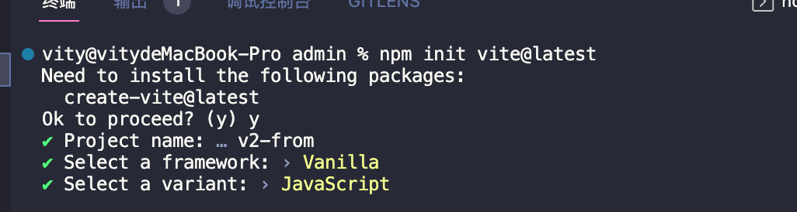

# 7-vite创建vue2项目

## **初始化 Vue2 项目**

因为`Vite` 默认没提供 `Vue2` 项目创建的选项。

我们可以使用 `Vite` 创建一个原生项目，然后再安装 `Vue2` 的生态进行开发。

### **初始化项目**

运行以下命令创建项目

```shell
npm init vite@latest
```

如果是首次使用 `Vite` 的话，会询问你是否继续，这里回复 y 即可。

```shell
Ok to proceed?(y)
```

之后只需输入项目名称即可，我这里新建的项目名为：v2-form。

```shell
Project name: vite-vue2
```

完成以上步骤后，再选择以下要新建的是什么项目即可。

这里选择 `vanilla` 即可，随后会追问选择 `原生` 的还是 `ts` 的，根据自己需求选择即可。

我这里会选择 原生 进行开发。



### 安装 vite 对 vue2 支持的插件

要在 `vite` 里运行 `vue2` 项目，需要安装一个 `vite` 的插件：`vite-plugin-vue2`

```shell
yarn add vite-plugin-vue2
```

要使用 `vite` 插件，需要在项目的根目录创建 `vite.config.js` 文件。

在 `vite.config.js` 里输入以下代码。

```js
import { createVuePlugin } from 'vite-plugin-vue2'

export default {
  plugins: [createVuePlugin()]
}
```

引入 `vite-plugin-vue2` 插件，并用 `Vite` 提供的插件注册方法来注册。

需要注意，`createVuePlugin()` 是跟着括号的，是要执行的！

### **安装 vue 依赖**

```shell
yarn add vue@2.7 vue-template-compiler
```

### **修改项目文件依赖关系**

- 创建 src 目录

  在项目根目录下创建 `src` 目录。

  然后把 `main.js` 移到 `src` 目录里。

- 修改 index.html

  项目启动后，入口文件是 `index.html` ，而 `index.html` 原本引入了 `main.js` ，所以也要修改一下 `index.html` 文件的指向。

  ```html
  <script type="module" src="/src/main.js"></script>
  ```

- 创建 App.vue 文件

  创建 `App.vue` 文件，并输入以下代码

  ```vue
  <template>
    <div>Hello Vite Vue2</div>
  </template>
  ```
  
- 修改 src/main.js
   这一步的代码就有点像使用 vue-cli 创建的项目里的 main.js 的操作了。
   
   ```js
   import Vue from 'vue'
   import App from './App.vue'
   
   new Vue({
     render: h => h(App)
   }).$mount('#app')
   ```
- 启动项目
  ```shell
  yarn dev
  ```

## **创建其他类型项目**

```shell
yarn create vite my-vue-app --template vue
```

目前支持的模板预设如下：

|                JavaScript                 |                TypeScript                 |
| :---------------------------------------: | :---------------------------------------: |
| [vanilla(原生)](https://vite.new/vanilla) | [vanilla-ts](https://vite.new/vanilla-ts) |
|        [vue](https://vite.new/vue)        |     [vue-ts](https://vite.new/vue-ts)     |
|      [react](https://vite.new/react)      |   [react-ts](https://vite.new/react-ts)   |
|     [preact](https://vite.new/preact)     |  [preact-ts](https://vite.new/preact-ts)  |
|        [lit](https://vite.new/lit)        |     [lit-ts](https://vite.new/lit-ts)     |
|     [svelte](https://vite.new/svelte)     |  [svelte-ts](https://vite.new/svelte-ts)  |
