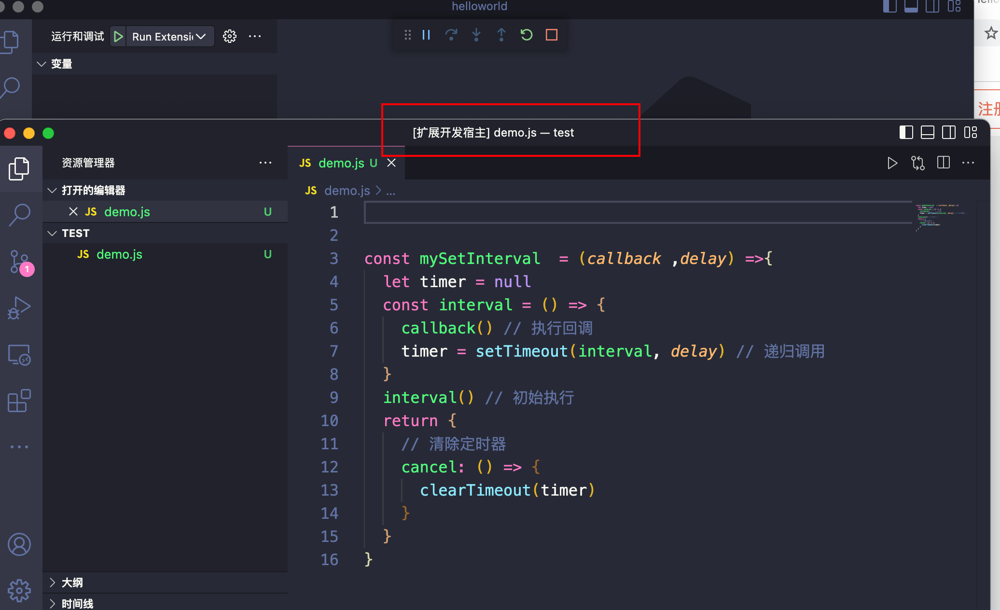

# **vscode插件开发**

## **安装插件开发脚手架**

安装[Yeoman](https://yeoman.io/)和[VS Code Extension Generator](https://www.npmjs.com/package/generator-code)

```shell
npm install -g yo generator-code
```

## **使用插件开发脚手架创建插件项目**

接下来我们利用 yo 和 generator-code 模块配合而成的脚手架，开始创建我们的 VSCode 插件项目, 执行命令

```shell
yo code
```

根据脚手架提示选择和填入相关信息：


项目依赖安装完成后，可以根据提示打开插件项目：


想要有这个打开插件项目的提示（Open with code），则需要事先在 VSCode 内 command+shift+p 选择执行：
` Shell Command: Install 'code' command in PATH`。


打开项目后，项目结构如：


其实这是个简单的、完整的、可运行的插件项目，接下来我们先来看看这个插件项目工作起来是怎么样子的~

## **使用Hello World 插件**

借助 VSCode 工具进行调式


点击调式后, 会打开打开 Extension Developer Host 窗口, 如下图



**运行插件项目**

- 先调用`yarn compile`,这里会输出一个out文件

  ```shell
  yarn compile
  ```

  

- 在Extension Developer Host 窗口内使用键盘组合键：Command+Shift+P (windows 机器是 Ctrl+Shift+P)，然后搜索我们的 Hello World 插件


则在 VSCode 右下角则会看到一个提示，这就是我们的插件工作效果：


## 分析

待补充...