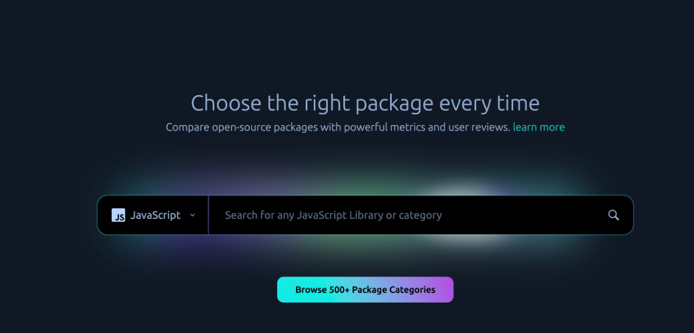

# **实用工具**

## **问题搜索**

经常看到类似的问题：

看到之后都会推荐使用 Openbase 去搜合适的库。那 Openbase 是个啥，它有什么特别之处，又是如何使用的，下面就来详细介绍一下 Openbase。

 Openbase 

在进行前端技术选型时，我们通常会在npm、GitHub、Google、百度上进行搜索，然后深入挖掘以了解技术是否维护良好，并确定其他人对该技术的看法。然而，现在仅 JavaScript 包就有超过 150 万个，这使得我们很难研究和评估每个包的质量。正是在这种背景下，Openbase 诞生了。我们现在可以在 Openbase 上搜索需要的库的类别，它会将所有信息集中到一起，便于我们更深入了解库是否符合我们的需求。

Openbase 的使命就是帮助开发人员在数百万个开源包中进行选择。它是第一个为软件包提供用户评论、强大的洞察力和开源软件包分类的平台。Openbase 的搜索引擎使开发人员能够根据他们使用的特定框架过滤搜索结果，例如 React、Vue , Node等。目前 Openbase 支持六种编程语言（Go、Java、JavaScript、Python、Rust 和 Swift）。

Openbase 官网：https://openbase.com/

###  搜索 

进入Openbase 官网的第一眼就是一个很大的搜索框：

只需在其中输入所需的库的类别即可（英文关键词），比如文章最开始的三个问题，找小数处理的库可以搜索“number”，找滚动库可以搜索“scroll”，找动态滚动的任务组件可以搜索“time line”：

然后就可以进入需要的类别里面进行查看了。可以根据语言、框架、过滤条件、排序方式来对数据进行过滤、排序：

可选的框架有很多：

支持根据用户对库的评分、Github最少Stars数量、最后提交时间、是否使用TS定义、是否支持Tree Shaking、是否被弃用来筛选结果：

###  分类 

当然，我们也可以根据分类去查找库，只需从主页进入库的分类页面：

Openbase中 有超过 500 多个类别的包，分类也支持通过语言、框架进行筛选，当然也可以直接搜索：

###  详情 

进入库的详情页面就能看到库的概述、文档、教程、评论、数据、依赖项、版本、备选方案：

在数据中可以看到下载趋势、Github Stars趋势、提交趋势、版本趋势、维护者等详细信息：

在评论中有用户对该库从多个维度进行的评分：

###  热门库 

如果你想看看有哪些优秀的开源库，可以在主页最下面来打开最热门的库：

打开热门的 JavaScript 库，Top 1 的库 debug 竟然每周下载量超过 1.6 亿！

## **前端工具**

### 1. Small Dev tools

Small Dev Tools 是一个前端工具网站，包含了很多实用的功能，比如JSON解码器、JSON格式化程序、UTF8编码、Base64编码、Base64解码、CSS格式化程序、CSS压缩器等。

**官网**：https://smalldev.tools/

### 2. Carbon

Carbon 是一个在线工具，可以生成漂亮的不同风格的代码图片。

**官网**：[https://carbon.now.sh/](https://carbon.now.sh/?)

### 3. UI Design Daily

UI 设计日报，提供免费优质的 UI 资源。

**官网**：https://www.uidesigndaily.com/

### 4. Color Hunt

ColorHunt，即颜色猎人，是一个在线设计配色的网站，其最大的特点就是使用饱和度调配配色方案。每天会根据浏览量进行更新排版，并可以直接使用。

**官网**：https://colorhunt.co/

### 5. SCHEME COLOR

SCHEME COLOR 是一个在线的配色工具网站，可以根据颜色、类型等查找合适的配色方案。

**官网**：https://www.schemecolor.com/

### 6. Keyframes

Keyframes 可以用来创建动画、阴影和使用颜色，帮助我们编写更好的CSS。

**官网**：https://keyframes.app/

### 7. Design Resources

Design Resources 是一个设计资源的集合。

**官网**：https://www.designresourc.es/

### 8. Omatsuri

Omatsuri 是一个开源项目，包含12个实用的前端工具。

**官网**：https://omatsuri.app/

### 9. UI Snippets

UI Snippets 是一个前端动画合集，可以通过右键点击想要的动画直接复制对应的 CSS 或 SCSS 代码。

**官网**：https://ui-snippets.dev/

### 10. Pattern CSS

Pattern CSS 可以用漂亮的图案填充空白背景。

**官网**：https://bansal.io/pattern-css

### 11. Can I use

Can I use 可以用来查询 HTML5、CSS、JS、SVG 在各种流行浏览器中的特性和兼容性。

**官网**：https://caniuse.com/

### 12. CSS Gradient

CSS Gradient 是一个用来快速方便的创建 CSS 渐变的网站。

**官网**：https://cssgradient.io/

### 13. **CSS matic**

CSS matic 是一个 CSS 工具，目前包含4个很有用的工具，分别是：支持各种颜色和透明度的渐变工具，使用渐变工具，可以创建渐变平滑的色彩变化效果和微妙的透明胶片；边框圆角工具可以帮助你方便的实现需要的圆角效果；噪声纹理可以帮助你创造奇妙的背景图案，能够实时预览结果；盒阴影工具可以控制模糊半径的变化，颜色变化，阴影大小，可以实现你想要的任何效果。

**官网**：https://www.cssmatic.com/

### 14. **Am I Responsive**

Am I Responsive 用来测试响应式网页。输入链接即可生成预览，Am I Responsive 能帮我们测试出页面在手机、平板电脑、笔记本电脑和桌面端设备上的浏览体验。

**官网**：http://ami.responsivedesign.is/

### 15. CSS Generator

这是一个实用的 CSS 生成器，可以实时查看调试效果。

**官网**：https://html-css-js.com/css/generator/

### 16. My Brand New Logo

My Brand New Logo 是一个CSS 调色板生成器，用来创建一致的调色板方案。

**官网**：https://mybrandnewlogo.com/color-palette-generator

### 17. 裁剪路径生成器

CSS cli-path 功能能够构建复杂的形状，该工具让我们可以轻松地以交互方式构建该多边形。

**官网**：https://bennettfeely.com/clippy/

### 18. CSS Grid Generator

CSS Grid Generator 是一个 Grid 布局生成器，通过这个工具可以快速创建自定义CSS Grid布局。

**官网**：https://cssgrid-generator.netlify.app/

### 19. CSS Layout Generator

CSS Layout Generator 布局生成器可以为布局组件创建 CSS 和 HTML 的工具。

**官网**：https://layout.bradwoods.io/

### 20. Fluid-responsive font-size calculator

Fluid-responsive font-size calculator 即响应式字体计算器，可以轻松创建流畅的排版体验。它有更广泛的支持，可以用几行 CSS 来实现。

**官网**：https://websemantics.uk/tools/responsive-font-calculator/

### 21. regex101

Regex101是学习、测试正则表达式的工具网站。

**官网**：https://regex101.com/

### 22. Regex-Vis

Regex-Vis 是一个正则表达式可视化器和编辑器。

**官网**：https://regex-vis.com/

### 23. Loupe

Loupe 是一个可视化工具，可帮助我们了解 JavaScript 的调用堆栈/事件循环/回调队列是如何执行的。

**官网**：http://latentflip.com/loupe/

### 24. RunJS

RunJS 是一个桌面应用程序，可帮助我们编写专门的 Javascript 和 Typescript 代码。它的一些优势是可以快速测试代码，轻松导入和测试库代码，并且能够修改界面、主题和字体以适应偏好。

**官网**：https://runjs.dev/

### 25. Wrap SVG Online

Wrap SVG Online 通过拖放从计算机上传图像，可以轻松地编辑网页的 SVG 图像。

**官网**：https://pavellaptev.github.io/warp-svg/

### 26. SVG Path Visualizer

SVG Path Visualizer 可以帮助我们通过输入 SVG 路径数据来快速直观地查看 SVG 图像。此外，该工具还提供了详细的说明，以便了解如何创建基本的 SVG 形状，如直线、曲线、三角形等。

**官网**：https://svg-path-visualizer.netlify.app/

### 27. BGJar

BGJar 是一个在线工具，可以轻松快速地为网站创建 SVG 背景。只需编辑必要的信息，它将自动导出图像或代码供我们应用到网站。

**官网**：https://bgjar.com/

### 28. Wavesnippets

Wavesnippets 可以将代码分步设置为动画、视频或 GIF。

**官网**：https://www.wavesnippets.com/

### 29. Generate SVG Waves

Generate SVG Waves 可以用来创建 SVG 波形背景。

**官网**：https://svgwave.in/

### 30. CodeSandbox

CodeSandbox 是一个为 Web 应用程序开发而构建的在线编辑器，支持多种主流框架。

**官网**：https://codesandbox.io/

### 31. Openbase

Openbase 帮助开发人员在数以百万计的开源软件包中进行选择和使用。

**官网**：https://openbase.com/

### 32. CodePen

CodePen 是一个在线的前端代码编辑工具，可用于制作测试页面、代码调试，所见即所得。

**官网**：https://codepen.io/

### 33. JSONLint

JSONLint 是一个 JSON 调试工具，如果遗漏了语法中的某些内容，它会进行检查。JSONLint 是处理大型 JSON 格式的绝佳工具，而且很容易上手。

**官网**：https://jsonlint.com/

### 34. Minify

Minifier 可以对 JavaScript 和 CSS 代码进行压缩，通过缩小可以提高网站加载速度。Minifier 通过删除 .js 和 .css 文件中的空白并重新格式化它们以减小大小。

**官网**：https://www.minifier.org/

### 35. Unminify 

Unminify 和 Minifier 恰恰相反。使用 Unminify 可以使 .js 或 .css 文件可读。这两种工具都非常容易使用。

**官网**：https://unminify.com/

### 36. CRADIENT.ART

CRADIENT.ART 是一个高级 CSS 渐变编辑器，使用带有分层、设计工具和免费云存储的功能丰富的编辑器设计插图、图案、图标等。

**官网**：https://gra.dient.art/

### 37. 3DPop

3DPop 可以使用 CSS 生成很棒的 3D 文本效果。

**官网**：https://textpop3d.web.app/

### 38. CSS Photo Filters

CSS Photo Filters 是一个CSS图片滤镜工具，提供了 36 个 CSS 过滤器供我们使用。

**官网**：https://baseline.is/tools/css-photo-filters/

## 工具网址
[https://www.5cv.top/](https://www.5cv.top/)