# **Charles抓包**

## **说明**

Charles安装完成，默认只能抓取到http请求，如果查看https请求，会显示unkonw或其它之类的响应。所以需要先进行一些配置，才能抓取到完整的https请求信息。

## **PC端配置**

- 安装证书

  工具栏中`Help -> SSL Proxying -> install Charles Root Certificate`

  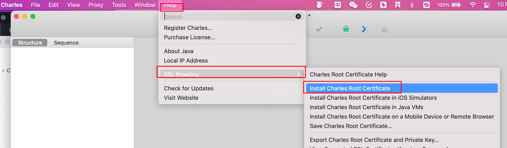

  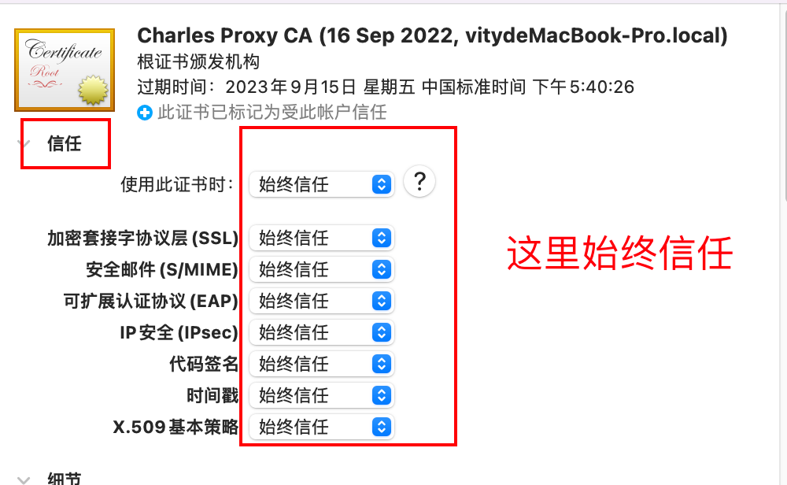

  然后就安装完毕了

- 修改charles的SSL Proxying Settings

  `Proxy -> SSL Proxying Settings`

  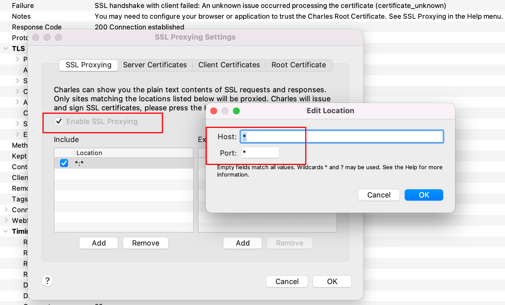

  这里表示能访问的域名、端口

- 开启 macOS Proxy 或者 Windows Proxy

  `Proxy -> macOS Proxy / Windows Proxy `

  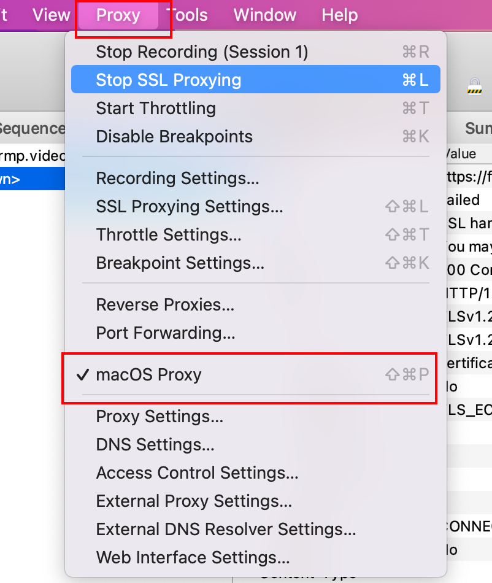

- 这个时候就可以抓取PC端浏览器的https请求了

  

## **移动端配置**

- 开启Charles 的代理功能

  `Proxy -> Proxy Settings`

  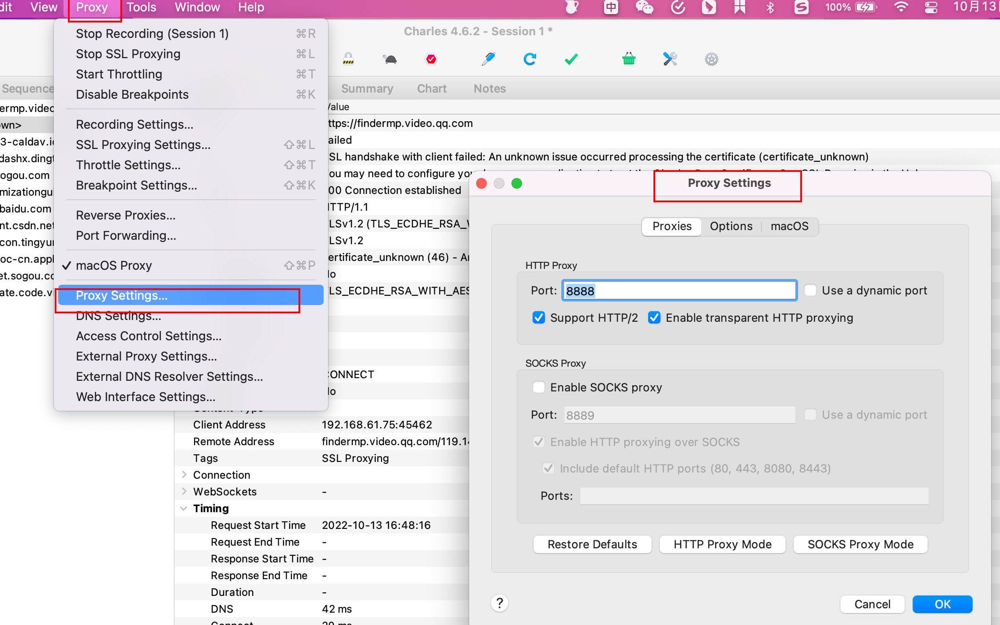

- 获取电脑的 IP

  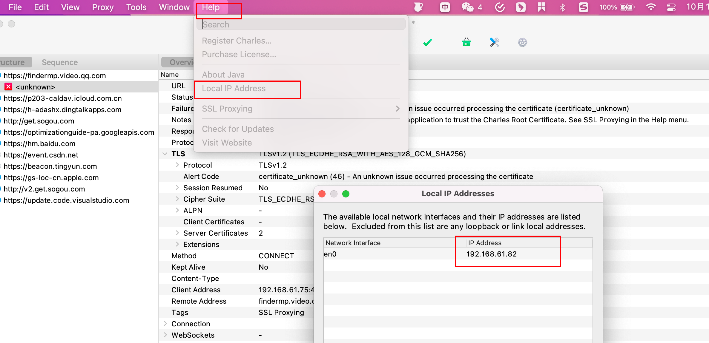

- 在手机上无线局域网配置中，选中所连的WiFi，选择手动配置代理

  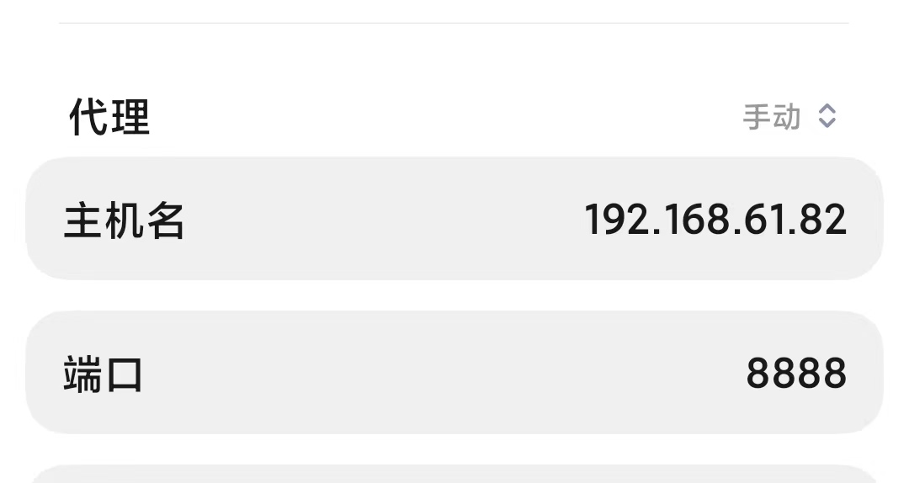

- 安装移动端证书

  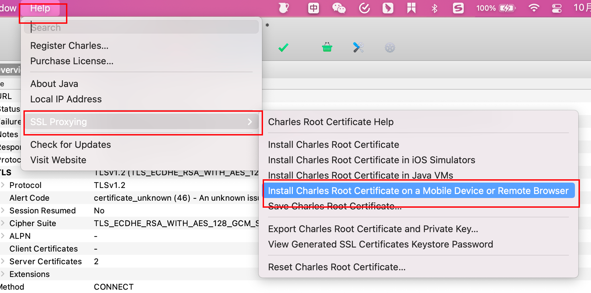

  打开手机浏览器，输入`chls.pro/ssl`，访问该地址会下载charles证书，将此证书安装到手机上

- 上面步骤完成后就可以抓取手机端的https请求了

## **charles 手机安装证书问题**

在浏览器中访问`chls.pro/ssl`下载证书

如果访问网址后一直下载不了, 可以换一个浏览器下载

## **修改一下请求和响应内容**

- 右键请求，勾选 breakpoints

  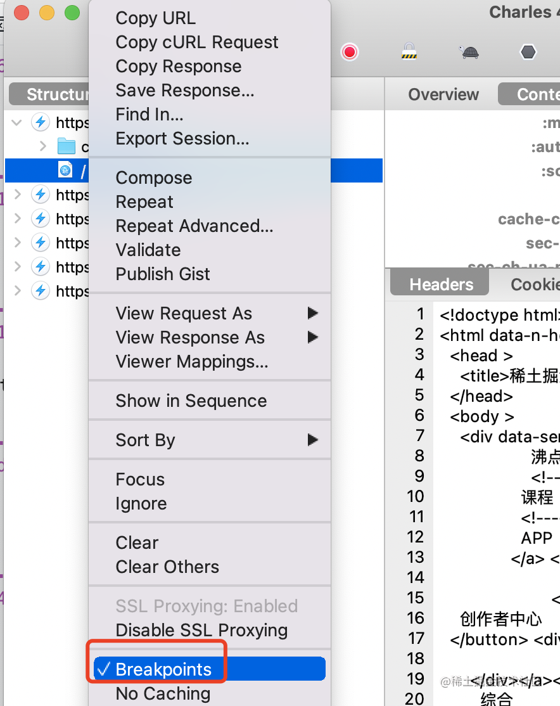

- 然后开启断点

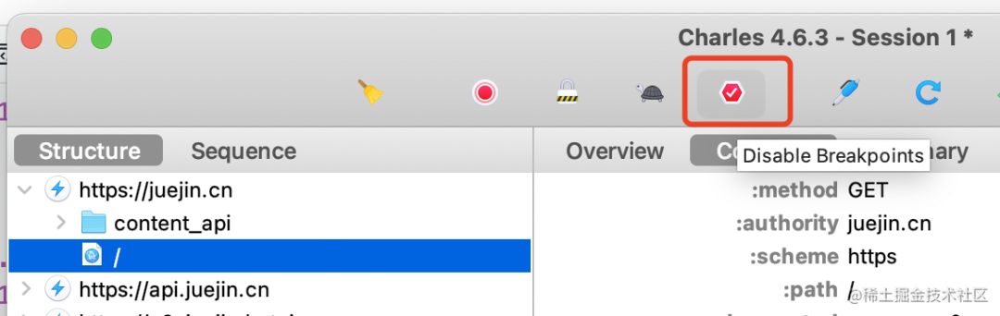

- 刷新页面你会发现它断住了

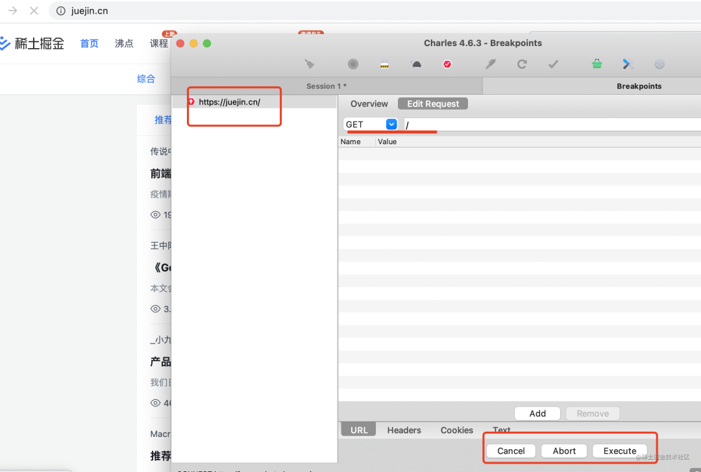

下面三个按钮分别是取消、终止、执行修改后的请求的意思。

上面可以改 url，添加 header，还可以改请求内容和 cookie：

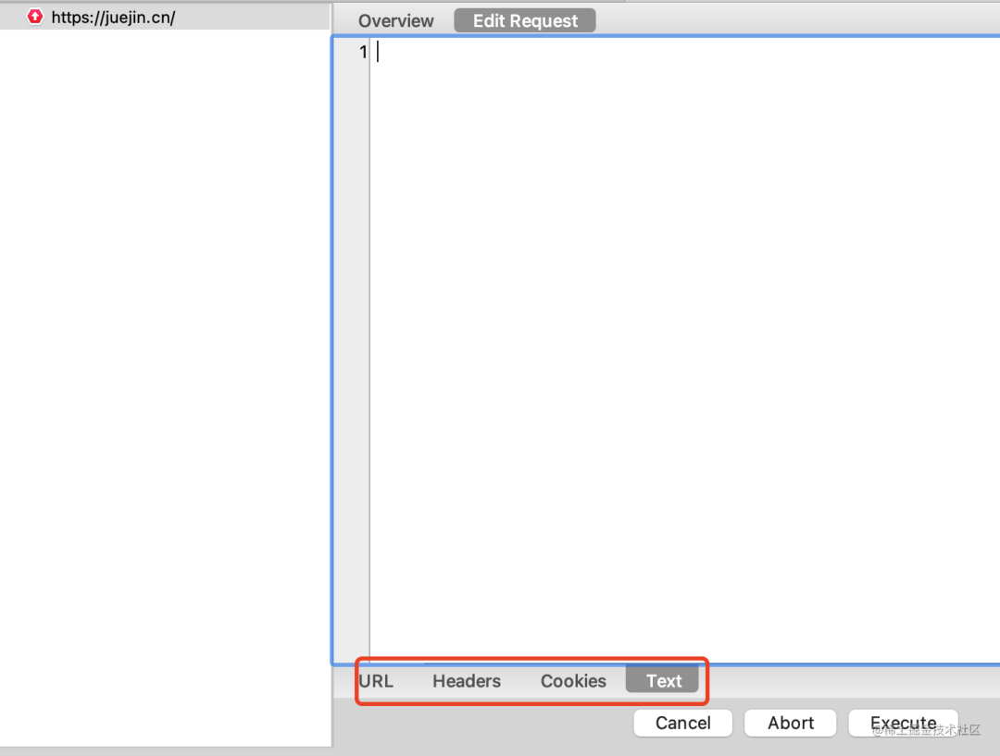

点击 execute 之后就会发送请求。

之后响应的时候还会断住，这时候就可以用同样的方式修改响应了：

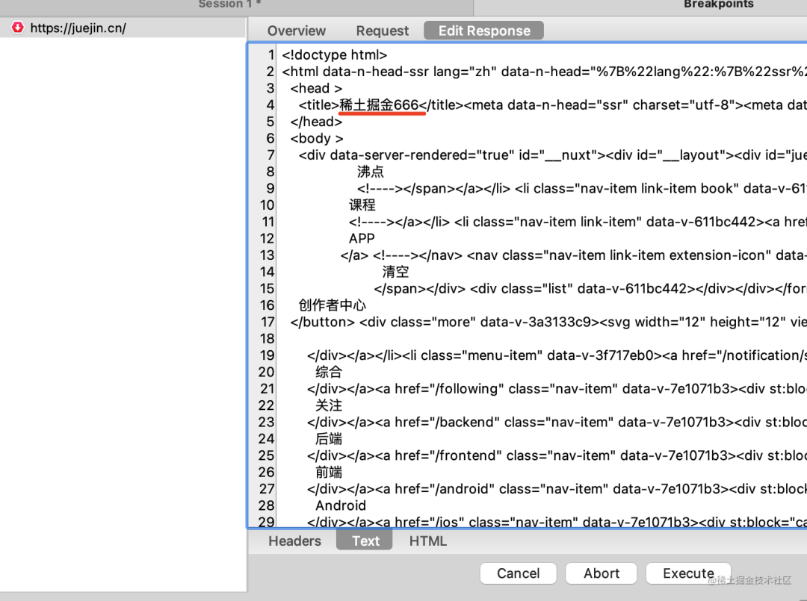

比如我把 title 修改了一下，点击 execute 之后，看到的网页就是修改过后的

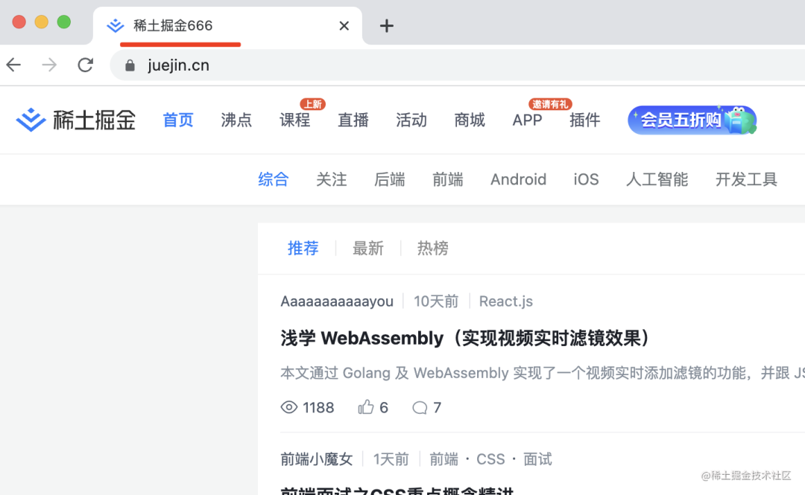

这样我们就可以断点调试 https 请求了。

## 参考链接

[用 Charles 断点调试 HTTPS 请求，原理揭秘](https://mp.weixin.qq.com/s/N8DvSASv852vzKRtyIFNyg)