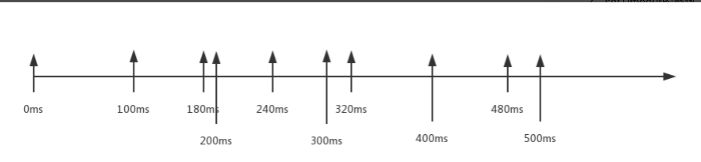

# **每日一问**

## **10.25**

### **1.common.js中的export和module.export又什么不一样呢?**

- 通过维基百科中对CommonJS规范的解析

  - CommonJS中是没有module.exports的概念的
  - 但是为了实现模块的导出，`Node中使用的是Module的类`，每一个模块都是Module的一个实例，也就是 module
  - 所以在Node中真正用于`导出的其实根本不是exports，而是module.exports`

- 为什么exports也可以导出呢?

  - 这是因为module对象的exports属性是exports对象的一个引用
  - 也就是说` module.exports = exports`

- 区别?

  - 当绑定一个属性时，两者相同

    ```js
    exports.a = 'a'
    module.exports.b = 'b'
    
    // { a: 'a', b: 'b' }
    ```

  - 不能直接赋值给exports，也就是不能直接使用exports={}这种语法

    ```js
    exports = {a : 'a'}
    module.exports = {
      b: 'b'
    }
    
    // { b: 'b' }
    ```

  - 直接给module.exports赋值了，之前绑定的属性都会被覆盖掉

    ```js
    exports = {a : 'a'}
    module.exports.b = 'b'
    module.exports = {
      c: 'c'
    }
    
    // { c: 'c' }
    ```

  

  可以知道`两者指向同一块内存`, 但是在同时使用的时候`最后被导出的是module.exports`

  

### **2.为什么模块循环依赖不会死循环？CommonJS和ES Module的处理有什么不同？**

- CommonJS使用了缓存模块来解决死循环
- ES Module对模块进行标注, 已经标注过的模块则不会再次进入


### **3.路径查找规则**

[参考](https://codevity.top/article/harvest/i-know/1-%E6%88%91%E6%83%B3%E7%9F%A5%E9%81%93.html#_5-require-%E6%BA%90%E7%A0%81%E8%A7%A3%E8%AF%BB)

### **参考链接**

[原文](https://mp.weixin.qq.com/s/lVciRdOKr4BR6ugY8T3kjg)

## **10.26**

### **1.解释下setTimeout和setInterval定时器无法按时执行的原因**

JS是单线程,所以异步事件仅在线程空闲时才会被调度运行,代码执行时异步事件任务会按照将它们添加到队列的顺序执行,

而setTimeout和setInterval 的**第二个参数只是告诉JS再过多长时间把当前任务添加到队列中**。

- 如果队列是空的,那么添加的代码会立即执行;

- 如果队列不是空的,那么它就要等前面的代码执行完了以后再执行。

**扩展**

**`setInterval`会漏执行**

```html
<body>
    <button id="btn"></button>
    <script>
        const btn = document.getElementById("btn");
        btn.addEventListener('click',function handleClick(){
            //...代码执行时间需80ms
        })
    	setTimeout(function handlerTimeout(){
            //...代码执行时间需60ms
        }, 100);
        setInterval(function handlerInterval(){
            //...代码执行时间需80ms
        },100)
        //... 其余代码执行时间需要180ms
    </script>
</body>
```

借助一个时间轴来描述这段代码是怎么执行的



在100ms时，本来两个定时器是同时完成的，但是setTimeout定时器写在前面，所以其回调函数handlerTimeout先进入事件队列先执行。回调函数handlerInterval后进入事件队列后执行。

但是实际情况是，因为还有其余代码执行时间需要180ms，也就是说主线程中需要到180ms时才有空闲，所以回调函数handlerTimeout只能180ms时才能执行。回调函数handlerInterval需要等回调函数handlerTimeout执行完才能执行，相当在240ms时才执行。

所以可以得出一个结论setTimeout、setInterval无法保证准时执行回调函数。
