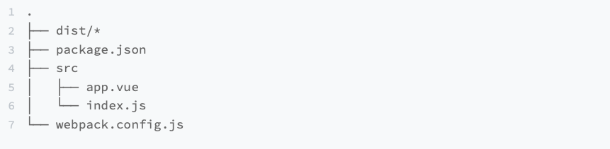
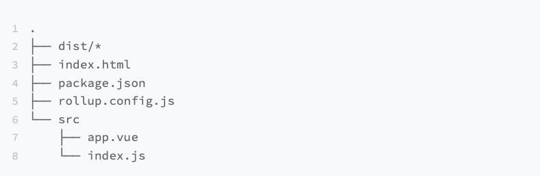
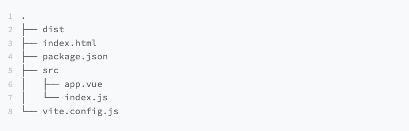
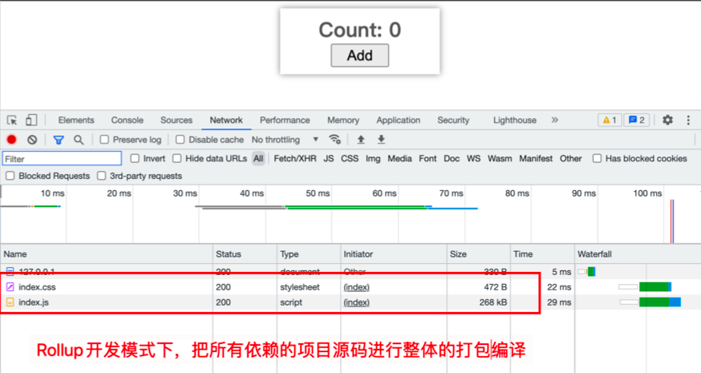
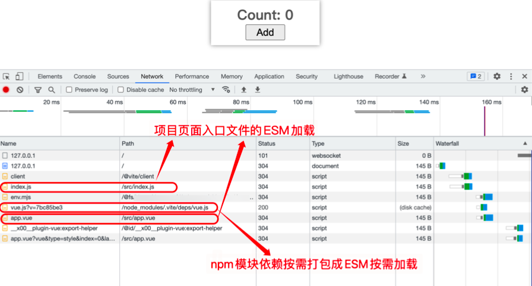

# 三种方法创建vue3项目

## webpack

用 Webpack 来搭建 Vue.js 3 项目，我们可以将最初始的项目搭建分成这几个步骤:

- 项目目录和源码准备
- 安装依赖
- 配置 Webpack 的 Vue.js 3 编译配置
- 执行 Vue.js 3 编译。

### 项目目录和源码准备

第一步就是要先准备好项目目录，如图所示:



从上到下介绍一下这个项目目录的结构:

- dist， 是一个文件夹，为 Vue.js 3 代码的编译结果目录，最后的编译结果都是前端静态资源文件，例如 JavaScript、CSS 和 HTML 等文件;

- package.json，是一个 JSON 文件，为 Node.js 项目的声明文件，声明了模块依赖、脚本定义和版本名称等内容

- src，是一个文件夹，为 Vue.js3 项目的源码目录，主要开发的代码内容都放在这个文件夹里

- webpack.config.js，是一个 JavaScript 文件，是本次 Vue.js 3 项目核心内容，主要是 Webpack 配置代码

我们就在 src 的文件夹里新增两个 Vue.js 3 的源码内容，为后续编译做准备。这里是 src/app.vue 的源码内容:

```vue
<template>
  <div class="demo">
    <div class="text">Count: {{ state.count }}</div>
    <button class="btn" @click="onClick">Add</button>
  </div>
</template>

<script setup>
import { reactive } from 'vue'
const state = reactive({
  count: 0
})
const onClick = () => {
  state.count++
}
</script>
<style>
.demo {
  width: 200px;
  padding: 10px;
  box-shadow: 0px 0px 9px #00000066;
  text-align: center;
}
.demo .text {
  font-size: 28px;
  font-weight: bolder;
  color: #666666;
}
.demo .btn {
  font-size: 20px;
  padding: 0 10px;
  height: 32px;
  min-width: 80px;
  cursor: pointer;
}
</style>
```

以下是 src/index.js 项目的入口文件源码:

```js
import { createApp } from 'vue';
import App from './app.vue';
const app = createApp(App);
app.mount('#app');
```

### 安装依赖

当你完成了步骤一的项目目录的结构设计和源码准备后，就可以进行第二步，安装依赖的 **npm** 模块了，也就是安装项目所需要的 **npm** 模块。

这里的 npm 模块分成两种，一种是源码所在的 npm 模块，另外一种是开发过程中所需要的 npm 模块。两种 npm 模块的安装方式都一样，区别就是安装命令要带上不同参数。

以下是安装源码依赖的 npm 模块:

```shell
npm i --save vue
```

这里源码代码依赖是 Vue.js 的官方源码库，这时候会自动增加依赖声明到 package.json 文件 的 dependencies 字段里。

```json
"dependencies": {
   "vue": "^3.2.47"
}
```

以下是安装项目开发过程中依赖的 npm 模块:

```shell
npm i --save-dev css-loader mini-css-extract-plugin vue-loader webpack webpack-cli
```

这里是 Webpack 编译 Vue.js 3 代码所需要的开发依赖，这时候也会自动新增依赖声明到 package.json 文件的 devDependencies 字段里，跟源码的依赖区分开来。

```json
"devDependencies": {
    "css-loader": "^6.7.3",
    "mini-css-extract-plugin": "^2.7.2",
    "vue-loader": "^17.0.1",
    "webpack": "^5.75.0",
    "webpack-cli": "^5.0.1"
 }
```

### 配置 Webpack 的 Vue.js 3 编译配置

当你完成了步骤二的项目依赖安装后，接下来就是这节课配置的关键内容，步骤三的 **Webpack** 配置。在此，我先将完整的 Webpack 配置内容贴出来，后面再跟你详细讲解每个 配置项的作用，你先看看完整的代码:

```js
const path = require('path')
const { VueLoaderPlugin } = require('vue-loader/dist/index')
const MiniCssExtractPlugin = require('mini-css-extract-plugin')
module.exports = {
  mode: 'production',
  entry: {
    index: path.join(__dirname, 'src/index.js')
  },
  output: {
    path: path.join(__dirname, 'dist'),
    filename: '[name].js'
  },
  module: {
    rules: [
      {
        test: /\.vue$/,
        use: ['vue-loader']
      },
      {
        test: /\.(css|less)$/,
        use: [MiniCssExtractPlugin.loader, 'css-loader']
      }
    ]
  },
  plugins: [
    new VueLoaderPlugin(),
    new MiniCssExtractPlugin({
      filename: '[name].css'
    })
  ],
  externals: {
    vue: 'window.Vue'
  }
}
```

我们从上到下一步步分析。

首先看 mode，这是声明了 Webpack 的打包模式是生产的编译模式。这里一般有两种选项， 生产(production)和开发(development)模式，这两种模式是企业或者开源项目约定俗成 的必备模式。

第二个 entry，是声明了 Webpack 要执行打包构建编译时候从哪个文件开始编译的“入口文 件”。而接下来的 output，是声明 Webpack 编译的出口文件，也就是编译结果要放在哪个目录 下的哪个文件里，这里我就对应地配置出口目录配置在 dist 文件夹里。

再接着是 module，这是 Webpack 打包构建的核心所在，你可以根据自己项目的打包需要， 选择对应的打包加载器(Loader)来处理指定的打包文件。这里我们选择了 vue-loader 和 css-loader 就是为了解决项目里 Vue.js3 源码和 Vue.js3 源码里的 CSS 代码的打包编译处 理。

然后是 plugins，这个是 Webpack 的插件配置，主要是贯穿 Webpack 的整个打包的生命周 期。这里就需要 Vue 的加载插件(VueLoaderPlugin)来辅助你在编译 Vue.js 3 代码时候做相 关的编译处理。同时，我们这里也用了 CSS 的分离插件(MiniCssExtractPlugin)，主要是在 Webpack 打包的生命周期过程中将 Vue.js 3 源码里的 CSS 代码分离出单独的 CSS 文件。

最后是 externals，这个是声明在 Webpack 打包编译过程中，有哪些源码依赖的 npm 模块需 要“排除打包”处理，也就是不做打包整合处理。我们这里就是将 Vue.js 3 的运行源码进行“排除 打包”处理，让代码最终代码依赖的 Vue.js 3 运行时，从 window.Vue 全局变量获取。这么做 的好处就是通过减少打包的内容来缩短打包时间。

### 执行 Vue.js 3 编译

完成以上的三个步骤，接下来就进入最终步骤了，也就是编译脚本配置。这里我们需要在 package.json 里配置好执行脚本，如下所示:

```json
{
  "scripts": {
  	"build": "webpack -c ./webpack.config.js"
  }
}
```

这个编译脚本可以让你在当前目录的命令行工具里，直接执行 npm run build 就可以触发编译操作。

执行完代码后，会在当前项目的 dist 目录文件夹里，生成最终的 Vue.js 3 编译结果代码 index.js 和 index.css 文件。


我们终于实现了最基础的 Webpack 编译 Vue.js 3 项目。不过，上述的内容 只是开始。不知道你有没有发现，上述配置过程只是处理了代码编译，但是实际做项目我们需 要一边写代码一边实时编译源码调试，还要实时显示效果，这不仅仅只做一次性的编译操作， 而是要分成多种编译模式。

通常我们做企业级前端项目时候，最基本的编译模式有开发模式和生产模式，接下来我们就来 讲解一下 Webpack 开发模式和生产模式的配置

### **Webpack** 开发模式和生产模式

在讲解如何配置 Webpack 开发模式和生产模式之前，我们要先了解一个概念，Node.js 进程的环境变量概念。

Node.js 在执行命令脚本时候，如果带上参数 NODE_ENV=production，完整的脚本命令是 NODE_ENV=production webpack -c ./webpack.config.js 。那么 webpack.config.js 文件在执 行的时候，可以在 process.env 拿到环境变量 NODE_ENV，也就是可以拿到 process.env.NODE_ENV = production。

这个环境变量有什么作用呢?它可以让我们设置不同环境变量来执行同一份配置 Webpack.config.js 配置文件，触发不同的编译模式。

到这里，你应该知道为什么我一开始要讲解 Node.js 进程的环境变量这个概念了吧?我们就是 要利用进程环境变量，在 webpack.config.js 配置文件里，根据不同环境变量值判断和处理不 同模式的编译。

现在我们就可以开始进入 Webpack 的开发模式和生产模式的讲解了。

### 开发模式处理

开发模式和生产模式是基于不同进程环境变量做区分的，所以他们的执行命令脚本就不一样。 这里我们就可以基于上述的 package.json 做一下执行脚本的更改，如下所示:

```json
{
   "scripts": {
    "dev": "NODE_ENV=development webpack serve -c ./webpack.config.js",
    "build": "NODE_ENV=production webpack -c ./webpack.config.js"
 }
}
```

你有没有发现，这里的开发模式(dev)，是不是多了个 serve 的子命令?这个就是我们要讲 的在开发模式下，需要一个开发服务来让编译的代码能在浏览器中访问。这个时候，我们就需要安装 Webpack 开发服务的依赖模块 webpack-dev-server 

```shell
npm i --save-dev webpack-dev-server
```

你安装后，要在 Webpack 配置文件添加对应的服务配置:

```js
{
  // 其它 Webpack配置代码
   devServer: {
      static: {
        directory: path.join(__dirname)
      },
      compress: true,
      port: 6001,
      hot: false,
      compress: false,
      open: true
    }
}
```

在开发模式下，我们还要断点到源码指定位置的内容，这里就需要新增一个配置内容，也就是 sourceMap 的配置，配置代码如下所示:

```js
{
  // 其它 Webpack配置代码
  devtool: 'inline-cheap-module-source-map'
}
```

这里的 devtool 还有其它的选项，详情你可以参考下官方

另外，开发过程中还需要 HTML 页面来承载运行编译后的 JavaScript 和 CSS 代码。这里你需 要在项目的根目录下新创建一个 HTML 文件 index.html，用于访问处理，同时还需要让 webpack-dev-server 知道它应该访问哪个 HTML 文件的配置处理。为此，你需要先配置好服 务的访问页面。

配置服务的访问页面，首先你要安装 html-webpack-plugin 插件来处理 HTML 页面:

```shell
npm i --save-dev html-webpack-plugin
```

再配置 html-webpack-plugin 到 webpack.confg.js 文件中:

```js
{
  // 其它 Webpack配置代码
  plugins: [
      new HtmlWebpackPlugin({
        title: 'Hello Vue',
        filename: 'index.html',
        template: './index.html',
        minify: false,
        inject: false,
        templateParameters: {
          publicPath: path.join(__dirname),
          js: ['./node_modules/vue/dist/vue.runtime.global.js', './index.js'],
          css: ['./index.css']
        }
      })
   ]
}
```

然后再配置 HTML 模板文件:

```html
<!DOCTYPE html>
<html lang="en">
  <head>
    <meta charset="UTF-8" />
    <meta http-equiv="X-UA-Compatible" content="IE=edge" />
    <link rel="stylesheet" href="<%= htmlWebpackPlugin.options.templateParameters.css[0] %>">
    <meta name="viewport" content="width=device-width, initial-scale=1.0" />
    <script src="<%= htmlWebpackPlugin.options.templateParameters.js[0] %>"></script>
  </head>
  <body>
    <div id="app"></div>
    <script src="<%= htmlWebpackPlugin.options.templateParameters.js[1] %>"></script>
  </body>
</html>

```

至此，你就可以愉快地使用开发模式进行 Vue.js 3 的项目开发了，执行以下命令:

```shell
npm run dev
```

再访问命令行所提示的访问链接，你就可以在浏览器预览到实际代码渲染结果了。

### 生产模式处理

好了，处理完开发模式后，我们接下来还要处理生产模式。

生产模式最重要的是代码编译完后要进行压缩处理，减少体积。这里我们就需要压缩 JavaScript 和 CSS 的结果代码，你可以选择安装 Webpack 生态里的压缩代码插件，具体有 压缩 JavaScript 代码的插件 TerserPlugin 和压缩 CSS 代码的插件 CssMinimizerPlugin，这几 个插件是 Webpack 官方文档的推荐插件，可以执行如下安装命令:

```shell
npm i --save-dev css-minimizer-webpack-plugin terser-webpack-plugin
```

然后再进行 webpack.config.js 文件的配置:

```js
{
  // // 其它 Webpack配置代码
  optimization: {
      minimizer: [
        new TerserPlugin({}),
        new CssMinimizerPlugin({})]
    }
}
```

好了，我这里就已经把 Webpack 编译 Vue.js3 项目的生产模式和开发模式都配置好了。不知 道你有没有发现，两种模式有很多配置是重叠的，这个时候就需要用到我们刚刚提到的 Node.js 进程环境变量来做区分判断处理，同时可以加上一个 webpack-merge 来辅助处理配 置的合并。

最终配置结果如下所示:

```js
const path = require('path')
const webpackMerge = require('webpack-merge').default
const { VueLoaderPlugin } = require('vue-loader')
const MiniCssExtractPlugin = require('mini-css-extract-plugin')
const CssMinimizerPlugin = require('css-minimizer-webpack-plugin')
const TerserPlugin = require('terser-webpack-plugin')
const HtmlWebpackPlugin = require('html-webpack-plugin')

const baseConfig = {
  mode: process.env.NODE_ENV,
  entry: {
    index: path.join(__dirname, 'src/index.js')
  },
  output: {
    path: path.join(__dirname, 'dist'),
    filename: '[name].js'
  },
  module: {
    rules: [
      {
        test: /\.vue$/,
        use: ['vue-loader']
      },
      {
        test: /\.(css|less)$/,
        use: [MiniCssExtractPlugin.loader, 'css-loader']
      },
      {
        test: /\.(png|svg|jpg|jpeg|gif)$/i,
        type: 'asset/resource'
      }
    ]
  },
  plugins: [
    new VueLoaderPlugin(),
    new MiniCssExtractPlugin({
      filename: '[name].css'
    })
  ],
  externals: {
    vue: 'window.Vue'
  }
}

if (process.env.NODE_ENV === 'development') {
  config = webpackMerge(baseConfig, {
    devtool: 'inline-cheap-module-source-map',
    devServer: {
      static: {
        directory: path.join(__dirname)
      },
      compress: true,
      port: 6001,
      hot: false,
      compress: false,
      open: true
    },
    plugins: [
      new HtmlWebpackPlugin({
        title: 'Hello Vue',
        filename: 'index.html',
        template: './index.html',
        minify: false,
        inject: false,
        templateParameters: {
          publicPath: path.join(__dirname),
          js: ['./node_modules/vue/dist/vue.runtime.global.js', './index.js'],
          css: ['./index.css']
        }
      })
    ]
  })
} else {
  config = webpackMerge(baseConfig, {
    optimization: {
      minimizer: [new TerserPlugin({}), new CssMinimizerPlugin({})]
    },
    plugins: [
      new HtmlWebpackPlugin({
        title: 'Hello Vue',
        filename: 'index.html',
        template: './index.html',
        minify: false,
        inject: false,
        templateParameters: {
          publicPath: path.join(__dirname),
          js: ['https://unpkg.com/vue@3.2.37/dist/vue.runtime.global.js', './index.js'],
          css: ['./index.css']
        }
      })
    ]
  })
}

module.exports = config
```

上述的配置内容就是本次 Vue.js 3 项目配置 Webpack 编译的核心代码，涵盖了开发模式和生 产模式。现在你应该已经比较清晰地了解到一个完整的 Vue.js 3 项目的 Webpack 配置流程 了，接下来就愉快地进行 Vue.js 3 代码的开发吧!

### 总结

用 Webpack 搭建 Vue.js 3 项目，主要包括配置项目目录、根据要求安装依赖(Plugin 和 Loader)、开发模式和生产模式的设置这几个步骤，其中你要特别注意开发模式和生产模式的 配置复用和配置隔离。

我们前面也说了，我们选择 Webpack，是为了面向企业级项目的学习目标考虑。目前我所接 触到的大厂，主流的构建配置还是 Webpack，除了生态丰富的原因外，还有一点是企业中很 多历史项目都是用 Webpack 进行构建的，形成了一个比较稳定的代码传承。但是，你也不能 因为这样就忽略了 Vite 这个 Vue.js 3 官方的“亲儿子”技术工具。

你需要的是举一反三，用 Webpack 生产和开发模式配置，类比学习 Vite 相关的技术知识点， 因为同类型的技术基本都是相同的。例如，本节课提到生产和开发模式，就不是 Webpack 独 有的概念，是大部分构建工具都有的概念，Vite 也有相关概念。不仅仅是这节课，我希望你后 续技术学习都要学会举一反三，互相比对。

## rollup

用 Rollup 来搭建 Vue.js 3 项目，也可以分成以下几个步骤:

- 项目目录和源码准备
- 安装依赖
-  Vue.js 3 的 Rollup 编译脚本配置
- 执行开发模式和生产模式的 Vue.js 3 编译

### 项目目录和源码准备

第一步就是要先准备好项目目录，如图所示:



从上到下介绍一下这个项目目录的结构:

- dist， 是一个文件夹，为 Vue.js 3 代码的编译结果目录，最后的编译结果都是前端静态资源文件，例如 JavaScript、CSS 和 HTML 等文件 index.html，是项目的 HTML 页面文件

- package.json，是一个 JSON 文件，为 Node.js 项目的声明文件，声明了模块依赖、脚本 定义和版本名称等内容

- rollup.config.js，是一个 JavaScript 文件，是本次 Vue.js 3 项目核心内容，主要是 Webpack 配置代码

- src，是一个文件夹，为 Vue.js 3 项目的源码目录，主要开发的代码内容都放在这个文件夹里

接着我们开始准备代码文件的内容。这里要先把项目 HTML 页面源码准备到 index.html 文件 里，HTML 源码内容如下所示:

```html
<html>
  <head>
    <link rel="stylesheet" href="./index.css" />
  </head>
  <body>
    <div id="app"></div>
  </body>
  <script src="./index.js"></script>
</html>
```

然后在 src 的文件夹里新增两个 Vue.js 3 的源码内容，为后续编译做准备。这里是 src/app.vue 的源码内容:

```vue
<template>
  <div class="app">
    <div class="text">Count: {{ state.count }}</div>
    <button class="btn" @click="onClick">Add</button>
  </div>
</template>

<script setup>
import { reactive } from 'vue'
const state = reactive({
  count: 0
})
const onClick = () => {
  state.count++
}
</script>
<style>
.app {
  width: 200px;
  padding: 10px;
  box-shadow: 0px 0px 9px #00000066;
  text-align: center;
}
.app .text {
  font-size: 28px;
  font-weight: bolder;
  color: #666666;
}
.app .btn {
  font-size: 20px;
  padding: 0 10px;
  height: 32px;
  min-width: 80px;
  cursor: pointer;
}
</style>
```

以下是 src/index.js 项目的入口文件源码:

```js
import { createApp } from 'vue'
import App from './app.vue'
document.addEventListener('DOMContentLoaded', () => {
  const app = createApp(App)
  app.mount('#app')
})

```

### 安装依赖

当你完成了步骤一的项目目录的结构设计和源码准备后，就可以进行第二步安装 **Rollup** 项目 依赖的 **npm** 模块了，也就是安装项目所需要的 **npm** 模块。

以下是安装源码依赖的 npm 模块:

```shell
npm i --save vue
```

接下来安装 Rollup 项目开发过程中依赖的 npm 模块:

```shell
npm i --save-dev @babel/core @babel/preset-env @rollup/plugin-babel @rollup/plugin-commonjs @rollup/plugin-html @rollup/plugin-node-resolve @rollup/plugin-replace rollup-plugin-postcss rollup-plugin-serve rollup-plugin-vue
```

这里安装的开发依赖非常多，我需要给你逐个分析一下各个依赖的作用:

- @babel/core，Babel 官方模块，用来编译 JavaScript 代码
- @babel/preset-env，Babel 官方预设模块，用来辅助 @babel/core 编译最新的 ES 特性

- @rollup/plugin-babel，Rollup 的 Babel 插件，必须配合 @bable/core 和 @babel/preset- env 一起使用

- @rollup/plugin-commonjs，是 Rollup 官方插件，用来处理打包编译过程中 CommonJS 模 块类型的源码

- @rollup/plugin-html，是 Rollup 官方插件，用来管理项目的 HTML 页面文件
- @rollup/plugin-node-resolve，是 Rollup 官方插件，用来打包处理项目源码在node_modules 里的使用第三方 npm 模块源码
- @rollup/plugin-replace，是 Rollup 官方插件，用来替换源码内容，例如 JavaScript 源码的全局变量 process.env.NODE_ENV

- rollup，Rollup 的核心模块，用来执行 Rollup 项目的编译操作
- rollup-plugin-postcss，第三方模块，用于将 Vue.js 项目源码的 CSS 内容分离出独立 CSS 文件
- rollup-plugin-serve，第三方模块，用于 Rollup 项目开发模式的 HTTP 服务
- rollup-plugin-vue，Vue.js 官方提供的 Rollup 插件模块。

依赖安装完后，可以在 package.json 看到安装结果，如下所示:

```json
{
   "dependencies": {
    "vue": "^3.2.47"
   },
  "devDependencies": {
    "@babel/core": "^7.20.12",
    "@babel/preset-env": "^7.20.2",
    "@rollup/plugin-babel": "^6.0.3",
    "@rollup/plugin-commonjs": "^24.0.1",
    "@rollup/plugin-html": "^1.0.2",
    "@rollup/plugin-node-resolve": "^15.0.1",
    "@rollup/plugin-replace": "^5.0.2",
    "rollup": "^3.14.0",
    "rollup-plugin-postcss": "^4.0.2",
    "rollup-plugin-serve": "^2.0.2",
    "rollup-plugin-vue": "^6.0.0"
  }
}
```

### Vue.js 3 的 Rollup 编译脚本配置

好了，到这里我就讲完了所有关于 Rollup 的 Vue.js 3 项目编译依赖安装，到此你算是完成了 步骤二的项目依赖安装后，接下来就是这节课配置的关键内容，步骤三的 **Rollup** 配置。

在此，我先将完整的 Rollup 配置内容贴出来，后面再跟你详细讲解每个配置项的作用，先看看完整的代码:

```js
const path = require('path')
const fs = require('fs')
const { babel } = require('@rollup/plugin-babel')
const vue = require('rollup-plugin-vue')
const { nodeResolve } = require('@rollup/plugin-node-resolve')
const commonjs = require('@rollup/plugin-commonjs')
const postcss = require('rollup-plugin-postcss')
const replace = require('@rollup/plugin-replace')
const html = require('@rollup/plugin-html')
const serve = require('rollup-plugin-serve')
const babelOptions = { presets: ['@babel/preset-env'], babelHelpers: 'bundled' }
module.exports = {
  input: path.join(__dirname, 'src/index.js'), // 入口文件
  output: {
    file: path.join(__dirname, 'dist/index.js') // 出口文件
  },
  plugins: [ //  Rollup 的插件配置
    vue(),
    postcss({ extract: true, plugins: [] }),
    nodeResolve(),
    commonjs(),
    babel(babelOptions),
    replace({
      'process.env.NODE_ENV': JSON.stringify(process.env.NODE_ENV),
      preventAssignment: true
    }),
    html({
      fileName: 'index.html',
      template: () => {
        const htmlFilePath = path.join(__dirname, 'index.html')
        const html = fs.readFileSync(htmlFilePath, { encoding: 'utf8' })
        return html
      }
    }),
    process.env.NODE_ENV === 'development' ? serve({ port: 6001, contentBase: 'dist' }) : null
  ]
}
```

我们对 Rollup 的配置从上到下一步步分析:

- input，是声明了 Rollup 要执行打包构建编译时候从哪个文件开始编译的“入口文件”
- output，是声明 Rollup 编译的出口文件，也就是编译结果要放在哪个目录下的哪个文件 里，这里我就对应地把出口目录配置在 dist 文件夹里
- plugins，这个是 Rollup 的插件配置，主要是贯穿 Rollup 的整个打包的生命周期。 看到这里，你是不是觉得 Rollup 的配置比 Webpack 简单很多?

没错，这是因为 Rollup 的技术生态就只有 Plugin 的概念，不像 Webpack 有 Loader 和 Plugin 两种技术生态和其它额外的官方配置。

### 执行开发模式和生产模式的 Vue.js 3 编译

完成以上的三个步骤，接下来就进入最终步骤了，也就是编译脚本配置。这里我们需要在 package.json 里配置好执行编译的脚本，如下所示:

```json
{
   "scripts": {
    "dev": "NODE_ENV=development rollup -w -c ./rollup.config.js", 
    "build": "NODE_ENV=production rollup -c ./rollup.config.js"
  }
}
```

这个脚本可以让你在当前目录的命令行工具里，直接执行 npm run dev 就可以触发开发模式编 译操作，直接执行 npm run build 就可以生产模式编译操作。

通过上述整套 Rollup 搭建 Vue.js 3 的项目编译的讲解，你是不是觉得即使 Rollup 比 Webpack 配置更简单，但仍然很繁琐呢?

而且，在上述 Rollup 的配置我还没加上生产模式的代码压缩配置，如果把生产模式判断逻辑 加上去的话， rollup.config.js 代码配置会更加复杂。所以这个时候 Vite 的开箱即用尤其重 要，可以帮我们减少很多项目开发过程中的配置工作。接下来我就来讲解一下 Vite 的 Vue.js 3 项目配置，顺便再对比一下 Vite 项目和 Rollup 项目的配置。

## vite

用 vite 来搭建 Vue.js 3 项目，也是分成以下几个步骤:

- 项目目录和源码准备
- 安装依赖
-  Vue.js 3 的 Rollup 编译脚本配置
- 执行开发模式和生产模式的 Vue.js 3 编译

### 项目目录和源码准备

第一步，项目目录和源码准备，如图所示:



这里与 Rollup 项目最大区别就是配置文件不同，为 vite.config.js。

### 安装依赖

第二步，安装依赖。

我们先来安装项目源码模块依赖:

```shell
npm i --save vue
```

然后再安装项目开发模块依赖:

```shell
npm i --save-dev vite @vitejs/plugin-vue
```

到了这一步，你会不会发现，项目开发的模块依赖比 Rollup 少了很多?只有简单的两 个依赖。

### Vue.js 3 的 vite 编译脚本配置

第三步，配置 Vite 的 Vue.js 3 编译配置，也就是在 vite.config.js 配置 Vite 的编译配置。

```js
import { defineConfig } from 'vite'
import vue from '@vitejs/plugin-vue'
export default defineConfig({
  plugins: [vue()]
})
```

### 执行开发模式和生产模式的 Vue.js 3 编译

第四步，执行开发模式和生产模式的 Vue.js 3 编译，在 package.json 配置开发模式和生产模 式的脚本命令。

```json
{
  "scripts": {
    "dev": "vite",
    "build": "vite build"
  }
}
```

好了，现在我们就可以愉快执行两种模式的命令进行打包编译了，你是不是觉得配置的内容比 Rollup 和 Webpack 少了很多?不需要考虑太多插件选择，做简单准备后就可以直接进入开发 和生产模式，已经算是达到了“开箱即用”的状态了。

那么，是不是 Rollup 和 VIte 之间的差别仅仅只有配置的难易呢?

答案是否定的。除了配置的难易差别外，两者之间还有不同开发编译模式的差异，但是这些差 异都是对使用者无感知的，因为 Vite 底层已经做了很多优化工作，让开发者只关注简单的配 置就能开箱即用。


我们刚刚提到过，Vite 只是在生产模式下的打包编译用了 Rollup，开发模式下的打包编译用的 是 esbuild。所以虽然 Vite 和纯 Rollup 在生产模式下构建的结果相差不大，只是在项目配置上

简约了很多，但是我们还是得花点时间对比下两者的开发模式，让你有个更清晰的判断。

- 启动 Rollup 开发模式命令，Rollup 识别配置里的编译入口(input)，从入口文件解析出所 有依赖代码，进行编译

- 编译完后启动 HTTP 开发服务，同时也继续监听源码变化

- 开发者用浏览器访问页面

- 再次修改代码，Rollup 监听到源码变化，再整体重新编译代码


我们直接来看看那 Rollup 在开发模式下，打包编译后在浏览器里的执行效果图片:



你可以看到，Rollup 是直接把所有代码打包成 Bundle 文件格式，也就是最后只生成一个 JavaScript 文件和 CSS 文件。这种打包成一个文件的过程是最费时间的，所以 Vite 在开发模 式下的理念就不用这套方式，只保留在 Vite 的生产模式中使用。

而 Vite 的开发模式执行过程又是另一番场景，具体执行过程如下:

- Vite 开发模式命令，VIte 启动 HTTP 服务和监听源码的变化
-  开发者用浏览器访问页面
-  Vite 根据访问页面引用的 ESM 类型的 JavaScript 文件进行查找依赖，并将依赖通过 esbuild 编译成 ESM 模块的代码，保存在 node_modules/.vite/ 目录下
- 浏览器的 ESM 加载特性会根据页面依赖到 ESM 模块自动进行按需加载
  - 再次修改代码，再次访问页面，会自动执行 ESM 按需加载，同时触发依赖到的变更文件重新单独编译
  - 修改代码只会触发刷新页面，不会直接触发代码编译，而且源码编译是浏览器通过 ESM 模块加载访问到对应文件才进行编译的
  - 开发模式下因为项目源码是通过 esbuild 编译，所以速度比 Rollup 快，同时由于是按页 面里请求依赖进行按需编译，所以整体打包编译速度理论上是比 Rollup 快一些

你也可以看下 Vite 在开发模式下浏览器访问的效果图片:



你可以看到，所有加载的 JavaScript 文件都是 ESM 模块文件。这些项目源码文件和 npm 依 赖模块都是经过 esbuild 快速单独编译封装的 ESM 模块文件，不需要像 Rollup 那样经过重新

分析语法和文件打包编译一个 Bundle 文件，省去了很多编译时间，这就是 Vite 为什么在开发 模式下能快速编译的原因。

经过上述的对比，我们可以知道两者开发模式的体验差异还是很大的。Vite 的按需加载打包速 度，理论上是比 Rollup 的打包编译 Bundle 文件要快一些。哈哈，请注意，我这里用的词是 “理论上”。因为考虑到开发过程中可能出现一些意想不到的场景，所以这个打包速度的快我觉 得“理论上”是绝对的，到实际开发就需要具体场景具体分析了。


除此之外，Vite 在开发模式下，依赖浏览器的 ESM 特性对页面的 JavaScript 文件进行按需加 载。这里就会有一个问题，就是当项目页面依赖了很多 JavaScript 文件和 npm 模块，加载页 面时候就要按需加载依赖的 ESM 文件，需要很长的浏览器请求时间，也会带来开发上的不好 体验。在这种场景下，即使 esbuild 提升的打包速度节省的时间，也招架不住浏览器大量 ESM 模块请求消费的大量时间，降低了整体的开发模式体验。

我讲了这么多，现在总结一下 Rollup 和 VIte 的差异，最大的差异是配置复杂度，其次是两种 模式的差异。在生产模式下，目前是没太大的区别，因为最终还是一样通过 Rollup 打包和编 译代码。在开发模式下，差异就比较大，Vite 通过 esbuild 和浏览器 ESM 对项目页面的 JavaScript 进行按需加载，Rollup 是直接把所有依赖代码打包编译。


好了，通过这些差异，我们明显能看出 Vite 的理念和方式比较新颖，也对优化开发体验做了 很多工作。那么最重要的问题来了，年轻的 Vite 能用于企业级项目吗?

### 年轻的 **Vite** 能用于企业级项目吗?

这个答案是可以的。我们前面说过企业项目最重要的是稳定，Vite 目前在生产模式下是通过 Rollup 进行打包编译项目源码的，基于 Rollup 丰富的技术生态，也能解决大部分企业级项目 遇到的问题。

但是!哈哈，我要提到“但是”了，你应该也发现 Vite 的开发模式和生产模式打包编译源码的机 制不一样，分别是 esbuild 和 Rollup，那么就会造成开发和产线两种不同编译代码结果，这种 不同可能会面临一个问题。

这个问题就是，开发过程编译的代码结果正常，但是到了产线的结果代码出错，导致开发阶段 很难及时发现问题。当然啦，这只是一种可能性，不是绝对的，毕竟 Webpack 和 Rollup 在开 发和生产模式的编译结果代码也存在一些差异，只不过差异没 Vite 这么大。

上述的风险也不是大问题，用 Vite 开发企业级项目在生产模式编译代码后，多验证和测试功 能就行，你不要太纠结两种模式的代码差异带来的风险。技术不可能一成不变的，技术是需要 试错和演进升级的。在这个技术演进过程中多花点时间去做测试和功能验证，也能够降低项目风险。

## 所有代码

[github仓库](https://github.com/iygxv/daily-study/tree/main/202302/code)

