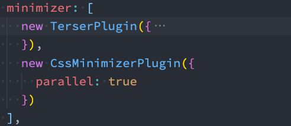

# 1.Terser

- **什么是Terser呢？**
  - Terser是一个**JavaScript的解释（Parser）、Mangler（绞肉机）/Compressor（压缩机）的工具集**
  - 早期我们会使用 uglify-js来压缩、丑化我们的JavaScript代码，但是目前已经不再维护，并且不支持ES6+的
    语法
  - Terser是从 uglify-es fork 过来的，并且保留它原来的大部分API以及适配 uglify-es和uglify-js@3等

- **Terser可以帮助我们压缩、丑化我们的代码，让我们的bundle变得更小**

- **安装**

  ```shell
  yarn add terser
  ```

- **Terser在webpack中配置**

  - 真实开发中，我们不需要手动的通过terser来处理我们的代码，我们可以直接通过webpack来处理
    - 在webpack中有一个minimizer属性，在**production模式**下，**默认就是使用TerserPlugin来处理我们的代码的**
    -  如果我们对默认的配置不满意，也可以自己来创建TerserPlugin的实例，并且覆盖相关的配置
  - 首先，我们需要打开minimize，让其对我们的代码进行压缩（**默认production模式下已经打开了**）
  -  其次，我们可以在minimizer创建一个**TerserPlugin**
    -  **extractComments**：默认值为true，表示会将注释抽取到一个单独的文件中
      - 在开发中，我们不希望保留这个注释时，可以设置为false
    -  **parallel**：使用多进程并发运行提高构建的速度，默认值是true，并发运行的默认数量： os.cpus().length - 1
      - 我们也可以设置自己的个数，但是使用默认值即可
    -  **terserOptions**：设置我们的terser相关的配置
      - **compress**：设置压缩相关的选项；
      - **mangle**：设置丑化相关的选项，可以直接设置为true；
      -  **toplevel**：底层变量是否进行转换；
      - **keep_classnames**：保留类的名称；
      -  **keep_fnames**：保留函数的名称

```js
module.exports = {
  optimization: {
    minimizer: [
      // 由Terser将未使用的函数, 从我们的代码中删除
      new TerserPlugin({
        parallel: true,
        extractComments: false,
        terserOptions: {
          compress: {
            arguments: false,
            dead_code: true
          },
          mangle: true,
          toplevel: true,
          keep_classnames: true,
          keep_fnames: true
        }
      })
    ]
  },
}	


```


# 2.CSS的压缩

- **CSS压缩通常是去除无用的空格等，因为很难去修改选择器、属性的名称、值等**
- **CSS的压缩我们可以使用另外一个插件：css-minimizer-webpack-plugin；**
- **css-minimizer-webpack-plugin是使用cssnano工具来优化、压缩CSS（也可以单独使用）**
  - 第一步，安装 css-minimizer-webpack-plugin
  - 第二步，在optimization.minimizer中配置



# 3.Tree Shaking

- **什么是Tree Shaking呢？**
  - Tree Shaking是一个术语，在计算机中表示**消除死代码（dead_code）**
  - 最早的想法起源于LISP，用于消除未调用的代码（纯函数无副作用，可以放心的消除，这也是为什么要求我们在进
    行函数式编程时，尽量使用纯函数的原因之一）
  - 后来Tree Shaking也被应用于其他的语言，比如JavaScript、Dart
- **webpack实现Tree Shaking**
  - **usedExports**：通过标记某些函数是否被使用，之后通过Terser来进行优化的
  - **sideEffects**：跳过整个模块/文件，直接查看该文件是否有副作用

- **usedExports**

  ```js
  module.exports = {
    optimization: {
      // usedExports: 目的是标注出来哪些函数是没有被使用 unused
      usedExports: true, // production
      minimize: true,
      minimizer: [
        // 由Terser将未使用的函数, 从我们的代码中删除
        new TerserPlugin({
          parallel: true,
          extractComments: false,
          terserOptions: {
            compress: {
              arguments: false,
              dead_code: true
            },
            mangle: true,
            toplevel: true,
            keep_classnames: true,
            keep_fnames: true
          }
        })
      ]
  },
  }
  ```

  

- **sideEffects**

  - sideEffects用于**告知webpack compiler哪些模块时有副作用**的
    - 副作用的意思是这里面的代码有执行一些特殊的任务，不能仅仅通过export来判断这段代码的意义
  - 在package.json中设置sideEffects的值
    - 如果我们将**sideEffects设置为false**，就是**告知webpack可以安全的删除未用到的exports**
    - 如果有一些我们希望保留，可以设置为数组


# 4.Scope Hoisting

- **什么是Scope Hoisting呢？**
  - Scope Hoisting从webpack3开始增加的一个新功能
  - 功能是对作用域进行提升，并且让**webpack打包后的代码更小、运行更快**
- **默认情况下webpack打包会有很多的函数作用域，包括一些（比如最外层的）IIFE**
  - 无论是从最开始的代码运行，还是加载一个模块，都需要执行一系列的函数
  - Scope Hoisting可以将函数合并到一个模块中来运行
- **使用Scope Hoisting非常的简单，webpack已经内置了对应的模块**
  - 在production模式下，默认这个模块就会启用
  - 在development模式下，我们需要自己来打开该模块

```js
module.exports = {
  plugins: [ // 一般用在生产环境
    new webpack.optimize.ModuleConcatenationPlugin()
  ]
}
```

