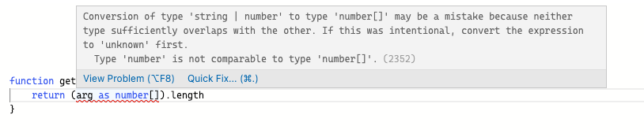

# 类型基础

## **如何学习**

不用去考虑配环境的问题，直接去这个在线地址 [TS Playground](https://link.juejin.cn/?target=https%3A%2F%2Fwww.typescriptlang.org%2Fplay) ，把例子都写一遍，多写写。

## **基本类型**

### **boolean 类型**

```ts
let isTrue: boolean = true
```

### **number类型**

```ts
let age: number = 18
```

### **string类型**

```ts
let str: string = 'vvv'
```

### **undefined和null 类型**

```ts
let u: undefined = undefined
let n: null = null
```

默认情况下 null 和 undefined 是所有类型的子类型。 就是说你可以把 null 和 undefined 赋值给 number 类型的变量

但是如果指定了` --strictNullChecks` 标记，null 和 undefined 只能赋值给 void 和它们各自，不然会报错

例如:

```ts
// 未指定strictNullChecks标记则不报错, 若指定了则报错
let str: string = undefined 
```

### **any、unknown 和 void 类型**

**any类型**

不清楚用什么类型，可以使用 any 类型。这些值可能来自于动态的内容，比如来自用户输入或第三方代码库

```ts
let notSure: any = 4
notSure = '123'
notSure = false

notSure.name                   // 可以随便调用属性和方法
notSure.getName()
```

**unknown类型**

不建议使用 any，当我不知道一个类型具体是什么时，该怎么办？

可以使用 `unknown` 类型

`unknown` 类型代表任何类型，它的定义和 `any` 定义很像，但是它是一个安全类型，使用 `unknown` 做任何事情都是不合法的。

比如，这样一个 divide 函数，

```ts
function divide(param: any) {
  return param / 2;
}
```

把 param 定义为 any 类型，TS 就能编译通过，没有把潜在的风险暴露出来，万一传的不是 number 类型，不就没有达到预期了吗。

把 param 定义为 unknown 类型 ，TS 编译器就能拦住潜在风险，如下图，

```ts
function divide(param: unknown) {
  return param / 2;
}
```


因为不知道 param 的类型，使用运算符 `/`，导致报错。

再配合类型断言，即可解决这个问题，

```ts
function divide(param: unknown) {
  return param as number / 2;
}
```

:::tip

注意: 类型断言必须有这个类型, 因为number是unknown的子类型,所以不会报错

:::

**void**

`void`类型与 `any` 类型相反，它表示没有任何类型。

比如函数没有明确返回值，默认返回 Void 类型

```ts
function test(): void {
    console.log('test')
}
```

### **never 类型**

`never`类型表示的是那些永不存在的值的类型。

有些情况下值会永不存在，比如，

- 如果一个函数执行时抛出了`异常`，那么这个函数永远不存在返回值，因为抛出异常会直接中断程序运行。
- 函数中执行`无限循环的代码`，使得程序永远无法运行到函数返回值那一步。

```ts
// 异常
function fn(msg: string): never { 
  throw new Error(msg)
}

// 死循环
function fn2(): never { 
  while (true) {}
}
```

never 类型是任何类型的子类型，也可以赋值给任何类型。

没有类型是 never 的子类型，没有类型可以赋值给 never 类型（除了 never 本身之外）。 即使 `any`也不可以赋值给 never 。

```ts
let test1: never;
test1 = 'vvv' // 报错，Type 'string' is not assignable to type 'never'
```

```ts
// any不能赋值给never
let test1: never;
let test2: any;

test1 = test2 // 报错，Type 'any' is not assignable to type 'never'
```

### **数组类型**

```ts
let list: number[] = [1, 2, 3];
// ES5：var list = [1,2,3];

let list: Array<number> = [1, 2, 3]; // Array<number>泛型语法
// ES5：var list = [1,2,3];
```

如果数组想每一项放入不同数据怎么办？用元组类型

### **元组类型**

元组类型允许表示一个已知元素数量和类型的数组，各元素的类型不必相同。

```ts
let tuple: [number, string] = [1, '2']
```

## **枚举**

### **数字枚举**

```ts
enum Color{
    BLUE,
    RED,
    PINK
}
```

这样就定义了一个**数字枚举**，他有两个特点：

- 数字递增
- 反向映射

枚举成员会被赋值为从 `0` 开始递增的数字

```ts
let color1:Color = Color.BLUE // '0'
let color2:Color = Color.RED // '1'
let color3:Color = Color.PINK // '2'
```

枚举会对枚举值到枚举名进行反向映射

```ts
let color1:Color = Color[0] // BLUE
let color2:Color = Color[1] // RED
let color3:Color = Color[2] // PINK
```

如果枚举第一个元素赋有初始值，就会从初始值开始递增，

```ts
enum Color{
    BLUE = 2,
    RED,
    PINK
}


let color1:Color = Color.BLUE // '2'
let color2:Color = Color.RED // '3'
let color3:Color = Color.PINK // '4'
```

### **反向映射的原理**

经过编译后的代码

```js
"use strict";
var Color;
(function (Color) {
    Color[Color["BLUE"] = 0] = "BLUE";
    Color[Color["RED"] = 1] = "RED";
    Color[Color["PINK"] = 2] = "PINK";
})(Color || (Color = {}));
let color = Color.BLUE; // '0'
let color2 = Color.RED; // '1'
let colo3r = Color.PINK; // '2'
```

主体代码是被包裹在一个自执行函数里，封装了自己独特的作用域。

```js
Color["BLUE"] = 0
```

会将 Color这个对象的 BLUE 属性赋值为 0，JS 的赋值运算符返回的值是被赋予的值。

```js
// 执行 Color[Color["BLUE"] = 6] = "BLUE";

// 相当于执行
Color["BLUE"] = 6
Color[6] = "BLUE"
```

这样就实现了枚举的反向映射。

### **计算成员**

枚举中的成员可以被计算，比如经典的使用位运算合并权限，可以这么写，

```ts
enum FileAccess {
    Read    = 1 << 1,
    Write   = 1 << 2,
    ReadWrite  = Read | Write,
}

console.log(FileAccess.Read)       // 2   -> 010
console.log(FileAccess.Write)      // 4   -> 100
console.log(FileAccess.ReadWrite)  // 6   -> 110
```

看个实例吧，Vue3 源码中的 patchFlags，用于标识节点更新的属性。

```ts
// packages/shared/src/patchFlags.ts
export const enum PatchFlags {
  TEXT = 1,                    // 动态文本节点
  CLASS = 1 << 1,              // 动态 class
  STYLE = 1 << 2,              // 动态 style
  PROPS = 1 << 3,              // 动态属性
  FULL_PROPS = 1 << 4,         // 具有动态 key 属性，当 key 改变时，需要进行完整的 diff 比较
  HYDRATE_EVENTS = 1 << 5,     // 具有监听事件的节点
  STABLE_FRAGMENT = 1 << 6,    // 子节点顺序不会被改变的 fragment
  KEYED_FRAGMENT = 1 << 7,     // 带有 key 属或部分子节点有 key 的 fragment
  UNKEYED_FRAGMENT = 1 << 8,   // 子节点没有 key 的 fragment
  NEED_PATCH = 1 << 9,         // 非 props 的比较，比如 ref 或指令
  DYNAMIC_SLOTS = 1 << 10,     // 动态插槽
  DEV_ROOT_FRAGMENT = 1 << 11, // 仅供开发时使用，表示将注释放在模板根级别的片段
  HOISTED = -1,                // 静态节点
  BAIL = -2                    // diff 算法要退出优化模式
}
```

### **字符串枚举**

在一个字符串枚举里，`每个成员都必须用字符串字面量`，或另外一个字符串枚举成员进行初始化。

字符串枚举的意义在于，提供有具体语义的字符串，可以更容易地理解代码和调试。

```ts
enum Color{
    BLUE = 'blue',
    RED = 'red',
    PINK = 'pink'
}
let color:Color = Color.BLUE // 'blue'
let color2:Color = Color.RED // 'red'
let colo3r:Color = Color.PINK // 'red'
```

### **常量枚举**

使用 const 来定义一个常量枚举

```ts
const enum Color{
    BLUE ,
    RED,
    PINK
}
let color:Color = Color.BLUE // 0
let color2:Color = Color.RED // 1
let colo3r:Color = Color.PINK // 2
```

编译出来的代码会简单很多

```js
"use strict";
let color = 0 /* Color.BLUE */;
let color2 = 1 /* Color.RED */;
let colo3r = 2 /* Color.PINK */;

```

### **小结**

- 枚举的意义在于，可以定义一些带名字的常量集合，清晰地表达意图和语义，更容易地理解代码和调试。
- 常用于和后端联调时，区分后端返回的一些代表状态语义的数字或字符串，降低阅读代码时的心智负担。


## **函数类型**

TS 定义函数类型需要定义输入参数类型和输出类型。

输出类型也可以忽略，因为 TS 能够根据返回语句自动推断出返回值类型。

```ts
function add(x:number, y:number):number {
    return x + y
}
add(1,2)
```

函数没有明确返回值，默认返回 void 类型

```ts
function test(): void {
    console.log('test');
}
```

### **函数表达式写法**

```ts
let add2 = (x: number, y: number): number => {
    return x + y
}
```

### **可选参数**

参数后加个问号，代表这个参数是可选的

```ts
function add(x:number, y:number, z?:number):number {
    return x + y
}

add(1,2,3)
add(1,2)
```

注意: `可选参数要放在函数入参的最后面`，不然会导致编译错误。


### **默认参数**

```ts
function add(x:number, y:number = 100):number {
    return x + y
}

add(100)  // 200
```

跟 JS 的写法一样，在入参里定义初始值。

和可选参数不同的是，默认参数可以不放在函数入参的最后面，

```ts
function add(x:number = 100, y:number):number {
    return x + y
}

add(100) 
```

如果带默认值的参数不是最后一个参数，用户必须明确的传入 `undefined`值来获得默认值(`跟 JS 的写法一样`)。

```ts
add(undefined,100) // 200
```

### **函数重载**

函数重载是指两个函数名称相同，但是参数个数或参数类型不同，他的好处显而易见，不需要把相似功能的函数拆分成多个函数名称不同的函数。

**不同参数类型**

比如我们实现一个 add 函数，如果传入参数都是数字，就返回数字相加，如果传入参数都是字符串，就返回字符串拼接，

```ts
function add(x: number[]): number
function add(x: string[]): string
function add(x: any[]): any {
  if (typeof x[0] === 'string') {
    return x.join()
  }
  if (typeof x[0] === 'number') {
      return x.reduce((acc, cur) => acc + cur)
  }
}
```

在 TS 中，实现函数重载，需要多次声明这个函数，前几次是函数定义，列出所有的情况，最后一次是函数实现，需要比较宽泛的类型，比如上面的例子就用到了 any。

**不同参数个数**

假设这个 add 函数接受更多的参数个数，比如还可以传入一个参数 y，如果传了y，就把 y 也加上或拼接上，就可以这么写，

```ts
function add(x: number[]): number
function add(x: string[]): string
function add(x: number[], y: number[]): number
function add(x: string[], y: string[]): string
function add(x: any[], y?: any[]): any {
  if (Array.isArray(y) && typeof y[0] === 'number') {
      return x.reduce((acc, cur) => acc + cur) + y.reduce((acc, cur) => acc + cur)
  }
  if (Array.isArray(y) && typeof y[0] === 'string') {
      return x.join() + ',' + y.join()
  }
  if (typeof x[0] === 'string') {
    return x.join()
  }
  if (typeof x[0] === 'number') {
      return x.reduce((acc, cur) => acc + cur)
  }
}


console.log(add([1,2,3]))      // 6
console.log(add(['vvv', '18']))  // 'vvv,18'
console.log(add([1,2,3], [1,2,3])) // 12
console.log(add(['vvv', '18'], ['man', 'handsome'])) // 'vvv,18,man,handsome'
```

其实写起来挺麻烦的，后面了解泛型之后写起来会简洁一些，不必太纠结函数重载，知道有这个概念即可，平时一般用泛型来解决类似问题。

## **interface接口**

### **基本概念**

`interface`(接口) 是 TS 设计出来用于定义对象类型的，可以对对象的形状进行描述。

定义 interface 一般首字母大写，代码如下：

```ts
interface Person {
    name: string
    age: number
}

const p1: Person = {
    name: 'vvv',
    age: 18
}
```

属性必须和类型定义的时候完全一致。

少写了属性，报错：


多写了属性，报错：


:::warning 注意

interface 不是 JS 中的关键字，所以 TS 编译成 JS 之后，这些 interface 是不会被转换过去的，都会被删除掉，interface 只是在 TS 中用来做静态检查。

:::

### **可选属性**

跟函数的可选参数是类似的，在属性上加个 `?`，这个属性就是可选的，比如下面的 age 属性

```ts
interface IPerson {
    name: string
    age?: number
}

let p:IPerson = {
    name: 'vvv',
}
```

### **只读属性**

如果希望某个属性不被改变，可以这么写：

```ts
interface Person {
    readonly id: number
    name: string
    age: number
}
```

改变这个只读属性时会报错。


### **interface 描述函数类型**

interface 也可以用来描述函数类型，代码如下：

```ts
interface ISum {
    (x: number, y: number): number
}
let add: ISum = (x, y) => x + y
```

### **自定义属性（可索引的类型）**

上文中，属性必须和类型定义的时候完全一致，如果一个对象上有多个不确定的属性，怎么办？

可以这么写。

```ts
interface RandomKey{
    [propName: string]: any
}
const obj: RandomKey = {
    a: 'hello',
    b: false,
    c: 123
}
```

## **类型推论**

TypeScript里，在有些没有明确指出类型的地方，类型推论会**帮助提供类型**。

这种推断发生在初始化变量和成员，设置默认参数值和决定函数返回值时。

### **定义时不赋值**

```ts
let a
a = 18
a = 'vvv'
```

定义时不赋值，就会被 TS 自动推导成 any 类型，之后随便怎么赋值都不会报错。


### **初始化变量**

例如: 

```ts
let a = 18
```


### **设置默认参数值**

函数设置默认参数时，也会有自动推导

比如，定义一个打印年龄的函数，默认值是 18

```ts
function printAge(num = 18) {
    console.log(num)
    return num
}
```

那么 TS 会自动推导出 printAge 的入参类型，传错了类型会报错。


### **决定函数返回值**

决定函数返回值时， TS 也会自动推导出返回值类型。

比如一个函数返回false

```ts
function returnFalse() {
    return false
}
```


### **小结**

类型推论四种

- 定义时不赋值
- 初始化变量
- 设置默认参数值
- 决定函数返回值

类型推论虽然能为我们提供帮助，但既然写了 TS，除非是函数默认返回类型为 void 这种大家都知道的，其他的最好每个地方都定义好类型。

## **联合类型**

如果希望一个变量可以支持多种类型，就可以用联合类型（union types）来定义。

例如，一个变量既支持 number 类型，又支持 string 类型，就可以这么写：

```ts
let a: number | string
a = 18
a = 'vvv'
```


联合类型大大提高了类型的可扩展性，但当 TS 不确定一个联合类型的变量到底是哪个类型的时候，只能访问他们共有的属性和方法。

比如这里就只能访问 number 类型和 string 类型共有的方法，如下图，


如果直接访问 `length` 属性，string 类型上有，number 类型上没有，就报错了，


### **交叉类型**

如果要对对象形状进行扩展，可以使用交叉类型 `&`。

比如 Person 有 name 和 age 的属性，而 Student 在 name 和 age 的基础上还有 grade 属性，就可以这么写。

```ts
interface Person {
    name: string
    age: number
}

type Student = Person & { grade: number }
```

这和类的继承是一模一样的，这样 Student 就继承了 Person 上的属性。


联合类型 `|` 是指可以取几种类型中的任意一种，而交叉类型 `&` 是指把几种类型合并起来。

交叉类型和 interface 的 extends 非常类似，都是为了实现对象形状的组合和扩展。

### **类型别名（type）**

类型别名（type aliase），听名字就很好理解，就是给类型起个别名。

类型别名用 `type` 关键字来书写，有了类型别名，我们书写 TS 的时候可以更加方便简洁。

比如下面这个例子，`getName` 这个函数接收的参数可能是字符串，可能是函数，就可以这么写。

```ts
type Name = string
type Fn = () => string
type NameOrFn = Name | Fn

function getName (n:NameOrFn):string {
    if(typeof n === 'string') {
        return n
    }else {
        return n()
    }
}
```

这样调用时传字符串和函数都可以。

```ts
getName('vvv')
getName(() => 'vvv')
```

:::tip TS 文档

类型别名会给一个类型起个新名字。 类型别名有时和接口很像，但是可以作用于原始值，联合类型，元组以及其它任何你需要手写的类型。

:::

类型别名的用法如下，

```ts
type Name = string                              // 基本类型

type arrItem = number | string                  // 联合类型

const arr: arrItem[] = [1,'2', 3]

type Person = { 
  name: Name 
}

type Student = Person & { grade: number  }       // 交叉类型

type Teacher = Person & { major: string  } 

type StudentAndTeacherList = [Student, Teacher]  // 元组类型

const list:StudentAndTeacherList = [
  { name: 'vvv', grade: 100 }, 
  { name: 'vvv', major: 'Chinese' }
]
```

#### **type 和 interface 的区别**

比如下面这个例子，可以用 type，也可以用 interface。

```ts
interface IPerson {
    name: string
    age: number
}
let p: IPerson = {
    name: 'vvv',
    age: 18
}

type Person = {
    name: string
    age: number
}
let p2: Person = {
    name: 'vvv',
    age: 18
}
```

**两者相同点：**

- 都可以定义一个对象或函数
- 都允许继承

**都可以定义一个对象或函数**

定义对象上文已经说了，我们来看一下如何定义函数。

```ts
type addType = (num1:number,num2:number) => number

interface addType {
    (num1:number,num2:number):number
}
// 这两种写法都可以定义函数类型
```

**都允许继承**

我们定义一个 Person 类型和 Student 类型，**Student 继承自 Person**，可以有下面四种方式

`interface 继承 interface`

```ts
// interface 继承 interface
interface Person { 
  name: string 
}
interface Student extends Person { 
  grade: number 
}
```

```ts
const person:Student = {
  name: 'lin',
  grade: 100
}
```

`type 继承 type`

```ts
// type 继承 type
type Person = { 
  name: string 
}
type Student = Person & { grade: number  }   // 用交叉类型
```

`interface 继承 type`

```ts
// interface 继承 type
type Person = { 
  name: string 
}

interface Student extends Person { 
  grade: number 
}
```

`type 继承 interface`

```ts
// type 继承 interface
interface Person { 
  name: string 
}

type Student = Person & { grade: number  }   // 用交叉类型
```

interface 使用 extends 实现继承， type 使用交叉类型实现继承

**两者不同点：**

interface（接口） 是 TS 设计出来用于定义对象类型的，可以对对象的形状进行描述。

type 是**类型别名**，用于给各种类型定义别名，让 TS 写起来更简洁、清晰。

type 可以声明基本类型、联合类型、交叉类型、元组，interface 不行(`敲重点`)

interface可以合并重复声明，type 不行((`敲重点`)

**合并重复声明：**

```ts
interface Person {
    name: string
}

interface Person { // 重复声明 interface，就合并了
    age: number
}

const person: Person = {
    name: 'vvv',
    age: 18
}
```

重复声明 type ，就报错了

```ts
type Person = {
    name: string
}
type Person = {
    age: string
}
```


### **类型保护(typeof)**

如果有一个 `getLength` 函数，入参是联合类型 `number | string`，返回入参的 length，

```ts
function getLength(arg: number | string): number {
    return arg.length
}
```

这么写会报错，因为 number 类型上没有 length 属性。


这个时候，类型保护（Type Guards）出现了，可以使用 `typeof` 关键字判断变量的类型。

我们把 getLength 方法改造一下，就可以精准地获取到 string 类型的 length 属性了，

```ts
function getLength(arg: number | string): number {
    if(typeof arg === 'string') {
        return arg.length
    } else {
        return arg.toString().length
    }
}
```

### **类型断言**

上文的例子也可以使用类型断言来解决。

类型断言语法：

```ts
值 as 类型
```

使用类型断言来告诉 TS，我（开发者）比你（编译器）更清楚这个参数是什么类型，你就别给我报错了，

```ts
function getLength(arg: number | string): number {
    const str = arg as string
    if (str.length) {
        return str.length
    } else {
        const number = arg as number
        return number.toString().length
    }
}
```

:::warning 注意

类型断言不是类型转换，把一个类型断言成联合类型中不存在的类型会报错。

:::

比如，

```ts
function getLength(arg: number | string): number {
    return (arg as number[]).length
}
```



## **泛型**

### **为什么需要泛型？**

:::tip TS文档

软件工程中，我们不仅要创建一致的定义良好的 API，同时也要考虑可重用性。 组件不仅能够支持当前的数据类型，同时也能支持未来的数据类型，这在创建大型系统时为你提供了十分灵活的功能。

**在像 C# 和 Java 这样的语言中，可以使用泛型来创建可重用的组件，一个组件可以支持多种类型的数据。 这样用户就可以以自己的数据类型来使用组件。**

:::

先来看这样一个例子，体会一下泛型解决的问题吧。

定义一个 print 函数，这个函数的功能是把传入的参数打印出来，再返回这个参数，传入参数的类型是 string，函数返回类型为 string。

```ts
function print(arg:string):string {
    console.log(arg)
    return arg
}
```

现在需求变了，我还需要打印 number 类型，怎么办？

可以使用联合类型来改造：

```ts
function print(arg:string | number):string | number {
    console.log(arg)
    return arg
}
```

现在需求又变了，我还需要打印 string 数组、number 数组，甚至任何类型，怎么办？

有个笨方法，支持多少类型就写多少联合类型。

或者把参数类型改成 any。

```ts
function print(arg:any):any {
    console.log(arg)
    return arg
}
```

且不说写 any 类型不好，毕竟在 TS 中尽量不要写 any。

而且这也不是我们想要的结果，只能说传入的值是 any 类型，输出的值是 any 类型，传入和返回**并不是统一的**。

这么写甚至还会出现bug

```ts
const res:string = print(123) 
```

定义 string 类型来接收 print 函数的返回值，返回的是个 number 类型，TS 并不会报错提示我们。

这个时候，泛型就出现了，它可以轻松解决**输入输出要一致**的问题。

### **泛型基本使用**

**处理函数参数**

我们使用泛型来解决上文的问题。

泛型的语法是 `<>` 里写类型参数，一般可以用 `T` 来表示

```ts
function print<T>(arg:T):T {
    console.log(arg)
    return arg
}
```

这样，我们就做到了输入和输出的类型统一，且可以输入输出任何类型。

如果类型不统一，就会报错：


泛型中的 T 就像一个占位符、或者说一个变量，在使用的时候可以把定义的类型**像参数一样传入**，它可以**原封不动地输出**。

:::tip 注意

泛型的写法对前端工程师来说是有些古怪，比如 `<>` `T` ，但记住就好，只要一看到 `<>`，就知道这是泛型。

:::

我们在使用的时候可以有两种方式指定类型。

- 定义要使用的类型
- TS 类型推断，自动推导出类型

```ts
print<string>('123')  // 定义 T 为 string

print('123')  // TS 类型推断，自动推导类型为 string
```


我们知道，type 和 interface 都可以定义函数类型，也用泛型来写一下，type 这么写：

```ts
type Print = <T>(arg: T) => T
const printFn:Print = function print(arg) {
    console.log(arg)
    return arg
}
```

interface 这么写：

```ts
interface Iprint<T> {
    (arg: T): T
}

function print<T>(arg:T) {
    console.log(arg)
    return arg
}


const myPrint: Iprint<number> = print
```

**默认参数**

如果要给泛型加默认参数，可以这么写：

```ts
interface Iprint<T = number> {
    (arg: T): T
}

function print<T>(arg:T) {
    console.log(arg)
    return arg
}

const myPrint: Iprint = print
```

这样默认就是 number 类型了，怎么样，是不是感觉 `T` 就如同函数参数一样呢？

**处理多个函数参数**

现在有这么一个函数，传入一个只有两项的元组，交换元组的第 0 项和第 1 项，返回这个元组。

```ts
function swap(tuple) {
    return [tuple[1], tuple[0]]
}
```

这么写，我们就丧失了类型，用泛型来改造一下。

我们用 T 代表第 0 项的类型，用 U 代表第 1 项的类型。

```ts
function swap<T, U>(tuple: [T, U]): [U, T]{
    return [tuple[1], tuple[0]]
}
```

这样就可以实现了元组第 0 项和第 1 项类型的控制。


传入的参数里，第 0 项为 string 类型，第 1 项为 number 类型。

在交换函数的返回值里，第 0 项为 number 类型，第 1 项为 string 类型。

### **约束泛型**

假设现在有这么一个函数，打印传入参数的长度，我们这么写：

```ts
function printLength<T>(arg: T): T {
    console.log(arg.length)
    return arg
}
```

因为不确定 T 是否有 length 属性，会报错：


那么现在我想约束这个泛型，一定要有 length 属性，怎么办？

可以和 interface 结合，来约束类型。

```ts
interface ILength {
    length: number
}

function printLength<T extends ILength>(arg: T): T {
    console.log(arg.length)
    return arg
}
```

这其中的关键就是 `<T extends ILength>`，让这个泛型继承接口 `ILength`，这样就能约束泛型。

我们定义的变量一定要有 length 属性，比如下面的 str、arr 和 obj，才可以通过 TS 编译。

```ts
const str = printLength('vvv')
const arr = printLength([1,2,3])
const obj = printLength({ length: 10 })
```

只要你有 length 属性，都符合约束，那就不管你是 str，arr 还是obj，都没问题。

当然，我们定义一个不包含 length 属性的变量，比如数字，就会报错：


### **泛型的一些应用**

使用泛型，可以在定义函数、接口或类的时候，不预先指定具体类型，而是在使用的时候再指定类型。

**泛型约束接口**

使用泛型，也可以对 interface 进行改造，让 interface 更灵活。

```ts
interface IKeyValue<T, U> {
    key: T
    value: U
}

const k1:IKeyValue<number, string> = { key: 18, value: 'vvv'}
const k2:IKeyValue<string, number> = { key: 'vvv', value: 18}
```

### **小结**

泛型是指在定义函数、接口或类的时候，不预先指定具体类型，而是在使用的时候再指定类型。

泛型中的 `T` 就像一个占位符、或者说一个变量，在使用的时候可以把定义的类型**像参数一样传入**，它可以**原封不动地输出**。

泛型的好处

- 函数和类可以轻松地支持多种类型,增强程序的扩展性

- 函不必写冗长的联合类型, 增强到吗的可读性
- 灵活控制类型之间的约束

## **索引类型**

从对象中抽取一些属性的值,然后拼接成数组，可以这么写，

```ts
const userInfo = {
  name: 'vvv',
  age: '18',
}

function getValues(userInfo: any, keys: string[]) {
  return keys.map(key => userInfo[key])
}

// 抽取指定属性的值
console.log(getValues(userInfo, ['name','age']))  // ['vvv', '18']
// 抽取obj中没有的属性:
console.log(getValues(userInfo, ['sex','hobby']))  // [undefined, undefined]
```

虽然 obj 中并不包含 `sex` 和 `hobby`属性,但 TS 编译器并未报错

此时使用 TS 索引类型,对这种情况做类型约束，实现动态属性的检查。

理解索引类型，需先理解 `keyof（索引查询）`、`T[K]（索引访问）` 和 `extends (泛型约束)`。

### **keyof（索引查询）**

`keyof` 操作符可以用于获取某种类型的所有键，其返回类型是联合类型。

```ts
interface IPerson {
    name: string
    age: number
}
type p = keyof IPerson // // 'name' | 'age'
```

上面的例子，Test 类型变成了一个字符串字面量。

### **T[K]（索引访问）**

`T[K]`，表示接口 T 的属性 K 所代表的类型，

```ts
interface IPerson {
  name: string;
  age: number;
}

let type1:  IPerson['name'] // string
let type2:  IPerson['age']  // number
```

### **extends (泛型约束)**

`T extends U`，表示泛型变量可以通过继承某个类型，获得某些属性，之前讲过，复习一下，

```ts
interface ILength {
    length: number
}

function printLength<T extends ILength>(arg: T): T {
    console.log(arg.length)
    return arg
}
```

这样入参就一定要有 length 属性，比如 str、arr、obj 都可以， num 就不行。

```ts
const str = printLength('18')
const arr = printLength([1,2,3])
const obj = printLength({ length: 10 })

const num = printLength(10) // 报错，Argument of type 'number' is not assignable to parameter of type 'ILength'
```

### **检查动态属性**

对索引类型的几个概念了解后,对 getValue 函数进行改造，实现对象上动态属性的检查。

- 定义泛型 T、K，用于约束 userInfo 和 keys
- 为 K 增加一个泛型约束,使 K 继承 userInfo 的所有属性的联合类型, 即`K extends keyof T`

```ts
function getValues<T, K extends keyof T>(userInfo: T, keys: K[]): T[K][] {
    return keys.map(key => userInfo[key])
}
```

这样当我们指定不在对象里的属性时，就会报错，


## **映射类型**

TS允许将一个类型映射成另外一个类型。

### **in操作符**

介绍映射类型之前，先介绍一下 `in` 操作符，用来对联合类型实现遍历。

```ts
type Person = "name" | "school" | "major"

type Obj =  {
  [p in Person]: string
}
```


### **Partial**

`Partial<T>`将`T`的所有属性映射为可选的，例如：

```ts
interface IPerson {
    name: string
    age: number
}

type IPartial = Partial<IPerson>

let p1: IPartial = {}
```

### **Partial 原理**

Partial` 的实现用到了 `in` 和 `keyof

```ts
/**
 * Make all properties in T optional
 */
type Partial<T> = {
    [P in keyof T]?: T[P]
}
```

- `[P in keyof T]`遍历`T`上的所有属性
- `?:`设置属性为可选的
- `T[P]`设置类型为原来的类型

### **Readonly**

`Readonly<T>`将`T`的所有属性映射为只读的，例如：

```ts
interface IPerson {
  name: string
  age: number
}

type IReadOnly = Readonly<IPerson>

let p1: IReadOnly = {
  name: 'lin',
  age: 18
}
```

### **Readonly 原理**

和 `Partial` 几乎完全一样，

```ts
/**
 * Make all properties in T readonly
 */
type Readonly<T> = {
    readonly [P in keyof T]: T[P]
}
```

- `[P in keyof T]`遍历`T`上的所有属性
- `readonly`设置属性为只读的
- `T[P]`设置类型为原来的类型

### **Pick**

`Pick`用于抽取对象子集，挑选一组属性并组成一个新的类型，例如：

```ts
interface IPerson {
  name: string
  age: number
  sex: string
}

type IPick = Pick<IPerson, 'name' | 'age'>


let p1: IPick = {
  name: 'vvv',
  age: 18
}

```

这样就把 name 和 age 从 IPerson 中抽取出来。


### **Pick 原理**

```ts
/**
 * From T, pick a set of properties whose keys are in the union K
 */
type Pick<T, K extends keyof T> = {
    [P in K]: T[P]
}
```

Pick映射类型有两个参数:

- 第一个参数T，表示要抽取的目标对象
- 第二个参数K，具有一个约束：K一定要来自T所有属性字面量的联合类型

### **Record**

上面三种映射类型官方称为同态,意思是只作用于 obj 属性而不会引入新的属性。

`Record` 是会创建新属性的非同态映射类型。

```ts
interface IPerson {
  name: string
  age: number
}

type IRecord = Record<string, IPerson>

let personMap: IRecord = {
   person1: {
       name: 'vvv',
       age: 18
   },
   person2: {
       name: 'vvv',
       age: 20
   } 
}
```


### **Record 原理**

```ts
/**
 * Construct a type with a set of properties K of type T
 */
type Record<K extends keyof any, T> = {
    [P in K]: T
}
```

Record 映射类型有两个参数:

- 第一个参数可以传入继承于 any 的任何值
- 第二个参数，作为新创建对象的值，被传入。

### **条件类型**

```ts
T extends U ? X : Y 
//若类型 T 可被赋值给类型 U,那么结果类型就是 X 类型,否则就是 Y 类型
```

Exclude 和 Extract 的实现就用到了条件类型。

#### **Exclude**

Exclude 意思是不包含，`Exclude<T, U>` 会返回 `联合类型 T` 中不包含 `联合类型 U` 的部分。

```ts
type Test = Exclude<'a' | 'b' | 'c', 'a'>
```


### **Exclude 原理**

```ts
/**
 * Exclude from T those types that are assignable to U
 */
type Exclude<T, U> = T extends U ? never : T
```

- `never`表示一个不存在的类型
- `never`与其他类型的联合后，为其他类型

### **Extract**

`Extract<T, U>`提取联合类型 T 和联合类型 U 的所有交集。

```ts
type Test = Extract<'key1' | 'key2', 'key1'>
```


### **Extract 原理**

```ts
/**
 * Extract from T those types that are assignable to U
 */
type Extract<T, U> = T extends U ? T : never
```

