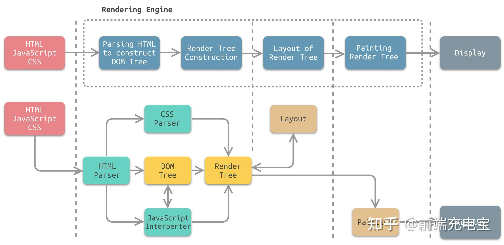

---
sidebar:
  title: 浏览器渲染原理及流程
  step: 1
  isTimeLine: true
title: 浏览器渲染原理及流程
tags:
  - 浏览器
categories:
  - 浏览器
---

# 浏览器渲染原理及流程

## 简介

静态资源通过浏览器渲染，最后呈现出页面，主要包含以下 5 个 流程：

- DOM 树构建：渲染引擎使用 HTML 解析器（调用 XML 解析器）解析 HTML 文档，将各个 HTML 元素逐个转化成 DOM 节点，从而生成 DOM 树
- CSSOM 树构建：CSS 解析器解析 CSS，并将其转化为 CSS 对象，将这些 CSS 对象组装起来，构建 CSSOM 树
- 渲染树构建：DOM 树和 CSSOM 树都构建完成以后，浏览器会根据这两棵树构建出一棵渲染树
- 页面布局：渲染树构建完毕之后，元素的位置关系以及需要应用的样式就确定了，这时浏览器会计算出所有元素的大小和绝对位置
- 页面绘制：页面布局完成之后，浏览器会将根据处理出来的结果，把每一个页面图层转换为像素，并对所有的媒体文件进行解码

对于这五个流程，每一阶段都有对应的产物，分别是：DOM 树、CSSOM 树、渲染树、盒模型、界面。

下图为渲染引擎工作流程中各个步骤所对应的模块：

从图中可以看出，渲染引擎主要包含的模块有：

- HTML 解析器：解析 HTML 文档，主要作用是将 HTML 文档转换成 DOM 树；
- CSS 解析器：将 DOM 中的各个元素对象进行计算，获取样式信息，用于渲染树的构建；
- JavaScript 解释器：使用 JavaScript 可以修改网页的内容、CSS 规则等。JavaScript 解释器能够解释 JavaScript 代码，并通过 DOM 接口和 CSSOM 接口来修改网页内容、样式规则，从而改变渲染结果；
- 页面布局：DOM 创建之后，渲染引擎将其中的元素对象与样式规则进行结合，可以得到渲染树。布局则是针对渲染树，计算其各个元素的大小、位置等布局信息。
- 页面绘制：使用图形库将布局计算后的渲染树绘制成可视化的图像结果。

## DOM 树构建