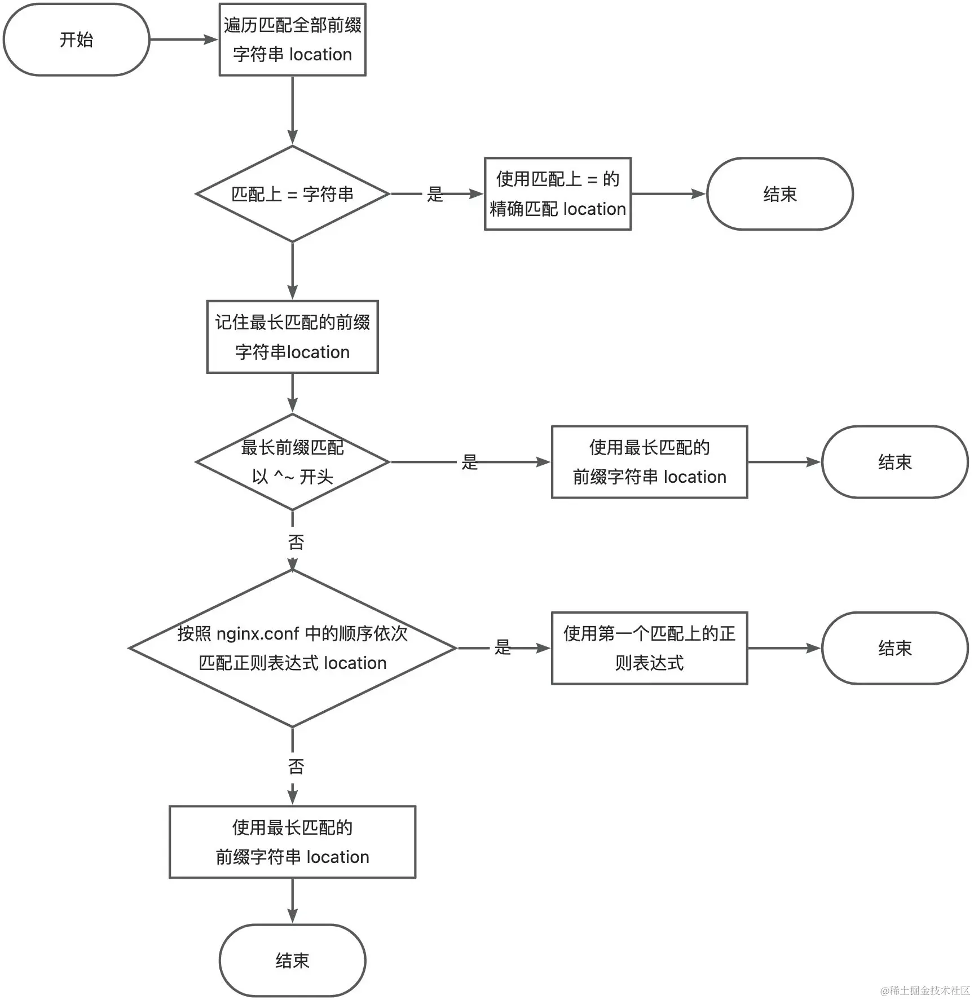

---
sidebar:
  title: nginx location
  step: 1
  isTimeLine: true
title: nginx location
tags:
  - 运维
categories:
  - 运维
---

# nginx location

> 作者：随便起一个名字吧
> <br/>链接：https://juejin.cn/post/7378891290807844901
> <br/>来源：稀土掘金

## 什么是 `location`

`location` 的作用是根据请求的 URI 将其定位到一个特定的规则块，然后由该规则块决定如何处理用户的请求。尽管 `location` 模块看似简单，但在实际编写过程中可能会让人无从下手：是应该使用 `location /images`、`location ^~ /images` 还是 `location ~ /images` 呢？这个 `location` 规则应该放在配置文件的哪个位置合适？放在最前面会不会影响已有的配置呢？

## `location` 的匹配选项

编写 `location` 规则时，可以选择以下几种配置项：

```nginx
location [= | ~ | ~* | ^~] uri { ... }
```

根据匹配模式的不同，`location` 后面可以有两种类型的匹配规则，即前缀字符串（prefix string）和正则匹配（regular expression）。前缀字符串包括 `=`、`^~` 以及不设置（即空字符串），正则匹配则分为 `~` 和 `~*`。这五种选项是最常见的，另有一种不常用的 `location @name { ... }`，这次不做讨论。

## `location` 的匹配规则

只有请求的 URI 满足某条 `location` 规则时，该规则才会被应用。针对不同的匹配模式，`location` 的匹配规则也有所不同。

#### 前缀字符串

前缀字符串表示从请求 URI 的开头开始进行匹配，如果用 JavaScript 表示，则当 `uri.indexOf(locationRule.uri) === 0` 表示满足匹配条件，其中 `uri` 表示请求路径，`locationRule.uri` 表示 `location` 设置的规则。

其中 `=` 比较特殊，它代表精准匹配，只有当匹配规则与请求 URI 完全相同时才满足条件，即 `uri === locationRule.uri`。

#### 正则匹配

正则匹配通过正则表达式验证是否满足规则，nginx 使用的是 [Perl 兼容正则表达式 (PCRE)](https://link.juejin.cn?target=https%3A%2F%2Fwww.pcre.org%2F)。需注意，nginx 为了方便配置，进行了某些非标准的优化，例如，不需要像标准正则表达式中那样转义 URL 中的正斜杠（/）。

而对于 `~` 和 `~*` 唯一的区别就是：`~` 区分大小写，而 `~*` 不区分大小写。

### 匹配规则总结

如下表格简单总结了 `location` 的各选项及对应匹配规则：

| **选项** | **匹配规则**           | **示例**                   |
| -------- | ---------------------- | -------------------------- |
| =        | 精准匹配               | location = /test { ... }   |
| ^~       | 前缀匹配               | location ^~ /test { ... }  |
| [空串]   | 前缀匹配               | location /test { ... }     |
| ~        | 区分大小写的正则匹配   | location ~ /test { ... }   |
| ~\*      | 不区分大小写的正则匹配 | location ~\* /test { ... } |

## `location` 规则的应用顺序

了解了匹配规则后，我们来看一下 nginx 如何应用这些规则，即 `location` 的匹配顺序。

根据实践和[文档](https://link.juejin.cn?target=)总结，`location` 规则的应用顺序如下：

1. 将 `server` 块中的 `location` 根据匹配模式分成前缀字符串规则列表和正则匹配规则列表。
2. 首先遍历前缀字符串规则列表，如果匹配到精准匹配（即选项为 `=`），直接应用该规则，结束流程；否则，找到匹配规则最长的记录（记作 `maxLengthStringPrefixRule`），继续下一步。
3. 如果 `maxLengthStringPrefixRule` 存在且选项为 `^~`，应用该规则，结束流程；否则，进入下一步。
4. 遍历正则匹配规则列表，如果有符合匹配规则的，直接应用该规则，结束流程；如果直到结束都没有匹配到，转向下一步。
5. 如果 `maxLengthStringPrefixRule` 存在，则应用该规则；否则返回 404，表示未找到合适的规则。

如果上述描述看起来难以理解，可以参考以下伪代码：

```js
// 字符串匹配的规则集合，按在 .conf 文件中的顺序放置
const stringPrefixRuleList = [...];
// 正则匹配的规则集合，按在 .conf 文件中的顺序放置
const regularExpressionRuleList = [...];

// 用于存放最长的字符串匹配规则
let maxLengthStringPrefixRule = null;

// 遍历字符串匹配的规则集合
for (const rule of stringPrefixRuleList) {
  if (rule.isMatched()) {
    // 发现精准匹配，直接应用该规则并结束流程
    if (rule.option === '=') {
      applyRule(rule);
      return;
    }

    // 记录当前最长的匹配规则
    if (!maxLengthStringPrefixRule || rule.uri.length > maxLengthStringPrefixRule.uri.length) {
      maxLengthStringPrefixRule = rule;
    }
  }
}

// 如果最长匹配规则的选项是 ^~，直接应用该规则并结束流程
if (maxLengthStringPrefixRule?.option === '^~') {
  applyRule(maxLengthStringPrefixRule);
  return;
}

// 遍历正则匹配规则集合
for (const regexRule of regularExpressionRuleList) {
  if (regexRule.isMatched()) {
    applyRule(regexRule);
    return;
  }
}

// 如果存在最长的字符串匹配规则，应用之
if (maxLengthStringPrefixRule) {
  applyRule(maxLengthStringPrefixRule);
  return;
}

// 没有找到匹配的规则，返回 404
throw new Error(404);

```

这里有一些**关键点**需要注意：

1. 命中 `=` 匹配规则后终止搜索，直接使用该规则。因此对于频繁发生的请求 URL，例如 `/`，可以在 `nginx.conf` 中添加 `location = /` 规则以加速处理。
2. `^~` 和空串的前缀匹配不同在于，如果命中 `^~` 规则且是最长前缀匹配，将终止进一步的正则匹配。
3. 前缀字符串匹配与文件中的位置无关，但与匹配长度有关。
4. 正则匹配耗时资源较多，因此 nginx 命中一个正则匹配规则后即直接使用，与规则在文件中的顺序有关。

## 实践中的 `location` 配置示例

接下来通过几个实例来更直观地了解 `location` 的规则应用顺序。

**示例一：**

```nginx
location /test {
    default_type text/html;
    return 200 '/test';
}
location ~ /test {
   default_type text/html;
   return 200 '~ /test';
}
location = /test {
   default_type text/html;
   return 200 '= /test';
}
```

浏览器访问 `localhost:9001/test` 会返回什么？

> 答: 会返回 = /test。因为精准匹配选项 = 会优先被应用，在匹配到 `location = /test` 时就直接应用该规则。

**示例二：**

```nginx
location ~ /test {
  default_type text/html;
  return 200 '~ /test';
}
location ~ /test/*/demo {
  default_type text/html;
  return 200 '~ /test/*/demo';
}
```

浏览器访问 `localhost:9001/test/xyz/demo` 会显示什么？

> 答: 会返回 ~ /test。因为正则表达式匹配是按照配置在文件中的顺序依次进行的，匹配到第一个符合规则的 `location ~ /test` 并应用它。

**示例三：**

```nginx
location ^~ /test {
  default_type text/html;
  return 200 '^~ /test';
}
location /test/more/andmore {
  default_type text/html;
  return 200 '/test/more/andmore';
}
location ~ /test {
  default_type text/html;
  return 200 '~ /test';
}
```

浏览器访问 `localhost:9001/test/more/andmore` 和 `localhost:9001/test/more` 分别会返回什么？

> 答:
>
> 1.  访问 localhost:9001/test/more/andmore：会返回 ~ /test。尽管配置文件中存在 `/test/more/andmore` 的前缀匹配规则（最长匹配前缀），但它不包含 ^~ 选项，因此会继续进行正则匹配。在正则匹配中，`~ /test` 符合条件，所以直接应用该规则。
> 2.  访问 localhost:9001/test/more：会返回 `^~ /test`。因为在前缀匹配中，^~ /test 是最长匹配且带有 ^~ 选项的规则，所以直接应用该规则，而不会继续匹配正则表达式的规则。

## 总结

在理解和配置 `location` 规则时，有几个关键点需要牢记。这些规则会影响 nginx 如何处理传入的请求，确保匹配到正确的 `location` 块以执行适当的处理逻辑。下面我们先看看关键的匹配顺序和原则，然后再总结每类匹配的具体行为。

### 匹配规则的关键点：

<br/>


先遍历所有前缀字符串，选取最长的一个前缀字符串，如果该字符串为 `=` 的精确匹配或 `^~` 的前缀匹配，将直接使用。

如果第一步未匹配上 `=` 或 `^~`，则记住最长匹配的前缀字符串 `location`。

按照 `nginx.conf` 文件中的配置依次匹配正则表达式。

如果正则表达式全部未匹配上，则使用最长匹配的前缀字符串。

#### 具体匹配规则顺序总结：

1. 精准匹配 `=`
2. 前缀匹配 `^~`，如果该前缀匹配为最长前缀规则，则应用。
3. 正则匹配 `~`、`~*`，与规则在文件中的顺序有关，执行顺序从上到下，找到符合配置的规则即应用。
4. 不带修饰符的前缀匹配，**与匹配规则的长度有关，仅应用最长匹配规则，与文件中的顺序无关**。