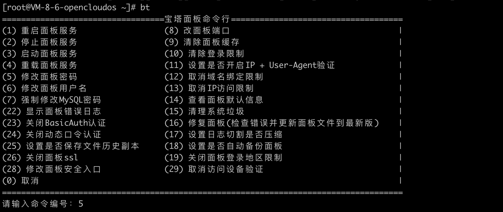

---
sidebar:
  title: 宝塔的安装与卸载
  step: 1
  isTimeLine: true
title: 宝塔的安装与卸载
tags:
  - 运维
categories:
  - 运维
---

# 宝塔的安装与卸载

## 安装

OpenCloudOS 或 CentOS 安装宝塔面板命令如下：

```shell
yum install -y wget && wget -O install.sh https://download.bt.cn/install/install_6.0.sh && sh install.sh ed8484bec
```

## 卸载

卸载的命令如下

```shell
wget http://download.bt.cn/install/bt-uninstall.sh
sh bt-uninstall.sh
```

## 操作命令

操作宝塔的命令如下

```shell
bt
```



<br/>
<hr />

⭐️⭐️⭐️ 好啦！！！本文章到这里就结束啦。⭐️⭐️⭐️

✿✿ ヽ(°▽°)ノ ✿

撒花 🌸🌸🌸🌸🌸🌸
