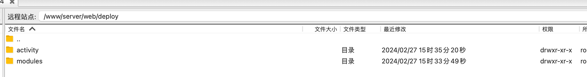

---
sidebar:
  title: 部署vue项目
  step: 1
  isTimeLine: true
title: 部署vue项目
tags:
  - 运维
categories:
  - 运维
---

# 部署 vue 项目

## 简介

在这里主要介绍针对 vue3 + vite 打包部署，包含单个项目部署、多个项目部署

## 单一项目部署

`vite.config.js` 配置文件查看

```js
import { defineConfig } from "vite";
import vue from "@vitejs/plugin-vue";

// https://vitejs.dev/config/
export default defineConfig({
  plugins: [vue()],
  // 开发或生产环境服务的公共基础路径
  base: "/",
  build: {
    // 打包输出目录
    outDir: "./modules",
  },
});
```

这里我们定义好开发或生产环境服务的公共基础路径 `base` 和 打包输出目录 `outDir` ，然后执行命令 `yarn build` 进行打包，

我们将打包好的文件夹拷贝到服务器的目录下, 如下图：



然后我们就可以配置 nginx 了

```shell
server {
      listen 1006;
      charset utf-8;
      location / {
      root /www/server/web/deploy/modules;
          try_files $uri $uri/ /index.html;
          index  index.html index.htm;
      }

      # nginx配置中的location块，@router是一个自定义的名称，表示一个内部重定向的目标
      location @router {
       # 对所有请求路径进行重写，将其重定向到/index.html页面，使用last标志表示最后的重定向
          rewrite ^.*$ /index.html last;
      }

      location /prod-api/ {
        proxy_set_header Host $http_host;
        proxy_set_header X-Real-IP $remote_addr;
        proxy_set_header REMOTE_HOST $remote_addr;
        proxy_set_header X-Forwarded-For $proxy_add_x_forwarded_for;
				proxy_set_header X-Forwarded-Proto $scheme;
				proxy_set_header X-NginX-Proxy true;
        proxy_pass http://localhost:3000/;
      }
  }

```

**server**：在 `nginx` 配置中，`server` 块定义了一个虚拟主机。每个虚拟主机都可以有自己的配置，包括监听的端口、域名、SSL 证书等。在这个配置中，使用了 `listen 1006 `;来指定该虚拟主机监听在 1006 端口接收来自客户端的 HTTP 请求。

**location /**：这个部分配置了处理根路径的规则。当用户访问的 `URL` 是根路径时，`Nginx` 会根据这里的配置来响应请求。首先使用`root /www/server/web/deploy/modules`，指定了根路径对应的文件目录，接着使用 `try_files $uri $uri/ /index.html`，来定义了如何查找对应的文件。如果 URI 对应的文件存在，则直接返回该文件；如果 URI 对应的是目录，则尝试在这个目录下寻找 `index.html`；如果都找不到，则返回 `/index.html` 页面。

**location @router**：这个部分定义了一个命名位置，以@开头的位置名称表示内部重定向。当其他 `location` 块无法处理请求时，会尝试内部重定向到 `@router` 这个位置。在这个位置中，使用了`rewrite ^.*$ /index.html last` ;来将所有匹配的请求路径都重定向到 ` /index.html` 页面。

**location /prod-api/**：这部分配置了一个反向代理规则，用于处理以 `/prod-api/` 开头的请求。使用了代理头（proxy_set_header）来设置一系列的请求头信息，然后使用 `proxy_pass` 将请求代理转发到 3000 端口，实现反向代理的功能。

单个项目就讲到这里啦，下面介绍多个项目的部署

## 多个项目部署

多个项目的话，我们需要改变一下`vite.config.js` 配置文件，如下：

```js
import { defineConfig } from "vite";
import vue from "@vitejs/plugin-vue";

// https://vitejs.dev/config/
export default defineConfig({
  plugins: [vue()],
  // 开发或生产环境服务的公共基础路径
  // base: '/',
  base: "/activity",
  build: {
    // 打包输出目录
    // outDir: './modules',
    outDir: "./activity",
  },
});
```

另外还需要改变 routes 下的 base 路径， 如果不配置，造成页面访问路径不对，base 变化如下：

```js
// const base = '/'
const base = "/activity";
const router = createRouter({
  history: createWebHashHistory(base), // hash
  routes: constantRoutes,
});

export default router;
```

执行命令 `yarn build` 进行打包


然后配置 nginx

```shell
    server {
      listen 1006;
      charset utf-8;
      location / {
      root /www/server/web/deploy/modules;
          try_files $uri $uri/ /index.html;
          index  index.html index.htm;
      }

      location /activity {
           alias /www/server/web/deploy/activity;
   				 try_files $uri $uri/ /applet/index.html;
           index  index.html index.htm;
      }
      # nginx配置中的location块，
      # @router是一个自定义的名称，表示一个内部重定向的目标
      location @router {
       # 对所有请求路径进行重写，
       # 将其重定向到/index.html页面，使用last标志表示最后的重定向
          rewrite ^.*$ /index.html last;
      }

      location /prod-api/ {
        proxy_set_header Host $http_host;
        proxy_set_header X-Real-IP $remote_addr;
        proxy_set_header REMOTE_HOST $remote_addr;
        proxy_set_header X-Forwarded-For $proxy_add_x_forwarded_for;
				proxy_set_header X-Forwarded-Proto $scheme;
				proxy_set_header X-NginX-Proxy true;
        proxy_pass http://localhost:3000/;
      }
   }
```

想比于单个项目部署，可以看到上面多出了

```shell
location /activity {
    alias /www/server/web/deploy/activity;
    try_files $uri $uri/ /applet/index.html;
    index  index.html index.htm;
}
```

这里使用了路径别名 `alias` 即当匹配到/activity 时，应该将请求映射到实际的文件系统路径/www/server/web/deploy/activity

**注意**：`root` 根路径只能有一个, `alias` 可以有多个， 所以部署 3 个、4 个 vue 项目 也是通过 `alias` 映射

## 总结

- 单一部署项目时，可以直接通过根路径直接指定文件目录
- 多个项目部署时，第一个项目使用根路径，其他项目使用别名 `alias` 来指定文件目录，另外其他项目的`公共基础路径`和`路由基本路径 base`也需要修改

<br/>
<hr />

⭐️⭐️⭐️ 好啦！！！本文章到这里就结束啦。⭐️⭐️⭐️

✿✿ ヽ(°▽°)ノ ✿

撒花 🌸🌸🌸🌸🌸🌸
