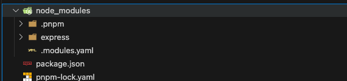

---
sidebar:
  title: npm、yarn、pnpm的区别？
  step: 1
  isTimeLine: true
title: npm、yarn、pnpm的区别？
tags:
  - 工程化
categories:
  - 工程化
---

# npm、yarn、pnpm 的区别？

## npm2

在 npm 3.0 版本之前，项目的 `node_modules` 会呈现出嵌套结构，也就是说，我安装的依赖、依赖的依赖、依赖的依赖的依赖...，都是递归嵌套的

```js
node_modules
├─ express
│  ├─ index.js
│  ├─ package.json
│  └─ node_modules
│     ├─ accepts
│     │  ├─ index.js
│     │  ├─ package.json
│     │  └─ node_modules
│     │     ├─ mime-types
|     |     |   └─ node_modules
|     |     |      └─ mime-db
|     │     └─ negotiator
│     ├─ array-flatten
│ 		├─ ...
│  		└─ ...
└─ A
   ├─ index.js
   ├─ package.json
   └─ node_modules
      └─ accepts
         ├─ index.js
         ├─ package.json
         └─ node_modules
            ├─ mime-types
            |   └─ node_modules
            |      └─ mime-db
            └─ negotiator

```

## 设计缺陷

种嵌套依赖树的设计确实存在几个严重的问题

1. **路径过长问题：** 由于包的嵌套结构 ， `node_modules` 的目录结构可能会变得非常深，甚至可能会超出系统路径长度上限 ，毕竟 windows 系统的文件路径默认最多支持 256 个字符
2. **磁盘空间浪费：** 多个包之间难免会有公共的依赖，公共依赖会被多次安装在不同的包目录下，导致磁盘空间被大量浪费 。比如上面 `express` 和 A 都依赖了 `accepts`，它就被安装了两次
3. **安装速度慢**：由于依赖包之间的嵌套结构，`npm` 在安装包时需要多次处理和下载相同的包，导致安装速度变慢，尤其是在依赖关系复杂的项目中

当时 npm 还没解决这些问题， 社区便推出了新的解决方案 ，就是 yarn。 它引入了一种新的依赖管理方式——**扁平化依赖。**

看到 yarn 的成功，npm 在 3.0 版本中也引入了类似的扁平化依赖结构

## yarn

**yarn 的主要改进之一就是通过扁平化依赖结构来解决嵌套依赖树的问题**

具体来说铺平，yarn 尽量将所有依赖包安装在项目的顶层 `node_modules` 目录下，而不是嵌套在各自的 `node_modules` 目录中。

这样一来，减少了目录的深度，避免了路径过长的问题 ，也尽可能避免了依赖被多次重复安装的问题


我们可以看到整个目录，全部铺平在了顶层 `node_modules` 目录下，展开下面的包大部分是没有二层 `node_modules` 的

然而，有些依赖包还是会在自己的目录下有一个 `node_modules` 文件夹，出现嵌套的情况，例如 yarn-example 下的`http-errors` 依赖包就有自己的 `node_modules`，原因是：

当一个项目的多个依赖包需要同一个库的不同版本时，**yarn 只能将一个版本的库提升到顶层** **`node_modules`** **目录中。** 对于需要**这个库其他版本**的依赖，yarn 仍然需要在这些依赖包的目录下创建一个嵌套的 `node_modules` 来存放不同版本的包

比如，包 A 依赖于 `lodash@4.0.0`，而包 B 依赖于 `lodash@3.0.0`。由于这两个版本的 `lodash` 不能合并，`yarn` 会将 `lodash@4.0.0` 提升到顶层 `node_modules`，而 `lodash@3.0.0` 则被嵌套在包 B 的 `node_modules` 目录下。

## 幽灵依赖

**虽然 yarn 和 npm 都采用了扁平化的方案来解决依赖嵌套的问题，但这种方案本身也有一些缺陷，其中幽灵依赖是一个主要问题。**

幽灵依赖，也就是你明明没有在 `package.json` 文件中声明的依赖项，但在项目代码里却可以 `require` 进来 这个也很容易理解，因为依赖的依赖被扁平化安装在顶层 `node_modules` 中，所以我们能访问到依赖的依赖

但是这样是有隐患的，因为没有显式依赖，未来某个时候这些包可能会因为某些原因消失（例如新版本库不再引用这个包了，然后我们更新了库），就会引发代码运行错误

## 浪费磁盘空间

**而且还有一个问题，就是上面提到的依赖包有多个版本的时候，只会提升一个，那其余版本的包不还是复制了很多次么，依然有浪费磁盘空间的问题**

那社区有没有解决这俩问题的思路呢？ pnpm 就是其中最成功的一个

## pnpm

pnpm 通过**全局存储和符号链接机制**从根源上解决了依赖重复安装和路径长度问题，同时也避免了扁平化依赖结构带来的幽灵依赖问题 pnpm 的优势概括来说就是“快、准、狠”：

- 快：安装速度快
- 准：安装过的依赖会准确复用缓存，甚至包版本升级带来的变化都只 diff，绝不浪费一点空间
- 狠：直接废掉了幽灵依赖

执行 `npm add express`，我们可以看到整个目录，由于只安装了 `express`，那 `node_modules` 下就只有 `express`



那么所有的（次级）依赖去哪了呢？在`node_modules/.pnpm/`目录下，`.pnpm/` 以平铺的形式储存着所有的包


## 三层寻址

所有 npm 包都安装在全局目录 `~/.pnpm-store/v3/files` 下，同一版本的包仅存储一份内容，甚至不同版本的包也仅存储 diff 内容。

顶层 `node_modules` 下有 `.pnpm` 目录以打平结构管理每个版本包的源码内容，以硬链接方式指向 pnpm-store 中的文件地址。

每个项目 `node_modules` 下安装的包以软链接方式将内容指向 `node_modules/.pnpm` 中的包。 所以每个包的寻找都要经过三层结构：`node_modules/package-a` > 软链接 `node_modules/.pnpm/package-a@1.0.0/node_modules/package-a` > 硬链接 `~/.pnpm-store/v3/files/00/xxxxxx`。

这就是 pnpm 的实现原理。官方给了一张原理图，可以搭配食用


前面说过，npm 包都被安装在全局 `pnpm store` ，默认情况下，会创建多个存储（每个驱动器（盘符）一个），并在项目所在盘符的根目录

所以，同一个盘符下的不同项目，都可以共用同一个全局 `pnpm store`，绝绝子啊 👏，大大节省了磁盘空间，提高了安装速度

## 软硬链接

也就是说，所有的依赖都是从全局 store 硬连接到了 `node_modules/.pnpm` 下，然后之间通过软链接来相互依赖。

那么，这里的软连接、硬链接到底是什么东西？

硬链接是指向磁盘上原始文件所在的同一位置 （直接指向相同的数据块）

软连接可以理解为新建一个文件，它包含一个指向另一个文件或目录的路径 （指向目标路径）

## 总结

**npm2 的嵌套结构**： 每个依赖项都会有自己的 `node_modules` 目录，导致了依赖被重复安装，严重浪费了磁盘空间 ；在依赖层级比较深的项目中，甚至会超出 windows 系统的文件路径长度

**npm3+ 和 Yarn 的扁平化策略：** 尽量将所有依赖包安装在项目的顶层 `node_modules` 目录下，解决了 `npm2` 嵌套依赖的问题。但是该方案有一个重大缺陷就是“幽灵依赖”；而且依赖包有多个版本时，只会提升一个，那其余版本依然会被重复安装，还是有浪费磁盘空间的问题

**pnpm 全局存储和符号链接机制：** 结合软硬链和三层寻址，解决了依赖被重复安装的问题，更加变态的是，同一盘符下的不同项目都可以共用一个全局 `pnpm store`。节省了磁盘空间，并且根本不存在“幽灵依赖”，安装速度还贼快 💪💪💪
