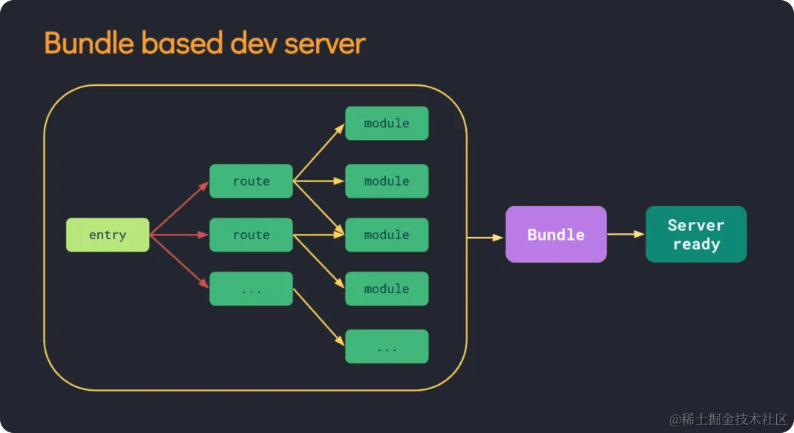
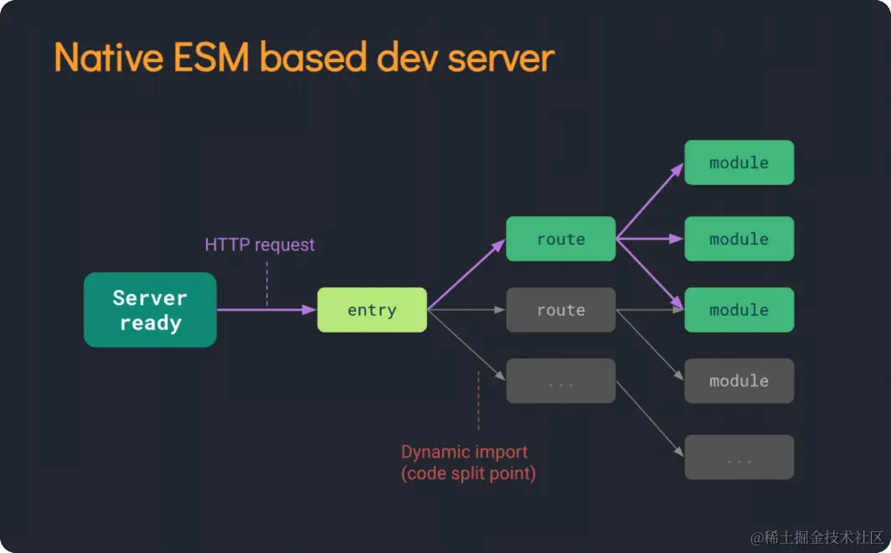

# vite 为什么比 webapck 快?

> 原文地址： https://juejin.cn/post/7283682738497765413

## 前言

vite 比 webpack 快？

vite 比 webpack 简单？

今天我们就来分析一下，到底有什么不一样的地方！

## 定位

对比之前，我们先要搞懂，vite 与 webpack 的定位以及关系才可以。

那前端社区中常谈到的这些工具`webpack`、`rollup`、`parcel`、`esbuild`、`vite`、`vue-cli`、`create-react-app`、`umi`他们之间的关系是怎样的。

- `webpack`、`rollup`、`parcel`、`esbuild`都是打包工具，代码写好之后，我们需要对代码进行`压缩`、`合并`、`转换`、`分割`、`打包`等操作，这些工作需要打包工具去完成。
- `vue-cli`、`create-react-app`、`umi` 是基于`webpack`的上层封装，通过简单的配置就可以快速创建出一个项目，把更多的时间放在业务开发上。
- `vite`开发环境依赖`esbuild`进行预构建，生产环境则依赖`rollup`进行打包，并且充分利用了现代浏览器的特性，比如`http2`、`ES module`，`vite`是站在众多巨人肩膀上的一个产物， 类似`webpack + webpack-dev-server`的结合体，是一个非常棒的前端项目的构建工具。

## 运行原理

首先，我们从运行原理上分析一下，vite 为什么比 webpack 快。

**webpack 运行原理**



当我们使用 webpack 启动项目时，webpack 会根据我们配置文件（`webpack.config.js`） 中的入口文件（`entry`），分析出项目项目所有依赖关系，然后打包成一个文件（`bundle.js`），交给浏览器去加载渲染。

这样就会带来一个问题，项目越大，需要打包的东西越多，启动时间越长。

**关于`ES module`**

在讲 vite 运行原理之前，我们先说一下`ES module`

目前，绝大多数现代浏览器都已经支持`ES module`了， 我们只需要在`<script>`标签中添加`type="module"`，就可以使用`ES module`了。

下面这段代码是可以直接在浏览器中运行的。

```js
// test.js
export default function hello() {
  console.log('hello world');
}

// index.html
<script type="module">
  import hello from './test.js';

  hello(); // hello world
</scirpt>

```

**vite 运行原理**



在`script type="module"`中，浏览器遇到内部的 import 引用时，会自动发起 http 请求，去加载对应的模块。

vite 也正是利用了`ES module`这个特性，使用 vite 运行项目时，首先会用`esbuild`进行预构建，将所有模块转换为`es module`，不需要对我们整个项目进行编译打包，而是在浏览器需要加载某个模块时，拦截浏览器发出的请求，根据请求进行`按需编译`，然后返回给浏览器。

这样一来，首次启动项目（冷启动）时，自然也就比 webpack 快很多了，并且项目大小对 vite 启动速度的影响也很小。

## 构建方式

我们再来看一下，vite 与 webpack 在项目构建上有哪些区别。

**webpack**

webpack 是基于`nodejs`运行的，但`js`只能单线程运行，无法利用多核 CPU 的优势，当项目越来越大时，构建速度也就越来越慢了。

**vite**

vite`预构建`与`按需编译`的过程，都是使用`esbuild`完成的。

`esbuild`是用`go`语言编写的，可以充分利用多核 CPU 的优势，所以 vite 开发环境下的`预构建`与`按需编译`速度，都是非常快的。

## http2

vite 充分利用了 http2 可以并发请求的优势，这也是速度快的一个主要原因。 接下来，我们了解一下**http2**的来龙去脉。

在之前 http1 的时候，浏览器对同一个域名的请求，是有并发限制的，一般为 6 个，如果并发请求 6 个以上，就会造成阻塞问题，所以在 http1 的时代，我们要减少打包产物的文件数量，减少并发请求，来提高项目的加载速度。

2015 年以后，http2 出现了，他可以并发发送多个请求，不会出现 http1 的并发限制。这时候，将打包产物分成多个小模块，并行去加载，反而会更快。

vite 也充分利用了这一优势，对项目资源进行了合理的拆分，访问项目时，同时加载多个模块，来提升项目访问速度。

## 热更新

vite 速度快的另一个原因是与 webpack 不同的热更新机制。

**我们首先来了解一下什么是 HMR。**

模块热替换(hot module replacement - HMR)，该功能可以实现应用程序运行过程中，替换、添加或删除模块，而无需重新加载整个页面，也就是我们常说的`热更新`。

vite 与 webpack 虽然都支持 HMR,但两个工具的实现原理是不一样的。

**webpack**

webpack 项目中，每次修改文件，都会对整个项目重新进行打包，这对大项目来说，是非常不友好的。

虽然 webpack 现在有了缓存机制，但还是无法从根本上解决这个问题。

**vite**

vite 项目中，监听到文件变更后，会用`websocket`通知浏览器，重新发起新的请求，只对该模块进行重新编译，然后进行替换。

并且基于`es module`的特性，vite 利用浏览器的缓存策略，针对源码模块（我们自己写的代码）做了`协商缓存`处理，针对依赖模块（第三方库）做了`强缓存`处理，这样我们项目的访问的速度也就更快了。

## 生产环境

**vite 生产环境下，为什么使用 rollup 打包呢？**

Rollup 是一款 `ES Module` 打包器， 从作用上来看，`Rollup` 与 `Webpack` 非常类似。不过相比于 `Webpack`，`Rollup`要小巧的多，打包生成的文件更小。 因为小巧，自然在这种特定的打包环境下，`Rollup`的打包速度也要比 `Webpack` 快很多。

vite 正是基于`es module`的特性实现的，所以使用 rollup 要更合适一些。

**vite 生产环境下，为什么不用 esbuild 打包呢？**

尽管 esbuild 的打包速度比 rollup 更快，但 Vite 目前的插件 API 与使用 esbuild 作为打包器并不兼容，rollup 插件 api 与基础建设更加完善，所以在生产环境 vite 使用 rollup 打包会更稳定一些。

如果后面 esbuild 基础建设与生态更加完善后，esbuild 还是更有优势的。

所以使用 vite 可能会带来开发环境与生产环境打包结果不一致的问题。

## 使用成本

除了速度上的区别，我们再分析一下，vite 与 webpack 的使用成本。

**webpack**

如果我们使用 webpack 自己去搭建项目脚手架时，需要配置比较多的东西， 比如：`跨域`、`代码压缩`、`代码分割`、`css预处理器的代码转换`、`样式兼容性`、`vue/react代码解析`、`图片压缩`、`代码热更新`、`es降级`、`ts转换`等等，远不止这些。

概念和配置项太多，我们需要了解各种 loader、plugin 的使用，并且需要根据项目场景，对配置不断进行优化，心智负担太大。

所以就出现了一些基于 webpack 上层封装的脚手架，如：`vue-cli`、`create-react-app`、`umi`等。

**vite**

vite 对我们常用功能都做了内置，比如：`css 预处理器`、`html 预处理器`、`hash 命名`、`异步加载`、`分包`、`压缩`、`HMR`等等，我们可以很轻松的通过配置项去配置。

并且 vite 官方也提供了一些官方模板、社区模板，我们可以快速地创建出一个带有最佳预设项目，不需要关心太多的配置项。

vite 的出现，降低了我们的学习成本、增加了开发体验，我们就可以把更多的时间放在业务开发上了，打磨出更好产品。

<br/>
<hr />

⭐️⭐️⭐️ 好啦！！！本文章到这里就结束啦。⭐️⭐️⭐️

✿✿ ヽ(°▽°)ノ ✿

撒花 🌸🌸🌸🌸🌸🌸