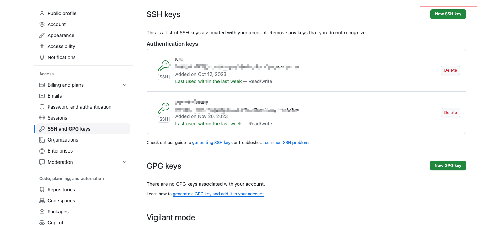

---
sidebar:
  title: Git配置ssh Key（密钥和公钥）到github
  step: 1
  isTimeLine: true
title: Git配置ssh Key（密钥和公钥）到github
tags:
  - Git
categories:
  - Git
---

# Git 配置 ssh Key（密钥和公钥）到 github

## 什么是 Git?

Git 是一个开源的分布式版本控制系统，可以有效、高速的处理从很小到非常大的项目版本管理。Git 是 Linus Torvalds 为了帮助管理 Linux 内核开发而开发的一个开放源码的版本控制软件。

## 什么是 SSL？什么是公钥和密钥？

`ssh (Secure Shell) 密钥是用于身份验证和加密通信的一对加密密钥。它由两个部分组成：私钥（private key）和公钥（public key）。这对密钥是通过非对称加密算法生成的，其中私钥用于加密数据，而公钥用于解密数据。`

在 ssh 中，私钥应该保持在你的本地计算机上，并且必须保持安全和保密。公钥则可以被分享给其他人或服务器。当你连接到一个远程服务器时，你可以将你的公钥添加到服务器上，以便服务器可以使用该公钥对你的身份进行验证。

**当你使用 ssh 协议连接到远程服务器时，身份验证过程如下：**

- 你的本地计算机向服务器发送请求。

- 服务器要求提供身份验证凭据。

- 你的本地计算机将使用你的私钥对一个随机生成的数字进行加密，并将加密后的数字发送给服务器。

- 服务器使用你之前提供的公钥对加密后的数字进行解密。如果解密后的数字与服务器生成的数字匹配，服务器将验证你的身份并允许你登录。

**使用 ssh 密钥对身份验证具有以下优势：**

- 安全性： ssh 密钥使用非对称加密算法，提供更高的安全性，比密码身份验证更难以被破解。

- 方便性：你不需要记住复杂的密码，只需要使用你的私钥来访问远程服务器。

- 可信任性 公钥可以在多个服务器之间共享，而不需要使用相同的密码。

- 通过生成 ssh 密钥对并将公钥添加到服务器上，你可以实现更安全和方便的远程访问。

## 如何配置?

### 第一步：打开终端

- 配置用户名和邮箱信息
  ```shell
  git config --global user.name “username”
  git config --global user.email “email”
  ```
- 生成 ssh key
  ```shell
  # 你的Github绑定的邮箱
  ssh-keygen -t rsa -C "***@qq.com"
  ```
- 获取 ssh key
  ```shell
  # 读取 ~/.ssh 中的 id_rsa.pub
  cat ~/.ssh/id_rsa.pub
  ```
- 在 github 添加 ssh key

  `进入 github， 点击右上角头像，然后点击 setting`
  

  `进入 setting，点击SSH and GPG keys`
  

- 检测是否配置成功
  ```shell
  ssh -T git@github.com
  ```

<br/>
<hr />

⭐️⭐️⭐️ 好啦！！！本文章到这里就结束啦。⭐️⭐️⭐️

✿✿ ヽ(°▽°)ノ ✿

撒花 🌸🌸🌸🌸🌸🌸
