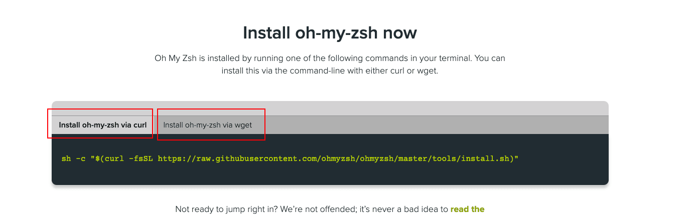

---
sidebar:
  title: mac安装oh-my-zsh
  step: 1
  isTimeLine: true
title: mac安装oh-my-zsh
tags:
  - Git
categories:
  - Git
---

# mac 安装 oh-my-zsh

## 说明

linux 与 mac ox 系统，shell 类型默认都是 bash, 在使用时候预发提示，页面美观等都不够强大，后来诞生了 zsh，但 zsh 配置复杂，就有人在 zsh 基础开发出了 oh-my-zsh
下载地址: https://ohmyz.sh/#install

## 安装

官网安装方式：



终端执行如下命令

```shell
sh -c "$(curl -fsSL https://raw.github.com/ohmyzsh/ohmyzsh/master/tools/install.sh)"
```

执行过程遇到`443`问题

```html
HQITI0010:.ssh shiyang.long$ sh -c "$(curl -fsSL
https://raw.github.com/robbyrussell/oh-my-zsh/master/tools/install.sh)" curl:
(7) Failed to connect to raw.githubusercontent.com port 443: Connection refused
```

原因是使用了国外资源，改国内镜像安装

```shell
sh -c "$(curl -fsSL https://gitee.com/shmhlsy/oh-my-zsh-install.sh/raw/master/install.sh)"
```

## 主题配置

```shell
 vim ~/.zshrc
```

编辑 `~/.zshrc`中的 `ZSH_THEME`="xxx"即可。默认 ：ZSH_THEME="robbyrussell"

```shell
# Set name of the theme to load --- if set to "random", it will
# load a random theme each time oh-my-zsh is loaded, in which case,
# to know which specific one was loaded, run: echo $RANDOM_THEME
# See https://github.com/ohmyzsh/ohmyzsh/wiki/Themes
ZSH_THEME="robbyrussell"
```

更多主题查看 github 上的 wiki：[https://github.com/ohmyzsh/ohmyzsh/wiki/Themes](https://links.jianshu.com/go?to=https%3A%2F%2Fgithub.com%2Fohmyzsh%2Fohmyzsh%2Fwiki%2FThemes)

修改完成，执行配置文件生效即可

```shell
source ~/.zshrc
```

## 找不到 nvm 问题

- 在终端输入**open ~/.zshrc**
- 在最开头加上**source ~/.bash_profile**
- 在刚才的终端输入**source ~/.zshrc**

[zsh 中 nvm 不见了](https://blog.csdn.net/sherlyxoxo/article/details/125265019)

<br/>
<hr />

⭐️⭐️⭐️ 好啦！！！本文章到这里就结束啦。⭐️⭐️⭐️

✿✿ ヽ(°▽°)ノ ✿

撒花 🌸🌸🌸🌸🌸🌸
