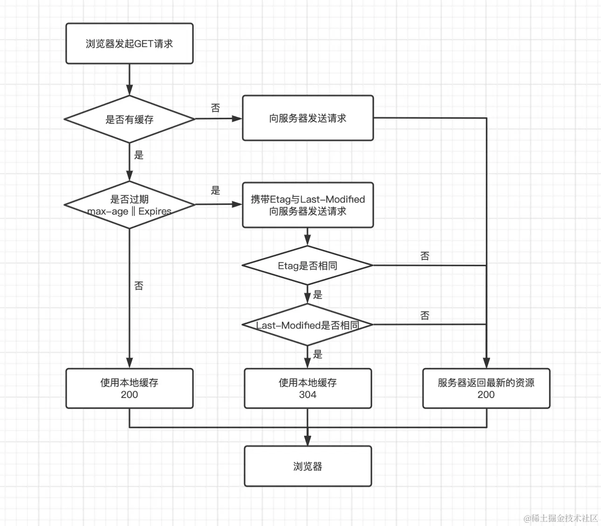

# EveryT

## 浏览器的缓存机制你了解多少呢？（2024-08-28）

览器缓存机制主要通过将用户之前请求过的资源（如 HTML、CSS、JavaScript、图片等）保存在本地，以便在后续请求时直接使用这些缓存的资源，而无需再次从服务器下载。这样可以显著提高页面加载速度，提升用户体验。

### 缓存类型

- **强缓存（Forced Caching）**
- **协商缓存（Revalidating Caching）**
- Service Worker 缓存
- Web Storage 缓存

### 强缓存（Forced Caching）

- **原理**：浏览器在请求资源时，会先检查本地缓存是否存在该资源的副本，并且该副本是否未过期。如果副本未过期，则直接使用本地缓存，不会向服务器发送请求。
- **实现方式**：主要依赖于 HTTP 响应头中的 `Expires` 和 `Cache-Control` 字段。`Expires` 是 HTTP/1.0 中的字段，表示资源的绝对过期时间；而 `Cache-Control` 是 HTTP/1.1 中引入的，更灵活且优先级高于 `Expires`，可以指定资源的最大缓存时间（如 `max-age=3600` 表示资源将在 3600 秒后过期）。

### 协商缓存（Negotiated Caching）

- **原理**：当资源的副本过期或浏览器的缓存被清除时，浏览器会向服务器发送请求，询问该资源是否有更新。服务器会根据资源的最后修改时间或 `ETag`（实体标签）来判断资源是否有更新。
- **实现方式**：主要依赖于 HTTP 请求头中的 `If-Modified-Since` 和 `If-None-Match` 字段，以及 HTTP 响应头中的 `Last-Modified` 和 `ETag` 字段。服务器会比较请求头中的时间戳或 ETag 值与资源当前的状态，如果资源未修改，则返回 304 Not Modified 响应，告知浏览器直接使用本地缓存。

### Service Worker 缓存 （了解即可）

- **原理**：Service Worker 是一种在浏览器后台运行的脚本，可以拦截网络请求并返回缓存的响应。通过 Service Worker，开发者可以自定义缓存策略，实现更灵活、更高效的缓存机制。
- **优势**：可以完全控制网络请求，具有最高优先级，即使是强制缓存也可以被覆盖。

### Web Storage 缓存 （了解即可）

- **包括**：localStorage 和 sessionStorage。
- **原理**：localStorage 用于存储用户在网站上的永久性数据，而 sessionStorage 则用于存储用户会话过程中的临时数据。
- **优先级**：Web Storage 缓存的优先级最低，只有在网络不可用或其他缓存都未命中时才会生效。

### 缓存机制的优势

- **提高页面加载速度**：通过减少网络请求和传输数据量，显著加快页面加载速度。
- **减少网络带宽消耗**：缓存资源可以重复使用，避免重复下载相同的资源，从而减少网络带宽的消耗。
- **降低服务器负载**：减少对服务器的请求次数，降低服务器的负载压力，提高服务器的性能和响应能力。

### 缓存机制的注意事项

- **缓存更新问题**：由于缓存的存在，用户可能无法立即获取到最新的内容。因此，需要合理设置缓存策略，确保用户能够及时获取到更新后的资源。
- **缓存一致性问题**：如果多个地方缓存了同一资源，当一个地方的资源更新时，其他地方的缓存可能仍然是旧的版本。这可能导致显示不一致的内容或功能异常。
- **缓存过期管理**：缓存需要定期更新以确保用户获取到最新的内容。过期管理可能复杂，设置不当或策略不当可能导致用户无法及时获取更新的内容。

### 浏览器缓存过程图

## 浏览器的 Cookie 你了解多少呢？（2024-08-27）

### 1、Cookie 的组成

一个 Cookie 通常包含以下信息：

- **名称（Name）**：Cookie 的唯一标识符。
- **值（Value）**：与名称相关联的数据。
- **过期时间（Expires/Max-Age）**：Cookie 的有效期，指定了 Cookie 何时应该被删除。如果未设置，则 Cookie 会在浏览器会话结束时过期（即浏览器关闭时）。
- **路径（Path）**：指定了哪些路径下的页面可以访问该 Cookie。
- **域（Domain）**：指定了哪些主机可以接受该 Cookie。
- **安全标志（Secure）**：当设置为 Secure 时，Cookie 仅通过 HTTPS 连接发送。
- **HttpOnly 标志**：当设置为 HttpOnly 时，JavaScript 脚本无法访问该 Cookie，这有助于减少跨站脚本攻击（XSS）的风险。

### 2、Cookie 的用途

- **用户认证**：存储用户的登录状态，如会话 ID。
- **个性化设置**：记住用户的偏好设置，如语言选择、主题等。
- **追踪用户行为**：用于分析用户行为，如访问页面、点击链接等，以优化网站或进行广告推送。
- **购物车**：在电子商务网站上存储用户的购物车信息。

### 3、Cookie 的限制

- **大小限制**：每个 Cookie 的大小通常限制在 4KB 左右，浏览器之间可能有所不同。
- **数量限制**：浏览器对单个域名下可以存储的 Cookie 数量有限制，通常是 20 个左右，但总大小限制更为关键。
- **隐私和安全**：Cookie 可以被第三方网站读取（如果设置了相应的域），这可能导致隐私泄露。此外，Cookie 也是跨站脚本攻击（XSS）的常见目标。

### 4、替代技术

由于 Cookie 的局限性，现代 Web 开发中还使用了其他技术来存储客户端数据，如：

- **Web Storage**（包括 LocalStorage 和 SessionStorage）：提供了更大的存储空间，并且没有数量限制，但数据存储在用户的浏览器上，可能会受到浏览器存储限制的影响。
- **IndexedDB**：一个低级的 API，用于客户端存储大量结构化数据，支持事务和查询。
- **Service Workers** 和 **Cache API**：用于在后台处理网络请求和缓存资源，提高应用性能。

### 5、管理和删除 Cookie

用户可以通过浏览器的设置来查看、修改或删除 Cookie。此外，许多浏览器还提供了隐私模式（如 Chrome 的无痕模式），在这种模式下，浏览器不会保存任何浏览历史、Cookie 或网站数据。

总的来说，Cookie 是 Web 开发中不可或缺的一部分，但开发者也需要注意其局限性，并考虑使用其他技术来补充或替代 Cookie 的功能。

 

⭐️⭐️⭐️好啦！！！本文章到这里就结束啦。⭐️⭐️⭐️

✿✿ヽ(°▽°)ノ✿

撒花 🌸🌸🌸🌸🌸🌸

