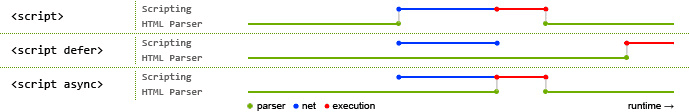
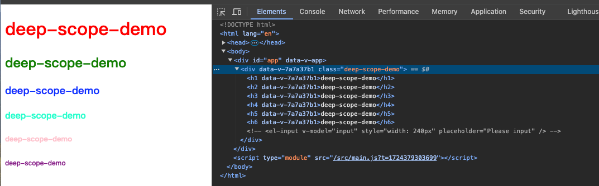
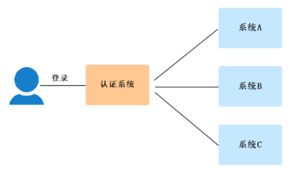

---
sidebar:
  title: EveryT - 开始
  step: 5
  isTimeLine: true
title: EveryT - 开始
tags:
  - 笔记
categories:
  - 笔记
---

# EveryT - 开始

## 十月
[十月移至此处](https://icodehub.top/blog/information/EveryT-Oct.html)

## Git 中本地项目连接远程仓库，怎么操作呢？（2024-9-30）
- 首先在本地创建一个项目，然后执行`git init`初始化仓库
- 然后执行`git remote add origin 远程仓库地址`，将本地项目与远程仓库关联
- 执行`git add .`，将所有文件添加到暂存区
- 执行`git commit -m "提交信息"`，将暂存区的内容提交到本地仓库
- 执行`git push -u origin master`，将本地仓库的内容推送到远程仓库

## 如何修改 node_modules 包代码呢？（2024-9-29）

使用`patch-package`，这是一个专门用来修改`node_modules`中包的代码的工具

**如何操作呢？**

- 修改包里面源代码
- 执行`yarn patch-package packageName`或者`npx patch-package packageName` ，它会生成一个`patches`目录，里面有一个`packageName+ .patch`文件
- 然后在 package.json 中添加命令 `"postinstall": "patch-package"`
- 当你的同事去执行`yarn`的时候，会自动执行`yarn postinstall`这个命令，也就是执行`patch-package`，这时候就回去读取刚刚的`patches`目录，并将那些补丁达到对应的包里

## 运行 npm run xxx 的时候发生了什么？（2024-9-28）

- 运行`npm run xxx`的时候，npm 会先在当前目录的 `node_modules/.bin` 查找要执行的程序，如果找到则运行
- 没有找到则从全局的 node_modules/.bin 中查找
- 如果全局目录还是没找到，那么就从 path 环境变量中查找有没有其他同名的可执行程序

[去学习](https://blog.51cto.com/u_15077533/4531157)

## Vue3.5 新增特性（2024-9-27）

[Vue3.5 新增特性](https://icodehub.top/blog/vue/vue3/vue3-3.5.html)

## Vue3.4 新增特性（2024-9-26）

[Vue3.4 新增特性](https://icodehub.top/blog/vue/vue3/vue3-3.4.html)

## Vue3.3 新增特性（2024-9-25）

[Vue3.3 新增特性](https://icodehub.top/blog/vue/vue3/vue3-3.3.html)

## Vue3.2 新增特性（2024-9-24）

[Vue3.2 新增特性](https://icodehub.top/blog/vue/vue3/vue3-3.2.html)

## ref 与 reactive 使用时的一些注意事项（2024-9-23）

### Vue3 ref 在哪些情况下会丢失响应式？

<br/>

#### 整体赋值会丢失响应式

对于 ref 定义的对象，如果直接整体赋值（如`count = ref({...})`），会丢失响应性。应该通过修改`.value`的属性来保持响应性。

```js
const count = ref(0);

// 这样子会导致 count 丢失响应式
count = ref(66);

// 这样就不会丢失响应式了
count.value = 66;
```

### Vue3 reactive 在哪些情况下会丢失响应式？

<br/>

#### 整体赋值会丢失响应式

由于 Vue 的响应式跟踪是通过属性访问实现的，因此我们必须始终保持对响应式对象的相同引用。这意味着我们不能轻易地“替换”响应式对象，因为这样的话与第一个引用的响应性连接将丢失：

```js
let state = reactive({ count: 0 });

// 上面的 ({ count: 0 }) 引用将不再被追踪
// (响应性连接已丢失！)
state = reactive({ count: 1 });
// 或者 这样子也会导致丢失响应式
state = { count: 2 };
```

#### 解构也会丢失响应式

当我们将响应式对象的原始类型属性解构为本地变量时，或者将该属性传递给函数时，我们将丢失响应性连接：

```js
const state = reactive({ count: 0 });

// 当解构时，count 已经与 state.count 断开连接
let { count } = state;
// 不会影响原始的 state
count++;

// 该函数接收到的是一个普通的数字
// 并且无法追踪 state.count 的变化
// 我们必须传入整个对象以保持响应性
callSomeFunction(state.count);
```

由于这些限制，建议使用 ref() 作为声明响应式状态的主要 API。

#### Vue3 在模板中解包的注意事项

在模板渲染上下文中，只有顶级的 ref 属性才会被解包。

在下面的例子中，`count` 和 `object` 是顶级属性，但 `object.id` 不是：

```js
const count = ref(0);
const object = { id: ref(1) };
```

因此，这个表达式按预期工作：

```vue
{{ count + 1 }}
```

但这个**不会**：

```vue
{{ object.id + 1 }}
```

渲染的结果将是 `[object Object]1`，因为在计算表达式时 `object.id` 没有被解包，仍然是一个 ref 对象。为了解决这个问题，我们可以将 `id` 解构为一个顶级属性：

```js
const { id } = object;
```

```vue
{{ id + 1 }}
```

现在渲染的结果将是 `2`。

另一个需要注意的点是，如果 ref 是文本插值的最终计算值 (即 `{{ }}` 标签)，那么它将被解包，因此以下内容将渲染为 `1`：

```vue
{{ object.id }}
```

该特性仅仅是文本插值的一个便利特性，等价于。

```vue
{{ object.id.value }}
```

[响应式基础 - 去看看](https://cn.vuejs.org/guide/essentials/reactivity-fundamentals.html#reactive-variables-with-ref)

## 日常 3 问（2024-9-22）

### Vue3 中的 Teleport 是什么？它的作用是什么？

`Teleport 是 Vue 3 引入的一个新特性，它允许开发者将组件的内容渲染到 DOM 中的任意位置`，即使这个位置在组件的挂载点之外。这一特性使得开发者能够更灵活地处理布局和嵌套问题，特别是在处理模态框、弹出框、通知栏等需要脱离组件层级结构的场景时。

#### Teleport 的作用

1. 解决布局和嵌套问题

   - 在 Vue 2 中，组件的内容只能渲染到组件自身的父级元素中，这限制了组件的灵活性和可重用性。而 Teleport 允许开发者将组件的内容渲染到 DOM 中的任何位置，从而解决了这一限制。
   - 例如，当需要在一个全局的模态框或弹出框中显示内容时，这些内容通常不应该被限制在触发它们的组件内部。通过使用 Teleport，可以轻松地将这些内容渲染到页面的其他位置，如 body 元素下，从而实现跨组件的渲染。

2. 提高组件的灵活性和可重用性

   - 传统的组件渲染方式要求开发者必须按照 DOM 的层级结构来组织组件。然而，在某些情况下，这种层级结构可能会限制组件的灵活性和可重用性。通过使用 Teleport，开发者可以忽略 DOM 的层级结构，将组件的内容渲染到任意位置。
   - 这使得开发者可以更加灵活地组织组件的结构，提高组件的复用性。例如，一个模态框组件可以在多个不同的页面中重用，而无需担心其渲染位置的问题。

3. 简化复杂布局的实现
   - 在处理多列布局、全局头部或脚部等复杂布局时，传统的方式可能需要编写复杂的 CSS 或使用额外的容器元素来组织内容。而 Teleport 允许开发者将内容直接渲染到目标位置，从而简化了布局的实现。
   - 通过将布局相关的内容封装在 Teleport 组件中，并指定其渲染位置为页面的特定区域（如 header、footer 或 main 等），可以更加直观地管理页面的布局结构。

#### Teleport 的使用方法

要在 Vue 3 中使用 Teleport，需要在组件的模板中添加 `<teleport>` 元素，并使用 `to` 属性指定目标位置的选择器。`<teleport>` 元素内部的内容将被渲染到指定的目标位置，而不是在组件自身的位置进行渲染。

```vue
<template>
  <div>
    <!-- 其他组件内容 -->
    <teleport to="body">
      <!-- 需要渲染到指定位置的内容 -->
      <div class="modal">这是一个模态框</div>
    </teleport>
  </div>
</template>
```

### Vue3 为什么可以在 template 中写多个标签？

Vue3 允许在 `template` 中写多个标签，这一改进主要得益于其内部编译机制的更新和优化。具体来说，Vue3 在处理组件模板时引入了基于标记片段（Fragment）的编译机制，这一机制允许模板包含多个根节点，从而提供了更高的灵活性和便利性。

#### 原因分析

1. 编译机制更新

   - 在 Vue2 中，模板（`template`）标签必须有一个根元素，这是因为 Vue2 的编译器需要将模板编译成一个 `render` 函数，而一个函数在 JavaScript 中只能有一个返回值。因此，Vue2 需要一个根元素来包含所有的子节点，以便编译器能够将它们编译成一个返回值。
   - 而在 Vue3 中，通过使用 Fragment（片段）标签或者空标签，可以在 `template` 标签中包含多个根元素。这是因为 Vue3 的新编译器能够将多个根节点编译成一个返回值。这种新的编译机制允许开发者在模板中直接使用多个根元素，而不需要额外的包裹层级。

2. 标记片段（Fragment）的使用

   - 标记片段是一种特殊的数据结构，它可以容纳多个子节点，但并没有实际的 DOM 元素与之对应。在 Vue3 中，编译器会将模板中的每个根级标签（包括自定义组件）都编译为一个单独的标记片段。然后，这些标记片段将作为一个数组，一起创建实际的渲染函数。这样，每个根级标签都能够保留自己的作用域和响应式数据，并且它们可以并行地进行更新。

3. 提升灵活性和便利性
   - 允许在 `template` 中写多个标签，使得开发者可以更灵活地组织模板结构，使代码更加简洁和易读。特别是在处理复杂的组件或页面布局时，这种灵活性尤为重要。

#### 总结

Vue3 允许在 `template` 中写多个标签，主要是因为其内部使用了基于标记片段的编译机制。这种机制不仅解决了 Vue2 中模板必须有一个根元素的限制，还提供了更高的灵活性和便利性，使得开发者能够更轻松地构建复杂的前端应用。

### Vue 3 中有哪些性能优化措施？

Vue 3 中提供了多种性能优化措施，这些措施旨在提升应用的渲染效率、减少不必要的计算和 DOM 操作，以及优化资源加载等。以下是一些主要的性能优化措施：

#### 1. 响应式系统优化

- **Proxy 替代 Object.defineProperty**：Vue 3 使用 Proxy 作为其响应式系统的核心，相较于 Vue 2.x 中的 Object.defineProperty，Proxy 能够提供更高效的变化追踪和更新机制。
- **更细粒度的依赖追踪**：Vue 3 的响应式系统能够更精确地追踪依赖，只在相关数据变化时触发更新，减少了不必要的计算和渲染。

#### 2. 编译优化

- **静态提升（Static Hoisting）**：Vue 3 的编译器在将模板编译为渲染函数时，会尽可能多地提取静态内容（如静态文本、静态属性等），并在编译阶段进行提升，避免了运行时的重复计算。
- **静态节点标记（Static Node Patching）**：在渲染过程中，Vue 3 会使用静态节点标记来跳过静态节点的比较和更新，从而提高渲染性能。

#### 3. DOM 操作优化

- **虚拟 DOM 优化**：Vue 3 使用了更高效的虚拟 DOM 算法，减少了不必要的 DOM 操作和重绘/重排。
- **列表渲染优化**：Vue 3 为列表渲染引入了新的动态更新策略，只会对发生变化的列表项进行更新，而不是重新渲染整个列表。

#### 4. 组件优化

- **异步组件**：Vue 3 支持异步组件，允许按需加载组件，减少了初始加载时的压力，提高了应用的响应速度。
- **keep-alive**：使用 `keep-alive` 组件可以缓存组件实例，避免在组件切换时重新创建和销毁组件，提高了性能。

#### 5. 缓存优化

- **事件处理函数缓存**：Vue 3 将事件处理函数缓存起来，避免了每次渲染都重新创建事件处理函数的开销。
- **计算属性缓存**：使用计算属性（computed）可以缓存计算结果，避免在模板中进行复杂的计算，减少了不必要的渲染。

#### 6. 资源优化

- **图片和媒体资源优化**：通过压缩图片、使用适当的图片格式、懒加载图片等方式，可以提高应用的加载速度和性能。
- **代码拆分和懒加载**：使用 Webpack 等工具进行代码拆分和懒加载，可以将公共库、第三方依赖、大型组件等拆分成单独的包进行加载和缓存，提高应用的性能和用户体验。

#### 7. TypeScript 支持

- **更好的 TypeScript 支持**：Vue 3 使用 TypeScript 重新编写了核心代码，提供了更好的类型支持和开发体验，有助于减少运行时错误和调试时间。

#### 8. 其他优化措施

- **合理使用 key 属性**：在使用 `v-for` 进行列表渲染时，为每个项指定唯一的 key 属性有助于更高效地重用和更新 DOM。
- **合理使用 v-show 和 v-if**：在需要频繁切换显示或隐藏的元素上，使用 `v-show` 可以避免频繁的 DOM 重新创建和销毁，从而提高性能。

综上所述，Vue 3 通过多种性能优化措施，使得开发者能够构建出更快、更高效、更易于维护的 Web 应用。

## 日常 3 问（2024-9-21）

### script setup 是干什么的？

`script setup`是 Vue3 的语法糖，简化了组合式 API 的写法，并且运行性能更高，使用`script setup`语法糖的特点：

- 属性和方法无需返回，直接使用；

- 引入组件的时候，会自动注册；

- 使用`defineProps`接收父组件传递的值；

- 使用`useAttrs`获取属性，`useSlots`获取插槽，`defineEmits`获取自定义事件；

- 默认不会对外暴露任何属性，如果有需要使用`defineExpose`；

### Vue3.0 里为什么要用 Proxy API 替代 defineProperty API？

Vue3.0 选择使用 Proxy API 替代 defineProperty API，主要基于以下几个方面的原因：

#### 1. 性能优化

- **减少遍历**：Proxy API 可以直接监听对象本身，而不需要像 defineProperty API 那样遍历对象的每个属性进行拦截。这使得在捕获对象的访问和修改时更为高效，特别是在处理大型对象或复杂数据结构时，性能优势更为明显。
- **递归拦截**：Proxy API 能够递归地拦截对象的嵌套属性，而 defineProperty API 无法自动递归处理嵌套对象。这一特性使得在 Vue 3.0 中处理嵌套对象更加简单和方便，也提高了整体的性能。

#### 2. 更好的响应式能力

- **数组变化检测**：Proxy API 可以直接拦截数组的索引访问和修改，使得对数组的变化更容易被监听到。相比之下，defineProperty API 在处理数组时存在限制，如无法检测到数组索引的改变，这导致了 Vue 2.x 在处理数组时需要依赖一些特殊的方法来触发视图更新。
- **属性添加/删除**：Proxy API 可以拦截对象的属性添加和删除操作，而 defineProperty API 则需要在添加或删除属性时手动调用相关函数来更新响应式系统。这使得在 Vue 3.0 中处理对象属性的动态变化更加灵活和方便。

#### 3. 更多的拦截方法

- **全面的拦截操作**：Proxy API 提供了更多的拦截方法，支持对目标对象的读取、设置、删除、枚举等操作的拦截，甚至还可以拦截函数调用和构造函数实例化。这使得 Vue 3.0 的响应式系统更加完善和强大。

#### 4. 简化内部实现

- **灵活的数据劫持**：Proxy API 的灵活性使得 Vue 3.0 可以更灵活地实现数据劫持和响应式更新。例如，在 Vue 3.0 中，可以通过 Proxy API 来拦截对响应式对象的所有操作，并根据需要执行相应的更新逻辑。

#### 5. 兼容性考虑

- **对低版本浏览器的支持**：虽然 Proxy API 是 ES6 中引入的新特性，不支持低版本浏览器（如 IE11），但 Vue 3.0 可以通过提供特殊版本的代码或使用 polyfill 等方式来确保对低版本浏览器的兼容性。此外，随着现代浏览器的发展，越来越多的浏览器开始支持 Proxy API，这使得 Vue 3.0 的应用范围更加广泛。

综上所述，Vue3.0 选择使用 Proxy API 替代 defineProperty API 是出于性能优化、更好的响应式能力、更多的拦截方法、简化内部实现以及兼容性考虑等多方面的因素。这一改变使得 Vue 3.0 的响应式系统更加完善和强大，也为开发者提供了更加灵活和高效的开发体验。

### 组件中写 name 选项有哪些好处？

- 可以通过名字找到对应的组件（ 递归组件：组件自身调用自身 ）
- 可以通过 `name` 属性实现缓存功能（`keep-alive`）
- 可以通过 `name` 来识别组件（跨级组件通信时非常重要）
- 使用 `vue-devtools` 调试工具里显示的组见名称是由 `vue` 中组件 `name` 决定的

## 认识 HTTP 5 种传输方式（2024-9-20）

对于前端来说，后端主要是提供 http 接口来传输数据，而这种数据传输的方式主要有 5 种：

- url param
- query
- form-urlencoded
- form-data
- json

前面 2 种是通过 url 传递数据，而后面 3 种则是通过请求体传递数据。

### url param

我们可以把参数写在 url 中，比如：

```txt
https://icodehub.top/blog/1111
```

这里的 1111 就是路径中的参数（url param），服务端框架或者单页应用的路由都支持从 url 中取出参数。

### query

通过 url 中 ？后面的用 & 分隔的字符串传递数据，比如：

```txt
http://icodehub.top/blog?name=sy&age=18
```

这里的 name 和 age 就是 query 传递的数据。

### form-urlencoded

直接用 form 表单提交数据就是这种，它和 query 字符串的方式的区别只是放在了 body 里，然后指定下 content-type 是 application/x-www-form-urlencoded。

### form-data

form data 不再是通过 & 分隔数据，而是用 --------- + 一串数字做为 boundary 分隔符。因为不是 url 的方式了，自然也不用再做 url encode。

form-data 需要指定 Content-Type 为 multipart/form-data，然后指定 boundary 也就是分割线。

body 里面就是用 boundary 分隔符分割的内容。

很明显，这种方式适合传输文件，而且可以传输多个文件。

但是毕竟多了一些只是用来分隔的 boundary，所以请求体会增大。

`一般用于文件传输`

### json

form-urlencoded 需要对内容做 url encode，而 form data 则需要加很长的 boundary，两种方式都有一些缺点。如果只是传输 json 数据的话，不需要用这两种。

可以直接指定 Content-Type 为 application/json 就行：

我们平时传输 json 数据基本用的是这种。

### Content-Type 的介绍

Content-Type 是一个 HTTP 标头，用于指示请求体或响应体的媒体类型。它告诉服务器实际发送的数据类型是什么，以便服务器能够正确处理和解析响应体。

常见的 Content-Type 值包括：

- `application/json`：表示请求体或响应体是一个 JSON 格式的数据。
- `application/x-www-form-urlencoded`：表示请求体或响应体是一个 URL 编码的表单数据。
- `multipart/form-data`：表示请求体或响应体是一个多部分表单数据，通常用于文件上传。

## Vite 环境配置与跨域配置（2024-9-19）

[Vite 环境配置与跨域配置](https://icodehub.top/blog/vite/vite-env-cross-orign.html)

## H5 页面跳转小程序的 3 种实现方式（2024-9-18）

[H5 页面跳转小程序的 3 种实现方式](https://icodehub.top/blog/project/H5页面跳转小程序的3种实现方式.html)

## 日常 3 问（2024-9-17）

### 对 SPA 单页面的理解，它的优缺点分别是什么？

SPA（ single-page application ）仅在 Web 页面初始化时加载相应的 HTML、JavaScript 和 CSS。一旦页面加载完成，SPA 不会因为用户的操作而进行页面的重新加载或跳转；取而代之的是利用路由机制实现 HTML 内容的变换，UI 与用户的交互，避免页面的重新加载。

**优点：**

- 用户体验好、快，内容的改变不需要重新加载整个页面，避免了不必要的跳转和重复渲染；

- 基于上面一点，SPA 相对对服务器压力小；

- 前后端职责分离，架构清晰，前端进行交互逻辑，后端负责数据处理；

**缺点：**

- 初次加载耗时多：为实现单页 Web 应用功能及显示效果，需要在加载页面的时候将 JavaScript、CSS 统一加载，部分页面按需加载；

- 前进后退路由管理：由于单页应用在一个页面中显示所有的内容，所以不能使用浏览器的前进后退功能，所有的页面切换需要自己建立堆栈管理；

- SEO 难度较大：由于所有的内容都在一个页面中动态替换显示，所以在 SEO 上其有着天然的弱势。

### Vue 组件之间通信方式有哪些？

**Vue 2 组件通信方式**

- **props / $emit**
- **$parent / $children**
- **$refs**
- **Event Bus（事件总线）**
- **Vuex**
- **$attrs/$listeners**

**Vue 3 组件通信方式**

- **props / $emit**
- **$parent** ($children 被移除)
- **$refs**
- **Event Bus**（Vue 3 官方没有直接提供 Event Bus 的实现，但可以使用第三方库如 mitt 来模拟。mitt 是一个简单而强大的事件总线库，可以在 Vue 3 项目中使用）
- **Vuex**
- **Pinia**
- **$attrs** ($listeners 被移除)
- **provide / inject**

### 在 Vue 中子组件可以直接改变父组件的数据吗？

**不能直接父组件的数据**

所有的 prop 都使得其父子之间形成了一个`单向下行绑定`：父级 prop 的更新会向下流动到子组件中，但是反过来则不行。这样会防止从子组件意外变更父级组件的状态，从而导致你的应用的数据流向难以理解。另外，每次父级组件发生变更时，子组件中所有的 prop 都将会刷新为最新的值。这意味着你不应该在一个子组件内部改变 prop。如果你这样做了，Vue 会在浏览器控制台中发出警告。

## 日常 3 问（2024-9-16）

### HMR 热更新原理是什么？

**HMR 热更新原理：**

- 通过 `webpack-dev-server` 创建两个服务器：提供静态资源的服务`express`和 `Socket `服务
- `express server` 负责直接提供静态资源的服务（打包后的资源直接被浏览器请求和解析）
- `socket server` 是一个 `websocket` 的长连接，双方可以通信
- 当 `socket server` 监听到对应的模块发生变化时，会生成两个文件`.json`文件和`.js` 文件（update chunk）
- 通过长连接，`socket server` 可以直接将这两个文件主动发送给客户端（浏览器）
  浏览器拿到两个新的文件后，通过 HMR runtime 机制，加载这两个文件，并且针对修改的模块进行更新

**总结：**

- 创建 2 个服务： 一个提供静态资源服务，一个提供长连接服务
- 当长连接服务监听到对应模块发生变化，生成对应修改的文件（json、js 文件），然后将这两个文件发给浏览器
- 浏览器拿到这两个新的文件后，加载这两个文件，针对修改的模块进行更新

### treeShaking 机制的原理是什么？

`Tree shaking` 是一种通过清除多余代码方式来优化项目打包体积的技术，专业术语叫 `Dead code elimination`

**tree shaking 的原理是什么?**

- **静态分析**：在打包过程中，通过静态分析代码的引用关系，识别出未被引用的代码（例如未被导出或未被其他代码直接引用的函数、变量等）。

- **标记未引用代码**：识别出未被引用的代码后，将其标记为“未引用”，形成一个“未引用代码集合”。

- **移除未引用代码**：在构建最终的代码包时，将标记为“未引用”的代码从代码包中剔除，从而减小最终生成的代码包大小。

值得注意的是，`tree shaking` 基于静态代码分析，因此只能消除那些静态分析阶段能够确定为未引用的代码，对于动态引用的代码无法进行处理。在实际开发中，通常与模块打包工具（如 Webpack、Rollup 等）结合使用，通过 `ES6 模块的静态特性`实现未引用代码的消除。

### babel 原理是什么？

`babel`是一个工具链，主要用于旧浏览器或者缓解中将 ECMAScript 2015+代码转换为向后兼容版本的 JavaScript

包括：语法转换、源代码转换、Polyfill 实现目标缓解缺少的功能等

Babel 的工作原理主要涉及三个主要步骤：**解析（Parse）**、**转换（Transform）**和**生成（Generate）**

下面是三个步骤的简要介绍：

1. 解析（Parse）：
   - Babel 首先将输入的 JavaScript 代码解析为抽象语法树（AST, Abstract Syntax Tree）。这个过程包括词法分析和语法分析。
   - 词法分析阶段，Babel 将代码字符串分解为一系列的标记（tokens），这些标记代表了代码中的最小单位，如变量名、操作符等。
   - 语法分析阶段，Babel 使用这些标记构建出代码的语法结构，形成 AST。AST 是一种树状数据结构，用于表示源代码的抽象语法结构，它将代码的每个语法结构（如表达式、语句、函数定义等）表示为树中的节点，并建立节点之间的关系。
2. 转换（Transform）：
   - 在 AST 构建完成后，Babel 遍历这个 AST，对每个节点进行转换操作。这些转换可以是添加、修改或删除节点，以及对节点进行其他操作。
   - 转换操作可以是自定义的，也可以使用 Babel 提供的插件。插件是 Babel 的核心，它们允许开发者根据自己的需求编写自定义的转换规则，或使用已有的插件来实现特定的转换操作。
   - 通过这种方式，Babel 可以将使用新语法特性编写的代码转换为使用旧版 JavaScript 语法的等效代码。
3. 生成（Generate）：
   - 在转换过程完成后，Babel 将转换后的 AST 重新生成为可执行的 JavaScript 代码。这个过程将 AST 转换回 JavaScript 代码的字符串形式。
   - 最终生成的代码将包含所有必要的转换，以确保它可以在旧版浏览器或环境中运行。

## 日常 3 问（2024-9-15）

### js 如何控制一次只加载一张图片，如何控制加载完成后再加载下一张呢？

在 JavaScript 中，如果你希望控制图片按顺序加载，即一次只加载一张图片并在其加载完成后再加载下一张，你可以通过监听图片的`load`事件来实现这一功能。以下是一个简单的示例，展示了如何做到这一点：

```js
const imgArrs = [...]; // 图片地址
const content = document.getElementById('content');
const loadImg = () => {
  if (!imgArrs.length)  return;
  const img = new Image(); // 新建一个Image对象
  img.src = imgArrs[0];
  img.setAttribute('class', 'img-item');
  img.onload = () => { // 监听onload事件
    // setTimeout(() => { // 使用setTimeout可以更清晰的看清实现效果
      content.appendChild(img);
        imgArrs.shift();
        loadImg();
    // }, 1000);
  }
  img.onerror = () => {
    // do something here
  }
}
// 开始递归
loadImg();

```

### 为什么开发的时候图片要使用二倍图？

在实际开发中，当一个 50 ×50 像素（CSS 像素）的图片直接放到 iPhone 6/7/8 设备中显示时，图片会被放大，变成原来的两倍（iPhone 6/7/8 的设备像素比为 2），即 100 ×100。

为了避免图片放大后模糊，我们可以预先制作一张 100 ×100 的图片，然后在网页中手动设置这个图片的样式，将图片的宽和高都设为 50 像素。这样，这张图片就会以它原本的像素（100 ×100）来显示，保证了图片的原有清晰度。

**扩展：**

**①、什么是设备像素比（dpr）**

- 又称为物理像素。
- 指设备能控制显示的最小物理单位，意指显示器上一个个的点。从屏幕在工厂生产出的那天起，它上面设备像素点就固定不变了，设备像素的特点就是大小固定，不可变。比如 iPhone 5 的分辨率为 640 x 1136px。
- 这个单位用 px 表示，它是一个[相对绝对单位]
  - 即在`同样一个设备上`，每 1 个设备像素所代表的物理长度(如英寸)是固定不变的(即设备像素的绝对性);
  - 但在`不同的设备之间`，每 1 个设备像素所代表的物理长度(如英寸)是可以变化的(即设备像素的相对性);
- 我们所说的设备分辨率的单位就是设备像素。
- 有了设备像素概念，我们就可以解释下表中：不同英寸大小的移动设备上，分辨率却相同的原因了————因为设备像素的相对性

### 为什么小程序里拿不到 dom 相关的 api？

微信小程序采用了类似于 Web 的 wxml 和 wxss 语言来描述页面结构和样式，但是却没有提供直接操作 DOM 的 API。

这是因为小程序本身是在一个 JavaScript 环境中运行的，其选用的是 JavaScriptCore 引擎，而不是浏览器中常见的 V8 引擎。JavaScriptCore 与 V8 引擎的实现方式存在较大差异，其中一个显著的特点是 JavaScriptCore 的执行速度较慢。对于小程序开发者来说，直接操作 DOM 会比较耗时，会导致性能下降和体验差。

**扩展**

**那在小程序中如何操作 DOM 元素呢？**

小程序没有提供像 Web 开发中那样的 `document.querySelector` 或 `document.getElementById` 等 DOM 查询方法，但小程序提供了一些类似的 API 来查询页面上的元素。例如，在微信小程序中，你可以使用 `wx.createSelectorQuery()`来创建一个选择器查询对象，并通过它来查询页面上的元素。不过，这种查询通常用于获取元素的布局位置、大小等信息，而不是用于直接操作元素。

## 日常 3 问（2024-9-14）

### img 标签产生的空白间隙怎么处理？

`img` 标签在 HTML 中经常会产生一些不期望的空白间隙（也称为“底部间隙”），这主要是由于 HTML 中行内元素（包括 `img`）的基线对齐方式导致的。默认情况下，图片会与其基线对齐，这可能会导致图片下方出现一些额外的空间。要处理这个问题，有几种方法可以尝试：

**解决方案**

- `vertical-align` 属性可以用来改变元素的垂直对齐方式。将 `img` 标签的 `vertical-align` 设置为 `top`、`middle`、`bottom` 可以消除或调整这个间隙
- 将 `img` 设置为块级元素，消除基线对齐的影响
- 设置 font-size: 0，去除 HTML 代码中的空白字符;

### Vue3 中动态引入本地图片在，怎么引入呢？

可以通过 `new URL('xxx.png', import.meta.url).href` 来 获取图片的绝对路径

`new URL('xxx.png', import.meta.url)` 是 ES Modules 中用于获取资源的绝对路径的一种方式。以下是对这个语法的详细解析：

#### new URL()

`URL` 是一个内置的 JavaScript 构造函数，用于创建 URL 对象。可以使用它来解析和构建 URL。

#### 语法

```javascript
new URL(relative, base);
```

- **relative**: 这是要解析的相对 URL。
- **base**: 这是用作基础 URL 的字符串。通常是一个完整的 URL。

#### import.meta.url

`import.meta` 是一个包含有关当前模块的元信息的对象。在 ES Modules 中，`import.meta.url` 返回当前模块的完整 URL。这意味着它提供了当前 JavaScript 文件的绝对路径。

### Vue3 API defineExpose 了解吗？

使用 `<script setup>` 的组件是**默认关闭**的——即通过模板引用或者 `$parent` 链获取到的组件的公开实例，**不会**暴露任何在 `<script setup>` 中声明的绑定。

可以通过 `defineExpose` 编译器宏来显式指定在 `<script setup>` 组件中要暴露出去的属性：

```vue
<script setup>
import { ref } from "vue";

const a = 1;
const b = ref(2);

defineExpose({
  a,
  b,
});
</script>
```

当父组件通过模板引用的方式获取到当前组件的实例，获取到的实例会像这样 `{ a: number, b: number }` (ref 会和在普通实例中一样被自动解包)

## 日常 3 问（2024-9-13）

### 在页面中添加水印可以通过控制台移除，那么怎么样才能避免用户移除水印呢?

可以通过用 MutationObserver 监听，重新添加水印

示例代码：

```js
function watermark(options = {}) {
  const {
    container = document.body, // 容器
    width = "240", // canvas元素宽
    height = "100", // canvas元素高
    textAlign = "left", // 文字对齐
    textBaseline = "bottom", // 基准线
    font = "16px Microsoft Yahei", // 字体大小及样式
    fillStyle = "#000", // 自定义水印的颜色
    content = "进制外传", // 水印内容
    globalAlpha = 0.3, // 设置图形和图像透明度的值
    rotate = 16, // 文字旋转角度
    zIndex = 1000, // 元素堆叠顺序
  } = options;

  const canvas = document.createElement("canvas");
  canvas.setAttribute("width", width);
  canvas.setAttribute("height", height);
  const ctx = canvas.getContext("2d"); // 获取 canvas2d 上下文
  ctx.globalAlpha = globalAlpha;
  ctx.textAlign = textAlign;
  ctx.textBaseline = textBaseline;
  ctx.font = font;
  ctx.fillStyle = fillStyle;
  ctx.rotate((Math.PI * rotate) / 180);
  // ctx.rotate(-10 * Math.PI / 140);
  ctx.fillText(content, 50, 50);

  const base64Url = canvas.toDataURL(); // 返回一个包含图片展示的 data URI

  const __wm = document.querySelector(".__wm"); // 选择器
  const watermarkDiv = __wm || document.createElement("div");
  const waterMarkStyle = `
    position:absolute;
    top:0px;
    left:0px;
    width:100%;
    height:100%;
    z-index:${zIndex};
    pointer-events:none;
    background-repeat:repeat;
    background-image:url('${base64Url}')`;

  watermarkDiv.setAttribute("style", waterMarkStyle);
  watermarkDiv.classList.add("__wm"); // 为元素添加“__wm”类名

  container.style.position = "relative";
  container.appendChild(watermarkDiv); // 添加元素

  // 监听删除 防止用户去手动删除，如果手动删除 ，在重新添加
  const MutationObserver =
    window.MutationObserver || window.WebKitMutationObserver;
  // 检查浏览器是否支持这个API
  if (MutationObserver) {
    const args = arguments[0];
    const __wm = document.querySelector(".__wm");
    let mo = new MutationObserver(function () {
      // 只在__wm元素变动才重新调用
      if (
        (__wm && __wm.getAttribute("style") !== waterMarkStyle) ||
        !__wm ||
        document.body.style.position !== "relative"
      ) {
        // 避免一直触发
        mo.disconnect();
        mo = null;
        watermark(args);
      }
    });
    mo.observe(__wm, {
      // 视情况开启
      attributes: true, // 观察目标节点的属性节点
      subtree: false, // 观察目标节点的所有后代节点
      childList: true, // 观察目标节点的子节点
    });
  }
}
export default watermark;
```

### width:100% 与 width:auto 有什么区别呢?

- width:100% : 子元素的 content 撑满父元素的 content，如果子元素还有 padding、border 等属性，或者是在父元素上设置了边距和填充，都有可能会造成子元素区域溢出显示

- width:auto : 子元素的 content + padding + border + margin 等撑满父元素的 content 区域

### 运行 npm run xxx 的时候发生了什么？

运行 npm run xxx 的时候，npm 会先在当前目录的 node_modules/.bin 查找要执行的程序，如果找到则运行
没有找到则从全局的 node_modules/.bin 中查找
如果全局目录还是没找到，那么就从 path 环境变量中查找有没有其他同名的可执行程序

## 日常 3 问（2024-9-12）

### ES5 如何实现 let 和 const 呢？

**let 的特性**

- 在块级作用域内有效
- 不能重复声明
- 不能预处理，不存在变量提升，即未声明之前的代码不能调用

我们可以通过匿名函数和闭包的形式来模拟 let

```js
(function () {
  var c = 3;
  console.log(c); // 1
})();
console.log(c); // c is not defined
```

**count 的特性**

- 在块级作用域内有效
- 不能重复声明
- 不能预处理，不存在变量提升，即未声明之前的代码不能调用

我们可以通过 Object.defineProperty 来模拟 const

```js
function _const(key, value) {
  window[key] = value;
  Object.defineProperty(window, key, {
    enumerable: false, // 不可枚举
    configurable: false, // 不可配置
    get: function () {
      return value;
    },
    set: function (newValue) {
      if (newValue !== value) {
        throw TypeError("这是只读变量，不可修改");
      } else {
        return value;
      }
    },
  });
}
```

### base64 为什么比 png 大？

一般情况下，base64 编码后的字符串长度会比原始图片的大小大约为 4/3 左右。这是因为 base64 编码将 3 个字节转换为 4 个字符，同时可能会添加一些填充字符。
此外，图片在编码为 base64 格式时，通常会进行二进制转换，将每个像素的颜色信息转换为二进制数据，然后再将这些二进制数据编码为 base64 字符串。由于 base64 编码使用的是文本形式表示二进制数据，因此在编码过程中可能会引入一些额外的开销和填充，从而导致编码后的字符串比原始图片的大小更大。

### 为什么 Vue3 中使用 ref 定义的变量要用 .value 呢?

源码中 使用 了 get value 函数和 set value 函数, 在使用 getter 和 setter 的时候为实例创建一个伪属性（value）

大概源码展示:

```js
class RefImpl {
  private _value // 私有的值
  private _rawValue // 私有的原始值
  public readonly __v_isRef = true
  constructor(value, public readonly __v_isShallow: boolean) {
    this._rawValue = value
    this._value = __v_isShallow ? value : toReactive(value)
  }

  // 代理
  get value() {
    // 收集依赖
    track(this, trackOpTypes.GET, 'value')
    return this._value
  }
  set value(newVal) {
    if(hasChanged(newVal, this._rawValue)) {
       this._rawValue = newVal
       this._value =  this.__v_isShallow ? newVal : toReactive(newVal)
       // 触发依赖
       trigger(this, TriggerOrTypes.SET, 'value', newVal)
    }
  }
}
```

## npm、yarn、pnpm 的区别？（2024-9-11）

[npm、yarn、pnpm 的区别？](https://icodehub.top/blog/engineering/npm%E3%80%81yarn%E3%80%81pnpm%E7%9A%84%E5%8C%BA%E5%88%AB%EF%BC%9F.html)

## 日常 3 问（2024-9-10）

### Javascript 本地存储的方式有哪些，有什么区别，及有哪些应用场景？

`javaScript` 本地缓存的方法我们主要讲述以下四种：

- cookie
- sessionStorage
- localStorage
- indexedDB

**cookie**

`Cookie`，类型为「小型文本文件」，指某些网站为了辨别用户身份而储存在用户本地终端上的数据。是为了`解决 HTTP 无状态导致的问题`

作为一段一般不超过 4KB 的小型文本数据，它由一个名称（Name）、一个值（Value）和其它几个用于控制 cookie 有效期、安全性、使用范围的可选属性组成

但是 cookie 在每次请求中都会被发送，如果不使用 HTTPS 并对其加密，其保存的信息很容易被窃取，导致安全风险。举个例子，在一些使用 cookie 保持登录态的网站上，如果 cookie 被窃取，他人很容易利用你的 cookie 来假扮成你登录网站

**localStorage**

- 生命周期：持久化的本地存储，除非主动删除数据，否则数据是永远不会过期的
- 存储的信息在同一域中是共享的
- 当本页操作（新增、修改、删除）了`localStorage` 的时候，本页面不会触发 storage 事件,但是别的页面会触发`storage` 事件。
- 大小：5M（跟浏览器厂商有关系）
- `localStorage` 本质上是对字符串的读取，如果存储内容多的话会消耗内存空间，会导致页面变卡
- 受同源策略的限制

**sessionStorage**

`sessionStorage` 和 `localStorage` 使用方法基本一致，唯一不同的是生命周期，一旦页面（会话）关闭，`sessionStorage` 将会删除数据

**indexedDB**

`indexedDB` 是一种低级 API，用于客户端存储大量结构化数据(包括, 文件/ blobs)。该 API 使用索引来实现对该数据的高性能搜索

虽然 Web Storage 对于存储较少量的数据很有用，但对于存储更大量的结构化数据来说，这种方法不太有用。`IndexedDB` 提供了一个解决方案

**区别**

- 存储大小： `cookie` 数据大小不能超过 4k，`sessionStorage` 和`localStorage` 虽然也有存储大小的限制，但比`cookie` 大得多，可以达到 5M 或更大

- 有效时间：`localStorage `存储持久数据，浏览器关闭后数据不丢失除非主动删除数据；` sessionStorage` 数据在当前浏览器窗口关闭后自动删除；`cookie`设置的 `cookie` 过期时间之前一直有效，即使窗口或浏览器关闭

- 数据与服务器之间的交互方式， `cookie` 的数据会自动的传递到服务器，服务器端也可以写 cookie 到客户端；` sessionStorage` 和` localStorage` 不会自动把数据发给服务器，仅在本地保存

**应用场景**

在了解了上述的前端的缓存方式后，我们可以看看针对不对场景的使用选择：

- 标记用户与跟踪用户行为的情况，推荐使用`cookie`
- 适合长期保存在本地的数据（令牌），推荐使用`localStorage`
- 敏感账号一次性登录，推荐使用`sessionStorage`
- 存储大量数据的情况、在线文档（富文本编辑器）保存编辑历史的情况，推荐使用`indexedDB`

### 前端跨页面通信，你知道哪些方法？

在前端中，有几种方法可用于实现跨页面通信：

- **LocalStorage 或 SessionStorage**：这两个 Web 存储 API 可以在不同页面之间共享数据。一个页面可以将数据存储在本地存储中，另一个页面则可以读取该数据并进行相应处理。通过监听 storage 事件，可以实现数据的实时更新。

- **Cookies**：使用 Cookies 也可以在不同页面之间传递数据。通过设置和读取 Cookie 值，可以在同一域名下的不同页面之间交换信息。

- **PostMessage**：window.postMessage() 方法允许从一个窗口向另一个窗口发送消息，并在目标窗口上触发 message 事件。通过指定目标窗口的 origin，可以确保只有特定窗口能够接收和处理消息。

- **Broadcast Channel**：Broadcast Channel API 允许在同一浏览器下的不同上下文（例如，在不同标签页或 iframe 中）之间进行双向通信。它提供了一个类似于发布-订阅模式的机制，通过创建一个广播频道，并在不同上下文中加入该频道，可以实现消息的广播和接收。

- **SharedWorker**：SharedWorker 是一个可由多个窗口或标签页共享的 Web Worker，它可以在不同页面之间进行跨页面通信。通过 SharedWorker，多个页面可以通过 postMessage 进行双向通信，并共享数据和执行操作。

- **IndexedDB**：IndexedDB 是浏览器提供的一个客户端数据库，可以在不同页面之间存储和共享数据。通过在一个页面中写入数据，另一个页面可以读取该数据。

- **WebSockets**：WebSockets 提供了全双工的、双向通信通道，可以在客户端和服务器之间进行实时通信。通过建立 WebSocket 连接，可以在不同页面之间通过服务器传递数据并实现实时更新。

### 如何判断元素是否在可视区域？

**如何判断元素是否在可视区域？主要有三种方法**

**方法一**

- 通过 document.documentElement.clientHeight 获取屏幕可视窗口高度
- 通过 element.offsetTop 获取元素相对于文档顶部的距离
- 通过 document.documentElement.scrollTop 获取浏览器窗口顶部与文档顶部之间的距离，也就是滚动条滚动的距离

然后判断 ②-③<① 是否成立，如果成立，元素就在可视区域内。


**方法二：通过 getBoundingClientRect 方法**
通过 getBoundingClientRect()方法来获取元素的大小以及位置，MDN 上是这样描述的：
`Element.getBoundingClientRect() 方法返回一个 DOMRect 对象，其提供了元素的大小及其相对于视口的位置。`


我们这样判断：

```js
function isInSight(el) {
  const bound = el.getBoundingClientRect();
  const clientHeight = window.innerHeigh;
  // 这里有个+100是为了提前加载。
  return bound.top <= clientHeight + 100;
}
```

**方法三：通过 IntersectionObserver 方法**
IntersectionObserver 可以自动观察元素是否在视口内。

```js
const io = new IntersectionObserver((ioes) => {
  ioes.forEach((ioe) => {
    const el = ioe.target;
    const intersectionRatio = ioe.intersectionRatio;
    if (intersectionRatio > 0 && intersectionRatio <= 1) {
      // intersectionRatio来判断是否在可视区域内，当intersectionRatio > 0 && intersectionRatio <= 1即在可视区域内。
    }
    el.onload = el.onerror = () => io.unobserve(el);
  });
});
```

**总结：**

判断元素是否在可视区域的三种方法

- 通过 document 中的一些方法
- 通过 getBoundingClientRect 方法
- 通过 IntersectionObserver 方法

## 日常 3 问（2024-9-9）

### vue 中怎么缓存当前的组件？缓存后怎么更新？

开发中缓存组件使用 **keep-alive 组件，keep-alive 是 vue 内置组件**，keep-alive 包裹动态组件 component 时，会缓存不活动的组件实例，而不是销毁它们，这样在组件切换过程中将状态保留在内存中，防止重复渲染 DOM。

结合属性 include 和 exclude 可以明确指定缓存哪些组件或排除缓存指定组件。

vue3 中结合 vue-router 时变化较大，之前是 keep-alive 包裹 router-view，现在需要反过来用 router-view 包裹 keep-alive

缓存后如果要获取数据，解决方案可以有以下两种：

- beforeRouteEnter：在有 vue-router 的项目，每次进入路由的时候，都会执行 beforeRouteEnter
- actived：在 keep-alive 缓存的组件被激活的时候，都会执行 actived 钩子

### 为什么 [ ] == [ ] 为 false, [ ] == ![ ] 为 true？

①：为什么 [ ] == [ ] 为 false

在 JS 中对象（包括数组）的`比较是基于它们的引用地址`，而不是它们的内容。即使两个对象的内容相同，它们的引用地址也不同，所以比较结果是 false

②：为什么 [ ] == ![ ] 为 true

- 因为`！`的优先级高于 `==`，首先将空数组转换为 `true`，再取反得 `false`；
- 接着是 `[] == false`，这是布尔值和非布尔值类型比较，首先将 `false` 转换为 `0`，然后调用对象的`toString `方法，返回一个空对象''
- 最后`空对象转换为数值0`，即 `0 == 0 `，结果返回 `true `。

### 三个页面地址为www.baidu.com/a、www.baidu.com/b、www.qq.com` sessionStorage 是否能在这些页面共享，为什么? localStorage 呢?

**sessionStorage 和 localStorage** 只能在同一个域名下共享，不同域名下是不共享的。

所以`www.baidu.com/a`、`www.baidu.com/b` 可以共享，但是和`www.qq.com` 不共享。

## 日常 3 问（2024-9-8）

### vue3 中 watch 和 watchEffect 的区别？

vue3 中 watch 和 watchEffect 的区别主要分下面四个方面来说

**触发时机**

- watch 显式指定依赖源，依赖源更新时执行回调函数
- watchEffect 自动收集依赖源，依赖源更新时重新执行自身

**使用场景**

- watch 适用于比较复杂的场景
- watchEffect 适用于比较简单的场景

**返回值**

- watch:返回一个取消函数，可以使用该函数来取消对数据的监听
- watchEffect:没有返回值

**初始情况**

- watchEffect 在使用时，传入的函数会立刻执行一次。
- watch 默认情况下并不会执行回调函数，除非我们手动设置 immediate 选项

### slot 是什么？有什么作用？原理是什么？

`slot` 又名插槽，是 Vue 的内容分发机制，组件内部的模板引擎使用 slot 元素作为承载分发内容的出口。插槽 slot 是子组件的一个模板标签元素，而这一个标签元素是否显示，以及怎么显示是由父组件决定的。slot 又分三类，`默认插槽`、`具名插槽`和`作用域插槽`。

**默认插槽**：又名匿名查抄，当 slot 没有指定 name 属性值的时候一个默认显示插槽，一个组件内只能有一个匿名插槽。
**具名插槽**：带有具体名字的插槽，也就是带有 name 属性的 slot，一个组件可以出现多个具名插槽。
**作用域插槽**：默认插槽、具名插槽的一个变体，可以是匿名插槽，也可以是具名插槽，该插槽的不同点是在子组件渲染作用域插槽时，可以将子组件内部的数据传递给父组件，让父组件根据子组件的传递过来的数据决定如何渲染该插槽。

实现原理：当子组件 vm 实例化时，获取到父组件传入的 slot 标签的内容，存放在 `vm.$slot` 中，默认插槽为 `vm.$slot.default` ，具名插槽为 `vm.$slot.xxx`，xxx 为插槽名，当组件执行渲染函数时候，遇到 slot 标签，使用 `$slot` 中的内容进行替换，此时可以为插槽传递数据，若存在数据，则可称该插槽为作用域插槽。

### Vue3 通过 proxy 监听数组和对象有何区别？

在 Vue 3 中，使用 Proxy 来监听数组和对象的变化是通过 reactive API 实现的。reactive 函数用于创建响应式对象，而 ref 用于创建响应式基本类型（比如字符串、数字、布尔值）或者可响应式引用对象（比如数组或对象）。

当你使用 reactive 对象时，Vue 会通过 Proxy 包装你的对象，从而在对象内部的属性被访问、修改、添加或删除时，都能够触发响应性系统的更新。

对于数组，Vue 3 为数组的变异方法（例如 push、splice 等）提供了特殊处理，使得它们能够触发视图更新，而不需要额外的操作。

```js
import { reactive, ref } from "vue";

// 响应式对象
const state = reactive({
  object: {
    key: "value",
  },
  array: [1, 2, 3],
});

// 响应式基本类型
const count = ref(0);

// 监听对象属性的变化
state.object.key = "new value"; // 触发更新

// 监听数组的变化
state.array.push(4); // 触发更新

// 监听基本类型的变化
count.value++; // 触发更新
```

## 日常 3 问（2024-9-7）

### reactive 和 ref 的区别, ref 可以定义响应式对象吗?

reactive 和 ref 的区别

- reactive 主要用于定义响应式对象
- ref 主要用于定义响应式基础数据

**总结：**

ref 也是可以定义响应式对象的但是会走 reactive 的逻辑

**最后**

`reactive是通过proxy实现的, 而proxy只支持对象`

`ref是通过Object.defineProperty实现的`

### 说说 vue 中的 nextTick 的使用和原理？

**nextTick 是等待下一次 DOM 更新刷新的工具方法。**

Vue 有个异步更新策略，意思是如果数据变化，Vue 不会立刻更新 DOM，而是开启一个队列，把组件更新函数保存在队列中，在同一事件循环中发生的所有数据变更会异步的批量更新。这一策略导致我们对数据的修改不会立刻体现在 DOM 上，此时如果想要获取更新后的 DOM 状态，就需要使用 nextTick。

开发时，有两个场景我们会用到 nextTick：

- created 中想要获取 DOM 时
- 响应式数据变化后获取 DOM 更新后的状态，比如希望获取列表更新后的高度。

在 Vue 内部，nextTick 之所以能够让我们看到 DOM 更新后的结果·是因为我们传入的 callback 会被添加到队列刷新函数(flushSchedulerQueue)的后面，这样等队列内部的更新函数都执行完毕，所有 DOM 操作也就结束了，callback 自然能够获取到最新的 DOM 值。

### v-model 是如何实现的，语法糖实际是什么？

**① 作用在表单元素上**

动态绑定了 input 的 value 指向了 message 变量，并且在触发 input 事件的时候去动态把 message 设置为目标值：

```html
<input v-model="sth" />
<!-- 等同于 -->
<input v-bind:value="message" v-on:input="message=$event.target.value" />

<!-- $event 指代当前触发的事件对象;
$event.target 指代当前触发的事件对象的dom;
$event.target.value 就是当前dom的value值;
在@input方法中，value => sth;
在:value中,sth => value; -->
```

**② 作用在组件上**

在自定义组件中，v-model 默认会利用名为 value 的 prop 和名为 input 的事件

**本质是一个父子组件通信的语法糖，通过 prop 和 emit 实现** 。 因此父组件 v-model 语法糖本质上可以修改为：

```vue
<child
  :value="message"
  @input="
    function (e) {
      message = e;
    }
  "
></child>
```

**扩展**

- 使用 `model `选项 可以定义 prop 和 emit
- 使用了 sync 修饰符, 就不用再父组件中接受子组件发射的事件

## 日常 3 问（2024-9-6）

### forEach 中 return 有效果吗？如何中断 forEach 循环？

有效果,但是只是不走本次循环,后边的还是会走 **使用`break/continue`无效,会报语法错误**

```js
let arr = [1, 2, 3];
arr.forEach((item, index) => {
  return; //无效
});
```

中断方法：
**官方推荐方法（替换方法）**

- 用 every 和 some 替代 forEach 函数
- every 在碰到 return false 的时候，中止循环
- some 在碰到 return true 的时候，中止循环

### localhost:3000 与 localhost:5000 的 cookie 信息是否共享

**共享**，原因：根据同源策略，cookie 是区分端口的，但是浏览器可以实现 cookie 区分域，而不区分端口，也就是说，同一个 ip 下的多个端口下的 cookie 是共享的！

例如, 在设置 cookie 时, 服务器应该发送类似以下的 HTTP 头部: `Set-Cookie: name=value; Path=/; Domain=localhost; HttpOnly`

这样设置后, 只要浏览器允许, localhost 下的任何端口都可以访问这个 cookie。但是出于安全考虑, 开发者应该谨慎地共享 cookie, 特别是在涉及敏感数据时。

### Array(100).map(x => 1) 结果是多少

`Array(100)` 将会创建一个稀疏数组 (sparse array)，即不存在真实元素，节省内存空间。在控制台上显示为`[empty]`，正因为没有元素，所以它也不会有 `map`操作，所以`Array(100).map(x => 1)`仍然返回为 `[empty]`

## 日常 3 问（2024-9-5）

### flex:1 代表啥?

**flex:1 实际代表的是三个属性的简写**

- flex-grow 是用来增大盒子的，比如，当父盒子的宽度大于子盒子的宽度，父盒子的剩余空间可以利用 flex-grow 来设置子盒子增大的占比
- flex-shrink 用来设置子盒子超过父盒子的宽度后，超出部分进行缩小的取值比例
- flex-basis 是用来设置盒子的基准宽度，并且 basis 和 width 同时存在 basis 会把 width 干掉

```css
.box {
  flex-grow: 1;
  flex-shrink: 1;
  flex-basis: 0%;
}
```

**总结**

- flex-grow 控制 设置子盒子`放大`比例
- flex-shrink 控制 设置子盒子`缩小`比例
- flex-basis 用来设置盒子的基准`宽度`

### setTimeout 延时写成 0，我们一般什么情况会这么做？

在 JavaScript 中，`setTimeout` 函数用于延迟执行一段代码。通常情况下，`setTimeout` 函数的第二个参数表示延迟的时间（以毫秒为单位），**但将这个参数设置为 0 时，并不意味着代码会立即执行，而是将指定的函数作为异步任务添加到异步任务队列中**，等到当前同步任务执行完毕后，再执行 setTimeout 队列中的任务。实际上，这样做是为了改变任务执行的先后顺序，延迟该任务的发生，使之异步执行。

## Promise.all 和 Promise.race 和 Promise.allSettled 有什么区别？

- `Promise.all()`: 接受一个 promise 数组作为参数，如果不是则会调用`Promise.resolve()`方法，将参数转为`Promise`实例再进一步处理(参数可以不是数组，但必须具有`Iterator`接口，且返回的每个成员都是`Promise`实例)，当数组内每个成员的状态变为成功状态时，返回由成员返回值组成的数组。当数组内有一个或多个成员变为失败状态时，返回第一个失败状态成员的返回值

- `Promise.race()`: 参数同`Promise.all()`，只要数组成员有一个成员状态改变，`Promise.race()`返回的 promise 实例状态就会改变

- `Promise.allSettled()`(ES2020)：参数同`Promise.all()`，`Promise.all()`可以确定所有请求都成功了，但是只要有一个请求失败，他就会报错，不管另外的请求是否结束，而`Promise.allSettled()`来确定一组异步操作是否都结束了(不管成功或失败)，当数组每个成员状态都改变时，`Promise.allSettled()`返回的新 promise 对象状态才会改变

## 如何解决前端常见的竞态问题？（2024-9-4）

### 什么是竞态问题

**竞态问题，又叫竞态条件（race condition），它旨在描述一个系统或者进程的输出依赖于不受控制的事件出现顺序或者出现时机。**

**此词源自于两个信号试着彼此竞争，来影响谁先输出。**

简单来说，竞态问题出现的原因是无法保证异步操作的完成会按照他们开始时同样的顺序。举个例子：

- 有一个分页列表，快速地切换第二页，第三页；
- 先后请求 data2 与 data3，分页器显示当前在第三页，并且进入 loading；
- 但由于网络的不确定性，先发出的请求不一定先响应，所以有可能 data3 比 data2 先返回；
- 在 data2 最终返回后，分页器指示当前在第三页，但展示的是第二页的数据。

这就是竞态条件，在前端开发中，常见于搜索，分页，选项卡等切换的场景。

为了有效解决这些问题，可以采取以下几种策略：

### 取消旧请求

当发起新的请求时，取消尚未完成的旧请求是防止竞态问题的一种有效方法。这可以通过不同的 HTTP 请求库来实现：

- XMLHttpRequest (XHR): 使用 abort()方法立即中止请求
  ```js
  const xhr = new XMLHttpRequest();
  xhr.open("GET"， "https://example.com/data");
  xhr.send();
  // 当需要取消请求时
  xhr.abort();
  ```
- Fetch API: 利用 AbortController 来取消请求
  ```js
  const controller = new AbortController();
  const signal = controller.signal;
  fetch("https://example.com/data"， { signal })
    .then((response) => response.json())
    .then((data) => console.log(data))
    .catch((err) => console.error("Fetch error:"， err));
  // 当需要取消请求时
  controller.abort();
  ```
- Axios: 从 v0.22.0 开始，axios 支持通过 AbortController 来取消请求，v0.22.0 之前可以使用 CancelToken 来取消请求

  ```js
  // v0.22.0 之后（包括 v0.22.0）
  const controller = new AbortController();
  axios
    .get("/xxx"， { signal: controller.signal })
    .then(function (response) {
      // 处理成功情况
    })
    .catch(function (error) {
      if (axios.isCancel(error)) {
        console.log("Request canceled"， error.message);
      } else {
        // 处理错误情况
      }
    });
  // 当需要取消请求时
  controller.abort();
  ```

  ```js
  // v0.22.0 之前
  const source = axios.CancelToken.source();
  axios
    .get("/xxx"， {
      cancelToken: source.token，
    })
    .then(function (response) {
      // ...
    });

  source.cancel(); // 取消请求
  ```

### 忽略旧请求

另一种策略是忽略旧请求的响应，我们又有哪些方式来忽略旧的请求呢？：

- 封装指令式 promise
- 使用唯一 id 标识每次请求

### 封装指令式 promise

利用指令式 promise，我们可以手动调用 cancel API 来忽略上次请求。

但是如果每次都需要手动调用，会导致项目中相同的模板代码过多，偶尔也可能忘记 cancel。

我们可以基于指令式 promise 封装一个自动忽略过期请求的高阶函数 onlyResolvesLast。

在每次发送新请求前，cancel 掉上一次的请求，忽略它的回调。

```js
function onlyResolvesLast(fn) {
  // 保存上一个请求的 cancel 方法
  let cancelPrevious = null;

  const wrappedFn = (...args) => {
    // 当前请求执行前，先 cancel 上一个请求
    cancelPrevious && cancelPrevious();
    // 执行当前请求
    const result = fn.apply(this， args);

    // 创建指令式的 promise，暴露 cancel 方法并保存
    const { promise， cancel } = createImperativePromise(result);
    cancelPrevious = cancel;

    return promise;
  };

  return wrappedFn;
}

// 使用
const fn = (duration) =>
  new Promise((r) => {
    setTimeout(r， duration);
  });

const wrappedFn = onlyResolvesLast(fn);

wrappedFn(500).then(() => console.log(1));
wrappedFn(1000).then(() => console.log(2));
wrappedFn(100).then(() => console.log(3));

// 输出 3
```

#### 使用唯一 id 标识每次请求

除了指令式 promise，我们还可以给「请求标记 id」的方式来忽略上次请求。

具体思路是：

- 利用全局变量记录最新一次的请求 id
- 在发请求前，生成唯一 id 标识该次请求
- 在请求回调中，判断 id 是否是最新的 id，如果不是，则忽略该请求的回调

伪代码如下：

```js
function onlyResolvesLast(fn) {
  // 利用闭包保存最新的请求 id
  let id = 0;

  const wrappedFn = (...args) => {
    // 发起请求前，生成新的 id 并保存
    const fetchId = id + 1;
    id = fetchId;

    // 执行请求
    const result = fn.apply(this， args);

    return new Promise((resolve， reject) => {
      // result 可能不是 promise，需要包装成 promise
      Promise.resolve(result).then(
        (value) => {
          // 只处理最新一次请求
          if (fetchId === id) {
            resolve(value);
          }
        }，
        (error) => {
          // 只处理最新一次请求
          if (fetchId === id) {
            reject(error);
          }
        }
      );
    });
  };

  return wrappedFn;
}
```

### 总结

关于前端方面的竞态的问题，取消请求可以使用 **abort()** 方法进行终止；忽略请求方面是可以 **使用唯一 id 标识每次请求** 忽略上次请求；还可以使用 防抖节流 等方案处理问题；在实际业务场景中需要根据真实的业务场景合理考虑技术方案，在复杂的业务中可能也需要结合 loading 等 UI 层的效果来提升用户的体验

## 什么情况下会产生跨域？（2024-9-3）

跨域主要是由于**浏览器的同源策略**引用的，同源策略是浏览器的安全机制，**当协议，域名，端口三者有一个不同，浏览器就禁止访问资源**

### 扩展

**1、服务端请求服务端会跨域吗？**

不会，跨域主要针对对象是浏览器

**2、webpack 或者 vite 中可以使用 proxy 解决跨域，它解决跨域的原理是什么？**

webpack 或者 vite 中可以使用 proxy 解决跨域， 其实现是提供一个中间服务器进行代理。
webpack 提供服务器的工具是 webpack-dev-server，**只适用于开发阶段**。

**3、为什么跨域的时候有时候请求会发两次？**

当发起跨域请求时，浏览器会先发送一个预请求（通常是 OPTIONS 请求），用于询问服务器是否允许该跨域请求。如果服务器返回允许，则再发送正式的请求。如果预请求失败，则不会发送正式的请求

**4、那为什么非要有这个预检请求呢？**

**检查跨域请求的安全性**： 预检请求用于验证是否允许发起跨域请求，以保障跨域请求的安全性。这有助于防止潜在的安全风险，如跨站请求伪造（CSRF）攻击。

**检查跨域请求的支持**： 预检请求允许服务器检查客户端的请求头（Request Headers）和方法（HTTP Methods），以确定是否支持跨域请求。这有助于服务器根据实际情况决定是否允许客户端访问资源。

**提供更好的错误信息**： 如果服务器不支持跨域请求，预检请求可以提供更详细的错误信息，以便客户端开发者了解问题所在。

**减少潜在的冲突**： 预检请求还可以用于避免一些潜在的冲突，如浏览器缓存问题，从而确保请求的顺利进行。

## 日常 3 问（2024-9-2）

### 隐藏元素的方法有哪些?

- **display: none**：渲染树不会包含该渲染对象，因此该元素不会在页面中占据位置，也不会响应绑定的监听事件。
- **visibility: hidden**：元素在页面中仍占据空间，但是不会响应绑定的监听事件。
- **opacity: 0**：将元素的透明度设置为 0，以此来实现元素的隐藏。元素在页面中仍然占据空间，并且能够响应元素绑定的监听事件。
- **position: absolute**：通过使用绝对定位将元素移除可视区域内，以此来实现元素的隐藏。
- **z-index: 负值**：来使其他元素遮盖住该元素，以此来实现隐藏。
- **clip/clip-path** ：使用元素裁剪的方法来实现元素的隐藏，这种方法下，元素仍在页面中占据位置，但是不会响应绑定的监听事件。
- **transform: scale(0，0)**：将元素缩放为 0，来实现元素的隐藏。这种方法下，元素仍在页面中占据位置，但是不会响应绑定的监听事件。

### display:none 与 visibility:hidden 的区别

这两个属性都是让元素隐藏，不可见。两者区别如下：

（1）**在渲染树中**

- `display:none`会让元素完全从渲染树中消失，渲染时不会占据任何空间；
- `visibility:hidden`不会让元素从渲染树中消失，渲染的元素还会占据相应的空间，只是内容不可见。

（2）**是否是继承属性**

- `display:none`是非继承属性，子孙节点会随着父节点从渲染树消失，通过修改子孙节点的属性也无法显示；
- `visibility:hidden`是继承属性，子孙节点消失是由于继承了`hidden`，通过设置`visibility:visible`可以让子孙节点显示；

（3）修改常规文档流中元素的 `display` 通常会造成文档的重排，但是修改`visibility`属性只会造成本元素的重绘；

（4）如果使用读屏器，设置为`display:none`的内容不会被读取，设置为`visibility:hidden`的内容会被读取。

### 单行、多行文本溢出隐藏

- 单行文本溢出

```css
.box {
  /* 溢出隐藏 */
  overflow: hidden;
  /* 溢出用省略号显示 */
  text-overflow: ellipsis;
  /* 文本不换行 */
  white-space: nowrap;
}
```

- 多行文本溢出

```css
.box {
  /* 溢出隐藏 */
  overflow: hidden;
  /* 作为弹性伸缩盒子模型显示 */
  display: -webkit-box;
  /* 溢出用省略号显示 */
  text-overflow: ellipsis;
  /* 设置伸缩盒子的子元素排列方式：从上到下垂直排列 */
  -webkit-box-orient: vertical;
  /* 显示的行数 */
  -webkit-line-clamp: 3;
}
```

**注意：**
由于上面的三个属性都是 CSS3 的属性，没有浏览器可以兼容，所以要在前面加一个`-webkit-` 来兼容一部分浏览器。

## 日常 3 问（2024-9-1）

### img 标签的 title 和 alt 有什么作用呢？

`img` 标签在 HTML 中用于嵌入图像。对于图像来说，`title` 和 `alt` 属性各自扮演着重要的角色，它们的作用如下：

**title 属性**

`title` 属性用于为元素提供额外的信息，通常作为提示信息（tooltip）显示。当鼠标悬停在具有 `title` 属性的元素上时，会显示这个属性的值作为一个小框（通常称为“工具提示”）。对于 `img` 标签来说，`title` 属性可以用来提供图像的额外信息，比如图像的版权信息、作者的姓名或者图像的简短描述等。但需要注意的是，`title` 属性并不应该用来替代 `alt` 属性，因为 `title` 属性提供的信息并不是对图像内容的替代描述，而是为了增强用户体验或提供额外信息。

**alt 属性**

`alt（alternative text，替代文本）`属性用于指定图像的替代文本。这个属性对于无法查看图像的用户（如视力障碍者使用屏幕阅读器）来说尤为重要，因为它提供了图像内容的描述。此外，当图像因为某些原因（如加载失败或网络延迟）无法显示时，`alt` 文本也会被显示在图像原本应该出现的位置，从而保证了网页内容的可访问性和完整性。

**总结：**

- **alt**：提供图像的替代文本，主要用于提高网页的可访问性，确保图像内容能够被所有人理解，包括那些无法看到图像的用户。
- **title**：为元素提供额外的信息，通常作为工具提示显示，用于增强用户体验或提供图像的额外信息，但不应该替代 alt 属性。

### script 标签中 defer 和 async 的区别

如果没有 defer 或 async 属性，浏览器会立即加载并执行相应的脚本。它不会等待后续加载的文档元素，读取到就会开始加载和执行，这样就阻塞了后续文档的加载。

下图可以直观的看出三者之间的区别:



其中蓝色代表 js 脚本网络加载时间，红色代表 js 脚本执行时间，绿色代表 html 解析。

**defer 和 async 属性都是去异步加载外部的 JS 脚本文件，它们都不会阻塞页面的解析**，其区别如下：

- **执行顺序**：
  - 多个带 async 属性的标签，不能保证加载的顺序
  - 多个带 defer 属性的标签，按照加载顺序执行
- **脚本是否并行执行**：
  - async 属性，表示**后续文档的加载和执行与 js 脚本的加载和执行是并行进行的**，即异步执行
  - defer 属性，加载后续文档的过程和 js 脚本的加载(此时仅加载不执行)是并行进行的(异步)，js 脚本需要等到文档所有元素解析完成之后才执行，DOMContentLoaded 事件触发执行之前。

**总结：**

- `defer` 是延迟
- `async` 是异步执行

### 常⽤的 meta 标签有哪些

`meta` 标签由 `name` 和 `content` 属性定义，**用来描述网页文档的属性**，比如网页的作者，网页描述，关键词等，除了 HTTP 标准固定了一些`name`作为大家使用的共识，开发者还可以自定义 name。

常用的 meta 标签：

（1）`charset`，用来描述 HTML 文档的编码类型：

```html
<meta charset="UTF-8" />
```

（2） `keywords`，页面关键词：

```html
<meta name="keywords" content="关键词" />
```

（3）`description`，页面描述：

```html
<meta name="description" content="页面描述内容" />
```

（4）`refresh`，页面重定向和刷新：

```html
<meta http-equiv="refresh" content="0;url=" />
```

（5）`viewport`，适配移动端，可以控制视口的大小和比例：

```html
<meta
  name="viewport"
  content="width=device-width， initial-scale=1， maximum-scale=1"
/>
```

其中，`content` 参数有以下几种：

- `width viewport` ：宽度(数值/device-width)
- `height viewport` ：高度(数值/device-height)
- `initial-scale` ：初始缩放比例
- `maximum-scale` ：最大缩放比例
- `minimum-scale` ：最小缩放比例
- `user-scalable` ：是否允许用户缩放(yes/no）

（6）搜索引擎索引方式：

```html
<meta name="robots" content="index，follow" />
```

其中，`content` 参数有以下几种：

- `all`：文件将被检索，且页面上的链接可以被查询；
- `none`：文件将不被检索，且页面上的链接不可以被查询；
- `index`：文件将被检索；
- `follow`：页面上的链接可以被查询；
- `noindex`：文件将不被检索；
- `nofollow`：页面上的链接不可以被查询。

## 日常 3 问（2024-8-31）

### vue 中的 key 有什么作用呢？

每个元素都有一个唯一的 key 值，Vue 使用这个 key 来跟踪每个节点的身份，从而复用现有元素，提高渲染性能

```js
const isSameVNodeType = (n1， n2) => {
  return n1.type === n2.type && n1.key === n2.key;
};

function diff(oldVNode， newVNode) {
  if (isSameVNodeType(oldVNode， newVNode)) {
    // 比较节点
  } else {
    // 没啥好比，直接整个节点替换
  }
}
```

### scope 作用域隔离的原理

- 通过给组件里面的元素添加一个唯一的 `data-v-xxx` 属性来保证他的唯一性
- 会在每句编译后的 css 选择器末尾添加一个当前组件的属性选择器（如[data-v-69538f99]）来私有化样式
- 如果组件内部还有其他组件，只会给`其他组件的最外层元素添加当前组件的 data-v-xxx 属性`，这也就是为什么我们修改一些第三方 ui 库的样式时需要使用深度选择器 `:deep()` 实现样式穿透的原因，因为第三方的子组件内部的元素不会添加当前组件的 `data-v-xxx` 属性，而转译后的 css 又会在末尾添加含有该 `data-v-xxx` 属性的属性选择器，这样就会导致设置的样式无法准确命中。



### vue 样式穿透（deep）的原理

先来看一个例子，下面为 input 使用 还是未使用 deep 都 展示了 css 样式编译后的结果

```css
<style scoped lang="scss">
.deep-scope-demo {
  /* 不加 depp */
  input {
    background-color: skyblue;
  }
  /* 加入 depp */
  :deep(input) {
    background-color: skyblue;
  }
}
</style>
```

**没使用:deep()之前，css 样式编译后的结果是**

```css
.deep-scope-demo input[data-v-7a7a37b1] {
  background-color: skyblue;
}
```

但是 scoped 的特性只会在子组件的最外层元素添加上父组件的 data-v-xxx 属性， 所以 input 是没有 data-v-xxx 属性的，因此编译后的 css 样式无法找到该元素。

**使用:deep()之前，css 样式编译后的结果是**

```css
.deep-scope-demo[data-v-7a7a37b1] input {
  background-color: skyblue;
}
```

可以看到，使用:deep()之后，编译后的 css 样式中，添加了上层元素添加了 data-v-xxx 属性，因此可以找到该元素。

因此：**使用 deep 之后，编译后的 css 样式中，添加了上层元素添加了 data-v-xxx 属性，因此可以找到该元素。**

## token 无感刷新你了解多少呢？（2024-8-30）

### token 无感刷新的定义

token 无感刷新：指的是在用户操作应用程序时，如果 accessToken（访问令牌）即将过期或已过期，系统能够自动使用 refreshToken（刷新令牌）获取新的 accessToken，而无需用户重新登录或进行任何额外操作。这种机制确保了用户在使用应用时的流畅性和连贯性。

### 实现原理

token 无感刷新的实现主要依赖于双 token 机制，即 accessToken 和 refreshToken：

- **accessToken（访问令牌）**：
  - 用户直接用于访问受保护资源的令牌
  - 有效期通常较短，几分钟到几小时不等，以减少被泄露的风险
  - 每次用户请求受保护资源时，都需在请求头中携带 accessToken
- **refreshToken（刷新令牌）**：
  - 用于在 accessToken 过期后重新获取新的 accessToken
  - 有效期较长，可以是几天甚至更长，以减少用户重新登录的频率
  - refreshToken 不会频繁在网络上传输，而是安全存储在客户端或服务器端，以降低被窃取的风险

### 实现步骤

- **获取 accessToken 和 refreshToken**
  - 在用户认证成功后，后端应返回 accessToken 和 refreshToken 给客户端
  - 客户端将这两个 token 保存到本地缓存中
- **设置请求拦截器**
  - 在客户端设置请求拦截器，用于在发送请求前检查 accessToken 的有效性
  - 如果 accessToken 即将过期或已过期，拦截器会暂停当前请求，并使用 refreshToken 向后端发送刷新请求
- **刷新 accessToken**
  - 后端接收到 refreshToken 的刷新请求后，验证其有效性
  - 如果 refreshToken 有效，后端生成一个新的 accessToken 并返回给客户端
- **更新 token 并继续请求**
  - 客户端收到新的 accessToken 后，替换本地缓存中的旧 token
  - 使用新的 accessToken 继续之前的请求

### 优势和应用场景

- 优势：
  - **提升用户体验**：用户无需频繁登录，操作更加流畅
  - **增强安全性**：通过分离短期和长期凭证，降低了 token 被泄露的风险
  - **减少服务器负载**：减少了因用户频繁登录而产生的服务器请求
- 应用场景：
  - Web 应用
  - 移动应用
  - 单页应用
  - 需要长生命周期 token 和多终端登录的场景

:::tip 注意事项

- **安全性**：确保 refreshToken 的安全存储和传输，避免被窃取
- **时间同步**：客户端和服务器之间的时间同步对于 token 有效性的判断至关重要
- **错误处理**：在 token 刷新过程中，应妥善处理可能出现的错误情况，如 refreshToken 过期或无效等
  :::

### 代码实现

需要注意会出现的 `2` 个问题

**如何防止多次刷新 token**

我们通过一个变量 isRefreshing 去控制是否在刷新 token 的状态

```js
import axios from "axios";
// 是否正在刷新的标记
let isRefreshing = false;

service.interceptors.response.use(
  (response) => {
    if (response.data.code === 401) {
      if (!isRefreshing) {
        isRefreshing = true;
        return refreshToken({
          refreshToken: localStorage.getItem("refreshToken")，
          token: getToken()，
        })
          .then((res) => {
            const { token } = res.data;
            setToken(token);
            response.headers.Authorization = `${token}`;
          })
          .catch((err) => {
            removeToken();
            router.push("/login");
            return Promise.reject(err);
          })
          .finally(() => {
            isRefreshing = false;
          });
      }
    }
    return response && response.data;
  }，
  (error) => {
    Message.error(error.response.data.msg);
    return Promise.reject(error);
  }
);
```

**同时发起两个或者两个以上的请求时，其他接口怎么解决**

当第二个过期的请求进来，token 正在刷新，我们先将这个请求存到一个数组队列中，想办法让这个请求处于等待中，一直等到刷新 token 后再逐个重试清空请求队列。 那么如何做到让这个请求处于等待中呢？为了解决这个问题，我们得借助 Promise。将请求存进队列中后，同时返回一个 Promise，让这个 Promise 一直处于 Pending 状态（即不调用 resolve），此时这个请求就会一直等啊等，只要我们不执行 resolve，这个请求就会一直在等待。当刷新请求的接口返回来后，我们再调用 resolve，逐个重试。最终代码：

```js
import axios from "axios";

// 是否正在刷新的标记
let isRefreshing = false;
//重试队列
let requests = [];
service.interceptors.response.use(
  (response) => {
    //约定code 409 token 过期
    if (response.data.code === 409) {
      if (!isRefreshing) {
        isRefreshing = true;
        //调用刷新token的接口
        return refreshToken({
          refreshToken: localStorage.getItem("refreshToken")，
          token: getToken()，
        })
          .then((res) => {
            const { token } = res.data;
            // 替换token
            setToken(token);
            response.headers.Authorization = `${token}`;
            // token 刷新后将数组的方法重新执行
            requests.forEach((cb) => cb(token));
            requests = []; // 重新请求完清空
            return service(response.config);
          })
          .catch((err) => {
            //跳到登录页
            removeToken();
            router.push("/login");
            return Promise.reject(err);
          })
          .finally(() => {
            isRefreshing = false;
          });
      } else {
        // 返回未执行 resolve 的 Promise
        return new Promise((resolve) => {
          // 用函数形式将 resolve 存入，等待刷新后再执行
          requests.push((token) => {
            response.headers.Authorization = `${token}`;
            resolve(service(response.config));
          });
        });
      }
    }
    return response && response.data;
  }，
  (error) => {
    return Promise.reject(error);
  }
);
```

## 单点登录（SSO） 你了解多少呢？（2024-8-29）

### 单点登录的定义

单点登录（SSO）是指用户只需要在多个应用系统中的任意一个进行登录，就可以访问所有相互信任的应用系统，而无需在每个系统中重新输入凭证（如用户名和密码）。这种机制通过共享用户的登录状态来实现，使得用户能够无缝地在多个系统之间切换。

简言之：用户在企业内部多个应用系统（如考勤系统、财务系统、人事系统等）场景下，用户只需要登录一次，就可以访问多个应用系统。

### 单点登录的实现方式

- **基于 Cookie 和 Session 的实现**
  - 用户登录后，`认证服务器`将用户信息存储在 Session 中，并生成一个 Session ID
  - 将 Session ID 存储在 Cookie 中，并返回给用户浏览器
  - 用户访问其他应用系统时，浏览器会自动携带 Cookie 中的 Session ID
  - 应用系统通过 Session ID 向认证服务器验证用户身份，如果验证通过，则允许用户访问系统资源
- **基于 Token 的实现**
  - 用户登录后，`认证服务器`生成一个 Token，并将 Token 存储在共享的存储中（如 Redis、数据库等）
  - 将 Token 返回给用户，用户可以在后续请求中携带 Token
  - 应用系统通过向认证服务器验证 Token 的有效性来确认用户身份

:::tip 提示
**用户是项认证中心登录的**
:::

### 单点登录的优势

- **提升用户体验**：用户只需一次登录，即可访问多个系统，无需反复输入凭证，提高了使用便捷性
- **减轻用户记忆负担**：用户只需记住一套用户名和密码，降低了记忆难度和混淆风险
- **增强安全性**：集中管理身份验证和授权机制，可以实施更强大的安全措施，如多因素认证
- **简化管理和维护**：对于企业和组织来说，用户账户和权限的管理变得更加简便，降低了管理和维护成本
- **降低密码管理复杂性**：用户不再需要在不同应用中设置和更新多个独立的密码

### 单点登录的劣势

- **安全风险增加**：如果 SSO 系统本身出现故障或被攻击，那么所有依赖该系统的应用程序和服务都将受到影响，可能导致用户无法访问这些服务
- **实施复杂性**：整合不同应用程序和服务的身份验证机制可能需要大量的开发和配置工作。不同系统之间的技术差异和兼容性问题可能使得 SSO 的实施变得复杂
- **用户体验问题**：在 SSO 环境中，确保用户在注销时正确地从所有关联的应用程序和服务中注销可能是一个挑战。如果注销过程没有得到妥善处理，可能会导致安全隐患或用户体验问题
- **实施和维护成本**：尽管 SSO 可以降低支持成本（如减少密码重置请求等），但实施和维护 SSO 解决方案本身可能需要额外的投资。组织需要权衡成本和收益，以确定 SSO 是否适合其需求

### 单点登录的应用场景

单点登录广泛应用于需要多个系统协同工作的场景，如企业内部管理系统（如 OA、ERP、CRM 等）、电商平台（如淘宝、天猫等）、在线教育平台等。这些场景下的用户需要频繁地在多个系统之间切换，单点登录能够显著提升用户的使用体验和系统的安全性。

### 单点登录的挑战与解决方案

尽管单点登录带来了诸多优势，但在实际应用中也面临一些挑战，如跨域身份验证、Token 的安全传输和存储等。针对这些挑战，可以采取以下解决方案：

- **跨域身份验证**：通过 CORS（跨源资源共享）机制或设置代理服务器来实现跨域身份验证
- **Token 的安全传输**：使用 HTTPS 协议来加密 Token 的传输过程，防止 Token 被截获和篡改
- **Token 的安全存储**：将 Token 存储在安全的存储介质中（如浏览器的 LocalStorage），并设置合理的过期时间和访问权限

综上所述，单点登录是一种高效、便捷且安全的身份验证和授权机制，它在提升用户体验、减轻用户记忆负担、增强系统安全性等方面发挥着重要作用，然而，单点登录也面临一些挑战和限制，需要权衡成本和收益，根据具体需求选择合适的解决方案。

### 单点登录建议过程图



### 资料

[一站式登录：揭秘 CAS 单点登录的原理与流程](https://juejin.cn/post/7351700046486487049)

## 浏览器的缓存机制你了解多少呢？（2024-8-28）

览器缓存机制主要通过将用户之前请求过的资源（如 HTML、CSS、JavaScript、图片等）保存在本地，以便在后续请求时直接使用这些缓存的资源，而无需再次从服务器下载。这样可以显著提高页面加载速度，提升用户体验。

### 缓存类型

- **强缓存（Forced Caching）**
- **协商缓存（Revalidating Caching）**
- Service Worker 缓存
- Web Storage 缓存

### 强缓存（Forced Caching）

- **原理**：浏览器在请求资源时，会先检查本地缓存是否存在该资源的副本，并且该副本是否未过期。如果副本未过期，则直接使用本地缓存，不会向服务器发送请求。
- **实现方式**：主要依赖于 HTTP 响应头中的 `Expires` 和 `Cache-Control` 字段。`Expires` 是 HTTP/1.0 中的字段，表示资源的绝对过期时间；而 `Cache-Control` 是 HTTP/1.1 中引入的，更灵活且优先级高于 `Expires`，可以指定资源的最大缓存时间（如 `max-age=3600` 表示资源将在 3600 秒后过期）。

### 协商缓存（Negotiated Caching）

- **原理**：当资源的副本过期或浏览器的缓存被清除时，浏览器会向服务器发送请求，询问该资源是否有更新。服务器会根据资源的最后修改时间或 `ETag`（实体标签）来判断资源是否有更新。
- **实现方式**：主要依赖于 HTTP 请求头中的 `If-Modified-Since` 和 `If-None-Match` 字段，以及 HTTP 响应头中的 `Last-Modified` 和 `ETag` 字段。服务器会比较请求头中的时间戳或 ETag 值与资源当前的状态，如果资源未修改，则返回 304 Not Modified 响应，告知浏览器直接使用本地缓存。

#### 协商缓存中的 `If-Modified-Since` 和 `If-None-Match` 说明
协商缓存中的 `If-Modified-Since` 和 `If-None-Match` 是用于优化 HTTP 请求的头部字段，帮助减少不必要的数据传输。

- `If-Modified-Since`
  - 作用: 通过时间戳判断资源是否被修改。
  - 工作原理: 客户端在请求头中发送 `If-Modified-Since`，服务器检查资源的最后修改时间。如果资源自该时间以来未被修改，服务器返回 304 Not Modified，客户端使用缓存资源。
  - 使用场景: 适用于资源更新频率较低的情况。
- `If-None-Match`
  - 作用: 通过 ETag（实体标签）判断资源是否被修改。
  - 工作原理: 客户端在请求头中发送 `If-None-Match`，服务器检查资源的 ETag。如果 ETag 未改变，服务器返回 304 Not Modified，客户端使用缓存资源。
    - 使用场景: 适用于资源更新频率较高或内容变化不明显的情况。

总结
- `If-Modified-Since`: 基于时间戳，简单但不够精确。 
- `If-None-Match`: 基于 ETag，更精确，适合频繁变化的资源。
- 这两个头部字段帮助减少带宽消耗和服务器负载，提高应用性能。

### Service Worker 缓存 （了解即可）

- **原理**：Service Worker 是一种在浏览器后台运行的脚本，可以拦截网络请求并返回缓存的响应。通过 Service Worker，开发者可以自定义缓存策略，实现更灵活、更高效的缓存机制。
- **优势**：可以完全控制网络请求，具有最高优先级，即使是强制缓存也可以被覆盖。

### Web Storage 缓存 （了解即可）

- **包括**：localStorage 和 sessionStorage。
- **原理**：localStorage 用于存储用户在网站上的永久性数据，而 sessionStorage 则用于存储用户会话过程中的临时数据。
- **优先级**：Web Storage 缓存的优先级最低，只有在网络不可用或其他缓存都未命中时才会生效。

### 缓存机制的优势

- **提高页面加载速度**：通过减少网络请求和传输数据量，显著加快页面加载速度。
- **减少网络带宽消耗**：缓存资源可以重复使用，避免重复下载相同的资源，从而减少网络带宽的消耗。
- **降低服务器负载**：减少对服务器的请求次数，降低服务器的负载压力，提高服务器的性能和响应能力。

### 缓存机制的注意事项

- **缓存更新问题**：由于缓存的存在，用户可能无法立即获取到最新的内容。因此，需要合理设置缓存策略，确保用户能够及时获取到更新后的资源。
- **缓存一致性问题**：如果多个地方缓存了同一资源，当一个地方的资源更新时，其他地方的缓存可能仍然是旧的版本。这可能导致显示不一致的内容或功能异常。
- **缓存过期管理**：缓存需要定期更新以确保用户获取到最新的内容。过期管理可能复杂，设置不当或策略不当可能导致用户无法及时获取更新的内容。

### 浏览器资源缓存过程图


## 浏览器的 Cookie 你了解多少呢？（2024-8-27）

### 1、Cookie 的组成

一个 Cookie 通常包含以下信息：

- **名称（Name）**：Cookie 的唯一标识符。
- **值（Value）**：与名称相关联的数据。
- **过期时间（Expires/Max-Age）**：Cookie 的有效期，指定了 Cookie 何时应该被删除。如果未设置，则 Cookie 会在浏览器会话结束时过期（即浏览器关闭时）。
- **路径（Path）**：指定了哪些路径下的页面可以访问该 Cookie。
- **域（Domain）**：指定了哪些主机可以接受该 Cookie。
- **安全标志（Secure）**：当设置为 Secure 时，Cookie 仅通过 HTTPS 连接发送。
- **HttpOnly 标志**：当设置为 HttpOnly 时，JavaScript 脚本无法访问该 Cookie，这有助于减少跨站脚本攻击（XSS）的风险。

### 2、Cookie 的用途

- **用户认证**：存储用户的登录状态，如会话 ID。
- **个性化设置**：记住用户的偏好设置，如语言选择、主题等。
- **追踪用户行为**：用于分析用户行为，如访问页面、点击链接等，以优化网站或进行广告推送。
- **购物车**：在电子商务网站上存储用户的购物车信息。

### 3、Cookie 的限制

- **大小限制**：每个 Cookie 的大小通常限制在 4KB 左右，浏览器之间可能有所不同。
- **数量限制**：浏览器对单个域名下可以存储的 Cookie 数量有限制，通常是 20 个左右，但总大小限制更为关键。
- **隐私和安全**：Cookie 可以被第三方网站读取（如果设置了相应的域），这可能导致隐私泄露。此外，Cookie 也是跨站脚本攻击（XSS）的常见目标。

### 4、替代技术

由于 Cookie 的局限性，现代 Web 开发中还使用了其他技术来存储客户端数据，如：

- **Web Storage**（包括 LocalStorage 和 SessionStorage）：提供了更大的存储空间，并且没有数量限制，但数据存储在用户的浏览器上，可能会受到浏览器存储限制的影响。
- **IndexedDB**：一个低级的 API，用于客户端存储大量结构化数据，支持事务和查询。
- **Service Workers** 和 **Cache API**：用于在后台处理网络请求和缓存资源，提高应用性能。

### 5、管理和删除 Cookie

用户可以通过浏览器的设置来查看、修改或删除 Cookie。此外，许多浏览器还提供了隐私模式（如 Chrome 的无痕模式），在这种模式下，浏览器不会保存任何浏览历史、Cookie 或网站数据。

总的来说，Cookie 是 Web 开发中不可或缺的一部分，但开发者也需要注意其局限性，并考虑使用其他技术来补充或替代 Cookie 的功能。

<br/>
<hr />

⭐️⭐️⭐️ 好啦！！！本文章到这里就结束啦。⭐️⭐️⭐️

✿✿ ヽ(°▽°)ノ ✿

撒花 🌸🌸🌸🌸🌸🌸
