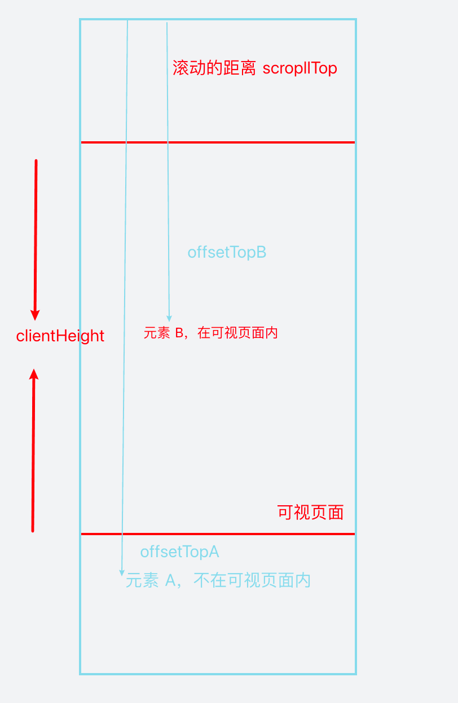
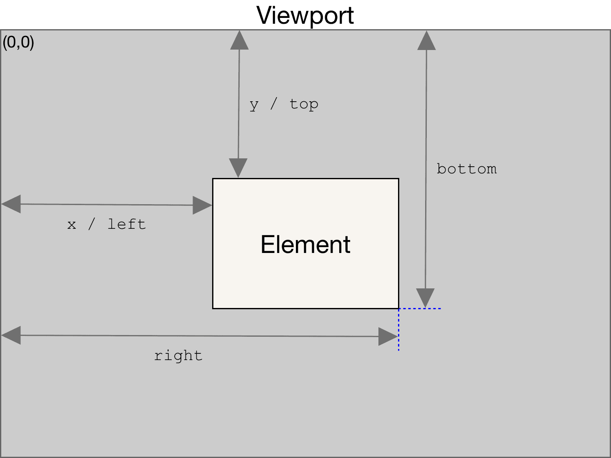

---
sidebar:
  title: 原生js实现图片懒加载
  step: 993
  isTimeLine: true
title: 原生js实现图片懒加载
tags:
  - JavaScript
categories:
  - JavaScript
---

# 原生 js 实现图片懒加载

## 什么是懒加载

懒加载其实就是延迟加载，是一种对网页性能优化的方式，比如当访问一个页面的时候，优先显示可视区域的图片而不一次性加载所有图片，当需要显示的时候再发送图片请求，避免打开网页时加载过多资源。

## 什么时候用懒加载

当页面中需要一次性载入很多图片的时候，往往都是需要用懒加载的。

## 懒加载原理

我们都知道 HTML 中的``标签是代表文档中的一个图像。

``标签有一个属性是`src`，用来表示图像的 URL，当这个属性的值不为空时，浏览器就会根据这个值发送请求。如果没有`src`属性，就不会发送请求。

嗯？貌似这点可以利用一下？
我先不设置`src`，需要的时候再设置？
nice，就是这样。

我们先不给`设置`src`，把图片真正的 URL 放在另一个属性`data-src`中，在需要的时候也就是图片进入可视区域的之前，将 URL 取出放到`src`中。

## 实现

### HTML 结构

```html
<div class="container">
  <div class="img-area">
    
  </div>
  <div class="img-area">
    
  </div>
  <div class="img-area">
    
  </div>
  <div class="img-area">
    
  </div>
  <div class="img-area">
    
  </div>
</div>
```

仔细观察一下，``标签此时是没有`src`属性的，只有 alt 和 data-src 属性。

`alt 属性是一个必需的属性，它规定在图像无法显示时的替代文本。
data-* 全局属性：构成一类名称为自定义数据属性的属性，可以通过HTMLElement.dataset来访问。`

## 如何判断元素是否在可视区域

### 方法一

- 通过`document.documentElement.clientHeight`获取屏幕可视窗口高度
- 通过`element.offsetTop`获取元素相对于文档顶部的距离
- 通过`document.documentElement.scrollTop`获取浏览器窗口顶部与文档顶部之间的距离，也就是滚动条滚动的距离

然后判断 ① + ③ > ② 是否成立，如果成立，元素就在可视区域内。



### 方法二 getBoundingClientRect

通过 getBoundingClientRect()方法来获取元素的大小以及位置，MDN 上是这样描述的：
`这个方法返回一个名为ClientRect的DOMRect对象，包含了top、right、bottom、left、width、height这些值。`



可以看出返回的元素位置是相对于左上角而言的，而不是边距。
我们思考一下，什么情况下图片进入可视区域。

假设`const bound = el.getBoundingClientRect();`来表示图片到可视区域顶部距离；
并设 `const clientHeight = window.innerHeight;`来表示可视区域的高度。

随着滚动条的向下滚动，`bound.top`会越来越小，也就是图片到可视区域顶部的距离越来越小，
当`bound.top===clientHeight`时，图片的上沿应该是位于可视区域下沿的位置的临界点，再滚动一点点，图片就会进入可视区域。

也就是说，在`bound.top<=clientHeight`时，图片是在可视区域内的。

我们这样判断：

```js
function isInSight(el) {
  const bound = el.getBoundingClientRect();
  const clientHeight = window.innerHeight;
  //如果只考虑向下滚动加载
  //const clientWidth = window.innerWeight;
  return bound.top <= clientHeight + 100;
}
```

这里有个+100 是为了提前加载。

### 加载图片

页面打开时需要对所有图片进行检查，是否在可视区域内，如果是就加载。

```js
function checkImgs() {
  const imgs = document.querySelectorAll(".my-photo");
  Array.from(imgs).forEach((el) => {
    if (isInSight(el)) {
      loadImg(el);
    }
  });
}

function loadImg(el) {
  if (!el.src) {
    const source = el.dataset.src;
    el.src = source;
  }
}
```

这里应该是有一个优化的地方，设一个标识符标识已经加载图片的 index，当滚动条滚动时就不需要遍历所有的图片，只需要遍历未加载的图片即可。

### 方法三 IntersectionObserver

IntersectionObserver 可以自动观察元素是否在视口内。

```js
var io = new IntersectionObserver(callback, option);
// 开始观察
io.observe(document.getElementById("example"));
// 停止观察
io.unobserve(element);
// 关闭观察器
io.disconnect();
```

我们需要用到`intersectionRatio`来判断是否在可视区域内，当`intersectionRatio > 0 && intersectionRatio <= 1`即在可视区域内。

```js
function checkImgs() {
  const imgs = Array.from(document.querySelectorAll(".my-photo"));
  imgs.forEach((item) => io.observe(item));
}

function loadImg(el) {
  if (!el.src) {
    const source = el.dataset.src;
    el.src = source;
  }
}

const io = new IntersectionObserver((ioes) => {
  ioes.forEach((ioe) => {
    const el = ioe.target;
    const intersectionRatio = ioe.intersectionRatio;
    if (intersectionRatio > 0 && intersectionRatio <= 1) {
      loadImg(el);
    }
    el.onload = el.onerror = () => io.unobserve(el);
  });
});
```

## 实践

[实践](https://github.com/iygxv/lazyload)

## 总结

1. 图片懒加载原理
   - 我们先不给`设置`src`，把图片真正的 URL 放在另一个属性`data-src`中，在需要的时候也就是图片进入`可视区域`的之前，将 URL 取出放到 src 中。
2. 判断元素是否在可视区域
   - 通过 document 方法
   - 通过 getBoundingClientRect 方法
   - 通过 IntersectionObserver 方法

<br/>
<hr />

⭐️⭐️⭐️ 好啦！！！本文章到这里就结束啦。⭐️⭐️⭐️

✿✿ ヽ(°▽°)ノ ✿

撒花 🌸🌸🌸🌸🌸🌸
