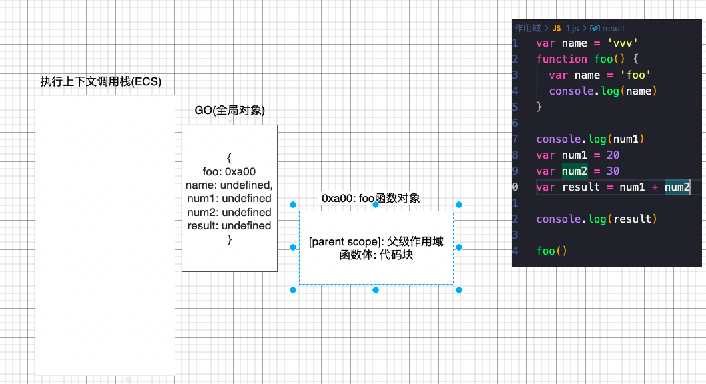
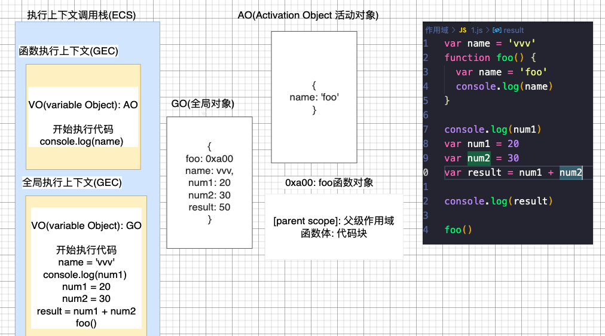

---
sidebar:
  title: 深入作用域
  step: 995
  isTimeLine: true
title: 深入作用域
tags:
  - JavaScript
categories:
  - JavaScript
---

# 深入作用域

## **全局对象 Global Object(GO)**

js 引擎会在执行代码之前，会在堆内存中创建一个全局对象:Global Object(GO)

- 该对象 所有的作用域(scope)都可以访问

- 里面会包含 Date、Array、String、Number、setTimeout、setInterval 等等

- 其中还有一个 window 属性指向自己

```js
GlobalObject: {
  window: GlobalObject,
  String: 'string类',
  setTimeout: '',
  // 等等
}
```

## **执行上下文栈(调用栈)**

js 引擎内部有一个**执行上下文栈(Execution Context Stack，简称 ECS)**，它是用于执行**代码的调用栈**

那么现在它要执行谁呢?执行的是**全局的代码块**

- 全局的代码块为了执行会构建一个 **Global Execution Context(GEC) 全局执行上下文**
- GEC 会 被放入到 ECS 中 执行

**GEC 被放入到 ECS 中里面包含两部分内容**

- 第一部分:在代码执行前，在 parser 转成 AST 的过程中，会将全局定义的变量、函数等加入到 GlobalObject 中，但是并不会赋值 ( 这个过程也称之为变量的作用域提升)
- 第二部分:在代码执行中，对变量赋值，或者执行其他的函数

## **从例子上解释**

```js
var name = "vvv";
function foo() {
  var name = "foo";
  console.log(name);
}

var num1 = 20;
var num2 = 30;
var result = num1 + num2;

foo();
```

### **初始化过程(编译过程)**



在编译的过程中,一开始先会创建`GO全局对象`,并且把定义的变量全部设置为`undefined`, 然后函数会指向一个地址, 这个地址会包含函数的`父级作用域`还有函数体

### **执行过程**



在执行的过程中, 先将`全局执行上下文`压入`执行栈`中, 在遇到函数执行后, 会创建一个函数执行上下文, 然后在压入到栈中, 开始执行代码, 函数上下文中的

`VO(变量对象)`是函数体内的变量, 也称`AO(活动对象)`