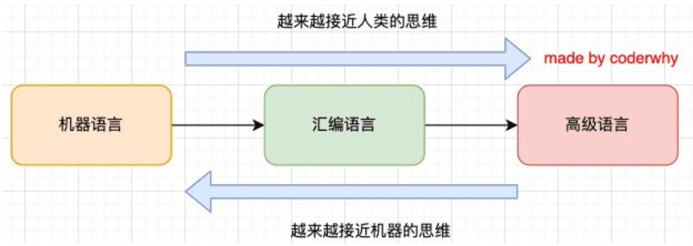
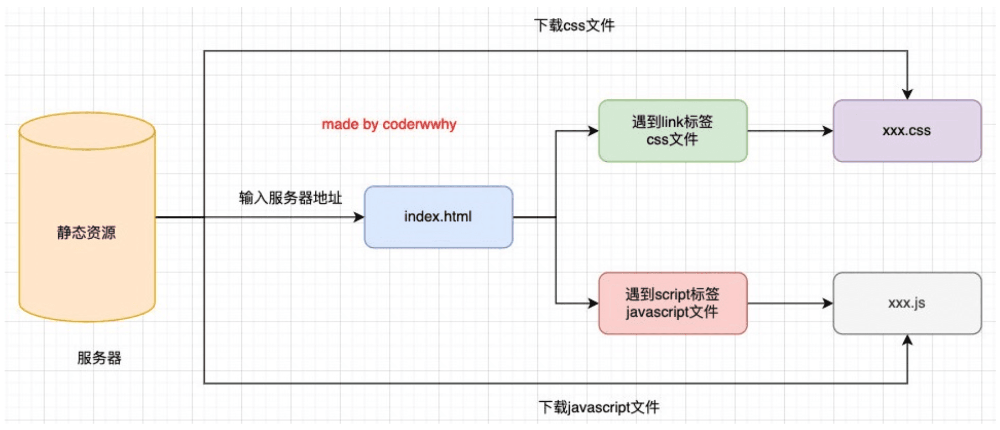
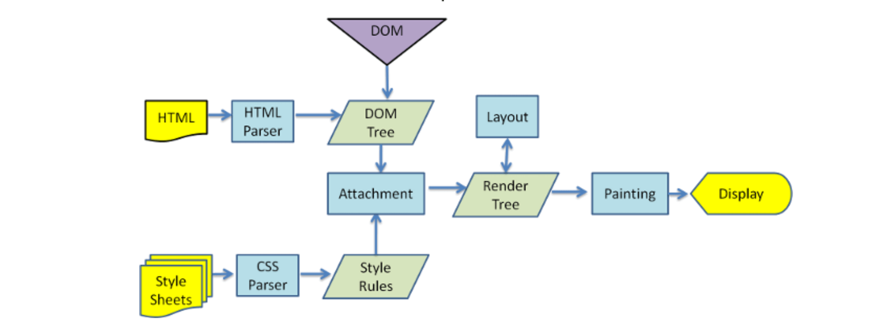
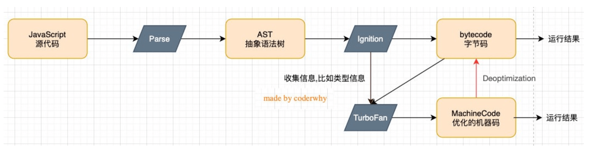
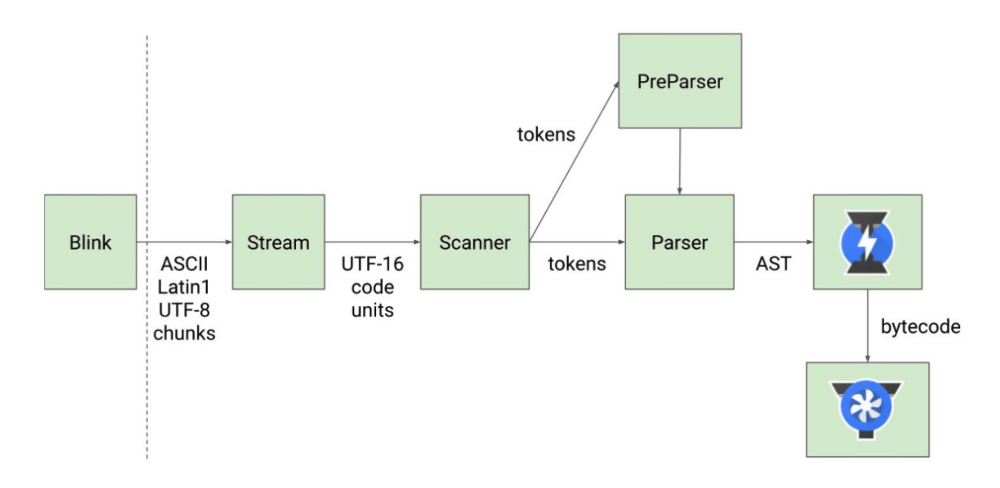

---
sidebar:
 title: 深入浏览器执行原理
 step: 995
 isTimeLine: true
title: 深入浏览器执行原理
tags:
 - JavaScript
categories:
 - JavaScript
---

# 深入浏览器执行原理

## **JavaScript是一门编程语言**

为什么这里我要强调JavaScript是一门编程语言呢?很多同学想，我还不知道JavaScript是一门编程语言吗? 

事实上我们可以使用更加准备的描述是这样:**JavaScript是一门高级的编程语言。**

那么有高级编程语言，就有低级编程语言，从编程语言发展历史来说，可以划分为三个阶段:

- 机器语言:1000100111011000，一些机器指令
- 汇编语言:mov ax,bx，一些汇编指令
- 高级语言:C、C++、Java、JavaScript、Python

但是计算机它本身是不认识这些高级语言的，所以我们的代码最终还是需要被转换成机器指令:

## **浏览器的工作原理**

JavaScript代码，在浏览器中是如何被执行的?

输入网址后, 从服务器中拿去静态资源, 先拿`index.html`进行加载, 遇到`css文件`,然后再去拿css资源, 遇到`js文件`,再去js拿资源

## **浏览器的内核**

不同的浏览器有不同的内核组成

- **Gecko**:早期被Netscape和Mozilla Firefox浏览器浏览器使用;
- **Triden**:微软开发，被IE4~IE11浏览器使用，但是Edge浏览器已经转向Blink; 
- **Webkit**:苹果基于KHTML开发、开源的，用于Safari，Google Chrome之前也在使用; 
- **Blink**:是Webkit的一个分支，Google开发，目前应用于Google Chrome、Edge、Opera等; 

事实上，我们经常说的浏览器内核指的是浏览器的排版引擎

**排版引擎**(layout engine)，也称为**浏览器引擎**(browser engine)、**页面渲染引擎**(rendering engine) 或**样版引擎**。

## **浏览器渲染过程**

在这个执行过程中，HTML解析的时候遇到了JavaScript标签, **会停止解析HTML，而去加载和执行JavaScript代码**

那么，JavaScript代码由谁来执行呢?  **JavaScript引擎**

## **认识JavaScript引擎**

**为什么需要JavaScript引擎呢?**

- 我们前面说过，**高级的编程语言**都是需要**转成最终的机器指令**来执行的;
- 事实上我们编写的JavaScript无论你交给**浏览器或者Node执行**，最后都是需要被**CPU执行**的; 
- 但是CPU只认识自己的指令集，实际上是机器语言，才能被CPU所执行;
- 所以我们需要**JavaScript引擎帮助我们将JavaScript代码翻译成CPU指令**来执行;

**比较常见的JavaScript引擎有哪些呢?**

- **SpiderMonkey**:第一款JavaScript引擎，由Brendan Eich开发(也就是JavaScript作者); 

- **Chakra**:微软开发，用于IT浏览器;

- **JavaScriptCore**:WebKit中的JavaScript引擎，Apple公司开发;

- **V8**:Google开发的强大JavaScript引擎，也帮助Chrome从众多浏览器中脱颖而出;

## **浏览器内核和JS引擎的关系**

这里我们先以WebKit为例，WebKit事实上由两部分组成的:

- **WebCore**:负责HTML解析、布局、渲染等等相关的工作; 
- **JavaScriptCore**:解析、执行JavaScript代码;

另外一个强大的JavaScript引擎就是`V8引擎`

## **V8引擎的原理**

我们来看一下官方对V8引擎的定义:

- V8是用C ++编写的Google开源高性能JavaScript和WebAssembly引擎，它用于Chrome和Node.js等。
- 它实现`ECMAScript`和`WebAssembly`，并在Windows 7或更高版本，macOS 10.12+和使用x64，IA-32， ARM或MIPS处理器的Linux系统上运行。
- V8可以独立运行，也可以嵌入到任何C ++应用程序中。

## **V8引擎的架构**

V8引擎本身的源码**非常复杂**，大概有超过**100w行C++代码**，通过了解它的架构，我们可以知道它是如何对JavaScript执行的:

**Parse模块**会将JavaScript代码转换成AST(抽象语法树)，这是因为解释器并不直接认识JavaScript代码; 

- 如果函数没有被调用，那么是不会被转换成AST的;
-  Parse的V8[官方文档](https://v8.dev/blog/scanner)

**Ignition**是一个解释器，会将AST转换成ByteCode(字节码)

- 同时会收集TurboFan优化所需要的信息(比如函数参数的类型信息，有了类型才能进行真实的运算); 
- 如果函数只调用一次，Ignition会执行解释执行ByteCode;
-  Ignition的V8[官方文档](https://v8.dev/blog/ignition-interpreter)

**TurboFan**是一个编译器，可以将字节码编译为CPU可以直接执行的机器码;

- 如果一个函数被多次调用，那么就会被标记为热点函数，那么就会经过TurboFan转换成优化的机器码，提高代码的执行性能;
- 但是，机器码实际上也会被还原为ByteCode，这是因为如果后续执行函数的过程中，类型发生了变化(比如sum函数原来执行的是 number类型，后来执行变成了string类型)，之前优化的机器码并不能正确的处理运算，就会逆向的转换成字节码;
- TurboFan的V8[官方文档](https://v8.dev/blog/turbofan-jit)

## **V8引擎的解析图(官方)**

## **V8执行的细节**

**我们的JavaScript源码是如何被解析(Parse过程)的呢?**

Blink将源码交给V8引擎，Stream获取到源码并且进行编码转换;

Scanner会进行词法分析(lexical analysis)，词法分析会将代码转换成tokens;

**接下来tokens会被转换成AST树，经过Parser和PreParser:**

- Parser就是直接将tokens转成AST树架构;
-  PreParser称之为预解析，为什么需要预解析呢?
  - 这是因为并不是所有的JavaScript代码，在一开始时就会被执行。那么对所有的JavaScript代码进行解析，必然会 影响网页的运行效率;
  - 所以V8引擎就实现了Lazy Parsing(延迟解析)的方案，它的作用是将不必要的函数进行预解析，也就是只解析暂 时需要的内容，而对函数的全量解析是在函数被调用时才会进行;
  - 比如我们在一个函数outer内部定义了另外一个函数inner，那么inner函数就会进行预解析;

生成AST树后，会被Ignition转成字节码(bytecode)，之后的过程就是代码的执行过程(后续会详细分析)。

 

⭐️⭐️⭐️好啦！！！本文章到这里就结束啦。⭐️⭐️⭐️

✿✿ヽ(°▽°)ノ✿

撒花 🌸🌸🌸🌸🌸🌸
