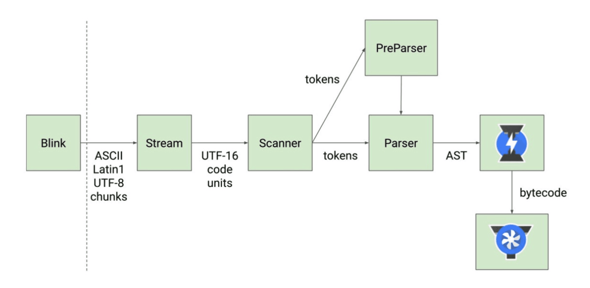

---
sidebar:
  title: 深入浏览器执行原理
  step: 995
  isTimeLine: true
title: 深入浏览器执行原理
tags:
  - JavaScript
categories:
  - JavaScript
---

# 深入浏览器执行原理

## **JavaScript 是一门编程语言**

为什么这里我要强调 JavaScript 是一门编程语言呢?很多同学想，我还不知道 JavaScript 是一门编程语言吗?

事实上我们可以使用更加准备的描述是这样:**JavaScript 是一门高级的编程语言。**

那么有高级编程语言，就有低级编程语言，从编程语言发展历史来说，可以划分为三个阶段:

- 机器语言:1000100111011000，一些机器指令
- 汇编语言:mov ax,bx，一些汇编指令
- 高级语言:C、C++、Java、JavaScript、Python

但是计算机它本身是不认识这些高级语言的，所以我们的代码最终还是需要被转换成机器指令:

## **浏览器的工作原理**

JavaScript 代码，在浏览器中是如何被执行的?

输入网址后, 从服务器中拿去静态资源, 先拿`index.html`进行加载, 遇到`css文件`,然后再去拿 css 资源, 遇到`js文件`,再去 js 拿资源

## **浏览器的内核**

不同的浏览器有不同的内核组成

- **Gecko**:早期被 Netscape 和 Mozilla Firefox 浏览器浏览器使用;
- **Triden**:微软开发，被 IE4~IE11 浏览器使用，但是 Edge 浏览器已经转向 Blink;
- **Webkit**:苹果基于 KHTML 开发、开源的，用于 Safari，Google Chrome 之前也在使用;
- **Blink**:是 Webkit 的一个分支，Google 开发，目前应用于 Google Chrome、Edge、Opera 等;

事实上，我们经常说的浏览器内核指的是浏览器的排版引擎

**排版引擎**(layout engine)，也称为**浏览器引擎**(browser engine)、**页面渲染引擎**(rendering engine) 或**样版引擎**。

## **浏览器渲染过程**

在这个执行过程中，HTML 解析的时候遇到了 JavaScript 标签, **会停止解析 HTML，而去加载和执行 JavaScript 代码**

那么，JavaScript 代码由谁来执行呢? **JavaScript 引擎**

## **认识 JavaScript 引擎**

**为什么需要 JavaScript 引擎呢?**

- 我们前面说过，**高级的编程语言**都是需要**转成最终的机器指令**来执行的;
- 事实上我们编写的 JavaScript 无论你交给**浏览器或者 Node 执行**，最后都是需要被**CPU 执行**的;
- 但是 CPU 只认识自己的指令集，实际上是机器语言，才能被 CPU 所执行;
- 所以我们需要**JavaScript 引擎帮助我们将 JavaScript 代码翻译成 CPU 指令**来执行;

**比较常见的 JavaScript 引擎有哪些呢?**

- **SpiderMonkey**:第一款 JavaScript 引擎，由 Brendan Eich 开发(也就是 JavaScript 作者);

- **Chakra**:微软开发，用于 IT 浏览器;

- **JavaScriptCore**:WebKit 中的 JavaScript 引擎，Apple 公司开发;

- **V8**:Google 开发的强大 JavaScript 引擎，也帮助 Chrome 从众多浏览器中脱颖而出;

## **浏览器内核和 JS 引擎的关系**

这里我们先以 WebKit 为例，WebKit 事实上由两部分组成的:

- **WebCore**:负责 HTML 解析、布局、渲染等等相关的工作;
- **JavaScriptCore**:解析、执行 JavaScript 代码;

另外一个强大的 JavaScript 引擎就是`V8引擎`

## **V8 引擎的原理**

我们来看一下官方对 V8 引擎的定义:

- V8 是用 C ++编写的 Google 开源高性能 JavaScript 和 WebAssembly 引擎，它用于 Chrome 和 Node.js 等。
- 它实现`ECMAScript`和`WebAssembly`，并在 Windows 7 或更高版本，macOS 10.12+和使用 x64，IA-32， ARM 或 MIPS 处理器的 Linux 系统上运行。
- V8 可以独立运行，也可以嵌入到任何 C ++应用程序中。

## **V8 引擎的架构**

V8 引擎本身的源码**非常复杂**，大概有超过**100w 行 C++代码**，通过了解它的架构，我们可以知道它是如何对 JavaScript 执行的:

**Parse 模块**会将 JavaScript 代码转换成 AST(抽象语法树)，这是因为解释器并不直接认识 JavaScript 代码;

- 如果函数没有被调用，那么是不会被转换成 AST 的;
- Parse 的 V8[官方文档](https://v8.dev/blog/scanner)

**Ignition**是一个解释器，会将 AST 转换成 ByteCode(字节码)

- 同时会收集 TurboFan 优化所需要的信息(比如函数参数的类型信息，有了类型才能进行真实的运算);
- 如果函数只调用一次，Ignition 会执行解释执行 ByteCode;
- Ignition 的 V8[官方文档](https://v8.dev/blog/ignition-interpreter)

**TurboFan**是一个编译器，可以将字节码编译为 CPU 可以直接执行的机器码;

- 如果一个函数被多次调用，那么就会被标记为热点函数，那么就会经过 TurboFan 转换成优化的机器码，提高代码的执行性能;
- 但是，机器码实际上也会被还原为 ByteCode，这是因为如果后续执行函数的过程中，类型发生了变化(比如 sum 函数原来执行的是 number 类型，后来执行变成了 string 类型)，之前优化的机器码并不能正确的处理运算，就会逆向的转换成字节码;
- TurboFan 的 V8[官方文档](https://v8.dev/blog/turbofan-jit)

## **V8 引擎的解析图(官方)**

## **V8 执行的细节**

**我们的 JavaScript 源码是如何被解析(Parse 过程)的呢?**

Blink 将源码交给 V8 引擎，Stream 获取到源码并且进行编码转换;

Scanner 会进行词法分析(lexical analysis)，词法分析会将代码转换成 tokens;

**接下来 tokens 会被转换成 AST 树，经过 Parser 和 PreParser:**

- Parser 就是直接将 tokens 转成 AST 树架构;
- PreParser 称之为预解析，为什么需要预解析呢?
- 这是因为并不是所有的 JavaScript 代码，在一开始时就会被执行。那么对所有的 JavaScript 代码进行解析，必然会 影响网页的运行效率;
- 所以 V8 引擎就实现了 Lazy Parsing(延迟解析)的方案，它的作用是将不必要的函数进行预解析，也就是只解析暂 时需要的内容，而对函数的全量解析是在函数被调用时才会进行;
- 比如我们在一个函数 outer 内部定义了另外一个函数 inner，那么 inner 函数就会进行预解析;

生成 AST 树后，会被 Ignition 转成字节码(bytecode)，之后的过程就是代码的执行过程(后续会详细分析)。

 

⭐️⭐️⭐️ 好啦！！！本文章到这里就结束啦。⭐️⭐️⭐️

✿✿ ヽ(°▽°)ノ ✿

撒花 🌸🌸🌸🌸🌸🌸
