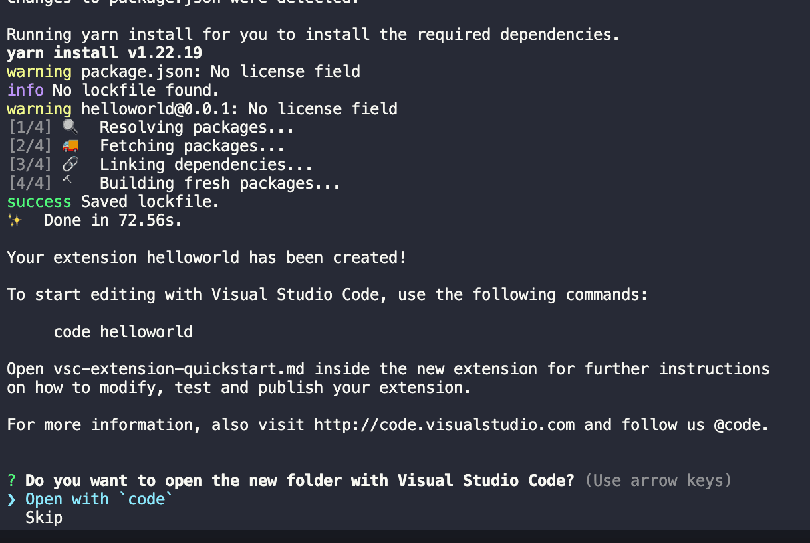
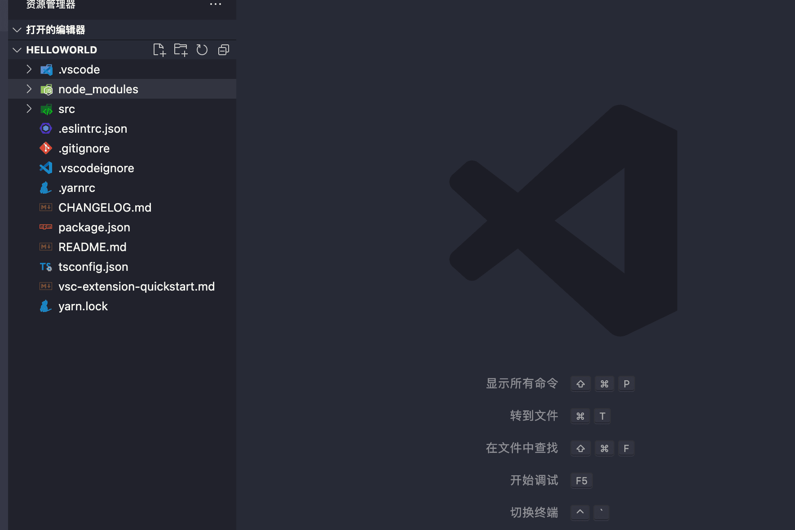
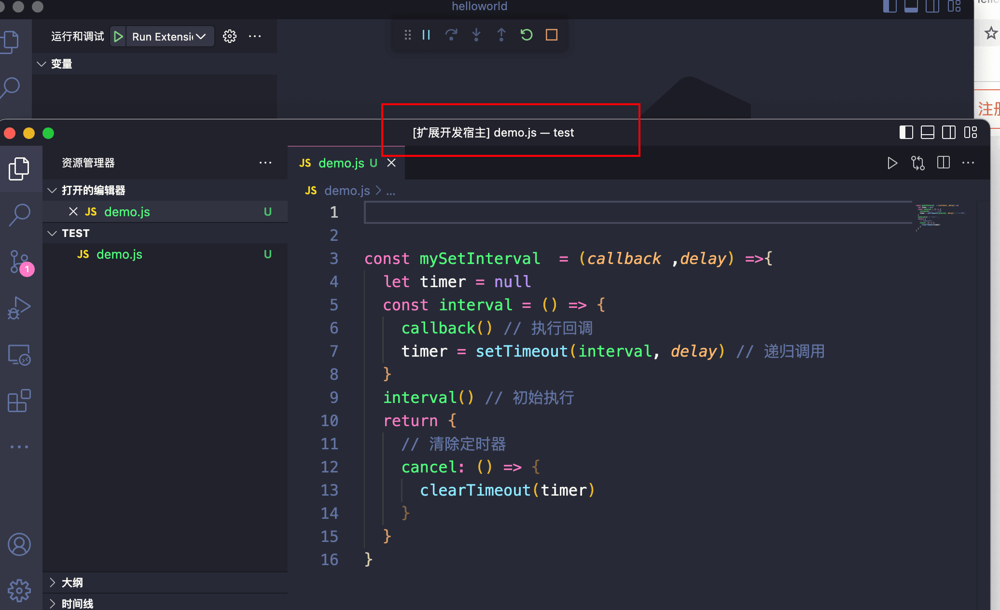
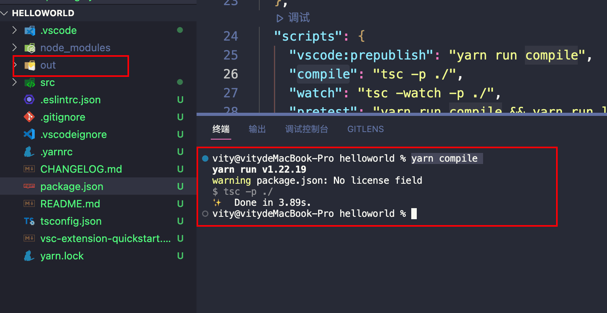
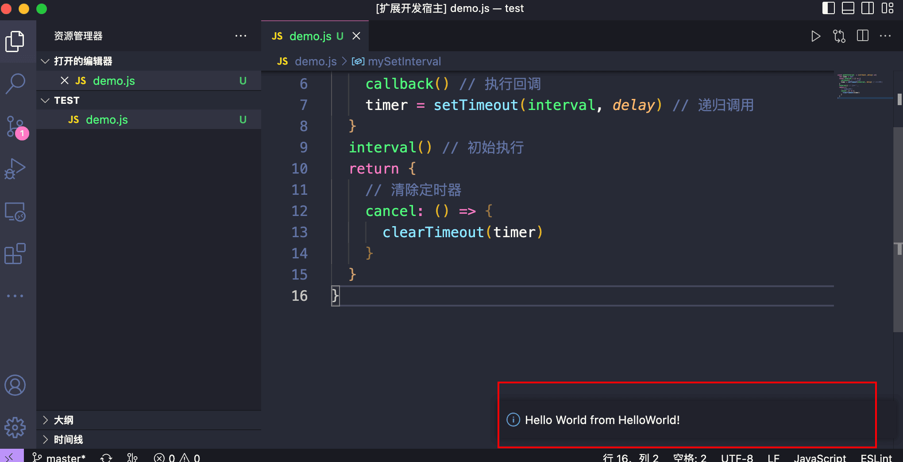

---
sidebar:
 title: vscode插件开发
 step: 1
 isTimeLine: true
title: vscode插件开发
tags:
 - 不懂的知识
categories:
 - 不懂的知识
---


## **安装插件开发脚手架**

安装[Yeoman](https://yeoman.io/)和[VS Code Extension Generator](https://www.npmjs.com/package/generator-code)

```shell
npm install -g yo generator-code
```

## **使用插件开发脚手架创建插件项目**

接下来我们利用 yo 和 generator-code 模块配合而成的脚手架，开始创建我们的 VSCode 插件项目, 执行命令

```shell
yo code
```

根据脚手架提示选择和填入相关信息：


项目依赖安装完成后，可以根据提示打开插件项目：



想要有这个打开插件项目的提示（Open with code），则需要事先在 VSCode 内 command+shift+p 选择执行：
` Shell Command: Install 'code' command in PATH`。


打开项目后，项目结构如：



其实这是个简单的、完整的、可运行的插件项目，接下来我们先来看看这个插件项目工作起来是怎么样子的~

## **使用Hello World 插件**

借助 VSCode 工具进行调式


点击调式后, 会打开打开 Extension Developer Host 窗口, 如下图



**运行插件项目**

- 先调用`yarn compile`,这里会输出一个out文件

  ```shell
  yarn compile
  ```

  

- 在Extension Developer Host 窗口内使用键盘组合键：Command+Shift+P (windows 机器是 Ctrl+Shift+P)，然后搜索我们的 Hello World 插件


则在 VSCode 右下角则会看到一个提示，这就是我们的插件工作效果：




##  打包发布

要打包这个插件，可以使用VS Code提供的命令行工具`vsce`

- 在终端中全局安装`vsce`

  ```shell
  npm install -g vsce
  ```

- 在插件项目的根目录下运行以下命令

  ```shell
  vsce package
  ```

该命令会在当前目录下生成一个`.vsix`文件，用于发布插件。

1. 如果要发布插件到VS Code插件市场，需要先在[Visual Studio Marketplace](https://marketplace.visualstudio.com/)上注册一个账号。
2. 登录到[Visual Studio Marketplace](https://marketplace.visualstudio.com/)，然后点击右上角的“Submit an extension”按钮，进入发布插件的页面。
3. 在发布页面中，填写插件的基本信息，包括名称、描述、版本号等。然后上传之前生成的`.vsix`文件，等待上传完成。
4. 审核通过后，插件就可以在VS Code插件市场中搜索到并安装使用了。

## 为插件设置头像

要为插件设置头像，需要进行以下步骤：

- 在VS Code插件项目的根目录下创建一个名为`images`的文件夹，并在其中添加插件头像文件。头像文件必须是正方形的PNG或SVG格式，大小为128x128像素

- 在插件的`package.json`文件中，添加以下配置：

  ```json
  {
    "icon": "images/icon.png"
  }
  ```

打包插件并上传到Visual Studio Marketplace，等待审核通过后，插件的头像就会显示在插件详情页面和搜索结果中

注意：上传的头像文件必须符合Visual Studio Marketplace的规定，具体要求可以参考[官方文档](https://docs.microsoft.com/en-us/visualstudio/marketplace/publish/branding-guidelines?view=vs-2019)。

<br/>
<hr />

⭐️⭐️⭐️好啦！！！本文章到这里就结束啦。⭐️⭐️⭐️

✿✿ヽ(°▽°)ノ✿

撒花 🌸🌸🌸🌸🌸🌸
