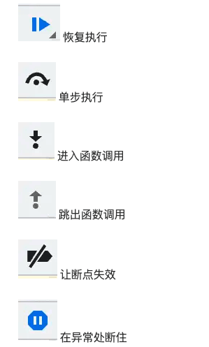
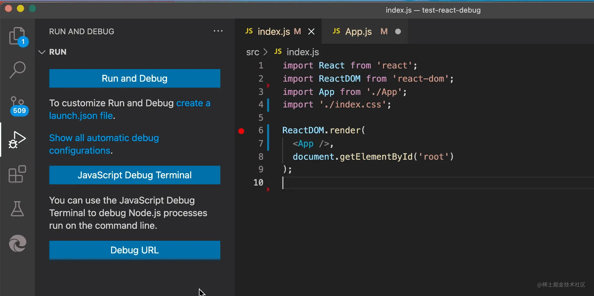

---
sidebar:
  title: 前端调试技能
  step: 1
  isTimeLine: true
title: 前端调试技能
tags:
  - 其他
categories:
  - 其他
---

# 前端调试技能

## **Chrome DevTools**

### **相关按钮**

上面有几个控制执行的按钮，分别是：

在调式网页的 JS, 除了 Chrome DevTools 外，还有一种更好用的调试方式： VSCode Debugger。

## **VSCode Debugger**

在 VSCode Debugger 中, 需要创建`launch.json`进行调式的配置

这个调试配置文件不用自己创建，可以直接点击 Debug 窗口的 `create a launch.json file` 快速创建：

[详细的 vscode debugger 配置信息](https://juejin.cn/book/7070324244772716556/section/7071920248835801126)

## **调试 Vue 项目**

[调式 Vue 项目](https://juejin.cn/book/7070324244772716556/section/7136841909946810404)

## **调试 Vue 源码**

[调式 Vue 元源码](https://juejin.cn/book/7070324244772716556/section/7071922360592367627)

## **原文**

[前端调式通关秘籍](https://juejin.cn/book/7070324244772716556)