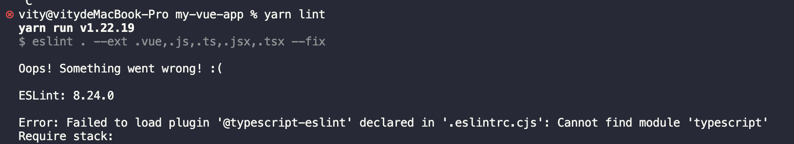
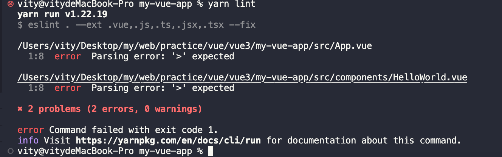
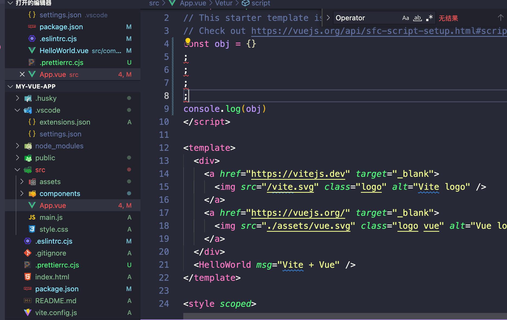
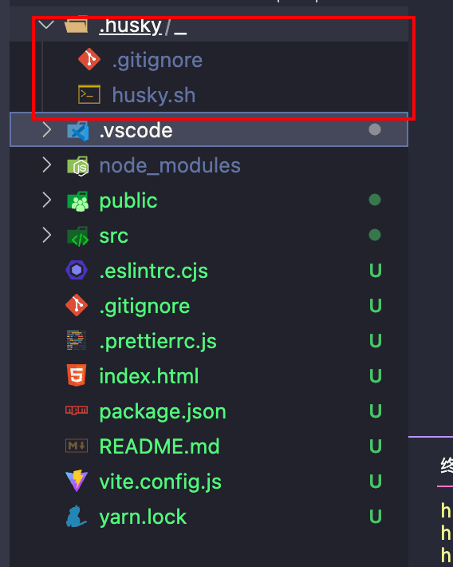
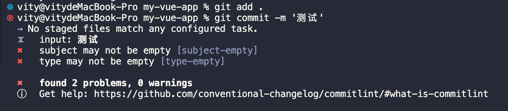
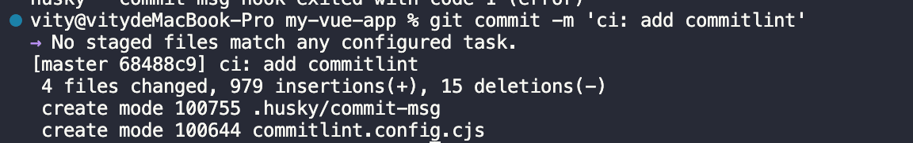

---
sidebar:
 title: 开发代码规范和git提交检测
 step: 1
 isTimeLine: true
title: 开发代码规范和git提交检测
tags:
 - 不懂的知识
categories:
 - 不懂的知识
---


# 开发代码规范和git提交检测

## 代码规范

### 代码检查工具

- **ESlint**
- 配置文件: **.eslintrc.js**
- 忽略文件: .eslintignore

### 代码风格工具

- **prettier**
- 配置文件: .prettierrc.js

## ESlint检查

先创建一个vue3+vite的项目

```shell
yarn create vite my-vue-app --template vue
```

创建完成后,使用`ESlint`进行代码检查

[ESlint官方文档](https://eslint.bootcss.com/)

然后安装ESlint(全局安装一下)

```shell
yarn add eslint -g
```

eslint初始化命令

```shell
npx eslint --init
```

执行完毕后出现

```shell
(1) How would you like to use ESLint?
选择：To check syntax and find problems

(2) What type of modules does your project use?
选择：JavaScript modules (import/export)

(3) Which framework does your project use?
选择：Vue.js

(4) Does your project use TypeScript?
选择：Yes

(5) Where does your code run?
选择：Browser

(6) What format do you want your config file to be in?
选择：JavaScript

(7) Would you like to install them now?
选择：Yes

(8) Which package manager do you want to use?
选择：yarn
```

### 依赖安装完成后，会生成`.eslintrc.js`配置文件

```js
module.exports = {
  env: {
    browser: true,
    es2021: true
  },
  extends: ['eslint:recommended', 'plugin:vue/vue3-essential', 'plugin:@typescript-eslint/recommended'],
  overrides: [],
  parser: '@typescript-eslint/parser',
  parserOptions: {
    ecmaVersion: 'latest',
    sourceType: 'module'
  },
  plugins: ['vue', '@typescript-eslint'],
  rules: {}
}

```

### 在`package.json`文件中的`script`中添加`lint`命令

```js
{
    "scripts": {
        // eslint . 为指定lint当前项目中的文件
        // --ext 为指定lint哪些后缀的文件
        // --fix 开启自动修复
        "lint": "eslint . --ext .vue,.js,.ts,.jsx,.tsx --fix"
    }
}

```

### 执行`lint`命令

```shell
yarn lint
```





出现了没有找到`typescript`模块,安装一下

```shell
yarn add typescript -D
```

再次执行`yarn lint`命令



会出现上面的错误, 解析`.vue`后缀的文件时候出现解析错误`parsing error`

`eslint`默认是不会解析`.vue`后缀文件的。因此，需要一个额外的解析器来解析`.vue`后缀文件。

但是我们查看`.eslintrc.js`文件中的`extends`会发现已经有继承`"plugin:vue/vue3-essential"`的配置。然后在`node_modules`中可以找到`eslint-plugin-vue/lib/cinfigs/essential`，里面配置了`extends`是继承于同级目录下的`base.js`，在里面会发现`parser: require.resolve('vue-eslint-parser')`这个配置。因此，按道理来说应该是会解析`.vue`后缀文件的。

继续往下看`.eslintrc.js`文件中的`extends`会发现，`extends`中还有一个`"plugin:@typescript-eslint/recommended"`，它是来自于`/node_modules/@typescript-eslint/eslint-plugin/dist/configs/recommended.js`，查看该文件会发现最终继承于同级目录下的`base.js`文件。从该文件中可以发现`parser: '@typescript-eslint/parser',`配置。

按照`.eslintrc.js`文件中的`extends`配置的顺序可知，最终导致报错的原因就是`@typescript-eslint/parser`把`vue-eslint-parser`覆盖了。

```shell
{
    "extends": [
        "eslint:recommended",
        "plugin:vue/vue3-essential",
        "plugin:@typescript-eslint/recommended"
    ],
}
```

查看[eslint-plugin-vue](https://link.juejin.cn?target=https%3A%2F%2Feslint.vuejs.org%2Fuser-guide%2F%23faq)官方文档可知。如果已经使用了另外的解析器（例如`"parser": "@typescript-eslint/parser"`），则需要将其移至`parseOptions`，这样才不会与`vue-eslint-parser`冲突。


修改`.eslintrc.js`文件

```js
module.exports = {
    "env": {
        "browser": true,
        "es2021": true,
        "node": true
    },
    "extends": [
        "eslint:recommended",
        "plugin:vue/vue3-essential",
        "plugin:@typescript-eslint/recommended"
    ],
    "parser": "vue-eslint-parser",
    "parserOptions": {
        "ecmaVersion": "latest",
        "parser": "@typescript-eslint/parser", // 新增
        "sourceType": "module"
    },
    "plugins": [
        "vue",
        "@typescript-eslint"
    ],
    "rules": {
    }
}
```

两个`parser`的区别在于，外面的`parser`用来解析`.vue`后缀文件，使得`eslint`能解析`<template>`标签中的内容，而`parserOptions`中的`parser`，即`@typescript-eslint/parser`用来解析vue文件中`<script>`标签中的代码。

此时，再执行` yarn lint`，就会发现校验通过了。

### 安装vscode插件ESLint

如果写一行代码就要执行一遍`lint`命令，这效率就太低了。所以我们可以配合vscode的`ESLint`插件，实现每次保存代码时，自动执行`lint`命令来修复代码的错误。

在项目中新建`.vscode/settings.json`文件，然后在其中加入以下配置。

```json
{
    // 开启自动修复
    "editor.codeActionsOnSave": {
        "source.fixAll": false,
        "source.fixAll.eslint": true
    }
}
```

### 测试ESlint插件

执行启动命令

```shell
yarn dev
```

.eslintrc.cjs中加入规则

```js
rules: {
    // 禁止不必要的分号
    'no-extra-semi': 2,
    // 省略...
}
```



### 安装依赖说明

- [eslint](https://link.juejin.cn/?target=https%3A%2F%2Fcn.eslint.org%2F)： JavaScript 和 JSX 检查工具
- [eslint-plugin-vue](https://link.juejin.cn/?target=https%3A%2F%2Feslint.vuejs.org%2F)： 使用 ESLint 检查 .vue文件 的 `<template>` 和 `<script>`，以及`.js`文件中的Vue代码


## 配置prettier

安装

```shell
yarn add prettier -D
```

### 在根目录下新建`.prettierrc.js`

添加以下配置，更多配置可查看[官方文档](https://link.juejin.cn/?target=https%3A%2F%2Fprettier.io%2Fdocs%2Fen%2Foptions.html)

```js
module.exports = {
    // 一行的字符数，如果超过会进行换行，默认为80
    printWidth: 80, 
    // 一个tab代表几个空格数，默认为80
    tabWidth: 2, 
    // 是否使用tab进行缩进，默认为false，表示用空格进行缩减
    useTabs: false, 
    // 字符串是否使用单引号，默认为false，使用双引号
    singleQuote: true, 
    // 行位是否使用分号，默认为true
    semi: false, 
    // 是否使用尾逗号，有三个可选值"<none|es5|all>"
    trailingComma: "none", 
    // 对象大括号直接是否有空格，默认为true，效果：{ foo: bar }
    bracketSpacing: true
}
```

### 在`package.json`中的`script`中添加以下命令

```json
{
    "scripts": {
        "format": "prettier --write \"./**/*.{html,vue,ts,js,json,md}\"",
    }
}
```

运行该命令，会将我们项目中的文件都格式化一遍，**后续如果添加其他格式的文件，可在该命令中添加，例如：`.less`后缀的文件**

### 安装vscode的Prettier - Code formatter插件

安装该插件的目的是，让该插件在我们保存的时候自动完成格式化

在`.vscode/settings.json`中添加一下规则

```js
{
    // 保存的时候自动格式化
    "editor.formatOnSave": true,
    // 默认格式化工具选择prettier
    "editor.defaultFormatter": "esbenp.prettier-vscode"
}
```


## 解决`eslint`与`prettier`的冲突

在理想的状态下，`eslint`与`prettier`应该各司其职。`eslint`负责我们的代码质量，`prettier`负责我们的代码格式。但是在使用的过程中会发现，由于我们开启了自动化的`eslint`修复与自动化的根据`prettier`来格式化代码。所以我们已保存代码，会出现屏幕闪一起后又恢复到了报错的状态。

这其中的根本原因就是`eslint`有部分规则与`prettier`冲突了，所以保存的时候显示运行了`eslint`的修复命令，然后再运行`prettier`格式化，所以就会出现屏幕闪一下然后又恢复到报错的现象。这时候你可以检查一下是否存在冲突的规则。

查阅资料会发现，社区已经为我们提供了一个非常成熟的方案，即`eslint-config-prettier` + `eslint-plugin-prettier`。

- [eslint-plugin-prettier](https://link.juejin.cn?target=https%3A%2F%2Fgithub.com%2Fprettier%2Feslint-plugin-prettier)： 基于 prettier 代码风格的 eslint 规则，即eslint使用pretter规则来格式化代码。
- [eslint-config-prettier](https://link.juejin.cn?target=https%3A%2F%2Fgithub.com%2Fprettier%2Feslint-config-prettier)： 禁用所有与格式相关的 eslint 规则，解决 prettier 与 eslint 规则冲突，**确保将其放在 extends 队列最后，这样它将覆盖其他配置**

### 安装依赖

```shell
yarn add eslint-config-prettier eslint-plugin-prettier -D
```

### 在 `.eslintrc.js中`extends`的最后添加一个配置

```js
{ 
    extends: [
    'eslint:recommended',
    'plugin:vue/vue3-essential',
    'plugin:@typescript-eslint/recommended',
+    // 新增，必须放在最后面
+    'plugin:prettier/recommended' 
  ],
}
```

最后**重启vscode**，你会发现冲突消失了，`eslint`与`prettier`也按照我们预想的各司其职了。

## git提交检测

- husky(添加git hook)
- lint-staged

## 配置 husky + lint-staged

理论上，到上一步我们已经能使得我们的项目获得不错的开发规范约束了。然而仍然有可以改进的地方：

- 如果是在项目中途才接入`eslint + prettier`,如果对原来的代码使用`yarn run lint `或者 `yarn run format`势必会带来大范围地改动，甚至会造成冲突。
- 对于一些不使用`vscode`编辑器，或者没有安装`prettier`和`eslint`插件的用户而言，他们不能享受到插件带来的协助，而他们的代码自然大概率是不符合规范的，不该被提交到代码库。

基于上述的顾虑，社区提供了 `husky + lint-staged`的渐进式方案。 `lint-staged` 是一个只检测`git`暂存区的`lint`工具，`husky`是一个用来给我们的项目添加`git hook`的工具，`git hook`是进行git操作会触发的脚本，例如：提交的时候会触发`pre-commit`钩子,输入提交信息会触发`commit-msg`钩子。 我们用`husky`安装`pre-commit`钩子，我们就可以在进行`git commit`操作的时候，运行我们的脚本来检测待提交的代码是否规范，便可以只对暂存区的文件进行检查。

首先安装依赖

```shell
yarn add husky lint-staged -D
```

添加一个在`package.json`中添加一条`preinstall`脚本

```json
{
    "script":{
        "prepare": "husky install"
    }
}
```

`prepare`脚本会在 `yarn` 之后自动运行，这样依赖你的小伙伴`clone`了你的项目之后会自动安装`husky`,这里由于我们已经运行过 `yarn` 了，所以我们需要手动运行一次`yarn  prepare`,然后我们就会得到一个目录`.husky`。



接下来我们为我们git仓库添加一个`pre-commit`钩子,运行

```shell
npx husky add .husky/pre-commit "npx --no-install lint-staged"
```

这回在我们的.husky目录下生成一个`pre-commit`的脚本

```shell
#!/usr/bin/env sh
. "$(dirname -- "$0")/_/husky.sh"

# commit之前触发
npx --no-install lint-staged
```

接下来我们配置`lint-staged`,在`package.json`中添加下面的配置信息。

```json
"lint-staged": {
      "*.{js,vue,ts,jsx,tsx}": [
        "prettier --write",
        "eslint --fix"
      ],
      "*.{html,css,less,scss,md}": [
        "prettier --write"
      ]
 },
```

这样之后，我们后续提交到暂存区的代码也就会被`eslint+prettier`格式化和检查，进一步保证我们的代码规范。

### 测试

```shell
git add .
git commit -m '测试eslint报错是否可以提交'
```

可以发现无法提交(使用`git status` 查看状态)

使用`yarn format`格式化后就可以提交了 


## commitlint规范

在实际开发中，我们的代码提交常常是比较潦草的，可能有时候只会写个简单的修复，这样的提交信息虽然开发中省时省力，但在代码回顾、维护时，常常需要提交信息才能更好理解代码的作用，因此代码提交信息的规范化其实是前端代码规范中的重要一环，而`commitlint`是一个帮我们检查commit msg是否符合规范的工具。 [commitlint仓库地址：https://github.com/conventional-changelog/commitlint](https://link.juejin.cn?target=https%3A%2F%2Fgithub.com%2Fconventional-changelog%2Fcommitlint)

#### 安装`commitlint`

```shell
yarn add @commitlint/{config-conventional,cli} -D
```

#### 创建配置文件（`echo`创建记得将编码改为`utf-8`）

```shell
echo "module.exports = {extends: ['@commitlint/config-conventional']}" > commitlint.config.js
```

#### 配置husky hook

在package.json的husky hook配置中添加 `"commit-msg": "commitlint -E HUSKY_GIT_PARAMS"`

```json
"husky": {
  "hooks": {
    "pre-commit": "lint-staged",
    "commit-msg": "commitlint -E HUSKY_GIT_PARAMS"
  }
},
```

#### 在.husky文件夹下生成`commit-msg`hook

```shell
npx husky add .husky/commit-msg 'npx --no-install commitlint --edit $1'
```

#### 测试

如果commit msg为ci不规范消息则在commit时会报错，如果使用ci: add commitlint`将会提交成功。






#### commitlint规范

[commitlint规范文档地址](https://link.juejin.cn/?target=https%3A%2F%2Fgithub.com%2Fconventional-changelog%2Fcommitlint%2Ftree%2Fmaster%2F%40commitlint%2Fconfig-conventional)

```shell
git commit -m 'fix: 修复xxx的bug'

git commit -m 'ci: 搭建基础配置'
```

