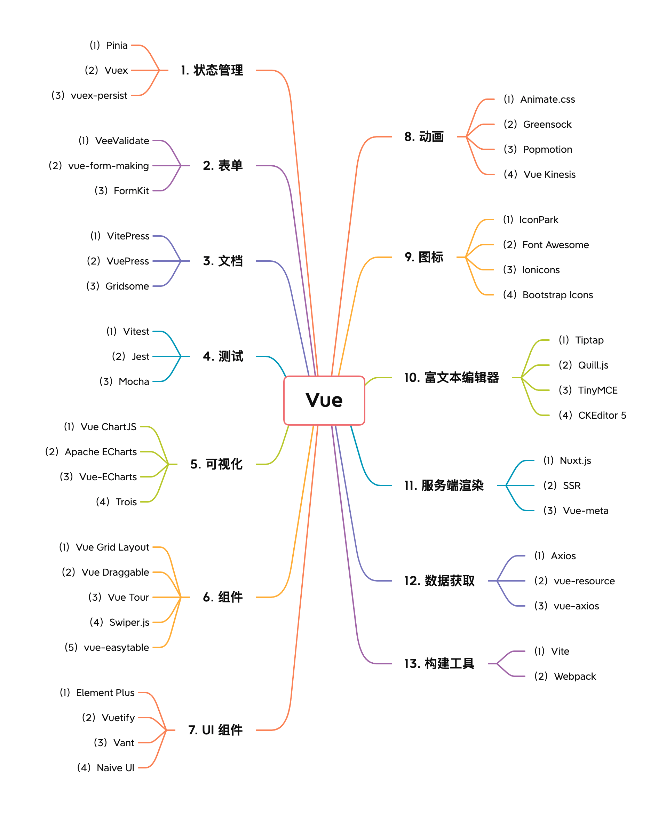
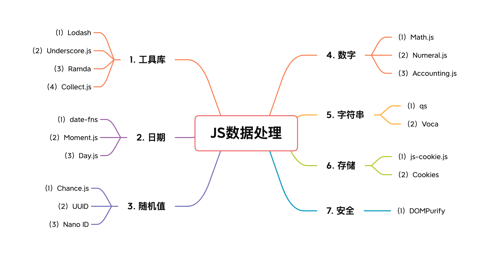
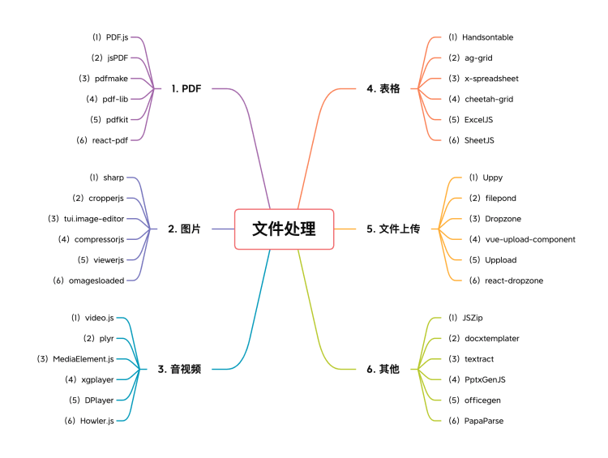
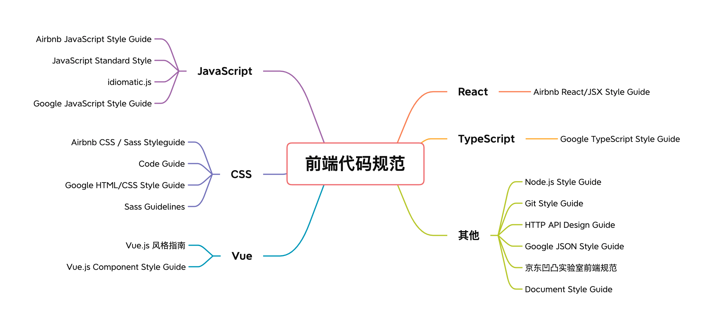
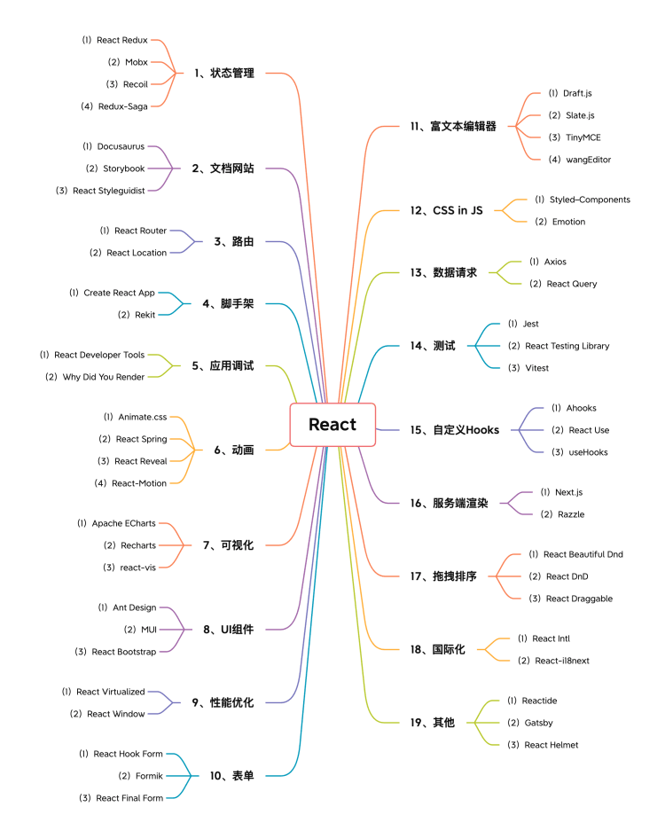

# 开源库


## **图表**

### 1. IconPark

IconPark 提供超过 2400 个高质量图标，还提供了每个图标的含义和来源的描述，便于开发者使用。除此之外，该网站还可以自定义图标，这是与其他图标网站与众不同的地方。该图标库是字节跳动旗下的技术驱动图标样式的开源图标库。


**Github**：https://github.com/bytedance/iconpark

### 2. Font Awesome

Font Awesome 提供了可缩放的矢量图标，可以使用CSS所提供的所有特性对它们进行更改，包括：大小、颜色、阴影或者其它任何支持的效果。

**Github**：https://github.com/FortAwesome/Font-Awesome

### 3. Ionicons

Ionicons 是一个完全开源的图标集，是知名混合开发框架 Ionic Framework 内置的图标库，包含 1300 个设计优雅、风格统一的高质量图标，能满足大多数的业务场景。

**Github**：https://github.com/ionic-team/ionicons

### 4. Bootstrap Icons

Bootstrap Icons 是 Bootstrap 开源的 SVG 图标库，此图标库起初专门针对其组件（从表单控件到导航）和文档进行定制设计和构建，现在可以免费用于任何项目。


**Github**：https://github.com/twbs/icons

### 5. Unicons

Unicons 是一套收录超过 4500 种图标的图标库，提供 SVG 矢量和图标字型（Iconfont）格式，使用者可以自订每个图标大小、颜色和颜色。

**Github**：https://github.com/Iconscout/unicons

### 6. Tabler Icons

Tabler Icons 是一组超过 1950 个免费的高质量 SVG 图标，可以在 Web 项目中用。


**Github**：https://github.com/tabler/tabler-icons

## **动画库**

很多时候我们在开发前端页面时都会做一些动画效果来提升用户体验度和页面美观度，所以今天就来给大家推荐几个好用的JavaScript动画库，希望对各位小伙伴有所帮助！

### **Animate.css**

animate.css 是一个使用CSS3的animation制作的动画效果的CSS集合，里面预设了很多种常用的动画，且使用非常简单。


GitHub：https://github.com/animate-css/animate.css

### Hover.css

Hover.css 是一套基于 CSS3 的鼠标悬停效果和动画，这些可以非常轻松的被应用到按钮、LOGO 以及图片等元素。所有这些效果都是只需要单一的标签，必要的时候使用 before 和 after 伪元素。因为使用了 CSS3 过渡、转换和动画效果，因此只支持 Chrome、Firefox 和 Safari 等现代浏览器。

Github：https://github.com/IanLunn/Hover

### Magic.css

Magic CSS3 Animations 动画是一款独特的CSS3动画特效包，可以自由地使用在网页中。只需简单的在页面上引入 CSS 文件: magic.css 或者压缩版本 magic.min.css 就可以使用了。


Github：https://github.com/miniMAC/magic

### React Spring

react-spring 是一个基于弹簧物理学的动画库，满足大多数与UI相关的动画需求，提供了足够灵活的工具，可以自信地将想法投射到不断变化的界面中。该库代表了一种现代动画方法。它继承了 animated 强大的插值和性能，以及 react-motion 的易用性。

GitHub：https://github.com/pmndrs/react-spring

### React Reveal

React Reveal 是一个用于 React 的高性能动画库。它占用空间小，专门为 ES6 中的 React 编写。可用于创建各种炫酷的滚动效果显示。


GitHub：https://github.com/rnosov/react-reveal

### Greensock

GreenSock是一个JavaScript动画库，可轻松对HTML元素进行动画处理。 用于创建高性能，零依赖性，跨浏览器动画，声称在超过 400 万个网站中使用。 其具有一下特点：

- 速度快，专门优化了动画性能，使之实现和css一样的高性能动画效果。
- 轻量与模块化。模块化与插件式的结构保持了核心引擎的轻量，TweenLite包非常小(基本上低于7kb)。提供了TweenLite, TimelineLite, TimelineMax 和 TweenMax不同功能的动画模块，你可以按需使用。
- 没有依赖。
- 灵活控制。不用受限于线性序列，可以重叠动画序列，可以通过精确时间控制，灵活地使用最少的代码实现动画。
- 任何对象都可以实现动画。


Github：https://github.com/greensock/GreenSock-JS/

### Velocity.js

Velocity.js 是velocity模板语法的javascript实现。Velocity 是基于Java的模板引擎，广泛应用在阿里集 体各个子公司。Velocity模板适用于大量模板使用的场景，支持复杂的逻辑运算，包含 本数据类型、变量赋值和函数等功能。还拥有**：颜色动画**、**转换动画(transforms)**、**循环**、 **缓动**、**SVG 动画**、和 **滚动动画** 等特色功能。Velocity.js 支持 Node.js 和浏览器环境。


其具有以下特点：

- 支持客户端和服务器端使用
- 语法是富逻辑的，构成门微型的语言
- 语法分析和模板渲染分离
- 基本完全支持velocity语法
- 浏览器使用支持模板之间相互引用，依据kissy模块加载机制


GitHub：http://github.com/julianshapiro/velocity

### Lax.js

Lax.js 是一款原生零依赖的制作跟随页面滑动的 JavaScript 动画插件，这款插件非常的轻巧，压缩版大小只有3kb。当滑动页面时，帮助创建酷炫的动画效果，比如滚动视差、变形移动等基本的动画效果，响应式兼容方面，比如手机端也有不错的支持。除了可以使用插件默认集成的动画属性，还可以自定义更加丰富的动画属性。


GitHub：https://github.com/alexfoxy/lax.js

### Rellax.js

rellax.js是一款轻量级的纯JavaScript滚动视觉差特效插件。rellax.js压缩后的版本仅871字节，在手机等小屏幕设备中，插件会自动限制视觉差特性。

Github：https://github.com/dixonandmoe/rellax

### three.js

three.js 是一个易于使用、轻量级、跨浏览器的通用 JavaScript 3D 库，它是一套基于WebGL 开发出的Javascript 函式库，它提供了比 WebGL 更简单的Javascript API，让开发者能够轻易在浏览器制作 3D 绘图。

GitHub：https://github.com/mrdoob/three.js/

### wow.js

WOW.js 是一款帮助你实现滚动页面时触发CSS 动画效果的插件。它依赖 animate.css，所以它支持 animate.css 多达 60 多种的动画效果，可以改变动画设置喜欢的风格、延迟、长度、偏移和迭代等，能满足各种需求。

GitHub：https://github.com/graingert/wow

### AniJS

AniJS允许我们为网站创建动画样式，而无需任何JavaScript或CSS编码！ 您可以使用简单的**If** - **On** - **Do** - **To**语法用HTML指定所有动画


GitHub：https://github.com/anijs/anijs

### Anime.js

Anime.js 是一个轻量的JavaScript 动画库， 拥有简单而强大的API。可对 CSS 属性、 SVG、 DOM 和JavaScript 对象进行动画。它很轻便，gzip压缩完只有9kb左右。


GitHub：https://github.com/juliangarnier/anime/

### Typed.js

typed.js是一个类型化库，效果是用打字机的方式显示一段话，可以自定义任何字符串、指定显示速度、指定是否循环等。


GitHub：https://github.com/mattboldt/typed.js/

### Vivus

Vivus 是一个轻量级的 JavaScript 库（没有依赖项），它允许我们对 SVG 进行动画处理，使它们看起来像是被绘制的。它有多种不同的动画可用，以及创建自定义脚本的选项，以喜欢的任何方式绘制 SVG。


GitHub：https://github.com/maxwellito/vivus

### Popmotion

Popmotion 是一个只有12KB的 JavaScript 运动引擎，可以用来实现动画，物理效果和输入跟踪。原生的DOM支持：CSS，SVG，SVG路径和DOM属性的支持，开箱即用。


GitHub：https://github.com/popmotion/popmotion

### Granim.js

granim.js是一个在网页中创建流畅的交互式流体动画的小型JavaScript库，granim.js可以实现各种想要的渐变的动画效果，使网页色彩更加丰富，视觉效果更佳！


GitHub：https://github.com/sarcadass/granim.js

### Kute.js

Kute.js 是一个原生的 Javascript 动画引擎，具有优秀的性能和模块化的代码。 它提供了一大堆工具，以帮助创建自定义动画。它提供了易于使用的方法来设置高性能、跨浏览器的动画。 


GitHub：https://github.com/thednp/kute.js

### Simple Parallax

simpleParallax.js 是一个非常简单且小巧的 Vanilla JS 库，可在任何图像上添加视差动画。它因其易用性和可视化渲染而脱颖而出。视差效果直接应用于图像标签，无需使用背景图像。

GitHub：https://github.com/geosigno/simpleParallax.js

### Barba.js

**Barba.js是一个小（4kb的压缩和压缩），灵活和无依赖的库，可以帮助您创建流畅和平滑的过渡网站的页面。 它可以减少页面之间的延迟，最大限度地减少浏览器HTTP请求并增强用户的Web体验。**


GitHub：https://github.com/barbajs/barba

### mo.js

Mo.js是一个简洁、高效的图形动画库，拥有流畅的动画和惊人的用户体验，在任何设备上，屏幕密度独立的效果都很好，可以绘制内置的形状或者自定义形状，还可以绘制多个动画，再让它们串联在一起。


GitHub：https://github.com/mojs

### Particles.js

Particles.js 一个轻量级的JavaScript库，用来在网页上创建颗粒效果。


GitHub：https://github.com/VincentGarreau/particles.js/

### tsParticles

tsParticles可以轻松创建高度可定制的粒子动画并将它们用作网站的动画背景。可用于 React.js、Vue.js（2.x 和 3.x）、Angular、Svelte、jQuery、Preact、Inferno、Solid、Riot 和 Web 组件的现成可用组件。


GitHub：https://github.com/matteobruni/tsparticles

### Rough Notation

Rough Notation是一个小型 JavaScript 库，用于在网页上创建和动画注释。它使用RoughJS 创建手绘的外观和感觉。元素可以用多种不同的样式进行注释。动画持续时间可以配置，或者只是关闭。压缩后的大小仅 3.83kb。


GitHub：https://github.com/rough-stuff/rough-notation

### Animate on Scroll

Animate on Scroll是一个在页面时创建动画的JavaScript动画库。


GitHub：https://github.com/topics/animate-on-scroll

### Framer Motion

Motion 是Framer的 React 的生产就绪运动库。它带来了声明性动画、轻松的布局转换和手势，同时保持了 HTML 和 SVG 语义。Motion 使用强大的手势识别器扩展了 React 的事件系统。它支持悬停、点击、平移和拖动。注意，Motion 需要 React 16.8 或更高版本。


GitHub：https://github.com/framer/motion

### React Motion

React Motion 是一个用于 React 应用程序的动画库，可以轻松创建和实现逼真的动画。


GitHub：https://github.com/chenglou/react-motion


## **Vue库**



### 1. 状态管理

#### （1）Pinia

Pinia 是最新一代的 Vue 轻量级状态管理库。它适用于 Vue 2.x 和 Vue 3.x。它是 Vue 官方成员在2019年11月重新设计的一个状态存储库，它允许你跨组件/页面共享状态，并且是响应式的，类似于 Vuex。

**Github**：https://github.com/vuejs/pinia

#### （2）Vuex

Vuex 是一个专为 Vue.js 应用程序开发的状态管理模式。它采用集中式存储管理应用的所有组件的状态，并以相应的规则保证状态以一种可预测的方式发生变化。


**Github**：https://github.com/vuejs/vuex

#### （3）vuex-persist

vuex-persistedstate 是一个支持 Typescript 的Vuex插件，使你能够将应用程序的状态保存到持久存储中，例如 Cookies 或 localStorage。


**Github**：https://github.com/championswimmer/vuex-persist

### 2. 表单

#### （1）VeeValidate

vee-validate 是Vue.js的表单验证库，它允许验证输入并以熟悉的声明式样式或使用组合函数构建更好的表单 UI。

**Github**：https://github.com/logaretm/vee-validate

#### （2）vue-form-making

vue-form-making 是一个基于 vue 和 element-ui 实现的可视化表单设计器，使用了最新的前端技术栈，内置了 i18n 国际化解决方案，可以让表单开发简单而高效。

**Github**：https://github.com/GavinZhuLei/vue-form-making

#### （3）FormKit

FormKit 是一个面向 Vue 开发人员的表单创作框架，它使构建高质量的生产就绪表单的速度提高了 10 倍。


**Github**：https://github.com/formkit/formkit

### 3. 文档

#### （1）VitePress

VitePress 是 VuePress 的继承者，建立在vite 之上。目前，正处于alpha阶段。它已经适合开箱即用的文档使用，但配置和主题 API 可能仍会在次要版本之间发生变化。

**Github**：https://github.com/vuejs/vitepress

#### （2）VuePress

VuePress 是一个基于 Vue 的轻量级静态网站生成器，以及为编写技术文档而优化的默认主题。 它是为了满足 Vue 自己的子项目文档的需求而创建的。

**Github**：https://github.com/vuepress/vuepress-next

#### （3）Gridsome

Gridsome 是一个基于 Vue.js 构建的 Jamstack 框架，它让开发人员可以轻松地构建静态生成的网站和应用程序，这些网站和应用程序天生速度快。


**Github**：https://github.com/gridsome/gridsome

### 4. 测试

#### （1）Vitest

Vitest 是一个由 Vite 提供支持的极速单元测试框架。其和 Vite 的配置、转换器、解析器和插件保持一致，具有开箱即用的 TypeScript / JSX 支持。

**Github**：https://github.com/vitest-dev/vitest

#### （2）Jest

Jest 是一个全面的 JavaScript 测试解决方案，专注于简洁明快。适用于大多数 JavaScript 项目。


**Github**：https://github.com/facebook/jest

#### （3）Mocha

mocha是一个功能丰富的javascript测试框架，运行在node.js和浏览器中，使异步测试变得简单有趣。Mocha测试连续运行，允许灵活和准确的报告，同时将未捕获的异常映射到正确的测试用例。


**Github**：https://github.com/mochajs/mocha

### 5. 可视化

#### （1）Vue ChartJS

vue-chartjs 是一个 Vue 对于 Chart.js 的封装，让用户可以在Vue中轻松使用Chart.js，很简单的创建可复用的图表组件，非常适合需要简单的图表并尽可能快地运行的人。 vue-chartjs抽象了基本逻辑，同时也暴露了Chart.js对象，让用户获得最大的灵活性。它支持 Vue 3 和 Vue 2。

**Github**：https://github.com/apertureless/vue-chartjs

#### （2）Apache ECharts

Apache ECharts 是一款基于Javascript的数据可视化图表库，提供直观，生动，可交互，可个性化定制的数据可视化图表。它是用纯 JavaScript 编写的，基于zrender，是一个全新的轻量级画布库。)

**GitHub**：https://github.com/apache/echarts

#### （3）Vue-ECharts

Vue-ECharts 是 Apache ECharts 的 Vue.js 组件。使用 Apache ECharts 5，同时支持 Vue.js 2/3。


**Github**：https://github.com/ecomfe/vue-echarts

#### （4）Trois

Trois 是一个基于 Three.JS 的 Vue 3 可视化库，它是一个流行的 WebGL 库。 Three.JS 对桌面和移动设备都有很好的支持。 该库允许我们使用 VueJS 组件轻松为网站创建 3D 效果。


**Github**：https://github.com/troisjs/trois

### 6. 组件

#### （1）Vue Grid Layout

vue-grid-layout 是一个网格布局系统，类似于 Gridster，用于 Vue.js。 


**Github**：https://github.com/jbaysolutions/vue-grid-layout

#### （2）Vue Draggable

Vue Draggable 是一个基于 Sortable.js 的 Vue 拖拽组件。


**Github**：https://github.com/SortableJS/Vue.Draggable

#### （3）Vue Tour

Vue Tour 是一个轻量级、简单且可定制的导览插件，可与 Vue.js 一起使用。它提供了一种快速简便的方法来指导用户完成你的应用程序。

**Github**：https://github.com/pulsardev/vue-tour

#### （4）Swiper.js

Swiper 是一款免费以及轻量级的移动设备触控滑块的框架，使用硬件加速过渡。主要使用与移动端的网站、网页应用程序，以及原生的应用程序。


**Github**：https://github.com/nolimits4web/swiper

#### （5）vue-easytable

该库提供了一个功能齐全且高度可定制的表格组件/数据网格。它支持许多功能，如虚拟滚动、列固定、标题固定、标题分组、过滤器、排序、单元格省略号、行扩展、行复选框等。


**Github**：https://github.com/Happy-Coding-Clans/vue-easytable

### 7. UI 组件

#### （1）Element Plus

Element Plus，由饿了么大前端团队开源出品的一套为开发者、设计师和产品经理准备的基于 Vue 3.0 的组件库，Element Plus 是基于 Vue3 面向设计师和开发者的组件库，提供了配套设计资源，帮助你的网站快速成型。


**GitHub**：https://github.com/ElemeFE/element

#### （2）Vuetify 

Vuetify 是一个基于 Vue.js 精心打造 UI 组件库，整套 UI 设计为 Material 风格。能够让没有任何设计技能的开发者创造出时尚的 Material 风格界面。


**GitHub**：https://github.com/vuetifyjs/vuetify

#### （3）Vant

Vant 是一套轻量、可靠的移动端组件库。通过 Vant，可以快速搭建出风格统一的页面，提升开发效率，支持 Vue 3。


**Github**：https://github.com/youzan/vant

#### （4）Naive UI

Naive UI 是一款基于当前比较新的 Vue 3.0/TypeScript 技栈开发的前端 UI 组件库。


**Github**：https://github.com/TuSimple/naive-ui

### 8. 动画

#### （1）Animate.css

animate.css 是一个使用CSS3的animation制作的动画效果的CSS集合，里面预设了很多种常用的动画，且使用非常简单。

**GitHub**：https://github.com/animate-css/animate.css

#### （2）Greensock

GreenSock是一个JavaScript动画库，可轻松对HTML元素进行动画处理。 用于创建高性能，零依赖性，跨浏览器动画，声称在超过 400 万个网站中使用。 


**Github**：https://github.com/greensock/GreenSock-JS/

#### （3）Popmotion

Popmotion 是一个只有12KB的 JavaScript 运动引擎，可以用来实现动画，物理效果和输入跟踪。原生的DOM支持：CSS，SVG，SVG路径和DOM属性的支持，开箱即用。

**Github**：https://github.com/Popmotion/popmotion

#### （4）Vue Kinesis

Vue Kinesis 支持使用 Vue.js 轻松创建复杂的交互式动画，其支持 Vue 3。


**Github**：https://github.com/Aminerman/vue-kinesis

### 9. 图标

#### （1）IconPark

IconPark 提供超过 2400 个高质量图标，还提供了每个图标的含义和来源的描述，便于开发者使用。除此之外，该网站还可以自定义图标，这是与其他图标网站与众不同的地方。该图标库是字节跳动旗下的技术驱动图标样式的开源图标库。

**Github**：https://github.com/bytedance/iconpark

#### （2）Font Awesome

Font Awesome 提供了可缩放的矢量图标，可以使用CSS所提供的所有特性对它们进行更改，包括：大小、颜色、阴影或者其它任何支持的效果。


**Github**：https://github.com/FortAwesome/Font-Awesome

#### （3）Ionicons

Ionicons 是一个完全开源的图标集，是知名混合开发框架 Ionic Framework 内置的图标库，包含 1300 个设计优雅、风格统一的高质量图标，能满足大多数的业务场景。


**Github**：https://github.com/ionic-team/ionicons

#### （4）Bootstrap Icons

Bootstrap Icons 是 Bootstrap 开源的 SVG 图标库，此图标库起初专门针对其组件（从表单控件到导航）和文档进行定制设计和构建，现在可以免费用于任何项目。


**Github**：https://github.com/twbs/icons

### 10. 富文本编辑器

#### （1）Tiptap

Tiptap 是一个基于 Vue 的无渲染的富文本编辑器，它基于 Prosemirror，完全可扩展且无渲染。可以轻松地将自定义节点添加为Vue组件。使用无渲染组件（函数式组件），几乎完全控制标记和样式。菜单的外观或在DOM中的显示位置。这完全取决于使用者。


**GitHub**：https://github.com/ueberdosis/tiptap

#### （2）Quill.js

Quill.js 是一个具有跨平台和跨浏览器支持的富文本编辑器。凭借其可扩展架构和富有表现力的 API，可以完全自定义它以满足个性化的需求。


**GitHub**：https://github.com/quilljs/quill/

#### （3）TinyMCE

TinyMCE 是一个热门的富文本编辑器。它的目标是帮助其他开发人员构建精美的 Web 内容解决方案。它易于集成，可以部署在基于云的、自托管或混合环境中。该设置使得合并诸如 Angular、React 和 Vue 等框架成为可能。它还可以使用 50 多个插件进行扩展，每个插件都有 100 多个自定义选项。


**GitHub**：https://github.com/tinymce/tinymce

#### （4）**CKEditor 5**

CKEditor 是一个强大的富文本编辑器框架，具有模块化架构、现代集成和协作编辑等功能。它可以通过基于插件的架构进行扩展，从而可以将必要的内容处理功能引入。它是在 ES6 中从头开始编写的，并且具有出色的 webpack支持。可以使用与Angular、React和Vue.js的原生集成。


**GitHub**：https://github.com/ckeditor/ckeditor5

### 11. 服务端渲染

#### （1）Nuxt.js

Nuxt.js 是一个基于 Vue.js 的通用应用框架。通过对客户端/服务端基础架构的抽象组织，Nuxt.js 主要关注的是应用的 UI 渲染。它预设了利用 Vue.js 开发服务端渲染的应用所需要的各种配置。

**Github**：https://github.com/nuxt/nuxt.js

#### （2）SSR

ssr 框架是为前端框架在服务端渲染的场景下所打造的开箱即用的服务端渲染框架。面向 Serverless，同时支持 React，Vue2，Vue3。


**Github**：https://github.com/zhangyuang/ssr

#### （3）Vue-meta

Vue-meta 是 Vue.js 的一个插件，它可以帮助你使用 SSR 支持管理 Vue.js 组件中的 HTML 元数据。Vue-meta 使用 Vue 的内置响应性使管理应用程序的元数据变得简单。


**Github**：https://vue-meta.nuxtjs.org/

### 12. 数据获取

#### （1）Axios

Axios 是一个基于promise 的网络请求库，作用于node.js和浏览器中。

**Github**：https://github.com/axios/axios

#### （2）vue-resource

vue-resource是 Vue.js 的一款插件，它可以通过XMLHttpRequest或JSONP发起请求并处理响应。

**Github**：https://github.com/pagekit/vue-resource

#### （3）vue-axios

vue-axios 是一个将 axios 集成到 Vuejs 的小型库。

**Github**：https://github.com/imcvampire/vue-axios

### 13. 构建工具

#### （1）Vite

Vite 是下一代前端开发与构建工具。 Vite 意在提供开箱即用的配置，同时它的插件 API 和 JavaScript API 带来了高度的可扩展性，并有完整的类型支持。

**Github**：https://github.com/vitejs/vite

#### （2）Webpack

webpack 是一个用于现代JavaScript应用程序的静态模块打包工具。当 webpack 处理应用程序时，它会在内部构建一个依赖图(dependency graph)，此依赖图对应映射到项目所需的每个模块，并生成一个或多个 bundle。

**Github**：https://github.com/webpack/webpack

## **数据处理**



### 1. 工具库

#### （1）Lodash

Lodash是一个一致性、模块化、高性能、提高开发者效率的JavaScript 实用工具库。Lodash 通过降低 array、number、objects、string 等等的使用难度从而让 JavaScript 变得更简单。 Lodash 的模块化方法，非常适用于：

- 遍历 array、object 和 string；
- 对值进行操作和检测；
- 创建符合功能的函数。

**Github**：https://github.com/lodash/lodash

#### （2）Underscore.js

Underscore.js 是一个实用的 JavaScript 工具库，它提供了一整套函数式编程的实用功能，但没有扩展任何 JavaScript 内置对象，而是将数据封装在一个自定义对象中。


**Github**：https://github.com/jashkenas/underscore

#### （3）Ramda

Ramda 的目标是专门为函数式编程风格而设计，更容易创建函数式 pipeline、且从不改变用户已有数据。Ramda 主要特性如下：

- Ramda 强调更加纯粹的函数式风格。数据不变性和函数无副作用是其核心设计理念。这可以帮助你使用简洁、优雅的代码来完成工作。
- Ramda 函数本身都是自动柯里化的。这可以让你在只提供部分参数的情况下，轻松地在已有函数的基础上创建新函数。
- Ramda 函数参数的排列顺序更便于柯里化。要操作的数据通常在最后面。


**Github**：https://github.com/ramda/ramda

#### （4）Collect.js

collect.js是 JavaScript 处理数组和对象的方便且无依赖的包装类工具。其提供了常用的数组和集合的操作API，map，reduce，filter 等集合的高级方法，设计灵感来源于 Laravel Collection。


**Github**：https://github.com/ecrmnn/collect.js/

### 2. 日期

#### （1）date-fns

date-fns 是一个现代的 JavaScript 日期工具类库，提供了最全面、最简单和一致的工具集，用于在浏览器和 Node.js 中操作 JavaScript 日期。其具有以下特性：

- **模块化**：根据需求选择需要引用的模块
- **不可变**：date-fns 使用纯函数构建，并且始终返回一个新的日期实例，而不是更改传递的日期实例。它允许防止错误并跳过长时间的调试会话
- **可信赖**：遵循语义版本，始终向后兼容
- **快速**：轻量快速，为用户提供最佳的使用体验
- **TypeScript & Flow**：date-fns 同时支持 Flow 和 TypeScript

```javascript
import { format, formatDistance, formatRelative, subDays } from 'date-fns'

format(new Date(), "'Today is a' eeee")
//=> "Today is a Saturday"

formatDistance(subDays(new Date(), 3), new Date(), { addSuffix: true })
//=> "3 days ago"

formatRelative(subDays(new Date(), 3), new Date())
//=> "last Friday at 7:26 p.m."
```

**Github**：https://github.com/date-fns/date-fns

#### （2）Moment.js

Moment.js 是一个简单易用的轻量级 JavaScript 日期处理类库，提供了日期格式化、解析、验证等功能。它支持在浏览器和 NodeJS 两种环境中运行。此类库能够将给定的任意日期转换成多种不同的格式，具有强大的日期计算功能，同时也内置了能显示多样的日期形式的函数。


**Github**：https://github.com/moment/moment/

#### （3）Day.js

Day.js是一个极简的JavaScript库，可以为现代浏览器解析、验证、操作和显示日期和时间。其具有以下特点：

- 和 Moment.js 相同的 API 和用法
- 不可变数据 (Immutable)
- 支持链式操作 (Chainable)
- 国际化 I18n
- 仅 2kb 大小的微型库
- 全浏览器兼容

```javascript
dayjs().format();                                     // 2020-09-08T13:42:32+08:00
dayjs().format('YYYY-MM-DD');                         // 2020-09-08
dayjs().format('YYYY-MM-DD HH:mm:ss');                // 2020-09-08 13:47:12
dayjs(1318781876406).format('YYYY-MM-DD HH:mm:ss');   // 2011-10-17 00
```

**Github**：https://github.com/iamkun/dayjs/

### 3. 随机值

#### （1）Chance.js

Chance 是一个轻量级的 JavaScript 随机字符串生成器插件，可帮助减少编写单调的代码，特别是在编写自动化测试时经常需要各种随机内容。可以使用它来产生随机数、字符、字符串、名字、地址、骰子等。


**Github**：https://github.com/chancejs/chancejs

#### （2）UUID 

UUID 是一个用于在 JavaScript 中生成符合 RFC 的 UUID 的实用程序库。其具有以下特点：

- **完整**：支持 RFC4122 版本 1、3、4 和 5 UUID
- **跨平台**：支持CommonJS、ECMAScript 模块和 CDN 构建；Node 12, 14, 16, 18；Chrome、Safari、Firefox、Edge 浏览器；Webpack 和 rollup.js 模块打包工具；
- **安全**：加密强度高的随机值
- **体积小**：零依赖，占用空间小
- **CLI**：包括 uuid 命令行实用程序


**Github**：https://github.com/uuidjs/uuid

#### （3）Nano ID

nanoid 是一个小巧、安全、URL友好、唯一的 JavaScript 字符串ID生成器。其具有以下特性：

- **小巧.** 130 bytes (已压缩和 gzipped)。 没有依赖。 Size Limit 控制大小。
- **快速.** 它比 UUID 快 60%。
- **安全.** 它使用加密的强随机 API。可在集群中使用。
- **紧凑.** 它使用比 UUID（A-Za-z0-9_-）更大的字母表。 因此，ID 大小从36个符号减少到21个符号。
- **易用.** Nano ID 已被移植到 20种编程语言。

```javascript
import { nanoid } from 'nanoid'
model.id = nanoid() //=> "V1StGXR8_Z5jdHi6B-myT"
```

**Github**：https://github.com/ai/nanoid

### 4. 数字

#### （1）Math.js

Math.js 是一个强大的 JavaScript 和 Node.js 数学库。它具有支持符号计算的灵活表达式解析器，带有大量内置函数和常量，并提供了一个集成的解决方案来处理不同的数据类型，如数字、大数、复数、分数、单位和矩阵。功能强大且易于使用。


**Github**：https://github.com/josdejong/mathjs

#### （2）Numeral.js

Numeral.js 是一个用来对数值进行操作和格式化的 JS 库。可将数字格式化为货币、百分比、时间，甚至是序数词的缩写（比如1st，100th）。


**Github**：https://github.com/adamwdraper/Numeral-js

#### （3）Accounting.js

Accounting.js 是一个用于数字、货币和货币解析/格式化的小型 JavaScript 库。它是轻量级的，完全可本地化的，没有依赖关系，并且在客户端或服务器端都可以很好地工作。使用独立或作为 nodeJS/npm 和 AMD/requireJS 模块。

```javascript
// Default usage:
accounting.formatMoney(12345678); // $12,345,678.00

// European formatting (custom symbol and separators), can also use options object as second parameter:
accounting.formatMoney(4999.99, "€", 2, ".", ","); // €4.999,99

// Negative values can be formatted nicely:
accounting.formatMoney(-500000, "£ ", 0); // £ -500,000

// Simple `format` string allows control of symbol position (%v = value, %s = symbol):
accounting.formatMoney(5318008, { symbol: "GBP",  format: "%v %s" }); // 5,318,008.00 GBP
```

**Github**：https://github.com/openexchangerates/accounting.js

### 5. 字符串

#### （1）qs

qs是一个url参数转化（parse和stringify）的JavaScript库。可以把格式化的字符串转换为对象格式。

```javascript
var qs = require('qs');
var assert = require('assert');

var obj = qs.parse('a=c');
assert.deepEqual(obj, { a: 'c' });

var str = qs.stringify(obj);
assert.equal(str, 'a=c');
```

**Github**：https://github.com/ljharb/qs

#### （2）Voca

Voca 是一个用于操作字符串的 JavaScript 库。Voca 库提供了有用的函数来使字符串操作更加舒适：更改大小写、修剪、填充、slugify、拉丁化、sprintfy、截断、转义等。模块化设计允许加载整个库或单个函数以最小化应用程序构建。该库经过全面测试、有据可查并长期受支持。

```javascript
v.camelCase('bird flight');              // => 'birdFlight'
v.sprintf('%s costs $%.2f', 'Tea', 1.5); // => 'Tea costs $1.50'
v.slugify('What a wonderful world');     // => 'what-a-wonderful-world'
```

**Github**：https://github.com/panzerdp/voca

### 6. 存储

#### （1）js-cookie.js

js-cookie.js 是一个用于处理浏览器 cookie 的简单、轻量级 JavaScript API。其具有以下特点：

- 适用于所有浏览器
- 接受任何字符
- 经过大量测试
- 无依赖
- 支持ES模块
- 支持 AMD/CommonJS
- 符合RFC 6265
- 有用的维基
- 启用自定义编码/解码
- < 800 字节压缩！


**Github**：https://github.com/js-cookie/js-cookie

#### （2）Cookies

Cookies 是一个用于获取和设置 HTTP(S) cookie的node.js模块。它的特点如下：

- 允许使用Keygrip来签署cookie，以防止篡改；
- 延迟验证cookie，以降低成本；
- 不允许通过不安全的套接字发送安全cookies；
- 默认情况下，所有cookie都仅适用于HTTP，并且通过SSL发送的cookie是安全的；
- 允许其他库在不知道签名机制的情况下访问 cookie。

```javascript
var http = require('http')
var Cookies = require('cookies')

// Optionally define keys to sign cookie values
// to prevent client tampering
var keys = ['keyboard cat']

var server = http.createServer(function (req, res) {
  // Create a cookies object
  var cookies = new Cookies(req, res, { keys: keys })

  // Get a cookie
  var lastVisit = cookies.get('LastVisit', { signed: true })

  // Set the cookie to a value
  cookies.set('LastVisit', new Date().toISOString(), { signed: true })

  if (!lastVisit) {
    res.setHeader('Content-Type', 'text/plain')
    res.end('Welcome, first time visitor!')
  } else {
    res.setHeader('Content-Type', 'text/plain')
    res.end('Welcome back! Nothing much changed since your last visit at ' + lastVisit + '.')
  }
})

server.listen(3000, function () {
  console.log('Visit us at http://127.0.0.1:3000/ !')
})
```

**GitHub**：https://github.com/pillarjs/cookies

### 7. 安全

#### （1）DOMPurify

DOMPurify 是一个开源的基于DOM的快速XSS净化工具。输入HTML元素，然后通过DOM解析递归元素节点，进行净化，输出安全的HTML。 

**Github**：https://github.com/cure53/DOMPurify

## **拖拽排序库**

### 1. React Beautiful Dnd

react-beautiful-dnd 是一款美观且简单易用的 React 列表拖拽库。其动画效果自然，性能优秀，简洁而强大的 API，易于上手，与标准浏览器的互动性非常好。


**Github（⭐️ 27.5k）**：https://github.com/atlassian/react-beautiful-dnd

### 2. Sortable

Sortable 是一个 JavaScript 拖拽库，用于在现代浏览器和触摸设备上对拖放列表进行重新排序。支持 Meteor、AngularJS、React、Polymer、Vue、Ember、Knockout 和任何 CSS 库。


**Github（⭐️ 25.3k）**：https://github.com/SortableJS/Sortable

### 3. Dragula

Dragula 是一个 JavaScript 库，实现了网页上的拖放功能。提供 JavaScript、AngularJS 和 React 版本。
**Github（⭐️ 21.3k）**：https://github.com/bevacqua/dragula

### 4. React DnD

React DnD是 React 和 Redux 核心作者 Dan Abramov 创造的一组React 高阶组件，可帮助我们构建复杂的拖放界面，同时保持组件解耦。它可以在应用程序的不同部分之间通过拖动传输数据，并且组件会更改其外观和应用状态以响应拖放事件。


**Github（⭐️ 18k）**：https://github.com/react-dnd/react-dnd

### 5. Vue.Draggable

Vue.Draggable 是基于 Sortable.js 的 Vue 拖放组件。它允许拖放和视图模型数组同步，基于并提供 Sortable.js 的所有功能。该库适用于Vue 2，如果想在 Vue 3 中使用该库，可以访问：https://github.com/SortableJS/vue.draggable.next。


**Github（⭐️ 17.7k）**：https://github.com/SortableJS/Vue.Draggable

### 6. interact.js

interact.js 是一个适用于现代浏览器的 JavaScript 拖放库，支持调整大小和多点触控手势，具有惯性和捕捉功能。为了尽可能多地提供控制，它尝试提供一个简单、灵活的API，该 API 提供移动元素所需的所有拖拽API。


**Github（⭐️ 11k）**：https://github.com/taye/interact.js

### 7. React Draggable

React-Draggable 库简单易用，将 CSS 中的`transform`应用于 React 组件，允许我们在 UI 中拖动组件。它有不同的 props 可以让你改变组件的行为，是创建直观、用户友好界面的绝佳选择。


**Github（⭐️ 7.7k）**：https://github.com/react-grid-layout/react-draggable

### 8. React Sortable Tree

React Sortable Tree 是一个用于对分层数据进行拖放式可排序表示的React组件。它支持单选多选，鼠标拖拽子集到新合集，模糊搜索等。


**Github（⭐️ 4.5k）**：https://github.com/frontend-collective/react-sortable-tree

## **文件处理**



### 1. PDF

#### （1）PDF.js

PDF.js是使用 HTML5 构建的可移植文档格式 (PDF) 查看器。它由社区驱动并受 Mozilla 支持，目标是创建一个通用的、基于 Web 标准的平台来解析和呈现 PDF。


**Github（⭐️ 39.2k）**：https://github.com/mozilla/pdf.js

#### （2）jsPDF

jsPDF 是一个使用 JavaScript 语言生成 PDF 的开源库，是一个用于生成 PDF 的领先的 HTML5 客户端解决方案。

**Github（⭐️ 24.6k）**：https://github.com/parallax/jsPDF

#### （3）pdfmake

在纯 JavaScript 中用于服务器端和客户端的 PDF 文档生成库。


**Github（⭐️ 10.2k）**：https://github.com/bpampuch/pdfmake

#### （4）pdf-lib

pdf-lib 可以在任何 JavaScript 环境中创建和修改 PDF 文档。它旨在解决 JavaScript 生态系统对 PDF 操作（尤其是 PDF修改）缺乏强大支持的问题。可以用于任何现代 JavaScript 运行时，如 Node、Browser、Deno 和 React Native 等。

**Github（⭐️ 4.1k）**：https://github.com/Hopding/pdf-lib

#### （5）**pdfkit**

PDFKit 是一个用于 Node 和浏览器的 PDF 文档生成库，可以轻松创建复杂的多页可打印文档。API 包含可链接性，并包括低级功能以及更高级别功能的抽象。PDFKit API 的设计很简单，因此生成复杂的文档通常只需几个函数调用即可。


**Github（⭐️ 8.2k）**：https://github.com/foliojs/pdfkit

#### （6）**react-pdf**

react-pdf 是一个用于在浏览器和服务器上创建 PDF 文件的 React 渲染器。

**Github（⭐️ 10.9k）**：https://github.com/diegomura/react-pdf

### 2. 图片

#### （1）sharp

sharp 是一个高性能的 Node.js 图像处理库，调整 JPEG、PNG、WebP、AVIF 和 TIFF 图像大小的最快模块。


**Github（⭐️ 22.7k）**：https://github.com/lovell/sharp

#### （2）cropperjs

cropperjs 是一个 JavaScript 图像裁剪器，支持29个裁剪选项、27种方法、6个事件、缩放、旋转等。


**Github（⭐️ 10.8k）**：https://github.com/fengyuanchen/cropperjs

#### （3）tui.image-editor

tui.image-editor 是一个使用 HTML5 Canvas 的全功能图像编辑器。它易于使用并提供强大的过滤器。


**Github（⭐️ 5.2k）**：https://github.com/nhn/tui.image-editor

#### （4）compressorjs

JavaScript 图像压缩器。使用浏览器原生的 canvas.toBlob API 来做压缩工作，即**有损压缩**，**异步**压缩，在不同的浏览器有**不同的压缩效果**。一般在客户端上传之前使用这个来预压缩图片。

**Github（⭐️ 3.9k）**：https://github.com/fengyuanchen/compressorjs

#### （5）**viewerjs**

viewerjs 是一个 JavaScript 图像查看器，支持52个查看选项、23种操作方法、17个事件、旋转、移动、缩放等。


**Github（⭐️ 6.6k）**：https://github.com/fengyuanchen/viewerjs

#### （6）omagesloaded

omagesloaded 是一个用来检查图像何时加载的 JavaScript 库。

**Github（⭐️ 8.7k）**：https://github.com/desandro/imagesloaded

### 3. 音视频

#### （1）video.js

Video.js 是一个为 HTML5 世界从头开始构建的网络视频播放器。它支持 HTML5 视频和媒体源扩展，以及其他播放技术，如 YouTube 和 Vimeo（通过插件）。它支持在台式机和移动设备上播放视频。


**Github（⭐️ 8.7k）**：https://github.com/videojs/video.js

#### （2）plyr

Plyr 是一个简单、轻量级、可访问和可定制的 HTML5、YouTube 和 Vimeo 媒体播放器，支持现代浏览器。


**Github（⭐️ 22.3k）**：https://github.com/sampotts/plyr

#### （3）MediaElement.js

MediaElement.js 是一个HTML5 audio 或 video 播放器，支持 MP4、WebM 和 MP3 以及 HLS、Dash、YouTube、Facebook、SoundCloud 等，具有通用 HTML5 MediaElement API，可在所有浏览器中实现一致的 UI。


**Github（⭐️ 7.9k）**：https://github.com/mediaelement/mediaelement

#### （4）xgplayer

西瓜播放器是一个Web视频播放器类库，它本着一切都是组件化的原则设计了独立可拆卸的 UI 组件。更重要的是它不只是在 UI 层有灵活的表现，在功能上也做了大胆的尝试：摆脱视频加载、缓冲、格式支持对 video 的依赖。尤其是在 mp4 点播上做了较大的努力，让本不支持流式播放的 mp4 能做到分段加载，这就意味着可以做到清晰度无缝切换、加载控制、节省视频流量。同时，它也集成了对 flv、hls、dash 的点播和直播支持。


**Github（⭐️ 5.4k）**：https://github.com/bytedance/xgplayer

#### （5）DPlayer

DPlayer 是一款可爱的 HTML5 弹幕视频播放器，可帮助人们轻松构建视频和弹幕。


**Github（⭐️ 12.9k）**：https://github.com/DIYgod/DPlayer

#### （6）Howler.js

howler.js 是一个现代 web 音频库。它默认为Web Audio API并回退到HTML5 Audio。这使得在所有平台上使用 JavaScript 处理音频变得容易且可靠。


**Github（⭐️ 20.3k）**：[Howler.js](https://github.com/goldfire/howler.js)

### 4. 表格

#### （1）Handsontable 

Handsontable 是一个具有电子表格外观的 JavaScript 数据网格组件。适用于 React、Angular 和 Vue。它结合了数据网格功能和类似电子表格的 UX。
它提供数据绑定、数据验证、过滤、排序和 CRUD 操作。


**Github（⭐️ 16.8k）**：https://github.com/handsontable/handsontable

#### （2）**ag-grid**

AG Grid 是一个功能齐全且高度可定制的 JavaScript 数据网格。它提供了出色的性能，没有第三方依赖，并且可以与所有主要的 JavaScript 框架顺利集成。


**Github（⭐️ 16.8k）**：https://github.com/ag-grid/ag-grid

#### （3）x-spreadsheet

x-spreadsheet 是一个基于 Web 的 JavaScript（canvas）电子表格。


**Github（⭐️ 12.6k）**：https://github.com/myliang/x-spreadsheet

#### （4）cheetah-grid

cheetah-grid 是最快的 Web 开源数据表。


**Github（⭐️ 1.2k）**：https://github.com/future-architect/cheetah-grid

#### （5）ExcelJS

ExcelJS 是一个Excel电子表格文件逆向工程项目。可以读取，操作并写入电子表格数据和样式到 XLSX 和 JSON 文件

**Github（⭐️ 9.7k）**：https://github.com/exceljs/exceljs

#### （6）SheetJS

SheetJS 是一个简化的电子表格，用意用来阅读、编辑和导出电子表格，其适用于 Web 浏览器和服务器，在 Office 365 中受 Microsoft 信任。

**Github（⭐️ 30.6k）**：https://github.com/SheetJS/sheetjs

### 5. 文件上传

#### （1）Uppy

Uppy 是一款时尚的模块化 JavaScript 文件上传器，可与任何应用程序无缝集成。它速度快，具有易于理解的 API，让您不必担心比构建文件上传器更重要的问题。


**Github（⭐️ 25.5k）**：https://github.com/transloadit/uppy

#### （2）filepond

filepond 是一个用于上传文件的 JavaScript 库，优化图像以加快上传速度，并提供出色、可访问、如丝般流畅的用户体验。

**Github（⭐️ 12.6k）**：https://github.com/pqina/filepond

#### （3）Dropzone

Dropzone 是一个 JavaScript 库，可以将任何 HTML 元素转换为 dropzone。这意味着用户可以将文件拖放到上面，Dropzone 将显示文件预览和上传进度，并通过 XHR 为你处理上传。

**Github（⭐️ 16.7k）**：https://github.com/dropzone/dropzone

#### （4）vue-upload-component

vue-upload-component 是一个用于 Vue.js 的上传组件，支持多文件上传，上传目录，拖拽上传，拖拽目录，以及支持同时上传多个文件等。

**Github（⭐️ 2.5k）**：https://github.com/lian-yue/vue-upload-component

#### （5）Uppload 

Uppload 是一个更好的 JavaScript 图片上传器。它具有 30 多个插件的高度可定制性，完全免费和开源，并且可以与任何文件上传后端一起使用。


**Github（⭐️ 1.7k）**：https://github.com/elninotech/uppload

#### （6）react-dropzone

react-dropzone 是一个为 React 量身定制的，基于HTML5 的 drop && drag API，可以实现拖拽上传文件的 JavaScript 库。


**Github（⭐️ 1.7k）**：https://github.com/react-dropzone/react-dropzone

### 6. 其他

#### （1）JSZip

JSZip 是一个使用 JavaScript 创建、读取和编辑 .zip 文件的库，具有可爱而简单的 API。


**Github（⭐️ 8.1k）**：https://github.com/Stuk/jszip

#### （2）**docxtemplater**

docxtemplater 是一个从 docx/pptx 模板生成 docx/pptx 文档的库。它可以用数据替换 {placeholders} 并且还支持循环和条件。


**Github（⭐️ 2.2k）**：https://github.com/open-xml-templating/docxtemplater

#### （3）textract

textract 是一个 node.js 模块，用于从 html、pdf、doc、docx、xls、xlsx、csv、pptx、png、jpg、gif、rtf 等中提取文本。


**Github（⭐️ 1.5k）**：https://github.com/dbashford/textract

#### （4）PptxGenJS

PptxGenJS 是一个使用功能强大、简洁的 JavaScript API 创建 PowerPoint 演示文稿。


**Github（⭐️ 1.6k）**：https://github.com/gitbrent/PptxGenJS

#### （5）officegen

officegen 是一个用于 JavaScript 中 Word (docx)、PowerPoint (pptx) 和 Excell (xlsx) 的独立 Office Open XML 文件（Microsoft Office 2007 及更高版本）生成器。


**Github（⭐️ 2.4k）**：https://github.com/Ziv-Barber/officegen

#### （6）PapaParse 

PapaParse 是一个快速而强大的 CSV（分隔文本）解析器，可以优雅地处理大文件和格式错误的输入。


**Github（⭐️ 10.6k）**：https://github.com/mholt/PapaParse

## **Node.js 框架**

Node.js 是最受欢迎的 JavaScript 运行时，今天就来看看有哪些热门、值得使用的Node.js框架。

### 1. Next.js

Next.js 是一个用于生产环境的 React 应用框架，使用它可以快速上手开发 React 应用，而不需要花很多时间和精力去折腾各种开发工具。所谓的用于生产环境，是指功能和稳定性足够，有大量的实际应用案例。常用于 React 服务端渲染应用。


实际上，Next.js 是一个全栈框架，它提供了生产环境所需的所有功能以及最佳的开发体验：包括静态及服务器端融合渲染、 支持 TypeScript、智能化打包、 路由预取等功能 无需任何配置。


**Next.js 的特点如下**：

- **支持 TypeScript**：自动配置并编译 TypeScript；
- **API 路由**：创建 API 端点（可选）以提供后端功能；
- **内置支持 CSS**：使用 CSS 模块创建组件级的样式。内置对 Sass 的支持；
- **代码拆分和打包**：采用由 Google Chrome 小组创建的、并经过优化的打包和拆分算法；
- **零配置**：自动编译并打包。从一开始就为生产环境而优化；
- **混合模式**： SSG 和 SSR：在一个项目中同时支持构建时预渲染页面（SSG）和请求时渲染页面（SSR）；
- **增量静态生成**：在构建之后以增量的方式添加并更新静态预渲染的页面。

**Github（⭐️87k）**：https://github.com/vercel/next.js

### 2. Express.js

Express 是最受欢迎的、基于 MVC 的 Node.js 框架。它有许多与 Nodejs 同步的库和组件，以创建漂亮而强大的动态 Web 应用程序。ExpressJS 提供了所有HTTP实用方法、函数和中间件，可帮助开发人员编写健壮的 API。它适用于单页应用、多页应用、混合应用开发。


我们可以使用 **Express.js** 更快地开发 Web 应用程序，因为它具有几乎现成的 API 生成基础。由于其强大的路由、模板、安全功能和错误处理规定，可以将其用于任何企业级或基于浏览器的应用程序。


**Express.js 的特点如下**：

- 可以构建单页和多页 Web 应用程序；
- 遵循 MVC 架构，使应用程序的实现变得容易；
- 它支持 14+ 引擎模板和 HTTP 方法；
- 高性能 ，使用异步编程相互独立地执行多个操作；
- 超高的测试覆盖率有助于构建具有最大可测试性的应用程序；
- 能够编写强大的 API 并注入重载包以帮助扩展框架的功能；
- 更好的内容协商，通过向 URL 提供 HTTP 标头来帮助客户端和服务器之间更好地通信，从而为用户/客户端获取准确的信息；
- 快速的服务器端编程包，该框架具有许多 Node.js 功能作为函数，并用很少的代码行加快了进程。


**GitHub（⭐️57.1k）**：https://github.com/expressjs/express

### 3. Socket.io

Socket.io 用于构建实时应用程序并在 Web 客户端和服务器之间建立双向通信。使用此库框架，可以开发具有 websocket 开发要求的应用程序。例如，聊天应用程序会持续运行以获取实时更新，并刷新后台进程以获取更新或消息。它还以更少的代码行提供实时分析。


Socket.io 适合开发实时应用程序，如聊天室应用程序、视频会议应用程序、多人游戏等，这些应用程序需要服务器推送数据而无需客户端请求。


**Socket.io 的特点如下**：

- 它支持自动重新连接；
- 无缝地向 Web 应用程序添加实时功能；
- 将消息编码为命名 JSON 或二进制事件；
- 它确保无与伦比的编码速度和可靠性；
- 使您能够开发即时消息传递和聊天应用程序，而无需处理复杂的编码。


**GitHub（⭐️55.8k）**：https://github.com/socketio/socket.io

### 4. Nest.js

Nest (NestJS) 是一个用于构建高效、可扩展的 Node.js 服务器端应用程序的开发框架。它利用 JavaScript 的渐进增强的能力，使用并完全支持 TypeScript （仍然允许开发者使用纯 JavaScript 进行开发），并结合了 OOP （面向对象编程）、FP （函数式编程）和 FRP （函数响应式编程）。它还提供了一个命令行界面 (CLI)，可帮助开发人员将其他前端工具与其集成。


Nest 在常见的 Node.js 框架 (Express/Fastify) 之上提高了一个抽象级别，但仍然向开发者直接暴露了底层框架的 API。这使得开发者可以自由地使用适用于底层平台的无数的第三方模块。可以将此框架用于编写更简洁且可重用的应用程序代码，编写可扩展、可测试的应用程序，编写具有更高级别结构的代码，例如过滤器、管道、拦截器等。


**Nest.js 的特点如下**：

- 使用 TypeScript 作为其原生编程语言；
- 利用了许多编程范式，例如 FP、OOP 和 FRP，使其更具可扩展性；
- 提供了一种模块化方法，其中库被安排在适当的模块中；
- 使用了一些 Express 功能来简化开发过程；
- 其简单易懂的命令行界面可帮助开发人员将其与不同工具无缝集成。


**GitHub（⭐️47.1k）**：https://github.com/nestjs/nest

### 5. Meteor.js

Meteor.js 是一个高度简单且用户友好的全栈 Node.js 框架，高度兼容 iOS、Android 或桌面。通过 Meteor.js 开发应用程序非常简单易用，同时具备服务大型项目的能力。使用 Meteor.js 最好的部分是，它可以与其他技术无缝集成，例如前端框架和数据库系统，如 React、Vue、Angular 和 MongoDB。此外，Meteor.js 在后端开发方面更接近 Node.js，开发人员可以更轻松地编写完整的网站，而无需使用多种编程语言。


Meteor.js 具有快速原型设计和生成跨平台（Android、iOS、Web）代码的能力。它也是最直接的学习框架之一，因为它不遵循任何严格的结构规则。因此，任何希望以最少的学习曲线为多个平台创建应用程序的初学者或中级开发人员都可以选择使用 Meteor.js。


**Meteor.js 的特点如下**：

- 允许开发人员为任何平台（iOS、Android 和 Web）构建应用程序；
- 它可以很容易地与 NoSQL 数据库集成，包括 MongoDB；
- 轻量级且高度灵活的 Web 应用程序开发；
- 可与 Angular、React 和 Vue 等前 3 大前端 Web 框架集成；
- 拥有一个快速发展的社区，是全栈开发人员的理想选择；
- 包含一组丰富的库，可帮助开发人员构建动态 Web 应用程序。


**GitHub（⭐️42.9k）**：https://github.com/meteor/meteor

### 6. Nuxt.js

Nuxt.js 是一个基于 Vue.js 的轻量级应用框架，可用来创建服务端渲染 (SSR) 应用，也可充当静态站点引擎生成静态站点应用，具有优雅的代码结构分层和热加载等特性。Nuxt 作为一个构建健壮应用程序的全栈框架，旨在显着改善全栈 Vue 开发的体验。


**Nuxt.js 的特点如下**：

- 自动代码分层；
- 服务端渲染；
- 强大的路由功能，支持异步数据；
- 静态文件服务；
- ES6/ES7 语法支持；
- 打包和压缩 JS 和 CSS；
- HTML头部标签管理；
- 本地开发支持热加载；
- 集成ESLint；
- 支持HTTP/2推送；
- 支持各种样式预处理器： SASS、LESS、 Stylus等。


**GitHub（⭐️40.5k）**：https://github.com/nuxt/nuxt.js

### 7. Koa.js

Koa 被认为是对 Express 框架的扩展，因为它是由 Express 团队设计和开发的基于 MVC 的框架。创建 Koa 的主要目的是提供一个比 Express 更轻量级并且能够更高效地开发 Web 应用程序和 API 的框架。尽管与 Express 相比，它包含的库和组件更少，但 Koa.js 具有许多新功能，并且错误处理能力要好很多。


Koa 与 Express 非常相似，在编写代码时，仍然可以享受 Express 的灵活性和更多的自由度和更少的复杂性。这最大限度地减少了整个应用程序堆栈中的错误范围。 当性能是 Web 应用程序的关键需求时，Koa 可能是最好的选择之一。特别是对于大型项目，该框架可以与大型且经验丰富的开发团队一起构建广泛的应用程序。在某些情况下，Koa 已被证明是比 Express 更快的框架。

**Koa.js 的特点如下**：

- 包括许多新的和独有的功能；
- 通过 async/await 关键字使代码保持干净；
- 具有内置的错误回调功能，可防止网站或web应用程序崩溃
- 它使用上下文对象，可以轻松地处理请求和响应对象。


**GitHub（⭐️32.7k）**：https://github.com/koajs/koa

### 8. Sails.js

Sails.js 是一个Web 框架，可以轻松构建自定义的企业级 Node.js 应用程序。它的设计类似于 Ruby on Rails 等框架的 MVC 架构，但支持更现代、面向数据的 Web 应用程序和 API 开发风格。它特别适合构建聊天等实时功能。


Sails 是一个比 Express 更快的轻量级 NodeJS 框架。它与各种流行的后端和前端工具的集成使其成为最好的 Nodejs 框架之一。它提供了 ORM，允许它与任何数据库系统集成，例如 MySQL、MongoDB、PostgreSQL、Redis等。


**Sails.js 的特点如下**：

- 100% 使用 JavaScript 编写，这使得它易于学习；
- 支持自动生成 REST API；
- 可以轻松地与 WebSockets 集成；
- 其 ORM（对象关系映射）功能可帮助开发人员将 Web 框架与任何数据库管理系统集成；
- 可以与任何前端技术集成；
- 可以处理任何类型的 HTTP 请求；
- 可重用的安全策略。


**GitHub（⭐️22.2k）**：https://github.com/balderdashy/sails

### 9. Fastify

Fastify 是一个快速并且低开销的 web 框架，专为 Node.js 平台量身打造。Fastify 的设计灵感来自 Hapi 和 Express，致力于以最少的开销和强大的插件结构提供最佳的开发体验。据我们所知，它是这个领域里速度最快的 web 框架之一。


**Fastify 的特点如下**：

- **高性能**： Fastify 是这一领域中最快的 web 框架之一，另外，取决于代码的复杂性，Fastify 最多可以处理每秒 3 万次的请求；
- **可扩展**： Fastify 通过其提供的钩子（hook）、插件和装饰器（decorator）提供完整的可扩展性；
- **基于 Schema**： 建议使用 JSON Schema 来做路由（route）验证及输出内容的序列化，Fastify 在内部将 schema 编译为高效的函数并执行；
- **日志**： 日志是非常重要且代价高昂的。使用最好的日志记录程序来尽量消除这一成本，这就是 Pino；
- **对开发人员友好**： 框架的使用很友好，帮助开发人员处理日常工作，并且不牺牲性能和安全性；
- **支持 TypeScript**： 维护一个 TypeScript 类型声明文件，以便支持不断成长的 TypeScript 社区。


**GitHub（⭐️23.1k）**：https://github.com/fastify/fastify

### 10. Egg.js

Egg.js 为企业级框架和应用而生，希望由 Egg.js 孕育出更多上层框架，帮助开发团队和开发人员降低开发和维护成本。它继承了Koajs的高性能优点，同时又加入了一些约束与开发规范，来规避Koajs框架本身的开发自由度太高的问题。Egg 提供了一个更加强大的插件机制，让这些独立领域的功能模块可以更加容易编写。


Egg.js 是国内最热门的 node.js 框架之一，不同于 Exporess、Koa 等基础框架，Egg.js 在应用级的提炼封装，使其更贴近业务场景，更快上手。


Egg.js 的特点如下：

- 提供基于 Egg 定制上层框架的能力；
- 高度可扩展的插件机制；
- 内置多进程管理；
- 基于 Koa 开发，性能优异；
- 框架稳定，测试覆盖率高；
- 渐进式开发。


**GitHub（⭐️17.9k）**：https://github.com/eggjs/egg


## **前端代码规范**



### 1. JavaScript

#### （1）Airbnb JavaScript Style Guide

Airbnb JavaScript Style Guide 是由 Airbnb 开源的 JavaScript 代码风格指南。主要是为编写 JavaScript 代码提供规范的风格，方便开发者理解、阅读代码。

**Github（英文）**：https://github.com/airbnb/javascript

**Github（中文）**：https://github.com/sivan/javascript-style-guide

#### （2）JavaScript Standard Style

JavaScript 标准风格，无需管理 `.eslintrc`,`.jshintrc`, 或 .`jscsrc` 文件即可运行，真正做到开箱即用。本规范特点之一是简洁。谁也不想为每个项目维护一份有成百上千行语句的代码风格配置文件，有此规范就够了。


**Github**：https://github.com/standard/standard

#### （3）idiomatic.js

编写具备一致风格、通俗易懂 JavaScript 的规则，提供了中文版。


**Github**：https://github.com/rwaldron/idiomatic.js

#### （4）Google JavaScript Style Guide

谷歌 JavaScript 风格指南。

**Github**：https://google.github.io/styleguide/jsguide.html#terminology-notes

### 2. CSS 

#### （1）Airbnb CSS / Sass Styleguide

用更合理的方式编写 CSS 和 Sass。

**Github**：https://github.com/airbnb/css

#### （2）Code Guide

开发灵活，稳定，可持续 HTML 和 CSS 代码的规范，提供了中文版。


**Github**：https://github.com/mdo/code-guide

#### （3）Google HTML/CSS Style Guide

谷歌 HTML/CSS 风格指南，旨在改善协作和代码质量。


**地址**：https://google.github.io/styleguide/htmlcssguide.html

#### （4）Sass Guidelines

编写健全、可维护和可扩展的 Sass 的指南。


**Github**：https://github.com/KittyGiraudel/sass-guidelines

### 3. Vue

#### （1）Vue.js 风格指南

这是 Vue 官方提供的 Vue（2.x）特有代码的风格指南。


**Github**：https://v2.cn.vuejs.org/v2/style-guide/

#### （2）Vue.js Component Style Guide

本规范提供了一种统一的编码规范来编写 Vue.js 代码，提供了中文版。


**Github**：https://github.com/pablohpsilva/vuejs-component-style-guide

### 4. React

#### （1）Airbnb React/JSX Style Guide

Airbnb React/JSX 风格指南，基于 JavaScript 当前流行的标准。


**Github**：https://github.com/airbnb/javascript/tree/master/react

### 5. TypeScript

#### （1）Google TypeScript Style Guide

谷歌 TypeScript 风格指南。

**地址**：https://google.github.io/styleguide/tsguide.html

### 6. 其他

#### （1）Node.js Style Guide

Node.js Style Guide是编写一致且美观的 node.js 代码的指南。


**Github**：https://github.com/felixge/node-style-guide

#### （2）Git Style Guide

Git 风格指南，这份风格指南受到 [How to Get Your Change Into the Linux Kernel](https://www.kernel.org/doc/Documentation/SubmittingPatches)，[git man pages](http://git-scm.com/doc) 和大量社区通用实践的启发，提供了中文版。


**Github**：https://github.com/agis/git-style-guide

#### （3）HTTP API Design Guide

本指南描述了一组 HTTP+JSON API 设计实践。它的目标是一致性和专注于业务逻辑，同时避免设计轮子。提供了中文版。


**Github**：https://github.com/interagent/http-api-design

#### （4）Google JSON Style Guide

谷歌 JSON 风格指南。


**地址**：https://google.github.io/styleguide/jsoncstyleguide.xml

#### （5）京东凹凸实验室前端规范

由凹凸实验室整理，基于 [W3C](http://www.w3.org/)、[苹果开发者](https://developer.apple.com/) 等官方文档，并结合团队日常业务需求以及团队在日常开发过程中总结提炼出的经验而制定。


**Github**：https://github.com/o2team/guide

#### （6）Document Style Guide

阮一峰开源的中文技术文档的写作规范。

**Github**：https://github.com/ruanyf/document-style-guide

## **富文本编辑器**

### 1. D3.js

D3（Data-Driven Documents 或 D3.js）是一个 JavaScript 库，用于使用 Web 标准将数据可视化。D3 可以使用SVG、 Canvas 和 HTML 将数据变为现实。D3 将强大的可视化和交互技术与数据驱动的DOM操作方法相结合，让你拥有现代浏览器的全部功能，并可以自由地为数据设计合适的可视化界面。

**GitHub（Stars: 101 K）**：https://github.com/d3/d3

### 2. Chart.js

Chart.js 是为设计人员和开发人员提供的简单而灵活的 JavaScript 图表。该库可以创建八种常见类型的图表：折线图、条形图、雷达图、气泡图、散点图、面积图、饼图和极坐标图图表。该库使用 HTML5 中的 canvas 元素来呈现图表，并且这些图表默认情况下是响应式的。

**GitHub（Stars: 56.8 K）**：https://github.com/chartjs/Chart.js

### 3. Apache ECharts

Apache ECharts 是一款基于Javascript的数据可视化图表库，提供直观，生动，可交互，可个性化定制的数据可视化图表。它是用纯 JavaScript 编写的，基于zrender，是一个全新的轻量级画布库。

**GitHub（Stars: 50.9 K）**：https://github.com/apache/echarts

### 4. Recharts

Recharts 是一个用React和D3构建的、重新定义的图表库。该库的主要目的是在 React 应用程序中轻松编写图表。Recharts的主要原则如下：

- 只需使用 React 组件进行部署；
- 原生SVG 支持，轻量级仅依赖于一些 D3 子模块；
- 声明性组件，图表的组件纯粹是展示性的。

**GitHub（Stars: 18.2 K）**：https://github.com/recharts/recharts

### 5. Plotly.js

Plotly.js 是一个开源的 JavaScript 图表库，它基于 d3.js 和 stack.gl 。Plotly.js 是一个高层次的、描述性的图表库。 plotly.js 带来了多种图表类型，包括 3D 图表，统计图表，和 SVG 地图等。


**GitHub（Stars: 14.6 K）**：https://github.com/plotly/plotly.js

### 6. **Chartist.js**

Chartist.js 是一个简单的响应式图表，可以作为前端图表生成器。其主要特性如下：

- 使用基于配置的转换简单处理；
- 使用明确的分离，具有巨大的灵活性(使用 CSS 样式和 JS 控制)；
- 使用 SVG ；
- 完全响应式，具有独立 DPI；
- 多媒体查询的响应式配置；
- 完全使用 SASS 构建，并且支持自定义。

**GitHub（Stars: 12.8 K）**：https://github.com/gionkunz/chartist-js

### **7.** ApexCharts

ApexCharts 是一个现代 JavaScript 图表库，允许使用简单的 API 和 100 多个即用型示例构建交互式数据可视化。ApexCharts 包含十几种图表类型，可在应用程序和仪表板中提供美观、响应迅速的可视化。该库旨在更轻松地缩放、平移、滚动数据、在图表上放置信息注释等。其适用于：React、Vue.js、JavaScript。


**GitHub（Stars: 11.4 K）**：https://github.com/apexcharts/apexcharts.js

### **8.** Highcharts

Highcharts 是一个制作图表的纯 Javascript 类库，主要特性如下：

- 兼容性：兼容当今所有的浏览器，包括 iPhone、IE 和火狐等；
- 支持大部分的图表类型：直线图，曲线图、区域图、区域曲线图、柱状图、饼状图、散布图等；
- 跨语言：不管是 PHP、Asp.net 还是 Java 都可以使用，它只需要三个文件：一个是 Highcharts 的核心文件 highcharts.js，还有 a canvas emulator for IE 和 Jquery 类库或者 MooTools 类库；
- 提示功能：鼠标移动到图表的某一点上有提示信息；
- 放大功能：选中图表部分放大，近距离观察图表；
- 易用性：无需要特殊的开发技能，只需要设置一下选项就可以制作适合自己的图表；
- 时间轴：可以精确到毫秒。


**GitHub（Stars: 10.6 K）**：https://github.com/highcharts/highcharts

### 9. Nivo

Nivo 是一个基于 D3 和 React 的框架，提供了 14 种不同类型的组件来呈现数据。Nivo 提供了很多自定义选项和三个渲染选项：Canvas、SVG，基于 API 的 HTML。


**GitHub（Stars: 10.1 K）**：https://github.com/plouc/nivo

### **10. deck.gl**

deck.gl是 Uber 开发并开源的基于 WebGL 的地理大数据可视化框架。用户可以通过组合现有图层或利用 deck.gl 的可扩展架构来满足自定义需求，从而快速获得令人印象深刻的视觉效果。


deck.gl 将数据（通常是 JSON 对象数组）映射到一堆可视层中——例如图标、多边形、文本；并用视图来查看它们：例如地图、第一人称、正字法。


deck.gl 处理了许多开箱即用的挑战：

- 大型数据集的高性能渲染和更新；
- 交互式事件处理，例如选择、突出显示和过滤；
- 制图投影和与主要底图提供商的集成；
- 经过验证的、经过良好测试的层目录；


Deck.gl 被设计为高度可定制的。所有层都带有灵活的 API，以允许对渲染的各个方面进行编程控制。用户可以轻松扩展所有核心类，以解决自定义用例。


**GitHub（Stars: 9.8 K）**：https://github.com/visgl/deck.gl

### 11. kepler.gl

Kepler.gl 是一个高性能的基于 Web 的应用程序，用于对大规模地理定位数据集进行可视化探索，它可以渲染数百万个点。它支持 3 种数据格式，分别是： CSV、JSON、GeoJSON 。部分地图种类只支持 GeoJSON 格式的数据。


Kepler.gl 也是一个使用 Redux 管理其状态和数据流的 React 组件。它可以嵌入到其他 React-Redux 应用程序中并且是高度可定制的


**GitHub（Stars: 8.6 K）**：https://github.com/keplergl/kepler.gl

### 12. react-vis

react-vis 是一组用于呈现常见数据可视化图表的 react 组件，例如折线图/面积图/条形图、热图、散点图、等高线图、六边形热图、饼图和圆环图、旭日形图、雷达图、平行坐标和树形图。


react-vis 的特点如下：

- 简单：不需要任何深入的数据可视化库知识即可开始构建第一个可视化；
- 灵活性：为不同的图表提供了一组基本构建块。例如，分离 X 轴和 Y 轴分量。这为需要它的应用程序提供了对图表布局的高级控制。
- 便于使用：提供了一组默认值，可以被自定义用户的设置覆盖；
- 与React集成：支持 React 的生命周期，不会创建不必要的节点。

**GitHub（Stars: 8.2 K）**：https://github.com/uber/react-vis

### 13. Chart.xkcd

Chart.xkcd 是一个图表库，可绘制“粗略”、“卡通”或“手绘”样式的图表。它支持多样的图表类型：折线图、XY 图、条形图、圆饼/甜甜圈图、雷达图等。


**GitHub（Stars: 7.1 K）**：https://github.com/timqian/chart.xkcd

### 14. BizCharts

BizCharts 是由阿里巴巴开源的一个基于 G2 封装的 React 图表库，具有 G2、React 的全部优点，可以让用户以组件的形式组合出无数种图表；并且集成了大量的统计工具，支持多种坐标系绘制，交互定制，动画定制以及图形定制等等。

**GitHub（Stars: 5.8 K）**：https://github.com/alibaba/BizCharts

### 15. TOAST UI Chart

TOAST UI Chart 是一个非常漂亮的图表库，用于可视化统计数据。它支持 Chrome、Firefox、Safari、Edge、IE（8+）等浏览器，绘制速度快，无需额外填充。Toast UI Chart 直观且易于使用。并且，它可以与当今两个最流行的开源前端框架（React 和 Vue.js ）很好地集成。


与 Highcharts 一样，Toast UI Chart 也为旧版浏览器提供了很好的支持。因此，它保证了所有浏览器的外观相同。它还可以快速绘制并具有出色的性能，并且不需要 polyfill。在渲染机制方面，它使用原生浏览器格式，包括 SVG 和 RVML。

**GitHub（Stars: 5.1 K）**：https://github.com/nhn/tui.chart

### 16. billboard.js

billboard.js 是一个基于D3.js的可重用、简单的界面 JavaScript 图表库。

**GitHub（Stars: 5.1 K）**：https://github.com/naver/billboard.js

## **中后台管理模版**

### Vue Element Admin

vue-element-admin 是一个后台前端解决方案，它基于 vue 和 element-ui实现。它使用了最新的前端技术栈，内置了 i18n 国际化解决方案，动态路由，权限验证，提炼了典型的业务模型，提供了丰富的功能组件，它可以帮助你快速搭建企业级中后台产品原型。

**Github（⭐️77.5k）**：https://github.com/PanJiaChen/vue-element-admin

### Ant Design Pro

Ant Design Pro 是基于 Ant Design 和 umi 的封装的一整套企业级中后台前端/设计解决方案，致力于在设计规范和基础组件的基础上，继续向上构建，提炼出典型模板/业务组件/配套设计资源，进一步提升企业级中后台产品设计研发过程中的用户和设计者的体验。


Ant Design Pro 的特点如下：

- **TypeScript**: 应用程序级 JavaScript 的语言
- **区块**: 通过区块模板快速构建页面
- **优雅美观**：基于 Ant Design 体系精心设计
- **常见设计模式**：提炼自中后台应用的典型页面和场景
- **最新技术栈**：使用 React/umi/dva/antd 等前端前沿技术开发
- **响应式**：针对不同屏幕大小设计
- **主题**：可配置的主题满足多样化的品牌诉求
- **国际化**：内建业界通用的国际化方案
- **最佳实践**：良好的工程实践助您持续产出高质量代码
- **Mock 数据**：实用的本地数据调试方案
- **UI 测试**：自动化测试保障前端产品质量

**Github（⭐️32.5k）**：https://github.com/ant-design/ant-design-pro

### React Admin

React Admin 是基于React17.x、Ant Design4.x、Material Design在REST/GraphQL API之上构建在浏览器中运行的管理应用程序的一款前端框架。


**Github（⭐️20.2k）**：https://github.com/marmelab/react-admin

### iView Admin

iView-admin是iView生态中的成员之一，是一套采用前后端分离开发模式，基于Vue的后台管理系统前端解决方案。其内置了开发后台管理系统常用的逻辑功能，和开箱即用的业务组件，旨在让开发者能够以最小的成本开发后台管理系统，降低开发量。


**Github（⭐️16.1k）**：https://github.com/iview/iview-admin

### Vue Manage System

Vue Manage System 是一个后台管理系统解决方案。它作为一套多功能的后台框架模板，适用于绝大部分的后台管理系统（Web Management System）开发。基于 Vue3 + pinia，引用 Element Plus 组件库，方便开发快速简洁好看的组件。分离颜色样式，支持手动切换主题色，而且很方便使用自定义主题色。

**Github（⭐️15.4k）**：https://github.com/lin-xin/vue-manage-system

### Vue vben admin

Vue Vben Admin 是一个免费开源的中后台模版。使用了最新的vue3,vite2,TypeScript等主流技术开发，开箱即用的中后台前端解决方案。其特点如下：

- **最新技术栈**：使用 Vue3/vite2 等前端前沿技术开发
- **TypeScript**: 应用程序级 JavaScript 的语言
- **主题**：可配置的主题
- **国际化**：内置完善的国际化方案
- **Mock 数据** 内置 Mock 数据方案
- **权限** 内置完善的动态路由权限生成方案
- **组件** 二次封装了多个常用的组件


**Github（⭐️13k）**：https://github.com/vbenjs/vue-vben-admin

### Vue Admin  Better

vue-admin-better 是一个基于 vue3+element-plus 的中后台前端框架。其特点如下：

- 40+高质量单页
- RBAC 模型 + JWT 权限控制
- 10 万+ 项目实际应用
- 良好的类型定义
- 开源版本支持免费商用
- 跨平台 PC、手机端、平板
- 后端路由动态渲染

**Github（⭐️12.6k）**：https://github.com/chuzhixin/vue-admin-better

### D2Admin

D2Admin 是一个完全开源免费的企业中后台产品前端集成方案，使用最新的前端技术栈，小于 60kb 的本地首屏 js 加载，已经做好大部分项目前期准备工作，并且带有大量示例代码，助力管理系统敏捷开发。

**Github（⭐️11.6k）**：https://github.com/d2-projects/d2-admin

### AntD Admin

AntD Admin 是一套优秀的中后台前端解决方案。其特征如下：

- 国际化，源码中抽离翻译字段，按需加载语言包
- 动态权限，不同权限对应不同菜单
- 优雅美观，Ant Design 设计体系
- Mock 数据，本地数据调试


**Github（⭐️9k）**：https://github.com/zuiidea/antd-admin

### Vuestic Admin

Vuestic Admin 是一套免费且美观的 Vue.js （3.x）管理模板，使用 Vuestic UI 构建，包含 44 多个自定义 UI 组件。


**Github（⭐️8.8k）**：https://github.com/epicmaxco/vuestic-admin

### Vue Pure Admin

vue-pure-admin 是一个免费开源的中后台模版。使用了最新的vue3 vite2 Element-Plus TypeScript等主流技术开发，开箱即用的中后台前端解决方案。


**Github（⭐️3.2k）**：https://github.com/xiaoxian521/vue-pure-admin

### Vue Antd Admin

Vue Antd Admin 是 Ant Design Pro 的 Vue 实现版本，是一个开箱即用的中后台前端/设计解决方案。

**Github（⭐️3.1k）**：https://github.com/iczer/vue-antd-admin

### Geeker Admin

Geeker Admin 是基于 Vue3.2、TypeScript、Vite2、Pinia、Element-Plus 开源的一套后台管理模板。

**Github（⭐️1.8k）**：https://github.com/HalseySpicy/Geeker-Admin

### Soybean Admin

Soybean Admin 是一个基于 Vue3、Vite3、TypeScript、Naive UI和UnoCSS 的清新优雅的中后台模版，它使用了最新的前端技术栈，内置丰富的主题配置，有着极高的代码规范，基于mock实现的动态权限路由，开箱即用的中后台前端解决方案。

**Github（⭐️1.2k）**：https://github.com/honghuangdc/soybean-admin

### Vue Admin Box

vue-admin-box是一个免费并且开源的中后台管理系统模板。使用最新版本的vue3+vite+element-plus开发而成，目的是为了解决通用型的业务中后台系统复杂的配置。

**Github（⭐️880）**：https://github.com/cmdparkour/vue-admin-box

### Vue3.0 Template Admin

vue3.0-template-admin 是基于 vue3+ElementPlus+Typescript+Vite 搭建一套通用的后台管理模板；并基于常见业务场景，抽象出常见功能组件；包括动态菜单，菜单权限、登录、主题切换、国际化、个人中心、表单页、列表页、复制文本、二维码分享等。

**Github（⭐️760）**：https://github.com/GeekQiaQia/vue3.0-template-admin


## **React 库**



### 1、状态管理

#### （1）React Redux

Redux 是 JavaScript 应用程序的状态容器，提供可预测的状态管理。React Redux 是 Redux 官方实现的 React 绑定。可以让你构建一致化的应用，运行于不同的环境（客户端、服务器、原生应用），并且易于测试。不仅于此，它还提供超爽的开发体验。

**Github**：https://github.com/reduxjs/react-redux

#### （2）Mobx

MobX 是一个身经百战的库，它通过运用透明的函数式响应编程使状态管理变得简单和可扩展。


**Github**：https://github.com/mobxjs/mobx

#### （3）Recoil

Recoil 是一个用于 React 应用程序的实验性状态管理库。它提供了一些单独使用 React 难以实现的功能，同时兼容 React 的最新功能。

**Github**：https://github.com/facebookexperimental/Recoil

#### （4）Redux-Saga

redux-saga 是一个旨在使应用程序的副作用（即，数据获取等异步操作和访问浏览器缓存等不纯操作）更易于管理、执行更高效、易于测试以及更好地处理故障的库。

**Github**：https://github.com/redux-saga/redux-saga

### 2、文档网站

#### （1）**Docusaurus**

Docusaurus 是由 facebook 开源的一个用于轻松构建、部署和维护开源项目网站的项目。使用 Docusaurus 可以让你**专注于内容**，并只需编写 Markdown 文件即可。

**Github**：https://github.com/facebook/docusaurus

#### （2）Storybook

Storybook 是 UI 组件的开发环境，它允许开发者浏览组件库，查看每个组件的不同状态，以及交互地开发和测试组件。


**Github**：https://github.com/storybookjs/storybook/

#### （3）React Styleguidist

React Styleguidist是一个React设计规范生成器，一个本地组件开发环境，支持热重载，共享的设计规范。它会列出了组件propTypes，并基于Markdown文件显示可编辑的实时使用示例。


**Github**：https://github.com/styleguidist/react-styleguidist

### 3、路由

#### （1）React Router

React Router 是完整的 React 路由解决方案。React Router 保持 UI 与 URL 同步。它拥有简单的 API 与强大的功能例如代码缓冲加载、动态路由匹配、以及建立正确的位置过渡处理。

**Github**：https://github.com/remix-run/react-router

#### （2）React Location

React Location 是客户端 React 应用程序的路由器。它支持异步路由、深度集成的搜索参数 API、可选的 JSX 路由定义、用于路由加载器缓存的预打包简单缓存实现、带有外部缓存和存储的轻松集成等。


**Github**：https://github.com/TanStack/location

### 4、脚手架

#### （1）Create React App

Create React App 是一种官方支持的创建单页 React 应用程序的方式。它提供了一个没有配置的现代构建设置。

**Github**：https://github.com/facebook/create-react-app

#### （2）Rekit

Rekit是开源的一个脚手架，用于使用 React、Redux 和 React-router 构建可扩展的 Web 应用程序。它可以帮助开发人员专注于业务逻辑，而不是处理大量的库、模式、配置等。

**Github**：https://github.com/rekit/rekit

### 5、应用调试

#### （1）React Developer Tools

React Devtools 可以在 Chrome 和 Firefox 开发者工具审查 React 组件的浏览器扩展。可以用于检查React组件层次结构，在页面上显示React组件。

**安装地址**：https://chrome.google.com/webstore/detail/react-developer-tools/fmkadmapgofadopljbjfkapdkoienihi?hl=zh-CN

#### （2）Why Did You Render

Why Did You Render 是由 Welldone Software 开发的，可以在开发的时候就检测到一些不必要的渲染问题，告诉我们当前渲染是什么原因导致的。


**Github**：https://github.com/welldone-software/why-did-you-render

### 6、动画

#### （1）Animate.css

animate.css 是一个使用CSS3的animation制作的动画效果的CSS集合，里面预设了很多种常用的动画，且使用非常简单。


**GitHub**：https://github.com/animate-css/animate.css

#### （2）React Spring

react-spring 是一个基于弹簧物理学的动画库，满足大多数与UI相关的动画需求，提供了足够灵活的工具，可以自信地将想法投射到不断变化的界面中。该库代表了一种现代动画方法。它继承了 animated 强大的插值和性能，以及 react-motion 的易用性。

**GitHub**：https://github.com/pmndrs/react-spring

#### （3）React Reveal

React Reveal 是一个用于 React 的高性能动画库。它占用空间小，专门为 ES6 中的 React 编写。可用于创建各种炫酷的滚动效果显示。

**GitHub**：https://github.com/rnosov/react-reveal

#### （4）React-Motion

React-Motion 是一个动画库，拥有一种更轻松的方法来创建和实现逼真的动画。它利用物理学来为 React 元素创建几乎自然的动画。

**Github**：https://github.com/chenglou/react-motion

### 7、可视化

#### （1）Apache ECharts

Apache ECharts 是一款基于Javascript的数据可视化图表库，提供直观，生动，可交互，可个性化定制的数据可视化图表。它是用纯 JavaScript 编写的，基于zrender，是一个全新的轻量级画布库。

**GitHub**：https://github.com/apache/echarts

#### （2）Recharts

Recharts 是一个用React和D3构建的、重新定义的图表库。该库的主要目的是在 React 应用程序中轻松编写图表。


**GitHub**：https://github.com/recharts/recharts

#### （3）react-vis

react-vis 是一组用于呈现常见数据可视化图表的 react 组件，例如折线图/面积图/条形图、热图、散点图、等高线图、六边形热图、饼图和圆环图、旭日形图、雷达图、平行坐标和树形图。


**GitHub**：https://github.com/uber/react-vis

### 8、UI组件

#### （1）Ant Design

GitHub 上超过 269 k 个项目使用了 Ant Design 组件库，Ant Design of React 是一个基于 Ant Design 设计体系的 React UI 组件库，主要用于研发企业级中后台产品。Ant Design 提供了大量高质量的组件，非常适合快速构建整个 UI 框架，也可以只使用单个组件。

**GitHub**：https://github.com/ant-design/ant-design

#### （2）MUI

MUI 是一个基于 Google 的 Material Design 的简单且可定制的 React 组件库。MUI 不仅是一个组件库，而是一个完整的设计系统。它具有一套完整的指南、设计原则和 UI 设计最佳实践系统。


**GitHub**：https://github.com/mui-org/material-ui

#### （3）React Bootstrap

React-Bootstrap，是比较古老的 React UI 组件库之一。它是使用 React 来重新构建了前端框架 Bootstrap。该库由完全响应并且可访问的现成的组件组成。所有设计元素都是高度可定制的。

**GitHub**：https://github.com/react-bootstrap/react-bootstrap

### 9、性能优化

#### （1）React Virtualized

React Virtualized 是一个以高效渲染大型列表和表格数据的响应式组件，可以用来解决长列表渲染问题。

**Github**：https://github.com/bvaughn/react-virtualized

#### （2）React Window

React Window 是用于高效渲染大型列表和表格数据的 React 组件。通过仅渲染大型数据集的一部分（刚好足以填充满视口）来工作。

**Github**：https://github.com/bvaughn/react-window

### 10、表单

#### （1）React Hook Form

React Hook Form 是一个高性能、灵活、易拓展、易于使用的表单校验库，用于 React Web 和 React Native 的表单验证。

**GitHub**：https://github.com/react-hook-form/react-hook-form

#### （2）Formik

Formik是一个可以在React中构建表单的组件。它旨在轻松管理具有复杂验证的表单，支持同步和异步表单级和字段级验证。


**GitHub**：https://github.com/jaredpalmer/formik

#### （3）React Final Form

React Final Form 是Final Form 的一个精简 React 包装器，它是一个基于订阅的表单状态管理库，使用观察者模式，因此只有需要更新的组件会随着表单状态的变化而重新渲染。


**GitHub**：https://github.com/final-form/react-final-form

### 11、富文本编辑器

#### （1）Draft.js

Draft.js 是 Facebook 的一个开源项目，是 React 项目首选的富文本编辑器框架。这是一个健壮、可扩展和可定制的框架。Draft.js 遵循与 React 中的受控组件相同的范例，并提供了一个 Editor 呈现富文本输入的组件。它还公开了一个EditorStateAPI 来处理/存储Editor组件中的状态更新。


**GitHub**：https://github.com/facebook/draft-js

#### （2）Slate.js

Slate.js 是受 Draft.js 启发的富文本编辑器。它是一个可深度定制的富编辑器框架，专用于 React。与 Draft.js 类似，它具有良好的 API、强大的插件基础设施以及与 React 的深度连接。此外，插件生态系统比 Draft.js 小一些，但它的插件质量会更好。


**GitHub**：https://github.com/ianstormtaylor/slate

#### （3）TinyMCE

TinyMCE 是一个热门的富文本编辑器。它的目标是帮助其他开发人员构建精美的 Web 内容解决方案。它易于集成，可以部署在基于云的、自托管或混合环境中。该设置使得合并诸如 Angular、React 和 Vue 等框架成为可能。它还可以使用 50 多个插件进行扩展，每个插件都有 100 多个自定义选项。


**GitHub**：https://github.com/tinymce/tinymce

#### （4）wangEditor

wangEditor 是一个使用Typescript 开发的 Web 富文本编辑器， 轻量、简洁、易用、开源免费。它兼容常见的 PC 浏览器：Chrome，Firefox，Safar，Edge，QQ 浏览器，IE11。


**GitHub**：https://github.com/wangeditor-team/wangEditor/

### 12、CSS in JS

#### （1）Styled–Components

styled-components 可以在 JavaScript 代码中使用 CSS 来设置 React 组件的样式。通过这个库可以自定义组件的样式，它会将给定的样式包装成一个组件，可以直接使用这个组件，也不需要组件和样式之间的映射，即创建后就是一个正常的React 组件。

**Github**：https://github.com/styled-components/styled-components

#### （2）Emotion

Emotion 是一个高性能且灵活的 CSS-in-JS 库。基于许多其他 CSS-in-JS 库，它允许开发人员使用字符串或对象样式快速设置应用样式。

**Github**：https://github.com/emotion-js/emotion

### 13、数据请求

#### （1）Axios

Axios 是一个基于 promise 网络请求库，作用于node.js 和浏览器中。 它是 isomorphic 的(即同一套代码可以运行在浏览器和node.js中)。在服务端它使用原生 node.js http 模块，而在客户端 (浏览端) 则使用 XMLHttpRequests。

**Github**：https://github.com/axios/axios

#### （2）React Query

React Query 是一个适用于react hooks的请求库，它可以为任何类型的异步数据提供React状态管理功能，使React中的获取、缓存、同步和更新服务器数据变得轻而易举。

**Github**：https://github.com/tanstack/query

### 14、测试

#### （1）Jest

Jest 是由 Facebook 开发的 JavaScript 测试框架。它应该是测试 React 的首选，因为它是由 React 的发明者创建的，并且得到了 React 社区的支持和开发。它还支持 Babel、TypeScript、Node、Angular 和 Vue 以及其他 JS 框架。


**Github**：https://github.com/facebook/jest

#### （2）React Testing Library

React Testing Library 基于DOM Testing Library的基础上添加一些API，主要用于测试React组件。该库在使用过程并不关注组件的内部实现，而是更关注测试。该库基于react-dom和react-dom/test-utils，是以上两者的轻量实现。

**Github**：https://github.com/testing-library/react-testing-library

#### （3）Vitest

Vitest 是一个由 Vite 提供支持的极速单元测试框架。其和 Vite 的配置、转换器、解析器和插件保持一致、开箱即用的 TypeScript / JSX 支持、支持 Smart 和 instant watch 模式，如同用于测试的 HMR、内置 Tinyspy 用于模拟、打标和监察等。

**Github**：https://github.com/vitest-dev/vitest

### 15、自定义Hooks

#### （1）Ahooks

ahooks 是一套由阿里巴巴开源的 React Hooks 库，封装了大量好用的 Hooks。

**Github**：https://github.com/alibaba/hooks

#### （3）React Use

React Use 是一个必不可少的 React Hooks 集合。其包含了传感器、用户界面、动画效果、副作用、生命周期、状态这六大类的Hooks。

**Github**：https://github.com/streamich/react-use

#### （3）useHooks

useHooks 是一组易于理解的 React Hook集合。

**Github**：https://github.com/uidotdev/usehooks

### 16、服务端渲染

#### （1）Next.js

Next.js 是一个用于服务器渲染的通用 JavaScript Web 应用程序的小型框架，该框架基于 React、Webpack 和 Babel 构建，为该网站提供了强大的支持。

**Github**：https://github.com/vercel/next.js

#### （2）Razzle

Razzle是类似于next.js的简单服务端框架，用于在服务端渲染 React 应用程序。比较方便的一点是无需配置。通过将一般的JavaScript应用抽象成单个的依赖，然后将框架，路由和数据提取出来。同时，Razzle 支持可插拔渲染。

**Github**：https://github.com/jaredpalmer/razzle

### 17、拖拽排序

#### （1）React Beautiful Dnd

react-beautiful-dnd 是一款美观且简单易用的 React 列表拖拽库。其动画效果自然，性能优秀，简洁而强大的 API，易于上手，与标准浏览器的互动性非常好。

**Github**：https://github.com/atlassian/react-beautiful-dnd

#### （2）React DnD

React DnD是 React 和 Redux 核心作者 Dan Abramov 创造的一组React 高阶组件，可帮助我们构建复杂的拖放界面，同时保持组件解耦。它可以在应用程序的不同部分之间通过拖动传输数据，并且组件会更改其外观和应用状态以响应拖放事件。

**Github**：https://github.com/react-dnd/react-dnd

#### （3）**React Draggable**

React-Draggable 库简单易用，将 CSS 中的 transform 应用于 React 组件，允许我们在 UI 中拖动组件。它有不同的 props 可以让你改变组件的行为，是创建直观、用户友好界面的绝佳选择。

**Github**：https://github.com/react-grid-layout/react-draggable

### 18、国际化

#### （1）React Intl

React Intl 提供了一个 React 组件和用于国际化 React Web 应用的 Mixin。它提供一个格式化日期、数字、字符串消息的描述方式。

**Github**：https://github.com/formatjs/formatjs

#### （2）React-i18next

react-i18next 是基于 i18next 的一款强大的国际化框架，可以用于 react 和 react-native 应用，是目前非常主流的国际化解决方案。

**Github**：https://github.com/i18next/react-i18next

### 19、其他

#### （1）Reactide

Reactide 是首个用于 React Web 应用开发的专用 IDE 。它是一个跨平台的桌面应用程序，提供了一个自定义模拟器，不需要构建工具和服务器配置，开箱即用。 Reactide 将开发带回到打开单个文件的日子，立即在浏览器中呈现项目。 使用 Reactide，开发人员可以使用单个 React JSX 文件实现相同的简单性，同时利用 React 的强大功能。

**Github**：https://github.com/reactide/reactide

#### （2）Gatsby

Gatsby 是基于 React 构建的静态站点生成器，拥有丰富的插件生态，其主要目标之一是交付访问速度快速的网页，它通过利用良好的缓存、静态页面生成和基于边缘的 CDN 数据源来实现这一目标。

**Github**：https://github.com/gatsbyjs/gatsby

#### （3）React Helmet

React Helmet是一个HTML文档head管理工具，管理对文档头的所有更改。Helmet采用纯 HTML 标签并输出纯 HTML 标签。它非常简单，而且对 React 初学者友好。

**Github**：https://github.com/nfl/react-helmet

## **React Hooks 库**

### 1. Ahooks

ahooks 是一套由阿里巴巴开源的 React Hooks 库，封装了大量好用的 Hooks。其特点如下：

- 易学易用；
- 支持 SSR；
- 对输入输出函数做了特殊处理，避免闭包问题；
- 包含大量提炼自业务的高级 Hooks；
- 包含丰富的基础 Hooks；
- 使用 TypeScript 构建，提供完整的类型定义文件。

**Github**：https://github.com/alibaba/hooks

### 2. React Use

React Use 是一个必不可少的 React Hooks 集合。其包含了传感器、用户界面、动画效果、副作用、生命周期、状态这六大类的Hooks。

**Github**：https://github.com/streamich/react-use

### 3. useHooks

useHooks 是一组易于理解的 React Hook集合。

**Github**：https://github.com/uidotdev/usehooks

### 4. React Recipes

React Recipes 是一个包含流行的自定义 Hook 的 React Hooks 实用程序库。

**Github**：https://github.com/craig1123/react-recipes

### 5. Rhooks

Rhooks 是一组基本的 React 自定义Hooks。

**Github**：https://github.com/imbhargav5/rooks

### 6. React Hanger

React Hanger 是一组有用的Hooks。

**Github**：https://github.com/kitze/react-hanger

### 7. Beautiful React Hook

Beautiful React Hook 是一组漂亮的（希望有用的）React hooks 来加速你的组件和 hooks 开发。


**Github**：https://github.com/antonioru/beautiful-react-hooks

### 8. Awesome React Hooks 

Awesome React Hooks  是一个很棒的 React Hooks 资源集合，该集合包含React Hooks教程、视频、工具，Hooks列表。其中Hooks列表中包含了众多实用的自定义Hooks。


**Github**：https://github.com/rehooks/awesome-react-hooks

### 9. SWR

SWR 是一个用于获取数据的 React Hooks 库。只需一个Hook，就可以显着简化项目中的数据获取逻辑。其特点如下：

- 极速、轻量、可重用的数据请求；
- 内置缓存和重复请求去除；
- 实时体验；
- 传输和协议不可知；
- 支持 SSR / ISR / SSG；
- 支持 TypeScript；
- React Native。

**Github**：https://github.com/vercel/swr

### 10. React Hook Form

React Hook Form 是一个用于表单状态管理和验证的 React Hooks (Web + React Native)。

**Github**：https://github.com/react-hook-form/react-hook-form

## **React UI 组件库**

根据 BuildWith 的统计，React 为全球1000 多万个网站的用户界面 (UI) 提供了支持。在做一些项目时，我们可能会选择使用一些成熟的UI组件库来实现。那为什么要使用组件库来处理 React 项目呢？主要有以下原因：

- **对初学者友好**：UI 库由预构建的组件组成，例如按钮、表单等。因此，我们不必弄清楚如何从头开始创建元素。相反，可以在文档的帮助下专注于页面功能的实现；
- **更快的原型制作**：使用现成的 React 组件供我们使用，可以快速创建多个功能原型，而无需在细节上花费太多时间。
- **节省时间**：使用组件库不仅可以节省原型设计时间，还可以节省处理 React 细节的时间。使用组件库可以编写更少的代码，而不必编写所有样式。
- **可定制的组件**：组件库提供的组件都可以进行不同程度的自定义，进行定制化。
- **跨设备兼容性**：大多数预构建的 UI 组件默认情况下是移动响应的，这意味着您不必付出很多额外的努力来确保您的 React 项目可以在不同类型的设备上运行。

下面就来看看 GitHub 上流行的 React UI 库！

### 1. Ant Design

GitHub 上超过 269 k 个项目使用了 Ant Design 组件库，Ant Design of React 是一个基于 Ant Design 设计体系的 React UI 组件库，主要用于研发企业级中后台产品。


Ant Design 组件库主要有以下特性：

- 🌈 提炼自企业级中后台产品的交互语言和视觉风格。
- 📦 开箱即用的高质量 React 组件。
- 🛡 使用 TypeScript 开发，提供完整的类型定义文件。
- ⚙️ 全链路开发和设计工具体系。
- 🌍 数十个国际化语言支持。
- 🎨 深入每个细节的主题定制能力。


当然，Ant Design 也是有缺点的，其包的大小有1.2 MB，而其他 React 库通常为几百 KB。


Ant Design 提供了大量高质量的组件，非常适合快速构建整个 UI 框架，也可以只使用单个组件。该库基于 43.9% 的 TypeScript、31.3% 的 JavaScript、24.5% 的 Less 和 0.3% 的其他代码。


GitHub Star：77.1k

GitHub地址：https://github.com/ant-design/ant-design

官网地址：https://ant.design/index-cn

### 2. MUI

GitHub 上超过 781k 个项目使用了MUI，它是一个基于 Google 的 Material Design 的简单且可定制的 React 组件库。MUI 不仅是一个组件库，而是一个完整的设计系统。它具有一套完整的指南、设计原则和 UI 设计最佳实践系统。MUI 使用了 61.4% 的 JavaScript 和 38.6% 的 TypeScript 来构建。


由于 MUI 基于的 Material-UI 设计系统是由 Google 创建的，所以它也会在 Google 的一些平台上使用。因此，MUI 组件可以具有类似于 Google 的外观和感觉，这意味着 MUI 可以成为构建 Android 应用程序的绝佳选择。


GitHub Star：74.5k

GitHub 地址：https://github.com/mui-org/material-ui

官网地址：https://mui.com/zh/

### 3. React Bootstrap

在 GitHub 上有大概 649k 个项目使用 React-Bootstrap，是比较古老的 React UI 组件库之一。它是使用 React 来重新构建了前端框架 Bootstrap。该库由完全响应并且可访问的现成的组件组成。所有设计元素都是高度可定制的。


React-Bootstrap 可以用于 UI 基础、网站和设计应用程序。该库使用 59.4% 的 JavaScript、38.3% 的 TypeScript 和 2.3% 的 SCSS 构建，最新版本可以与最新的 Bootstrap 5.1 版本兼容。我们可以 使用 React-Bootstrap 只导入需要使用的单个组件，这也有助于最大限度地减少代码总量。不过，React-Bootstrap 相对于其他组件库，组件会少一点。

GitHub Star：20.4k

GitHub 地址：https://github.com/react-bootstrap/react-bootstrap

官网地址：https://react-bootstrap.github.io/

### 4. Reactstrap

在GitHub上有 250k 个项目使用了 Reactstrap。Reactstrap 组件元素响应迅速，设计简单，适用于各种项目。Reactstrap 使用 74.7% 的 JavaScript、24.9% 的 TypeScript 和 0.4% 的 Shell 构建。我们可以使用 Reactstrap 进行完整的 UI 开发或者使用单个组件开发。它提供了极大的灵活性和预构建的验证，非常适合快速构建具有出色用户体验的精美表单。由于 Reactstrap 是一个比较年轻的组件库，所以它的可用组件相对其他组件库来说会略少一点。


GitHub Star：10.2k

GitHub 地址：https://github.com/reactstrap/reactstrap

官网地址：https://reactstrap.github.io/

### 5. Semantic UI React

Semantic UI React 被GitHub 上 136k 个项目使用，是一个用于移动端的响应式前端组件库。它是 Semantic UI 开发框架的官方 React 集成，以响应迅速、人性化的 HTML 代码而闻名。Semantic UI React 使用 99.9% 的 JavaScript 和 0.1% 的 TypeScript 构建。


GitHub Star：12.6k

GitHub 地址：https://github.com/Semantic-Org/Semantic-UI-React

官网地址：https://react.semantic-ui.com/

### 6. Chakra UI

Chakra UI 被 GitHub 上的 41.9k 个项目使用，提供了简单的、模块化的和可定制的 React 组件来支持应用程序和 Web 开发。所有元素也针对暗模式进行了优化，与其他一些 UI 组件库不同的，Chakra UI 完全兼容 WAI-ARIA 可访问性标准。Chakra UI 使用 97.5% 的 TypeScript、1.9% 的 JavaScript 和 0.6% 的其他代码构建。


简单是 Chakra UI 的一大特点。它非常关注开发过程，并承诺将花费更少的时间编写代码，而将更多的时间用于构建出色的用户体验。但是，其他 React UI 组件库相比，Chakra UI 相对较新，所以会缺乏一些功能和组件。因此，它更适合用于不需要大量组件或高级功能的中小型项目。

GitHub Star：23.4k

GitHub 地址：https://github.com/chakra-ui/chakra-ui

官网地址：https://chakra-ui.com/

### 7. Theme UI

Theme UI 被 GitHub 上 18.1k 个项目使用，它包含了 30 多个原始 UI 组件。Theme UI 的核心概念依赖基于约束的设计原则。Theme UI  使用 75.1% 的 TypeScript、24.1% 的 JavaScript 和 0.2% 的其他代码构建。由于快速的工作流程、真正易于使用的样式和主题功能以及对变化的支持，该组件库受到高度评价。Theme UI UI 还提供了一些实用功能，例如内置的深色模式和移动优先的响应式样式。


Theme UI React 组件库可以很容易地用于构建 Web 应用程序。但是因为它是一个很年轻的库，它还没有那么多的基础组件或者活跃的社区成员，并且默认情况下它不完全兼容可访问性标准。


GitHub Star：4.2k

GitHub 地址：https://github.com/system-ui/theme-ui

官网地址：https://theme-ui.com/

### 8. Rebass

Rebass 被 GitHub 上的 11k 个项目使用，它具有原始的 React UI 组件和用于进一步设计的简单系统。这些组件响应迅速、简约且灵活。最重要的是，它是一个非常轻量级的库，包大小只有 43 kb 。Rebass 100% 使用 JavaScript 开发。


我们可以使用 Rebass 创来建简约风格的系统并根据需要自定义组件。使用 Styled System 减少了在应用程序中编写自定义的 CSS 的需要，所以可以更快地构建项目。Rebass 是支持主题的，虽然没有预设主题，但它提供了足够的灵活性来供我们自定义主题。Rebass 与 Theme UI 完全兼容，因此可以根据需要将这两者结合使用。


GitHub Star：7.6k

GitHub 地址：https://github.com/rebassjs/rebass

官网地址：https://rebassjs.org/

### 9. Blueprint

Blueprint 被 GitHub 上的 10.2k 个项目使用，其包含了 40 多个组件。主要是为复杂的数据密集型桌面应用来构建 React UI，因此它不是完全响应移动设备的。Blueprint 使用 88.4% 的 TypeScript、8.7% 的 SCSS、2.2% 的 JavaScript 和 0.7% 的其他代码构建。我们可以安装包含所有基本组件的 Blueprint 核心包，并根据需求来添加任何组件包。例如，Datetime、Icons 和 Table 包等。


Blueprint 不提供任何预构建的主题，只提供了默认的浅色主题和深色主题。不过，我们可以定制和构建个性化主题。如想使用现成的组件构建数据密集型桌面应用，Blueprint 可能是最适合的 React 组件库。它不太适合移动应用程序。


GitHub Star：18.5k

GitHub 地址：https://github.com/palantir/blueprint

官网地址：https://blueprintjs.com/
