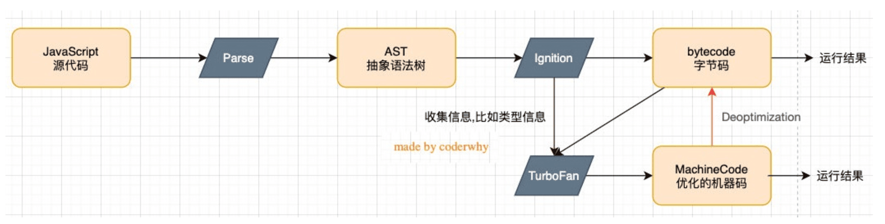

---
sidebar:
  title: Node 基本开发
  step: 1
  isTimeLine: true
title: Node 基本开发
tags:
  - Node
categories:
  - Node
---

# Node 基本开发

## **一. 邂逅 Node 开发**

### **什么是 Node.js 呢?**

官方对 Node.js 的定义: `Node.js是一个基于V8 JavaScript引擎的JavaScript运行时环境`。

那么什么是`JavaScript运行环境?`, `为什么JavaScript需要特别的运行环境呢?`, `什么又是JavaScript引擎?`,`什么是V8?` 呢?

我们先来把这些概念搞清楚，再去看 Node 到底是什么?

### **浏览器内核是什么?**

大家有没有深入思考过:`JavaScrip`t 代码，在`浏览器`中是`如何被执行`的?

我们经常会说:`不同的浏览器`有`不同的内核`组成

`Gecko`: 早期被 Netscape 和 Mozilla Firefox 浏览器使用;
`Trident`: 微软开发，被 IE4~IE11 浏览器使用，但是 Edge 浏览器已经转向 Blink;
`Webkit`: 苹果基于 KHTML 开发、开源的，用于 Safari，Google Chrome 之前也在使用;
`Blink`: 是 Webkit 的一个分支，Google 开发，目前应用于 Google Chrome、Edge、Opera 等;

事实上，我们经常说的浏览器内核指的是`浏览器的排版引擎`

**排版引擎**(layout engine)，也称为**浏览器引擎**(browser engine)、**页面渲染引擎**(rendering engine) 或**样版引擎**。

### **渲染引擎工作的过程**


在这个执行过程中，HTML 解析的时候`遇到了JavaScript标签`，应该怎么办呢?

- 会`停止解析HTML`，而去`加载和执行JavaScript代码`

为什么不直接`异步`去`加载执行JavaScript代码`，而要在这里停止掉呢?

- 这是因为 JavaScript 代码可以`操作我们的DOM`
- 所以浏览器希望将 HTML 解析的 DOM 和 JavaScript 操作之后的 DOM 放到一起来生成最终的 DOM 树，而不是 频繁的去生成新的 DOM 树

那么，`JavaScript代码`由谁来`执行`呢?

- `JavaScript引擎`

### **JavaScript 引擎**

为什么需要 JavaScript 引擎呢?

- `事实上我们编写的JavaScript无论你交给浏览器或者Node执行，最后都是需要被CPU执行的`
- 但是 CPU 只认识自己的指令集，实际上是机器语言，才能被 CPU 所执行
- 所以我们需要 JavaScript 引擎帮助我们将 JavaScript 代码翻译成 CPU 指令来执行;

比较常见的 JavaScript 引擎有哪些呢?

- `SpiderMonkey`::第一款 JavaScript 引擎，由 Brendan Eich 开发(也就是 JavaScript 作者)
- `Chakra`::微软开发，用于 IT 浏览器
- `JavaScriptCore`::WebKit 中的 JavaScript 引擎，Apple 公司开发
- `V8`:Google 开发的强大 JavaScript 引擎，也帮助 Chrome 从众多浏览器中脱颖而出;

### **WebKit 内核**

这里我们先以 WebKit 为例，WebKit 事实上由两部分组成的:

- `WebCore`:负责 HTML 解析、布局、渲染等等相关的工作;

- `JavaScriptCore`:解析、执行 JavaScript 代码;

### **V8 引擎**

官方对 V8 引擎的定义:

- V8 是用`C ++编写`的 Google 开源高性能 JavaScript 和 WebAssembly 引擎，它`用于Chrome和Node.js`等。

- 它实现`ECMAScript`和`WebAssembly`，并在 Windows 7 或更高版本，macOS 10.12+和使用 x64，IA-32， ARM 或 MIPS 处理器的 Linux 系统上运行
- V8`可以独立运行`，也可以嵌入到任何 C ++应用程序中

### **V8 引擎的原理**



V8 引擎本身的源码非常复杂，大概有超过 100w 行 C++代码，但是我们可以简单了解一下它执行 JavaScript 代码的原理:

`Parse模块`会将`JavaScript代码转换成AST(抽象语法树)`，这是因为解释器并不直接认识 JavaScript 代码

- 如果函数没有被调用，那么是不会被转换成 AST 的
- Parse 的 V8 官方文档:https://v8.dev/blog/scanner

`Ignition`是一个`解释器`，会`将AST转换成ByteCode(字节码)`

- 同时会收集 TurboFan 优化所需要的信息(比如函数参数的类型信息，有了类型才能进行真实的运算)
- 如果函数只调用一次，Ignition 会执行解释执行 ByteCode
- Ignition 的 V8 官方文档:https://v8.dev/blog/ignition-interpreter

`TurboFan`是一个`编译器`，可以`将字节码编译为CPU可以直接执行的机器码`

- 如果一个函数被`多次调用`，那么就会被标记为`热点函数`，那么就会经过 TurboFan 转换成优化的机器码，提高代码的执行性能;

- 但是，机器码实际上也会被还原为 ByteCode，这是因为如果后续执行函数的过程中，类型发生了变化(比如 sum 函数原来执行的是 number 类型，后 来执行变成了 string 类型)，之前优化的机器码并不能正确的处理运算，就会逆向的转换成字节码;

- TurboFan 的 V8 官方文档:https://v8.dev/blog/turbofan-jit

### **回顾:Node.js 是什么**

回顾: 官方对 Node.js 的定义: `Node.js是一个基于V8 JavaScript引擎的JavaScript运行时环境`

也就是说 Node.js`基于V8引擎`来`执行JavaScript的代码`，但是不仅仅只有 V8 引擎:

- 前面我们知道 V8 可以嵌入到任何 C ++应用程序中，无论是 Chrome 还是 Node.js，事实上都是嵌入了 V8 引擎来执行 JavaScript 代码;

- 但是`在Chrome浏览器`中，`还需要解析、渲染HTML、CSS等相关渲染引擎`，另外还需要提供支持浏览器操作 的 API、浏览器自己的事件循环等;

- 另外，在 Node.js 中我们也需要进行一些`额外的操作`，比如文件系统读/写、网络 IO、加密、压缩解压文件等 操作;

### **浏览器和 Node.js 架构区别**

我们可以简单理解规划出 Node.js 和浏览器的差异:

### **Node.js 架构**

1. 我们编写的 JavaScript 代码会经过 V8 引擎，再通过 Node.js 的 Bindings，将任务放到 Libuv 的事件循环中;

2. `libuv`(Unicorn Velociraptor—独角伶盗龙)是使用 C 语言编写的库;

3. libuv 提供了事件循环、文件系统读写、网络 IO、线程池等等内容;

4. 具体内部代码的执行流程，我会在后续专门讲解事件和异步 IO 的原理中详细讲解;


### **JavaScript 代码执行**

目前我们知道有两种方式可以执行:

- 将代码交给`浏览器执行`

- 将代码载入到`node环境中执行`

## **二. Node 核心开发**

### **Node 程序传递参数**

通过`procee.argv`

### **特殊的全局对象**

包括:`__dirname`、`__filename`、`exports`、`module`、`require()`

`__dirname:`获取当前文件所在的路径:

- 注意:不包括后面的文件名

```js
/user/study/node
```

`__filename:`获取当前文件所在的路径和文件名称:

- 注意:包括后面的文件名称

  ```js
  /user/study/node/index.js
  ```

### **常见的全局对象**

`process对象:`process 提供了 Node 进程中相关的信息:

- 比如 Node 的运行环境、参数信息等
- 后面在项目中，我也会讲解，如何将一些环境变量读取到 process 的 env 中

`console对象:`提供了简单的调试控制台，在前面讲解输入内容时已经学习过了。

- 更加详细的查看官网文档:https://nodejs.org/api/console.html

`定时器函数:`在 Node 中使用定时器有好几种方式:

- setTimeout(callback, delay[, ...args]):callback 在 delay 毫秒后执行一次;
- setInterval(callback, delay[, ...args]):callback 每 delay 毫秒重复执行一次;
- setImmediate(callback[, ...args]):callbackI / O 事件后的回调的“立即”执行;
- process.nextTick(callback[, ...args]):添加到下一次 tick 队列中;

### **global 对象**

`global是一个node中的全局对象`，事实上前端我们提到的 process、console、setTimeout 等都有被放到 global 中

### **global 和 window 的区别**

`在浏览器中`，全局变量都是在 window 上的，比如有 document、setInterval、setTimeout、alert、console 等等

`在Node中`，我们也有一个 global 属性，并且看起来它里面有很多其他对象。

在浏览器中执行的 JavaScript 代码，如果我们在顶级范围内通过 var 定义的一个属性，默认会被添加到 window 对象上

```js
var name = "vvv";
window.name; // vvv
```

但是在 node 中，我们通过 var 定义一个变量，它只是在当前模块中有一个变量，不会放到全局中

```js
var name = "vvv";
global.name; // undefined
```

## **三. Node 模块化**

### **什么是模块化呢?**

那么，到底什么是模块化开发呢?

- 事实上模块化开发最终的目的是`将程序划分成一个个小的结构`
- 这个结构中编写属于`自己的逻辑代码`，`有自己的作用域`，不会影响到其他的结构
- 这个结构可以将自己希望暴露的`变量`、`函数`、`对象`等导出给其结构使用
- 也可以通过某种方式，导入另外结构中的`变量`、`函数`、`对象`等;

\*\*上面说提到的`结构`，就是`模块`;按照这种`结构划分`开发程序的过程，就是`模块化开发`的过程;

### **CommonJS 和 Node**

`CommonJS是一个规范`，最初提出来是在浏览器以外的地方使用，并且当时被命名为`ServerJS`，后来为了 体现它的广泛性，修改为`CommonJS`，平时我们也会简称为 CJS。

`Node`中对`CommonJS进行了支持和实现`, 让我们在开发 node 的过程中可以方便的进行模块化开发:

- 在 Node 中每一个 js 文件都是一个单独的模块
- 这个模块中包括 CommonJS 规范的核心变量: `exports`、`module.exports`、`require`
- 我们可以使用这些变量来方便的进行模块化开发

#### **exports 导出**

`注意:exports是一个对象，我们可以在这个对象中添加很多个属性，添加的属性会导出`

```js
// bar.js
exports.name = "vvv";
exports.age = 18;
```

`另外一个文件中可以导入:`

```js
// main.js
const bar = require("./bar.js");
```

上面这行完成了什么操作呢? 理解下面这句话，Node 中的模块化一目了然

- `意味着main中的bar变量等于exports对象(本质就是浅拷贝(引用赋值))`
- 也就是 require 通过各种查找方式，最终找到了 exports 这个对象
- 并且将这个 exports 对象赋值给了 bar 变量
- bar 变量就是 exports 对象了;

#### **module.exports 导出**

Node 中我们经常导出东西的时候，又是通过`module.exports`导出的

module.exports 和 exports 有什么关系或者区别呢?

通过维基百科中对 CommonJS 规范的解析

- CommonJS 中是没有 module.exports 的概念的
- 但是为了实现模块的导出，`Node中使用的是Module的类`，每一个模块都是 Module 的一个实例，也就是 module
- 所以在 Node 中真正用于`导出的其实根本不是exports，而是module.exports`

为什么 exports 也可以导出呢?

- 这是因为 module 对象的 exports 属性是 exports 对象的一个引用
- 也就是说` exports = module.exports`

#### **require**

`require`是一个函数，可以帮助我们引入一个文件(模块)中导入的`对象`

`这里总结比较常见的查找规则:` 导入格式如下: require(X)

- 1. `X是一个核心模块`，比如 path、http

     直接返回核心模块，并且停止查找

  2. `X是以 ./ 或 ../ 或 /(根目录)开头的`

     第一步: `将X当一个文件`在对应的目录下查找;

     (1). 如果`有后缀名`，按照后缀名的格式查找对应的文件

     (2). 如果`没有后缀名`，会按照如下顺序:

     ​ 1> 直接查找文件 X

     ​ 2> 查找 X.js 文件

     ​ 3> 查找 X.json 文件

     ​ 4> 查找 X.node 文件

     第二步:没有找到对应的文件，`将X作为一个目录`

     (1). 查找目录下面的 index 文件

     ​ 1> 查找 X/index.js 文件

     ​ 2> 查找 X/index.json 文件

     ​ 3> 查找 X/index.node 文件

  3. 直接是一个 X(没有路径)，并且 X 不是一个核心模块

  4. 如果上面的路径中都没有找到，那么报错:not found

#### **模块的加载过程**

`结论一:模块在被第一次引入时，模块中的js代码会被运行一次`

`结论二:模块被多次引入时，会缓存，最终只加载(运行)一次`

- 每个模块对象 module 都有一个属性: `loaded`
- 为 false 表示还没有加载，为 true 表示已经加载

`结论三:如果有循环引入，那么加载顺序是什么?`

Node 采用的是深度优先算法

#### **CommonJS 规范缺点**

CommonJS 加载模块是`同步`的:

- 同步的意味着只有等到对应的模块加载完毕，当前模块中的内容才能被运行
- 这个在服务器不会有什么问题，因为服务器加载的 js 文件都是本地文件，加载速度非常快;

如果将它应用于浏览器呢?

- `浏览器加载js文件需要先从服务器将文件下载下来，之后在加载运行`
- 那么采用`同步`的就意味着`后续的js代码都无法正常运行`，即使是一些简单的 DOM 操作;

所以在浏览器中，我们通常不使用 CommonJS 规范:

- 当然在 webpack 中使用 CommonJS 是另外一回事
- 因为它会`将我们的代码转成浏览器可以直接执行的代码`

在早期为了可以在浏览器中使用模块化，通常会采用`AMD`或`CMD`:

- 但是目前一方面现代的浏览器已经支持 ES Modules，另一方面借助于 webpack 等工具可以实现对 CommonJS 或者 ES Module 代码的转换
- AMD 和 CMD 已经使用非常少了

### **AMD 规范**

AMD 主要是应用于浏览器的一种模块化规范:

- AMD 是 Asynchronous Module Definition(`异步模块定义`)的缩写
- 它采用的是`异步加载模块`
- 事实上 AMD 的规范还要早于 CommonJS，但是 CommonJS 目前依然在被使用，而 AMD 使用的较少了
- AMD 实现的比较常用的库是 require.js 和 curl.js

### **CMD 规范**

CMD 规范也是应用于浏览器的一种模块化规范:

- CMD 是 Common Module Definition(`通用模块定义`)的缩写
- 它也采用了`异步加载模块`，但是它将 CommonJS 的优点吸收了过来
- 但是目前 CMD 使用也非常少了

CMD 也有自己比较优秀的实现方案: `SeaJS`

### **ES Module**

ES Module 和 CommonJS 的模块化有一些不同之处:

- 一方面它使用了 import 和 export 关键字
- 另一方面它采用`编译期的静态分析`，并且也加入了`动态引用`的方式
- 采用 ES Module 将自动采用严格模式`use strict`

ES Module 模块采用 export 和 import 关键字来实现模块化:

- export 负责将模块内的内容导出
- import 负责从其他模块导入内容

#### **export 关键字**

`export关键字`将一个模块中的`变量`、`函数`、`类`等导出

`我们希望将其他中内容全部导出，它可以有如下的方式:`

- 方式一: 在语句声明的前面直接加上 export 关键字
- 方式二: 将所有需要导出的标识符，放到 export 后面的 {}中
  - 注意:这里的 {}里面不是 ES6 的对象字面量的增强写法，`{}也不是表示一个对象的`
  - 所以: `export {name: name}`，是错误的写法
- 方式三: 导出时给标识符起一个别名

#### **import 关键字**

` import关键字`负责从另外一个模块中`导入内容`

`导入内容的方式也有多种:`

- 方式一: `import {标识符列表} from '模块`
  - 注意:这里的{}也不是一个对象，里面只是存放导入的标识符列表内容
- 方式二: 导入时给标识符起别名: `import xx from '模块'`
- 方式三: 通过 _ 将模块功能放到一个模块功能对象 `import _ as xx from '模块'`

#### **Export 和 import 结合使用**

```js
export reactivly from "./reactivly";
```

为什么要这样做呢?

- 在开发和封装一个功能库时，通常我们希望`将暴露的所有接口放到一个文件中`
- 这样方便指定统一的接口规范，也方便阅读

#### **default 用法**

前面的导出功能都是`有名字的导出(named exports):`

- 在导出 export 时指定了名字
- 在导入 import 时需要知道具体的名字

还有一种导出叫做`默认导出(default export):`

- 默认导出 export 时可以不需要指定名字
- 在导入时不需要使用 {}，并且可以自己来指定名字
- 注意:在`一个模块中，只能有一个默认导出(default export)`

#### **import 函数**

通过 import 加载一个模块，是不可以在其放到逻辑代码中的

为什么会出现这个情况呢?

- 这是因为 ES Module 在被 JS 引擎解析时，就必须知道它的`依赖关系`
- 由于这个时候 js 代码没有任何的运行，所以无法在进行类似于 if 判断中根据代码的执行情况
- 甚至下面的这种写法也是错误的:因为我们必须到运行时能确定 path 的值

但是某些情况下，我们`希望动态的来加载某一个模块`

- 这个时候我们需要使用 import() 函数来动态加载

  ```js
  if (true) {
    import foo from "./foo.js";
  }
  ```

### **CommonJS 的加载过程**

`CommonJS模块加载js文件的过程是运行时加载的，并且是同步的`

- 运行时加载意味着是 js 引擎在执行 js 代码的过程中加载模块
- 同步的就意味着一个文件没有加载结束之前，后面的代码都不会执行

`CommonJS通过module.exports导出的是一个对象`

- 导出的是一个对象意味着可以将这个对象的引用在其他模块中赋值给其他变量
- 但是最终他们指向的都是同一个对象，那么一个变量修改了对象的属性，所有的地方都会被修改

### **ES Module 加载过程**

`1. ES Module加载js文件的过程是编译(解析)时加载的，并且是异步的`

- 编译时(解析)时加载，意味着 import 不能和运行时相关的内容放在一起使用
- 比如 from 后面的路径需要动态获取
- 比如不能将 import 放到 if 等语句的代码块中
- 所以我们有时候也称`ES Module是静态解析的`，而不是动态或者运行时解析的

`2. 异步的意味着:JS引擎在遇到import时会去获取这个js文件，但是这个获取的过程是异步的，并不会阻塞主线程继 续执行;`

`3. ES Module通过export导出的是变量本身的引用`

- export 在导出一个变量时，js 引擎会解析这个语法，并且创建`模块环境记录`(module environment record)
- `模块环境记录`会和变量进行 绑定(binding)，并且这个绑定是实时的
- 而在导入的地方，我们是可以实时的获取到绑定的最新值的

` 4. 所以，如果在导出的模块中修改了变化，那么导入的地方可以实时获取最新的变量`

- 注意:`在导入的地方不可以修改变量`，因为它只是被绑定到了这个变量上(其实是一个常量)