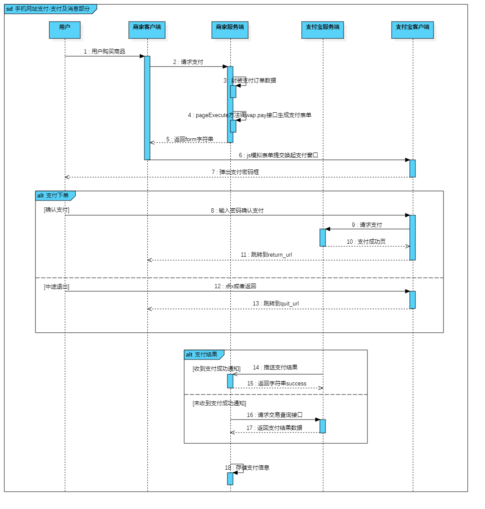
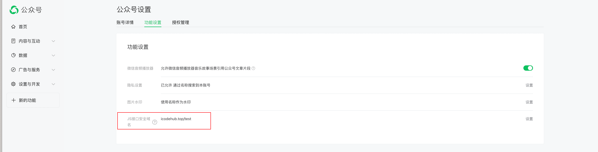
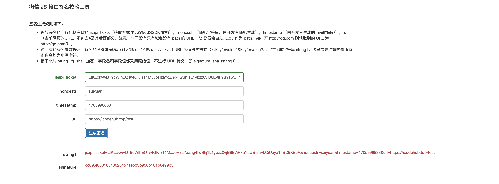

# h5 第三方接入
以下是记录一些 h5 第三方接入问题，包含 h5 微信支付、h5 支付宝支付以及 wx-sdk 的问题

## 微信支付
[微信支付网站](https://pay.weixin.qq.com/wiki/doc/apiv3/apis/chapter3_3_1.shtml)

上面这个是微信支付网站文档，包含各端微信支付， 这里主要记录 h5 的微信支付 `（注意： 这里仅支持微信外部的浏览器拉起微信支付中间页， 微信内 h5 支付后面讲 -> 需要通过 wx-sdk 操作）`

[h5 的微信支付 详细文档](https://pay.weixin.qq.com/docs/partner/products/partner-h5-payment/development.html)

h5 的微信支付, 接入方式：`开通`和`开发` 2 个流程， 这里主要讲开发的流程

下面是 h5 微信支付的一个总流程图


从上面我们可以知道，前端这边主要流程是
- 用户点击微信支付按钮，发起请求下单
- 获取到跳转支付的 url 地址
- 跳转 url 地址
- 支付完成后跳转结果页

下面用代码展示流程
```vue
<template>
 <div class="pay-container">
  <div class="wx-pay" @click="handleWxPay">
    微信支付
  </div>

  <!-- 用户去点击按钮触发查单操作，回跳页面 -->
  <!-- 这里是一个弹窗 -->
 </div>
</template>

<script>
export default {
  data() {
    return {
      isStartPay: false
    }
  },
  methods: {
    handleWxUrl(url, callbackResultUrl) {
        if(callbackResultUrl) {
          // 这里必须使用encodeURIComponent编码， 微信要求， 
          // 这里可以使用redirect_url在 url 上拼接回调地址， 但是这里会有问题，我们下面说
          url = `${url}&redirect_url=${encodeURIComponent(callbackResultUrl)}`;
        }
				var form = document.createElement('form');
				document.body.appendChild(form);
				form.method = "post";
				form.action = url;
				form.submit();
				document.body.removeChild(form);

        setTimeout(() => {
          this.isStartPay = true
        }, 1500)
        
    },
    handleWxPay() {
      // wxPay 为封装的请求，用于调起微信支付, data为参数
      wxPay(data).then((res) => {
        // 获取到 调起微信支付 url
        const { url } = res
        this.handleWxUrl(url)
      })
    }
  },
}
</script>

```

[在使用微信支付，你可能遇到常见的问题](https://pay.weixin.qq.com/docs/partner/products/partner-h5-payment/development.html)

下面列举一下可能性比较大的问题
- h5_url为拉起微信支付收银台的中间页面，可通过访问该URL来拉起微信客户端，完成支付，h5_url的有效期为5分钟
- 微信支付收银台中间页会进行H5权限的校验，安全性检查
- 正常流程用户支付完成后会返回至发起支付的页面，如需返回至指定页面，则可以在h5_url后拼接上redirect_url参数，来指定回调页面。您希望用户支付完成后跳转至`https://www.wechatpay.com.cn`，则拼接后的地址为h5_url= `https://wx.tenpay.com/cgi-bin/mmpayweb-bin/checkmweb?prepay_id=wx20161110163838f231619da20804912345&package=1037687096&redirect_url=https%3A%2F%2Fwww.wechatpay.com.cn`
- 需对redirect_url进行urlencode处理
- 由于设置redirect_url后,回跳指定页面的操作可能发生在：
  - 微信支付中间页调起微信收银台后超过5秒
  - 用户点击“取消支付”或支付完成后点击“完成”按钮。因此无法保证页面回跳时，支付流程已结束，所以商户设置的redirect_url地址不能自动执行查单操作，应让用户去点击按钮触发查单操作，回跳页面展示效果可参考下图
   
  

这里的话为因为redirect_url，无法保证页面回跳时，支付流程已结束， 因此最好的做法是`应让用户去点击按钮触发查单操作，回跳页面`

### 可能会发生的错误
[官方：可能会发生的错误](https://pay.weixin.qq.com/docs/partner/products/partner-h5-payment/development.html#q-%E8%B0%83%E8%B5%B7h5%E6%94%AF%E4%BB%98%E6%8A%A5-%E5%95%86%E5%AE%B6%E5%8F%82%E6%95%B0%E6%A0%BC%E5%BC%8F%E6%9C%89%E8%AF%AF-%E8%AF%B7%E8%81%94%E7%B3%BB%E5%95%86%E5%AE%B6%E8%A7%A3%E5%86%B3)


## 支付宝支付
[手机网站支付产品介绍 ｜ 网页&移动应用](https://opendocs.alipay.com/open/203/105288)

支付宝支付的接入方式也分：[开通](https://b.alipay.com/page/product-mall/product-detail/I1080300001000041949) 和 [开发](https://opendocs.alipay.com/open/203/107084?ref=api) 2 个流程

这里我也是主要讲开发的一个流程

老样子， 先看支付宝支付的一个总流程图



跟 h5 微信支付差不多，前端这边主要流程是
- 用户点击支付宝支付按钮，发起请求下单
- 获取 form 表单字符串
- 提交表单调起支付宝支付
- 支付完成后跳转结果页 

下面用代码展示流程
```vue
<template>
 <div class="pay-container">
  <div class="wx-pay" @click="handleAliPay">
    支付宝支付
  </div>

  <!-- 用户去点击按钮触发查单操作，回跳页面 -->
  <!-- 这里是一个弹窗 -->
 </div>
</template>

<script>
export default {
  data() {
    return {
      isStartPay: false
    }
  },
  methods: {
    handleForm(form, callbackResultUrl) {
        if(callbackResultUrl) {
          // 这里必须使用encodeURIComponent编码
          // 这里可以使用redirect_url在 url 上拼接回调地址， 
          // 这里的话最好也是跟h5 微信 支付同样的方式去处理
          //（使用一个弹窗，来查看是否支付成功，是否去跳结果页）
          url = `${url}&redirect_url=${encodeURIComponent(callbackResultUrl)}`;
        }
        const div = document.createElement("div");
        div.innerHTML = form;
        document.body.appendChild(div);
        document.forms[0].setAttribute("target", "_self");
        document.forms[0].submit();
        div.remove();

        setTimeout(() => {
          this.isStartPay = true
        }, 1500)
        
    },
    handleAliPay() {
      // wxPay 为封装的请求，用于调起微信支付, data为参数
      aliPay(data).then((res) => {
        // 获取到 form 表单字符串， 提交表单调起支付宝支付
        const { form } = res
        this.handleForm(form)
      })
    }
  },
}
</script>
```
支付宝没微信支付那么多要求， 支付宝可以在开发环境下调起，但是微信支付的话，需要用到绑定的域名

[常见的问题](https://opendocs.alipay.com/open/05a2y9), 不过这些问题一般不是前端问题


## wx-sdk 
微信 sdk 仅用于`微信环境`内，例如公众号网页

[微信 sdk](https://developers.weixin.qq.com/doc/offiaccount/OA_Web_Apps/JS-SDK.html#58)

下面是接入 wx-sdk 的流程
- 绑定域名
- 引入JS文件
- 通过config接口注入权限验证配置
- 通过ready接口处理成功验证
- 通过error接口处理失败验证

### 绑定域名
先登录微信公众平台进入“公众号设置”的“功能设置”里填写“JS接口安全域名”。

备注：登录后可在“开发者中心”查看对应的接口权限。



这里需要注意的点是：
- 需要使用`公众号登录`， 不是用小程序的
  
### 引入JS文件
在需要调用JS接口的页面引入如下JS文件，（支持https）：http://res.wx.qq.com/open/js/jweixin-1.6.0.js

如需进一步提升服务稳定性，当上述资源不可访问时，可改访问：http://res2.wx.qq.com/open/js/jweixin-1.6.0.js （支持https）。

备注：支持使用 AMD/CMD 标准模块加载方法加载

### 通过config接口注入权限验证配置
所有需要使用JS-SDK的页面必须先注入配置信息，否则将无法调用（同一个url仅需调用一次，对于变化url的SPA的web app可在每次url变化时进行调用,目前Android微信客户端不支持pushState的H5新特性，所以使用pushState来实现web app的页面会导致签名失败，此问题会在Android6.2中修复）。
```js
wx.config({
  debug: true, // 开启调试模式,调用的所有api的返回值会在客户端alert出来，若要查看传入的参数，可以在pc端打开，参数信息会通过log打出，仅在pc端时才会打印。
  appId: '', // 必填，公众号的唯一标识
  timestamp: , // 必填，生成签名的时间戳
  nonceStr: '', // 必填，生成签名的随机串
  signature: '',// 必填，签名
  jsApiList: [] // 必填，需要使用的JS接口列表
});
```

签名算法见文末的[附录1](https://developers.weixin.qq.com/doc/offiaccount/OA_Web_Apps/JS-SDK.html#62)，所有JS接口列表见文末的[附录2](https://developers.weixin.qq.com/doc/offiaccount/OA_Web_Apps/JS-SDK.html#63)

注意：如果使用的是[小程序云开发静态网站托管](https://developers.weixin.qq.com/miniprogram/dev/wxcloud/guide/staticstorage/introduction.html)的域名的网页，可以免鉴权直接跳任意合法合规小程序，调用 wx.config 时 appId 需填入非个人主体的已认证小程序，不需计算签名，timestamp、nonceStr、signature 填入非空任意值即可。


如果想要在微信网页中使用 wx-sdk， 最需要的是通过config接口注入权限，那么如何注入权限呢？
- 在微信公共平台中拿到 appId， 一般通过`服务端接口返回接口`, 在这里的话，我主要通过前端的方式去注入，并不会去涉及服务端，也包含config后面的参数
- 生成签名signature，生成签名的算法在上面

**下面我们介绍一下生成签名算法的步骤**
- 生成 jsapi_ticket
- 生成签名算法

**生成 jsapi_ticket**
生成签名之前必须先了解一下jsapi_ticket，jsapi_ticket是公众号用于调用微信JS接口的临时票据。正常情况下，jsapi_ticket的有效期为7200秒，通过access_token来获取。由于获取jsapi_ticket的api调用次数非常有限，频繁刷新jsapi_ticket会导致api调用受限，影响自身业务，开发者必须在自己的服务全局缓存jsapi_ticket 。

参考以下文档获取access_token（有效期7200秒，开发者必须在自己的服务全局缓存access_token）：https://developers.weixin.qq.com/doc/offiaccount/Basic_Information/Get_access_token.html

用第一步拿到的access_token 采用http GET方式请求获得jsapi_ticket（有效期7200秒，开发者必须在自己的服务全局缓存jsapi_ticket）：https://api.weixin.qq.com/cgi-bin/ticket/getticket?access_token=ACCESS_TOKEN&type=jsapi

**生成签名算法**

我们已经获取到 `jsapi_ticket`，之后，通过 [微信 js 签名工具](https://link.juejin.cn/?target=https%3A%2F%2Fmp.weixin.qq.com%2Fdebug%2Fcgi-bin%2Fsandbox%3Ft%3Djsapisign) 完成签名：




- jsapi_ticket：通过 getticket 接口获取的 JSAPI 调用凭证(上面)
- noncestr：随机生成的字符串（上图是 suiyuan --- 随机字符串，可以自己生成）
- timestamp：当前时间戳（单位：秒）(可以使用 +new Date() 获取)
- url：需要调用 JS 接口的 URL

接下来通过config接口注入权限的代码详细请到这里看：https://gitee.com/igxv/wx-sdk-test/tree/master

核心代码如下
```vue
<script setup>
const getUrl = () => {
  alert(location.href.split('#')[0])
}

 // 扫一扫功能
const scanQRCode = () => {
  console.log(22222222)
  wx.scanQRCode({
    needResult: 0, // 默认为0，扫描结果由微信处理，1则直接返回扫描结果，
    scanType: ["qrCode","barCode"], // 可以指定扫二维码还是一维码，默认二者都有
    success: function (res) {
      var result = res.resultStr; // 当needResult 为 1 时，扫码返回的结果
    }
  });
}

const injectPermission  = () => {
  // 通过请求获取到 appId、timestamp、nonceStr、signature
  wx.config({
    debug: true, // 开启调试模式,调用的所有api的返回值会在客户端alert出来，若要查看传入的参数，可以在pc端打开，参数信息会通过log打出，仅在pc端时才会打印。
    appId: appId, // 必填，公众号的唯一标识
    timestamp: timestamp, // 必填，生成签名的时间戳
    nonceStr: nonceStr, // 必填，生成签名的随机串
    signature: signature,// 必填，签名
    jsApiList: ['scanQRCode'] // 必填，需要使用的JS接口列表
  })
  // 这里展示扫一扫功能
  wx.ready(function(res){
  // config信息验证后会执行ready方法，所有接口调用都必须在config接口获得结果之后，config是一个客户端的异步操作，所以如果需要在页面加载时就调用相关接口，则须把相关接口放在ready函数中调用来确保正确执行。对于用户触发时才调用的接口，则可以直接调用，不需要放在ready函数中。
  });
  wx.error(function(res){
    alert('config信息验证失败', res)
  // config信息验证失败会执行error函数，如签名过期导致验证失败，具体错误信息可以打开config的debug模式查看，也可以在返回的res参数中查看，对于SPA可以在这里更新签名。
});
}
</script>

<template>
  <div class="btn" @click="getUrl">
  获取到当前 url
  </div>
  <div class="btn" @click="injectPermission">
  注入权限
  </div>
  <div class="btn" @click="scanQRCode">
  扫一扫
  </div>
</template>

<style scoped>
.btn {
  width: 130px;
  height: 30px;
  background-color: skyblue;
  border-radius: 20px;
  display: flex;
  align-items: center;
  justify-content: center;
  margin: 30px 0;
}
</style>

```
注入权限后的结果如图

<video controls width="250">
  <source src="https://www.icodehub.top/blob/wx-sdk-test.mp4" type="video/mp4" />
</video>


**需要注意的是**

这里通过函数`getUrl` 获取到当前 url, 然后对比一下[这里校验的 url](https://mp.weixin.qq.com/debug/cgi-bin/sandbox?t=jsapisign) 是否一致， 如果不一致就会报`invalid signature` 错误


**常见错误及解决方法**

[常见错误及解决方法，具体看这里](https://developers.weixin.qq.com/doc/offiaccount/OA_Web_Apps/JS-SDK.html#66)


