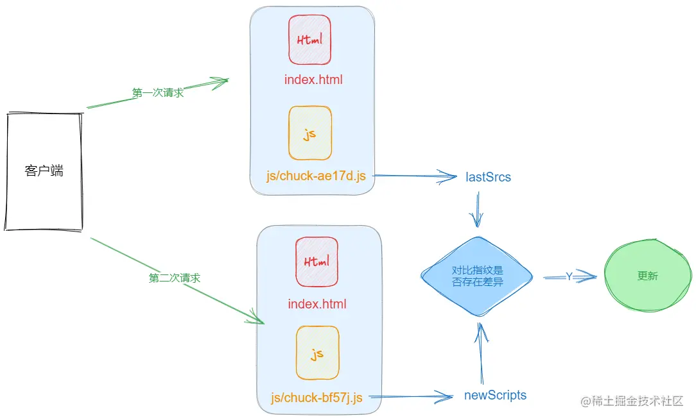

---
sidebar:
  title: vue 项目部署检测自动更新
  step: 1
  isTimeLine: true
title: vue 项目部署检测自动更新
tags:
  - 项目
categories:
  - 项目
---

# vue 项目部署检测自动更新

## 前言

当我们重新部署前端项目的时候，如果用户一直停留在页面上并未刷新使用，会存在功能使用差异性的问题，因此，当前端部署项目后，需要提醒用户有去重新加载页面。

在以往解决方案中，不少人会使用 websocket 去通知客户端更新，但是为了这么个小功能加入 websocket 是十分不明智的，新方案的思路是去轮询请求 index.html 文件，从中解析里面的 js 文件，由于 vue 打包后每个 js 文件都有指纹标识，因此可以对比每次打包后的指纹，分析文件是否存在变动，如果有变动即可提示用户更新

## 原理



## 封装函数 auto-update.js

```js
let lastScript; //上一次获取到的script地址
let needTip = true; // 默认开启提示

const scriptReg = /<script.*src=["'](?<src>[^"']+)/gm;

async function extractNewScripts() {
  const html = await fetch("/?_timestamp=" + Date.now()).then((resp) =>
    resp.text()
  );
  scriptReg.lastIndex = 0;
  let result = [];
  let match;
  while ((match = scriptReg.exec(html))) {
    result.push(match.groups.src);
  }
  return result;
}

async function needUpdate() {
  const newScripts = await extractNewScripts();
  // 第一次获取
  if (!lastScript) {
    lastScript = newScripts;
    return false;
  }
  // 长度不一致
  let result = false;
  if (lastScript.length !== newScripts.length) {
    result = true;
  }
  // 逐一对比
  for (let i = 0; i < lastScript.length; i++) {
    if (lastScript[i] !== newScripts[i]) {
      result = true;
      break;
    }
  }
  lastScript = newScripts;
  return result;
}
const DURATION = 5000;

function autoRefresh() {
  setTimeout(async () => {
    const willUpdate = await needUpdate();
    if (willUpdate) {
      if (window.confirm("发现新版本，是否去更新?")) {
        window.location.reload();
      }
      needTip = false; // 关闭更新提示，防止重复提醒
    }
    if (needTip) {
      autoRefresh();
    }
  }, DURATION);
}
autoRefresh();
```

## 在 main.js 中引入

```js
// 引入自动更新
import "./utils/auto-update";
```